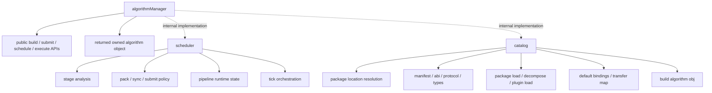

# algorithmManager root tree

Date: 2026-07-02

## Goal

Make `algorithmManager` the only public entry point for the algorithm layer.
Upper layers should not know the internal `scheduler` or `catalog`
structure. They only call the root build, submit, schedule, and execution
interfaces exposed by `algorithmManager`.

## Public / Internal Shape

## Rules

- The only public root for the algorithm layer is `algorithmManager`.
- Build, submit, schedule, and execution helpers are public APIs of
  `algorithmManager`, not child modules.
- `scheduler` and `catalog` stay internal.
- `scheduler` and `catalog` stay independent.
- After execution, `algorithmManager` returns the object structure it owns.
- `AlgorithmObject` ownership is managed below the root API; the root does not
  become a storage layer.

## Migration Note

This document is the target shape for `algorithm_management`. Code that still
reaches into internal subtrees from upper layers should be pulled back to the
root interface first, then the lower-layer implementation can keep using the
internal subtrees as needed.
