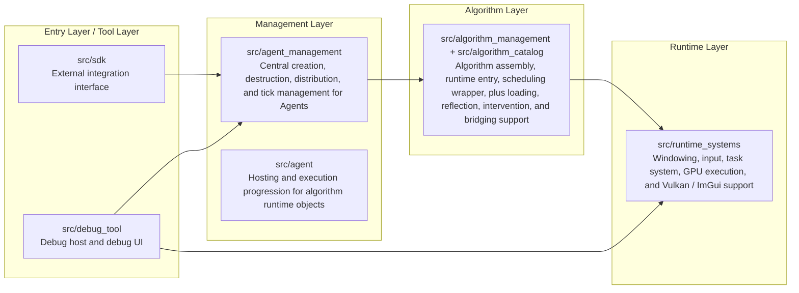
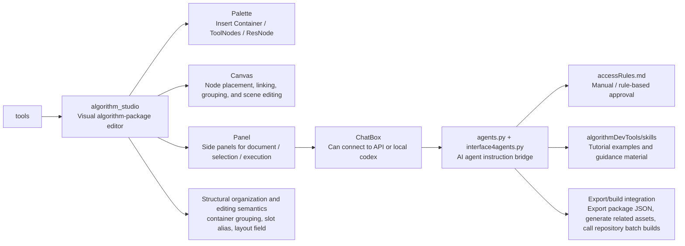

# AlgoForge Studio

A general-purpose algorithm production platform for modular assembly, debugging, execution, and packaging.

> Turn algorithms from scattered implementations into standardized modules that are describable, encapsulable, mountable, executable, debuggable, and previewable.

Referred to below as `AlgoForge`.

## 1. What is AlgoForge?

AlgoForge is a general algorithm production platform built around the idea of an "algorithm package".

Its goal is not to directly provide a set of plug-and-play complex algorithms or a complete system for a specific scenario. Instead, it provides a general method for producing algorithms, so developers can organize, debug, run, and finally package their own algorithms into reusable modules.

The platform offers an algorithm workflow that is closer to frontend development: developers can build and debug algorithms through visualization, UI interaction, and even AI agent interaction, then converge the debug result into an executable, integrable, and deliverable algorithm package.

To support that goal, AlgoForge aims to give algorithm development the following engineering properties:

- Readable: During development, algorithms can be inspected visually, including data flow, state changes after each step, and relationships between local modules. Developers can understand the local parts first and then gradually understand how the whole algorithm works.
- Usable: Algorithm manifests, code, and shaders are organized into a unified structure. After hot compilation, they can be loaded and used directly, or attached to an SDK or other host program.
- Debuggable: Because the data flow itself is visible, many input/output relationships can be constrained and verified earlier in the development process, so problems are exposed sooner instead of being discovered only after the whole system runs.
- Developer-friendly: The platform supports both code-first and low-code workflows. Developers familiar with the underlying implementation can write manifests, C++, and GLSL directly, while developers who prefer a more tooling-oriented workflow can use a visual UI to organize structure, inspect results, and work with AI agents to edit, inspect, iterate, and package.
- Efficient: On the CPU side, a jobs system supports parallel execution. On the GPU side, algorithms run through a Vulkan compute path. CUDA is not the default development path at the moment, mainly because the intended audience is generally less familiar with CUDA; more GPU compute backends will be added later.
- Flexible: Data is handled with variable precision, so developers can use the right precision for the right part of the pipeline and balance quality, performance, and bandwidth usage.

From an external perspective, AlgoForge currently consists of three core components:

- `SDK`: the interface layer used by external host programs to connect to, drive, and manage algorithm execution.
- `debugtool`: the debug host used by algorithm developers to observe, validate, and debug runtime behavior.
- `tools`: the toolchain used by algorithm developers to organize, edit, and produce algorithm packages.

## 2. What problems does AlgoForge solve?

In many projects, algorithms are scattered directly inside business code. As the number and complexity of algorithms grows, the following problems gradually appear:

- Algorithm-related assets are spread across multiple locations. Lifecycles are complicated, maintenance and debugging are expensive, complex logic loses locality, and overall runtime performance becomes difficult to optimize consistently.
- Before formal integration, developers often lack fast development, fast validation, and result comparison workflows, making it hard to decide whether an algorithm replacement or optimization is worth the effort.
- Algorithm development often requires mathematical understanding, engineering implementation skills, and runtime experience at the same time, which makes it hard for less experienced people to participate.
- Algorithm structure, data flow, and module boundaries are naturally difficult to explain, so communication and iteration costs rise quickly in team environments.

To address these issues, AlgoForge provides a more unified set of algorithm engineering capabilities:

- A continuous set of containers and assembly mechanisms that lets developers collect the data required by an algorithm and submit it in a unified way, separating data from logic.
- Visual data flow, reflection, intervention, preview, and hot reload capabilities for development-time validation, debugging, and result comparison.
- A combined workflow that supports code-first development, visual editing, and AI assistance, lowering the barrier to algorithm development.
- The ability to break complex algorithms into independently developable and verifiable stages or modules, assign work by capability, and then assemble and validate them together.

## 3. What can developers do with AlgoForge?

With AlgoForge, developers can complete different kinds of work through three core components:

### 3.1 tools

- Develop algorithms through visual editing and AI agent assistance (with the agent leading the process), generating the required manifests, code, and shader resources while lowering the development barrier.
- Inspect the internal data flow of algorithms to better understand structure and processing behavior.
- Generate usable logic through a low-code workflow. The repository includes a set of skills and an agents.md file for AI-assisted algorithm development, making the platform easier to get started with.

### 3.2 debugtool

- Mount and run algorithms in a relatively clean sandbox environment. Visualization is provided through Vulkan and shader programs (the shader still needs to be written manually, or generated from tools).
- Use preset or custom data and resources to drive algorithm execution, so target scenarios can be reproduced and verified quickly.
- Measure algorithm execution time, including per-stage timing for multi-stage `pipeline`s, to help analyze performance.

### 3.3 SDK

- Create, initialize, execute, update, and unload algorithm runtime instances inside a host application.
- The SDK is better suited as the execution interface for formal external integration. It can still use the powerful Jobs and Vulkan compute backend provided by AlgoForge, as long as the device has a Vulkan driver.
- Unlike the other two components, the SDK is cross-platform as long as the device supports Vulkan, and the version requirement is not lower than 1.3.

Typical use cases include:

- Physics simulation and staged computation
- Rendering pre-processing and result preview
- Multi-stage algorithm experimentation platforms
- Algorithm workbenches for research and prototype validation

## 4. Core concepts and project structure

### 4.1 Core concepts

#### `running preference & algorithmPhase`

- `algorithmPhase`: By convention, an algorithm has five phases: pretick, exec, aftertick, renderResult, and reflect. Pretick and aftertick are used to intervene in algorithm data before and after execution. renderResult is used to render results. reflect is used for debugging. exec is the actual execution logic of the algorithm, and if exec is empty the program will fail.
- `running preference`: The execution preference for each phase. Each phase has its own preference (cpp/cpu, vk/gpu, cuda/gpu). The preferences for pretick and aftertick are determined by the manifest. renderResult only supports vk. reflect only supports jobs. exec depends on the developer's needs. If an algorithm supports a given preference, it must provide the corresponding dll/spv/cu file.

#### `AlgorithmObject`

- `AlgorithmObject`: The core object of the project. It is the unified runtime object after an algorithm has been assembled, and it is the basic form after loading. It is usually mounted under an agent and submitted to AlgorithmScheduler at runtime, where algorithmScheduler handles scheduling. Both normal algorithms and non-normal algorithms are treated as algorithmObj.
- `norm algorithm`: A normal algorithm that follows the five-phase layout.
- `Pipeline Algorithm`: A staged algorithm composed of multiple stages (each stage is itself a normal algorithm), used to organize more complex composite logic.
- `Standard Container`: The container used by pipeline algorithms. It maps standard container data into the stage algorithm through a mapping table.
- `Wrapper`: The pipeline-specific structure that wraps the whole pipeline on both ends and provides algorithmPhase at the standard-container level.

#### `algorithmManager`

- `AlgorithmManager`: The single external entry point of the algorithm layer. It provides assembly, mounting, unloading, and unified scheduling through submodules.
- `AlgorithmScheduler`: A submodule of the manager, responsible for scheduling progression.
- `AlgorithmCatalog`: A submodule of the manager, used to load algorithms from manifests.

#### `agent_management`

- `Agent`: The management unit for algorithm runtime objects. It holds algorithms, organizes state, manages signals, and advances execution.
- `AgentManager`: Responsible for creating, destroying, distributing, and centrally managing `Agent`s.

### 4.2 Runtime structure



### 4.3 `tools` module

`tools` centers on `algorithm_studio` and is responsible for visual algorithm-package editing. AI interaction, teaching examples, and export/build integration are mainly organized along the `panel -> chat -> agent` path.



## 5. Demo showcase

### Demo 1: Minimal algorithm package run

Goal:

- Define a minimal mountable algorithm package
- Check whether it mounts and runs correctly
- Check whether the preview works correctly

Demo:

#### Tempo


#### Teapot


### Demo 2: V6A6 collision algorithm

Goal:

- Define a V6A6 algorithm that lets any number of balls collide with each other
  Here, V6 refers to six variables (ball radius and the four boundaries of the interface), and A6 refers to six arrays (ball position / velocity / BVH tree)
- Control the initial state of the decomposer through descriptors (ball radius, count, initial position, and velocity)
- Modify inputs and observe the result changes

Showcase:

#### Collision


### Demo 3: Multi-stage pipeline algorithm

Goal:

- Organize a pipeline algorithm and verify whether the container mapping table works
- Check whether data bridging between stages succeeds
- Check whether the scheduler works correctly

Showcase:

#### Firework


### Demo 4: Variable-precision algorithm

Goal:

- Split one container node into two half-precision containers so that two containers control two different grids, and verify whether the precision control system works correctly

Showcase:

#### Precise Grid


### Demo 5: Algorithm development tool UI and debug tool UI

Goal:

- Give a simple look at the development tool UI and the algorithm debugTool UI

Showcase:

#### Precise Grid


## 6. Quick start

### 6.1 Build the framework

Build the SDK:

```bat
build_sdk.bat
```

For most external developers, the SDK is the starting point for AlgoForge, rather than the underlying runtime modules directly.

Build the debug tool:

```bat
build_debugtool.bat
```

### 6.2 Build an algorithm package

```bat
build_algorithm_releaseWithDebugInfo.bat <algorithm_target_name>
```

### 6.3 Launch the visual tool

Install the visual tool dependency first:

```bat
py -3 -m pip install -r algorithmDevTools\algorithm_studio\requirements.txt
```

```bat
algorithmDevTools\launch_algorithmDevTools.bat
```

### 6.4 Planned workflow

- For general developers
    Connect the SDK, remember the algorithm name, collect the algorithm variables, and use it out of the box
- For algorithm developers
1. Prepare algorithm development documents in `tools`, then generate algorithm files (cpp, vert/frag, cu)
2. Compile the algorithm through the batch file
3. Test the algorithm in debugTools, including whether it runs and how long it takes
4. Create a runtime instance and mount the algorithm in an external program through `sdk`
5. Inspect results, reflection, and preview
6. Modify the algorithm and keep iterating

## 7. Who is it for?

AlgoForge is suitable for the following types of developers or teams:

- Engineering teams that need to maintain many algorithm modules over the long term
- Developers who want to turn algorithms into mountable capabilities for host systems
- Algorithm engineering teams that need multi-stage pipelines
- Algorithm research teams that need visual debugging, preview, and hot reload
- Platform developers who want to expose algorithm capabilities through an SDK

## 8. Project vision

The long-form project vision and update plan are maintained in
[`docs/VISION.md`](docs/VISION.md), keeping this README focused on onboarding,
architecture, capabilities, and reproducibility.
