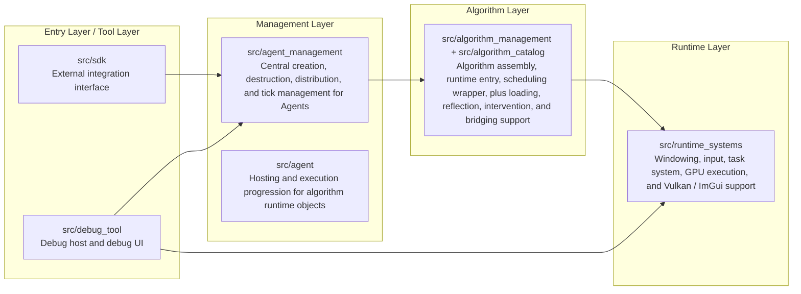
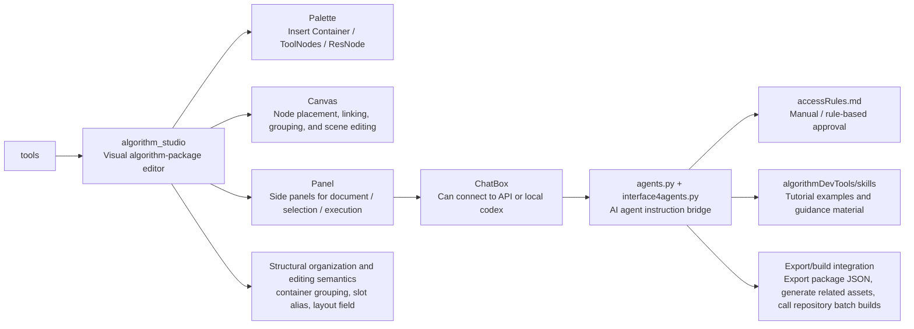
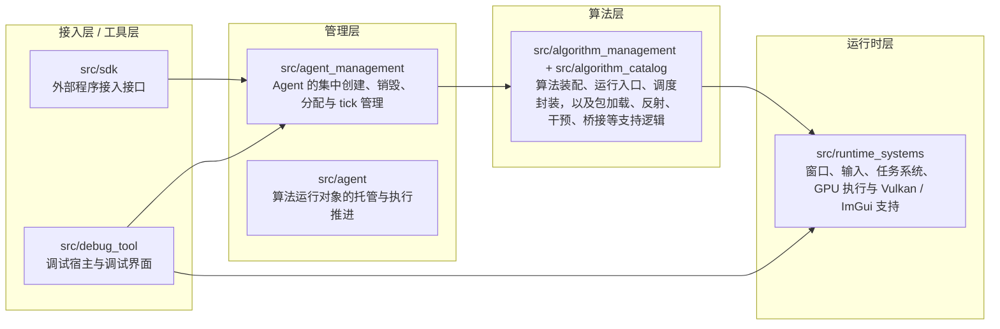
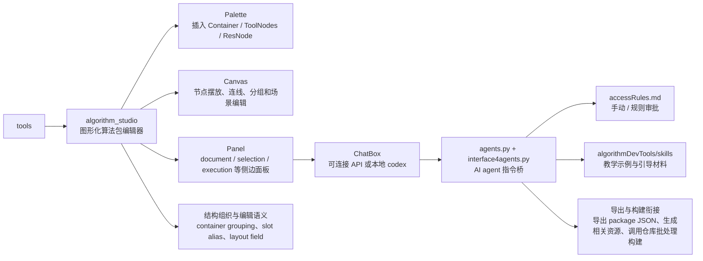

# AlgoForge Studio

A general-purpose algorithm production platform for modular assembly, debugging, execution, and packaging.

> Turn algorithms from scattered implementations into standardized modules that are describable, encapsulable, mountable, executable, debuggable, and previewable.

Referred to below as `AlgoForge`.

## 1. What is AlgoForge?

AlgoForge is a general algorithm production platform built around the idea of an "algorithm package".

Its goal is not to directly provide a set of plug-and-play complex algorithms or a complete system for a specific scenario. Instead, it provides a general method for producing algorithms, so developers can organize, debug, run, and finally package their own algorithms into reusable modules.

The platform offers an algorithm workflow that is closer to frontend development: developers can build and debug algorithms through visualization, UI interaction, and even AI agent interaction, then converge the debug result into an executable, integrable, and deliverable algorithm package.

To support that goal, AlgoForge aims to give algorithm development the following engineering properties:

- Readable: During development, algorithms can be inspected visually, including data flow, state changes after each step, and relationships between local modules. Developers can understand the local parts first and then gradually understand how the whole algorithm works.
- Usable: Algorithm manifests, code, and shaders are organized into a unified structure. After hot compilation, they can be loaded and used directly, or attached to an SDK or other host program.
- Debuggable: Because the data flow itself is visible, many input/output relationships can be constrained and verified earlier in the development process, so problems are exposed sooner instead of being discovered only after the whole system runs.
- Developer-friendly: The platform supports both code-first and low-code workflows. Developers familiar with the underlying implementation can write manifests, C++, and GLSL directly, while developers who prefer a more tooling-oriented workflow can use a visual UI to organize structure, inspect results, and work with AI agents to edit, inspect, iterate, and package.
- Efficient: On the CPU side, a jobs system supports parallel execution. On the GPU side, algorithms run through a Vulkan compute path. CUDA is not the default development path at the moment, mainly because the intended audience is generally less familiar with CUDA; more GPU compute backends will be added later.
- Flexible: Data is handled with variable precision, so developers can use the right precision for the right part of the pipeline and balance quality, performance, and bandwidth usage.

From an external perspective, AlgoForge currently consists of three core components:

- `SDK`: the interface layer used by external host programs to connect to, drive, and manage algorithm execution.
- `debugtool`: the debug host used by algorithm developers to observe, validate, and debug runtime behavior.
- `tools`: the toolchain used by algorithm developers to organize, edit, and produce algorithm packages.

## 2. What problems does AlgoForge solve?

In many projects, algorithms are scattered directly inside business code. As the number and complexity of algorithms grows, the following problems gradually appear:

- Algorithm-related assets are spread across multiple locations. Lifecycles are complicated, maintenance and debugging are expensive, complex logic loses locality, and overall runtime performance becomes difficult to optimize consistently.
- Before formal integration, developers often lack fast development, fast validation, and result comparison workflows, making it hard to decide whether an algorithm replacement or optimization is worth the effort.
- Algorithm development often requires mathematical understanding, engineering implementation skills, and runtime experience at the same time, which makes it hard for less experienced people to participate.
- Algorithm structure, data flow, and module boundaries are naturally difficult to explain, so communication and iteration costs rise quickly in team environments.

To address these issues, AlgoForge provides a more unified set of algorithm engineering capabilities:

- A continuous set of containers and assembly mechanisms that lets developers collect the data required by an algorithm and submit it in a unified way, separating data from logic.
- Visual data flow, reflection, intervention, preview, and hot reload capabilities for development-time validation, debugging, and result comparison.
- A combined workflow that supports code-first development, visual editing, and AI assistance, lowering the barrier to algorithm development.
- The ability to break complex algorithms into independently developable and verifiable stages or modules, assign work by capability, and then assemble and validate them together.

## 3. What can developers do with AlgoForge?

With AlgoForge, developers can complete different kinds of work through three core components:

### 3.1 tools

- Develop algorithms through visual editing and AI agent assistance (with the agent leading the process), generating the required manifests, code, and shader resources while lowering the development barrier.
- Inspect the internal data flow of algorithms to better understand structure and processing behavior.
- Generate usable logic through a low-code workflow. The repository includes a set of skills and an agents.md file for AI-assisted algorithm development, making the platform easier to get started with.

### 3.2 debugtool

- Mount and run algorithms in a relatively clean sandbox environment. Visualization is provided through Vulkan and shader programs (the shader still needs to be written manually, or generated from tools).
- Use preset or custom data and resources to drive algorithm execution, so target scenarios can be reproduced and verified quickly.
- Measure algorithm execution time, including per-stage timing for multi-stage `pipeline`s, to help analyze performance.

### 3.3 SDK

- Create, initialize, execute, update, and unload algorithm runtime instances inside a host application.
- The SDK is better suited as the execution interface for formal external integration. It can still use the powerful Jobs and Vulkan compute backend provided by AlgoForge, as long as the device has a Vulkan driver.
- Unlike the other two components, the SDK is cross-platform as long as the device supports Vulkan, and the version requirement is not lower than 1.3.

Typical use cases include:

- Physics simulation and staged computation
- Rendering pre-processing and result preview
- Multi-stage algorithm experimentation platforms
- Algorithm workbenches for research and prototype validation

## 4. Core concepts and project structure

### 4.1 Core concepts

#### `running preference & algorithmPhase`

- `algorithmPhase`: By convention, an algorithm has five phases: pretick, exec, aftertick, renderResult, and reflect. Pretick and aftertick are used to intervene in algorithm data before and after execution. renderResult is used to render results. reflect is used for debugging. exec is the actual execution logic of the algorithm, and if exec is empty the program will fail.
- `running preference`: The execution preference for each phase. Each phase has its own preference (cpp/cpu, vk/gpu, cuda/gpu). The preferences for pretick and aftertick are determined by the manifest. renderResult only supports vk. reflect only supports jobs. exec depends on the developer's needs. If an algorithm supports a given preference, it must provide the corresponding dll/spv/cu file.

#### `AlgorithmObject`

- `AlgorithmObject`: The core object of the project. It is the unified runtime object after an algorithm has been assembled, and it is the basic form after loading. It is usually mounted under an agent and submitted to AlgorithmScheduler at runtime, where algorithmScheduler handles scheduling. Both normal algorithms and non-normal algorithms are treated as algorithmObj.
- `norm algorithm`: A normal algorithm that follows the five-phase layout.
- `Pipeline Algorithm`: A staged algorithm composed of multiple stages (each stage is itself a normal algorithm), used to organize more complex composite logic.
- `Standard Container`: The container used by pipeline algorithms. It maps standard container data into the stage algorithm through a mapping table.
- `Wrapper`: The pipeline-specific structure that wraps the whole pipeline on both ends and provides algorithmPhase at the standard-container level.

#### `algorithmManager`

- `AlgorithmManager`: The single external entry point of the algorithm layer. It provides assembly, mounting, unloading, and unified scheduling through submodules.
- `AlgorithmScheduler`: A submodule of the manager, responsible for scheduling progression.
- `AlgorithmCatalog`: A submodule of the manager, used to load algorithms from manifests.

#### `agent_management`

- `Agent`: The management unit for algorithm runtime objects. It holds algorithms, organizes state, manages signals, and advances execution.
- `AgentManager`: Responsible for creating, destroying, distributing, and centrally managing `Agent`s.

### 4.2 Runtime structure



### 4.3 `tools` module

`tools` centers on `algorithm_studio` and is responsible for visual algorithm-package editing. AI interaction, teaching examples, and export/build integration are mainly organized along the `panel -> chat -> agent` path.



## 5. Demo showcase

### Demo 1: Minimal algorithm package run

Goal:

- Define a minimal mountable algorithm package
- Check whether it mounts and runs correctly
- Check whether the preview works correctly

Demo:

#### Tempo


#### Teapot


### Demo 2: V6A6 collision algorithm

Goal:

- Define a V6A6 algorithm that lets any number of balls collide with each other
  Here, V6 refers to six variables (ball radius and the four boundaries of the interface), and A6 refers to six arrays (ball position / velocity / BVH tree)
- Control the initial state of the decomposer through descriptors (ball radius, count, initial position, and velocity)
- Modify inputs and observe the result changes

Showcase:

#### Collision


### Demo 3: Multi-stage pipeline algorithm

Goal:

- Organize a pipeline algorithm and verify whether the container mapping table works
- Check whether data bridging between stages succeeds
- Check whether the scheduler works correctly

Showcase:

#### Firework


### Demo 4: Variable-precision algorithm

Goal:

- Split one container node into two half-precision containers so that two containers control two different grids, and verify whether the precision control system works correctly

Showcase:

#### Precise Grid


### Demo 5: Algorithm development tool UI and debug tool UI

Goal:

- Give a simple look at the development tool UI and the algorithm debugTool UI

Showcase:

#### Precise Grid


## 6. Quick start

### 6.1 Build the framework

Build the SDK:

```bat
build_sdk.bat
```

For most external developers, the SDK is the starting point for AlgoForge, rather than the underlying runtime modules directly.

Build the debug tool:

```bat
build_debugtool.bat
```

### 6.2 Build an algorithm package

```bat
build_algorithm.bat <algorithm_target_name>
```

### 6.3 Launch the visual tool

```bat
algorithmDevTools\launch_algorithmDevTools.bat
```

### 6.4 Planned workflow

- For general developers
    Connect the SDK, remember the algorithm name, collect the algorithm variables, and use it out of the box
- For algorithm developers
1. Prepare algorithm development documents in `tools`, then generate algorithm files (cpp, vert/frag, cu)
2. Compile the algorithm through the batch file
3. Test the algorithm in debugTools, including whether it runs and how long it takes
4. Create a runtime instance and mount the algorithm in an external program through `sdk`
5. Inspect results, reflection, and preview
6. Modify the algorithm and keep iterating

## 7. Who is it for?

AlgoForge is suitable for the following types of developers or teams:

- Engineering teams that need to maintain many algorithm modules over the long term
- Developers who want to turn algorithms into mountable capabilities for host systems
- Algorithm engineering teams that need multi-stage pipelines
- Algorithm research teams that need visual debugging, preview, and hot reload
- Platform developers who want to expose algorithm capabilities through an SDK

## 8. 关于项目本身，以及后面的更新计划

项目旨在成为算法运行与装配的底层基础设施，目标是提供接近“系统底座”级别的能力：统一调度、可组合执行、可观测调试与稳定集成。

长期来看，项目会继续降低算法开发门槛，让非底层开发者也能基于工具链完成复杂算法的构建、验证与迭代。同时，会强化工程接入体验，使其更容易嵌入已有的大型项目：业务侧负责数据准备，运行侧由 `Agent` 与调度系统承接执行。

在架构演进上，后续会探索“算法树”能力。现有 `pipeline` 已验证了基于调度器的阶段化组织方式，下一步将扩展 `wrapper` 的路由与决策能力：基于容器状态和采样结果在多条算法路径间动态选择，支持从分支算法到“特征提取 + 分类头”的组合式决策。

短期更新计划：

- 推进 `tools` 到可稳定使用状态，并尝试实现内存管理系统，打通 `CUDA` 执行偏好
- 增强 `tools` 对 `pipeline` 的编辑能力，补充“当前值固化为默认算法描述符”功能
- 改善 `sdk` 接入体验，提升外部项目集成的稳定性与可维护性

## 9. 最后

项目目前还在非常非常非常早期的阶段。目前开发文档里的想法很多，其中有一些还是互相冲突的。我已经很努力地尝试给 `agent` 划分边界了，但还是会出现这种情况：这个功能好了，那个功能就坏了。甚至有时候，之前能够正常挂载的算法，后面突然就挂不上了。原因往往来自于容器修改、新特性增加、legacy 移除，或者单纯是 AI 自己改越界了。

慢慢改吧。我感觉，在这个大模型崛起的时代，软件大概只有两条路：一条是往快、往 realtime 走，变成大模型快速决策时权重更高的参考；另外一条是往节约、往边界走，用一些更强硬的方法阻止模型越界。其实这很像操作系统：一方面在辅助软件，另一方面也在限制软件。它确实给软件执行提供了空间，但这个空间本来就有限，看上去再大也还是有限。虚拟内存之类的东西，本质上也只是一些假装问题不存在的小技法。

`agentmanager` 里面的 `agent`，之所以叫这个名字，是因为我确实有一个野心：让这个项目里的 `agent` 去挂一个真正的 `agent`，挂一个真正的多模态大模型作为脑子，余下的辅助算法作为脊椎（脑算法、脊柱算法这些名字，都是瞎取的）。从这个角度看，项目整体或许会承担一个类似于操作系统的角色。From Thinking working constrained by hardware 2 Posiblity working constrained by hardware吧，谁知道呢，我做的事情，反正是不会让它变厉害的，我也做不到让他变厉害。

在大模型发展起来以前，我反正是不敢想象自己能在自己的 PC 上去搓这么硬的东西的。在开始弄这个项目之前，我跨平台是跨不明白的，Vk 不懂，CUDA 也只知道在 Python 上有一个 `iscuda()`。可能再过五年左右吧，谷歌、亚马逊、英伟达、微软之类的厂商，就能把专门供大模型操作系统搓出来。这个项目可能只是一个注定比不过人家的东西吧，毕竟作者本人也不是什么特别厉害的人，没有什么厉害的手上功夫，学历也就那样。如果作者不缺钱用，作者的梦想其实是去当一个科幻小说作家。

但是，我觉得这个东西应该会有用，我希望它会有用。

---

面向算法模块化装配、调试、运行与打包的通用算法生产平台。

> 将算法从零散实现提升为可描述、可封装、可挂载、可执行、可调试、可预览的标准化模块。

下文简称 `AlgoForge`。

## 1. AlgoForge 是什么？

AlgoForge 是一个围绕“算法包”构建的通用算法生产平台。

它的目标不是针对某个特定场景直接提供一批即插即用的复杂算法或完整系统，而是提供一套通用的算法生产方法，让开发者能够把自己的算法组织、调试、运行并最终打包成可复用模块。

平台为开发者提供一条更接近前端开发体验的算法工作流：可以用可视化、UI 交互，甚至 AI agent 交互的方式开发和调试算法，再把调试结果收敛为可运行、可集成、可交付的算法包。

围绕这个目标，AlgoForge 希望让算法开发具备五类更直接的工程特性：

- 易读：算法在开发阶段就可以通过图形化方式查看数据流的流向、每一步处理之后的状态变化，以及局部模块之间的关系。开发者可以先理解局部，再逐步理解整体算法如何工作。
- 易用：算法相关的清单、代码和 shader 会被组织成统一结构，经过热编译后即可加载使用，也可以继续挂到 SDK 或其他宿主程序中。
- 易调试：算法的数据流本身就是可视的，很多输入输出关系可以在开发流程中提前约束和校验，把问题尽量前置暴露，而不是等到整体运行后才发现结果异常。
- 易开发：平台同时支持代码优先和低代码两种开发方式。熟悉底层实现的开发者可以直接编写清单、C++ 和 GLSL；更偏工具化工作流的开发者可以通过图形化 UI 组织结构、观察结果，并结合 AI agent 辅助完成编辑、检查、迭代和打包。
- 高效：CPU 侧提供 jobs 系统支撑并行执行，GPU 侧基于 Vulkan 计算通路运行算法。当前没有把 CUDA 作为默认开发路径，主要是因为这个项目面向的开发者普遍不熟悉 CUDA；后续会继续补充更多 GPU 计算后端。
- 灵活：以可变精度处理数据，用更合适的精度组织和传递数据，方便在效果、性能和带宽占用之间做平衡。

从对外形态看，AlgoForge 当前主要由三类核心组件组成：

- `SDK`：给外部宿主程序接入、驱动和管理算法运行能力的接口层。
- `debugtool`：给算法开发者观察、验证和调试运行过程的调试宿主。
- `tools`：给算法开发者组织、编辑和生产算法包的工具链。

## 2. AlgoForge 解决了什么痛点？

在很多项目中，算法通常直接散落在业务代码里，随着算法数量和复杂度增加，会逐渐暴露出这些问题：

- 算法相关资源分散在多个位置，生命周期复杂，维护与调试成本高，复杂逻辑执行也缺乏局部性，整体运行效率难以稳定优化
- 在正式接入之前，开发者往往缺少快速开发、快速验证和效果比对的方法，难以判断一次算法替换或优化是否值得投入
- 算法开发往往同时要求数学理解、工程实现和运行时经验，经验不深的人员难以参与
- 算法结构、数据流和模块边界天然不容易讲清楚，多人协作时沟通成本和迭代成本往往会迅速上升

AlgoForge 针对这些问题，提供了一套更统一的算法工程化支撑：

- 提供一组连续的容器与装配方式，支持开发者自行收集算法所需的数据统一提交，实现数据与逻辑的分离
- 用可视化数据流、反射、干预、预览和热重载能力支持开发期验证、调试和效果比对
- 同时支持代码优先、图形化编辑和 AI 辅助的组合式开发流程，降低算法开发门槛
- 支持把复杂算法拆成可独立开发和验证的阶段或模块，按能力分配任务，最终再统一装配并完成验证与调试

## 3. 开发者可以用 AlgoForge 做什么？

基于 AlgoForge，开发者可以通过三类核心组件完成不同类型的工作：

### 3.1 tools

- 支持以图形化编辑和ai agent辅助(主导)的方法开发算法，生成相关清单、代码和 shader 资源，降低开发门槛
- 查看算法内部的数据流流向，帮助开发者理解算法结构和处理过程
- 支持以低代码方式生成可用逻辑，内部提供了一系列支持ai agent开发算法的skill和agents.md文件，自带新手村，降低了软件的使用门槛

### 3.2 debugtool

- 在一个相对干净的沙盒环境中挂载并执行算法，通过vulkan和shader程序提供了可视化调试能力(shader得自己写,或者让tools出一个)
- 支持使用预设或自定义的数据与资源驱动算法运行，快速复现和验证目标场景
- 统计算法执行时间，包括多阶段 `pipeline` 的分阶段耗时，便于分析性能表现

### 3.3 SDK

- 通过接入 SDK，在宿主程序中创建、初始化、执行、更新和卸载算法运行实例
- SDK 更适合作为外部程序正式集成和调用算法的执行接口，本身依然可以使用AlgoForge底层提供的强大的Jobs和Vulkan计算后台(如果设备上有vulkan驱动的话)
- 和前面两个组件不同，SDK支持跨平台使用(如果设备能支持vulkan驱动的话,而且不能低于1.3)

典型适用场景包括：

- 物理仿真与阶段式计算
- 渲染前处理与结果预览
- 多阶段算法实验平台
- 面向研究和原型验证的算法工作台

## 4. 核心概念和项目结构

### 4.1 核心概念

#### `running preference & algorithmPhase`
- `algorithmPhase`：根据约定，算法有pretick,exec,aftertick,renderResult,reflect五个阶段(phase)，其中，pretick，aftertick用于在执行前后干预算法数据，renderResult用于渲染结果，reflect用于算法的调试，exec是算法真正的执行逻辑，exec阶段为空将直接导致程序报错
- `running preference`：执行偏好，每一个阶段(phase)都有自己的执行偏好(cpp/cpu,vk/gpu,cuda/gpu),其中,pretick,aftertick的执行偏好由清单(manifest)决定,renderResult只支持vk,reflect只支持jobs,exec阶段取决于开发者自己的需求,如果算法支持这个执行偏好,那么它需要提供对应的dll/spv/cu文件

#### `AlgorithmObject`
- `AlgorithmObject`：项目的核心，算法被装配后的统一运行对象，是算法载入之后的基础形态,平时挂在agent下,运行时提交到AlgorithmScheduler里面，由algorithmScheduler调度，无论是普通算法还是非普通算法，都被视为一个algorithmObj
- `norm algorithm`：普通算法(norm algorithm),遵守五个阶段(phase)的排布
- `Pipeline Algorithm`：由多个 stage 组成的阶段式算法(其实每个stage都是一个普通算法)，用于组织更复杂的组合逻辑
- `Standard Container`：pipeline算法专用的容器，需要通过映射表把标准容器的数据映射到stage算法里面去
- `Wrapper`：pipeline算法独有的结构，一前一后夹住整个pipeline算法，负责提供标准容器级别的algorithmPhase

#### `algorithmManager` 

- `AlgorithmManager`：算法层的对外唯一口，通过子模块提供装配、挂载、卸载和统一调度算法
- `AlgorithmScheduler`：manager的子模块,负责算法的调度推进
- `AlgorithmCatalog`：manager的子模块,用于从清单载入算法

#### `agent_management` 

- `Agent`：面向算法运行对象的托管单元，负责持有算法、组织状态、管理信号并推进执行
- `AgentManager`：负责 `Agent` 的创建、销毁、分配和集中管理

### 4.2 运行时主体



### 4.3 tools 模块

`tools` 以 `algorithm_studio` 为核心，负责算法包的图形化编辑；AI 交互、教学示例和导出构建能力则主要沿着 `panel -> chat -> agent` 这条链路展开。



## 5. Demo 演示

### Demo 1：最小算法包运行

目标：

- 定义一个最小可装配算法包
- 检查是否能正常挂载，正常运行
- 检查预览是否正常

演示：

#### Tempo


### Demo 2：V6A6 碰撞算法

目标：

- 定义一个V6A6算法，目标为实现任意个数量的小球互相碰撞
  其中，V6代表使用了6个变量(球半径，界面的四个边)，A6代表使用了6个数组(球的位置/速度/BVH树)
- 通过描述符控制拆解器初始化情况(球的半径，个数，初始位置和速度)
- 修改输入并观察结果变化

可以展示：

#### Collision


### Demo 3：多阶段 Pipeline算法

目标：

- 通过组织一个pipeline算法，检查容器映射表是否能够工作
- 检查 stage 之间的数据桥接是否成功
- 检查算法调度器是否能正确工作

可以展示：

#### Firework


### Demo 4：自由精度算法

目标：

- 通过把一个容器节点拆成两个半精度容器，让两个容器同时控制两个不同的栅格，检查精度控制系统是否能正常工作

可以展示：

#### Precise Grid


### Demo 5：算法开发工具UI和debug工具UI

目标：

- 简单展现一下开发工具UI和算法debugTool的UI

可以展示：

#### Precise Grid


## 6. 快速开始

### 6.1 构建框架

构建 SDK：

```bat
build_sdk.bat
```

对于大多数外部开发者，AlgoForge 的使用起点就是 SDK，而不是直接依赖底层运行时模块。

构建调试工具：

```bat
build_debugtool.bat
```

### 6.2 构建算法包

```bat
build_algorithm.bat <algorithm_target_name>
```

### 6.3 启动图形化工具

```bat
algorithmDevTools\launch_algorithmDevTools.bat
```

### 6.4 规划中的工作流

- 对于普通开发者
    接入sdk，记住算法名，收集算法变量，开箱即用
- 对于算法开发者
1. 在 `tools` 中准备算法开发文档，生成算法文件(cpp,vert/frag,cu)
2. 使用批处理文件编译算法
3. 再debugTools里面编译文件测试算法，包括能不能执行，执行耗时等等
4. 在外部程序中通过 `sdk` 创建运行实例并挂载算法
5. 查看结果、反射和预览
6. 修改算法并继续迭代

## 7. 项目现状和适合谁使用？

AlgoForge 适合以下类型的开发者或团队：

- 需要长期维护多种算法模块的工程团队
- 需要把算法做成可挂载能力的宿主系统开发者
- 需要多阶段 pipeline 的算法工程团队
- 需要可视化调试、预览和热重载的算法研发团队
- 需要 SDK 化对外提供算法能力的平台开发者

值得注意的事情：
- 开发过程大量使用了vibecoding，我是直接设定做法和验收目标的，如果出现那种，项目实际能完成任务，但是脱离了架构设计的情况下，我会推倒重来，所以不能保证每一版的demo都全部可用
- 此外，如果每一版都要求所有的已经实装功能都能正常执行，那在开发过程中确实是按下葫芦浮起来瓢。当前项目发布的所有版本都不是稳定版，稳定版本出现可能还有两到三个月。
- 以上。

## 8. 关于项目本身，以及后面的更新计划

项目定位是算法运行与装配的底层基础设施，目标是提供接近“系统底座”级别的能力：统一调度、可组合执行、可观测调试与稳定集成。

长期来看，项目会继续降低算法开发门槛，让非底层开发者也能基于工具链完成复杂算法的构建、验证与迭代。同时，会强化工程接入体验，使其更容易嵌入已有的大型项目：业务侧负责数据准备，运行侧由 `Agent` 与调度系统承接执行。

在架构演进上，后续会探索“算法树”能力。现有 `pipeline` 已验证了基于调度器的阶段化组织方式，下一步将扩展 `wrapper` 的路由与决策能力：基于容器状态和采样结果在多条算法路径间动态选择，支持从分支算法到“特征提取 + 分类头”的组合式决策。

短期更新计划：

- 推进 `tools` 到可稳定使用状态，并尝试实现内存管理系统，打通 `CUDA` 执行偏好
- 增强 `tools` 对 `pipeline` 的编辑能力，补充“当前值固化为默认算法描述符”功能
- 改善 `sdk` 接入体验，提升外部项目集成的稳定性与可维护性

## 9. 最后

项目目前还在非常非常非常早期的阶段。目前开发文档里的想法很多，其中有一些还是互相冲突的。我已经很努力地尝试给 `agent` 划分边界了，但还是会出现这种情况：这个功能好了，那个功能就坏了。甚至有时候，之前能够正常挂载的算法，后面突然就挂不上了。原因往往来自于容器修改、新特性增加、legacy 移除，或者单纯是 AI 自己改越界了。

慢慢改吧。我感觉，在这个大模型崛起的时代，软件大概只有两条路：一条是往快、往 realtime 走，变成大模型快速决策时权重更高的参考；另外一条是往节约、往边界走，用一些更强硬的方法阻止模型越界。其实这很像操作系统：一方面在辅助软件，另一方面也在限制软件。它确实给软件执行提供了空间，但这个空间本来就有限，看上去再大也还是有限。虚拟内存之类的东西，本质上也只是一些假装问题不存在的小技法。

`agentmanager` 里面的 `agent`，之所以叫这个名字，是因为我确实有一个野心：让这个项目里的 `agent` 去挂一个真正的 `agent`，挂一个真正的多模态大模型作为脑子，余下的辅助算法作为脊椎（脑算法、脊柱算法这些名字，都是瞎取的）。从这个角度看，项目整体或许会承担一个类似于操作系统的角色。From Thinking working constrained by hardware 2 Posiblity working constrained by hardware吧，谁知道呢，我做的事情，反正是不会让它变厉害的，我也做不到让他变厉害。

在大模型发展起来以前，我反正是不敢想象自己能在自己的 PC 上去搓这么硬的东西的。在开始弄这个项目之前，我跨平台是跨不明白的，Vk 不懂，CUDA 也只知道在 Python 上有一个 `iscuda()`。可能再过五年左右吧，谷歌、亚马逊、英伟达、微软之类的厂商，就能把专门供大模型操作系统搓出来。这个项目可能只是一个注定比不过人家的东西吧，毕竟作者本人也不是什么特别厉害的人，没有什么厉害的手上功夫，学历也就那样。如果作者不缺钱用，作者的梦想其实是去当一个科幻小说作家。

但是，我觉得这个东西应该会有用，我希望它会有用。

