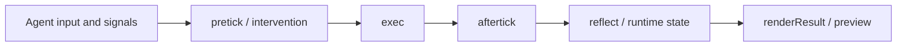
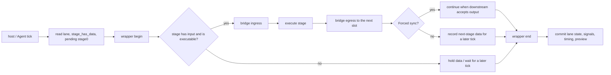

# AlgoForge Studio

[中文说明](READMEcn.md)

AlgoForge Studio is an algorithm production platform. It helps a team take either a newly described algorithm or an existing third-party algorithm library to a built package, a debuggable runtime, and an integration that can be called by another application.

The project is not a collection of algorithms that replaces your own code. It provides the surrounding tools and runtime so algorithms can be organized, built, inspected, tested, previewed, and reused. An algorithm may be implemented in the repository or brought in through a plugin and a third-party library such as a physics engine.

## What problem does it solve?

Algorithms often become difficult to maintain when their data, implementation, rendering code, debugging controls, and host-application glue are spread across unrelated parts of a project.

AlgoForge gives those parts a shared workflow:

```text
optional: describe a new algorithm in Algorithm DevTools
or:      bring an existing / third-party implementation
                         ↓
             describe its package boundary
                         ↓
              build one reusable .algo package
                         ↓
          load, inspect, and preview in DebugTool
                         ↓
             call it from a host through the SDK
```

The main benefits are:

- algorithms become independent packages instead of being tied to one application;
- developers can either create a project-specific algorithm or adapt an existing library;
- the same package can be inspected before it is integrated into a larger product;
- multi-stage algorithms can be assembled and debugged as Pipelines;
- Jobs, Vulkan, CUDA, and external-library-backed implementations can coexist behind the same package/runtime model;
- the SDK keeps external integration separate from the DebugTool UI and development-only controls.

## The three parts of the workflow

### 1. Algorithm DevTools: describe and author the algorithm

Algorithm DevTools is the project's native Agent application for algorithm development. It provides both GUI and CLI interaction: the GUI uses the canvas, nodes, and ChatBox to organize an algorithm; the CLI uses the Agent command protocol for structured commands from ChatBox, scripts, and automation. The command form is one `cmd arg arg ...` line per command.

It is not just a canvas: it is where the algorithm's development document, data flow, package boundary, and build request are organized.

It helps the developer:

- arrange variables, arrays, containers, resource nodes, and tool nodes;
- describe how data is grouped and connected;
- record package structure and development metadata;
- inspect a Pipeline overview without flattening all private stage graphs into one graph;
- export the package JSON used by the runtime and build scripts.

The Agent is built into DevTools rather than being an external afterthought. The ChatBox can connect to the local agent bridge, and the Agent can operate the editor through a command protocol: add or inspect nodes, create nested containers, connect structure, focus the scene, review a Pipeline, and help prepare package resources. Commands can be highlighted in the UI and gated by manual or rule-based approval.

DevTools can use the development document to build a real, loadable `.algo` package on Windows. The Agent/ChatBox can help create or modify the C++, GLSL, CUDA, or third-party integration files, and the developer can also provide those files directly. DevTools can inspect data flow and borrow DebugTool's preview path for a rough preview while the package is being developed. The booter then compiles the implementation, compiles shaders, loads the manifest, and packages the runtime artifacts. This DevTools build workflow is currently provided for Windows; exporting JSON alone is not the build result.

Read more in [`Algorithm Studio`](algorithmDevTools/algorithm_studio/README.md) and the [`algorithm-development` guide](doc/skills/debugtoolSkill/algorithm-development/SKILL.md).

### 2. DebugTool: load, adjust, and debug the algorithm

DebugTool is the native host for development-time execution. It loads the built package and gives the developer a place to try the algorithm before it is embedded in a product.

It is used to:

- create an Agent and mount an ordinary algorithm or a Pipeline;
- provide default or custom resources and descriptor values;
- choose the available execution path, such as Jobs or Vulkan;
- apply pre/post execution intervention data;
- inspect reflected variables, arrays, stage state, bridge state, and runtime signals;
- render the algorithm result through Vulkan shaders;
- replay a Pipeline stage bridge while investigating data transfer;
- debug one Pipeline stage in isolation;
- provide a prominent live preview while debugging;
- record algorithm and Pipeline stage execution time;
- load custom resources and descriptor values for repeatable experiments.

These capabilities are also exposed through the runner CLI, so an external script or CI job can perform the same load, adjust, execute, preview, and timing workflow without manually operating the GUI. DebugTool is therefore more than a preview window: it is the project's full development-time debugging host.

DebugTool mounts the same single `.algo` package in two ways: `Debug` loads reflection for development inspection, while `releaseWithDebugInfo` mounts the same package without reflection. These are mount methods, not two algorithm package builds.

Read more in [`src/debug_tool/README.md`](src/debug_tool/README.md), the [`scheduler-runtime` guide](doc/skills/debugtoolSkill/scheduler-runtime/SKILL.md), and the [`decomposer-manifest` guide](doc/skills/debugtoolSkill/decomposer-manifest/SKILL.md).

### 3. SDK: integrate the algorithm into another application

The SDK is the formal integration boundary. An external host uses `sdk/sdk.h` to:

1. create an Agent;
2. mount an algorithm by package name;
3. provide requested resources and descriptor values;
4. submit the algorithm to the Agent;
5. keep the Agent in the host application's runtime lifecycle;
6. unmount the algorithm or destroy the Agent when it is no longer needed.

When an Agent is created or an algorithm is mounted, the host supplies the execution mode and Pipeline configuration. The Agent does not decide how often the host calls it; it handles the tick or execution request it receives.

The runtime has two algorithm execution modes:

- `Continuous`: every allowed Agent tick advances the algorithm once;
- `LaunchOnceThenHold`: the algorithm runs once through its current execution path, marks completion, and holds that state on later ticks.

The host or `AgentManager` controls tick delivery and any frequency limit. The host also supplies the algorithm's execution preference and, for a Pipeline, its topology and synchronization mode. These are runtime execution choices, not a requirement for the Agent to own the host's clock.

The host does not need to know how the algorithm is split into internal stages. The Agent and scheduler own the runtime progression, while the algorithm package owns its semantics and data. DebugTool-only reflection and intervention UI remain outside the SDK boundary.

Read more in [`src/sdk/README.md`](src/sdk/README.md).

## What an algorithm package contains

An algorithm package has two complementary sides:

| Side | Responsibility |
| --- | --- |
| Package boundary | Containers, resources, descriptors, stages, mappings, defaults, reflection, intervention, and package metadata |
| Implementation | At minimum, an `exec` implementation with one declared execution preference; optional stages and extra backend implementations can be added when needed |

The smallest useful package only needs its required `exec` implementation and one execution preference. A larger package may contain C++, GLSL, CUDA, third-party files, or internal files needed by a complex reflector. Those details are package internals; the upper layers receive one loadable `.algo` package and do not need to understand its internal file list.

The manifest connects the package boundary to its implementation. The build system uses the selected package name to find its source, configures the project, builds the implementation, compiles shaders when present, copies the required runtime resources, and creates the `.algo` package. The host runtime then loads the package through the same manifest contract.

The repository supports both ordinary packages and Pipelines. A Pipeline is built from stages, while the root package describes the stage order, named container mappings, optional wrapper stages, and the way data crosses each stage boundary. This lets an algorithm remain modular without forcing the host application to understand every internal stage.

Third-party code is not excluded by this model. A plugin can wrap an external algorithm or physics library as long as it exposes the package's runtime contract and the required runtime libraries are available. The repository includes PhysX compatibility and CUDA examples to demonstrate this direction.

## Basic concepts

### AlgorithmObject

`AlgorithmObject` is the runtime form of a loaded and assembled algorithm package. It is what an Agent mounts and what the scheduler advances. A normal algorithm and a Pipeline are both represented as algorithm objects from the Agent's point of view.

### Algorithm stages

The current model uses these logical stages:

| Stage | Purpose | Typical backend |
| --- | --- | --- |
| `pretick` | Modify or initialize data before execution | Jobs or Vulkan |
| `exec` | The algorithm's main work; this stage is required | Jobs, Vulkan, or another declared backend |
| `aftertick` | Update or prepare data after execution | Jobs or Vulkan |
| `renderResult` | Render the current result for preview | Vulkan |
| `reflect` | Expose runtime state for inspection | Jobs |

An algorithm does not need every optional stage, but it must provide an executable `exec` stage. The stage declarations and execution preferences come from the package description rather than being guessed by the host.

### Agent

An Agent is the runtime owner of mounted algorithm objects. It holds the algorithms, forwards resources and signals, advances ticks, and collects the result state. `AgentManager` manages multiple Agents; the SDK and DebugTool use this layer instead of managing algorithm objects directly.

### Standard containers

Standard containers are shared public slots between Pipeline stages and do not carry intervention control bits. The `standard_layout` describes them using canonical names such as variable slots `v1`, `v2` and array slots `a1`, `a2`. Development-document aliases are normalized back to those standard slots at runtime.

When a Pipeline is mounted, the runtime creates a shared standard container set and binds each stage's container view to it. Stages can exchange data through the same public slots without copying every private stage container into the mainline. Jobs Pipelines also require a standard stage-buffer slot for inter-stage execution data; the scheduler and bridge own the transfer.

Standard containers answer “which public data slot connects the stages?”; intervention signals answer “how does runtime control state travel?”. They are different mechanisms.

### Pipeline, mapping, and bridge

A Pipeline combines several algorithm stages into one larger algorithm. A mapping says which named containers correspond across a stage edge. A bridge performs the runtime transfer and can capture debug information about the incoming and outgoing state. They are related, but they are not the same thing.

Wrapper stages can provide a Pipeline-level head or tail. Standard containers provide the common data slots used to connect stages without copying every private stage container into the host.

See [`src/README.md`](src/README.md) for layer rules and the [`decomposer-manifest` guide](doc/skills/debugtoolSkill/decomposer-manifest/SKILL.md) for package mappings and bridges.

## What happens in one tick?

`tick` is not an algorithm phase and does not mean “run every Pipeline stage in order”. It is the host's signal to Agent/AgentManager to advance execution. In the current source, one call roughly does this:

1. The host calls `AgentManager.Tick`, or the Agent tick entry, with input, `dt`, mouse, and preview context;
2. `AgentManager` decides whether this call is delivered according to its tick gate;
3. the Agent refreshes intervention signals, builds an `allow_tick` state for each mounted object, and enters `Agent::Tick`;
4. the Agent passes the context, input signals, and mounted objects to the algorithm scheduler;
5. the scheduler executes an ordinary algorithm or advances a Pipeline, writing signals, runtime state, debug state, and timing back to the Agent;
6. the Agent aggregates those results into `AgentTickResult` for `AgentManager` and the host.

For an ordinary algorithm, one tick usually follows this execution path:



For a Pipeline, the scheduler does not unconditionally run `stage 1 → stage 2 → … → stage N`. It maintains the Pipeline registration, lanes, each stage's `stage_has_data` state, and pending stage-0 submissions. A stage executes only when it has input data, is assembled and ready, is allowed to tick, and is not holding a completed launch-once state.



In `Forced` synchronization, if the downstream stage can accept the output, the scheduler may forward data through adjacent compatible stages in the same call. In non-forced synchronization, one executable bundle is advanced and the next stage's data waits for a later tick. The final body stage loops back to the first stage for a circular topology; otherwise the wrapper end produces the Pipeline result.

Each body-stage ingress uses the manifest mapping and bridge rules to prepare input, then execution is followed by egress. The scheduler updates lane state, stage data state, active-stage state, stall state, and timing. The Agent does not need to know the lane implementation; it receives the scheduler result.

The scheduler's lifetime and tick rules are described in [`scheduler-runtime/SKILL.md`](doc/skills/debugtoolSkill/scheduler-runtime/SKILL.md).

## What the demos demonstrate

### Minimal package: Tempo and Teapot

These demos show the smallest useful loop: define a package, build it, mount it, execute it, and render a result. The Teapot example additionally demonstrates mesh, material, texture, and scene data being prepared as package resources.


### Collision demo

This demo shows that an algorithm package can contain real simulation data and supporting structures, not only a single function. It demonstrates PBD-style collision processing, BVH data, descriptor-driven initialization, intervention stages, reflection, and rendered output.


### PhysX Compatibility

This demo proves that an existing third-party PhysX implementation can live behind an AlgoForge algorithm package. The plugin creates two dynamic box actors in a gravity-free PhysX scene, chooses random starting points and opposing velocities that are guaranteed to meet, and resets the scene every eight seconds. It reads the simulated poses and velocities into a standard container, then uses an algorithm-owned indirect draw command with a custom instance count to render both bodies. Contact strength also drives a small temporary deformation in the preview.

The important property is the boundary: AlgoForge only sees the `.algo`, its declared containers, stages, and execution preference. The plugin owns the PhysX types, scene lifetime, actor creation, simulation step, and state-to-render conversion. The package carries the plugin, GLSL/SPIR-V resources, and the PhysX runtime DLLs together.

Install and activate Anaconda first, then build it with the repository's cross-platform algorithm entry point:

```text
python boot/booterNinjaClang.py physics_sdk_compat_demo
```

After starting the runner server, run the package through the cross-platform CLI protocol with the PhysX compatibility preference:

```text
debugTool --algorithm-runner --algorithm physics_sdk_compat_demo --execution compatibility --preview-gif demo/physics/physics_sdk_compat_demo_collision.gif --gif-duration 10
```

The same request can be submitted from Python with `aglopy.DebugToolRunner.run_algorithm(..., execution="compatibility")`; see the [runner guide](doc/skills/debugtoolSkill/debugtool-cli-runner/SKILL.md).

The executable package is [`physics_sdk_compat_demo.algo`](algorithmLib/algorithmruntimeLib/norm/physics_sdk_compat_demo/physics_sdk_compat_demo.algo). The recorded preview shows the two instances approaching, contacting, deforming briefly, and separating again. The package owns the instance count and draw command; the host only transports the standard container and executes the declared stages.


### Fireworks Pipeline

This demo is the clearest example of the platform's composition model. It demonstrates multiple stages, standard-container mappings, bridge transfer, wrapper stages, scheduler progression, Vulkan execution, and Pipeline timing/preview.


### Precision Grid

This demo shows that the package description can control storage layout and precision choices, allowing different parts of an algorithm to use different precision without changing the host integration model.


### DevTools and DebugTool UI

These images show the two development surfaces: one for authoring package structure and one for loading, running, and inspecting it.


## Build and launch

Before running any repository command, install Anaconda or Miniconda and prepare Python 3.10+. The project entry points are intended to run inside an activated conda environment rather than the system Python.

The repository provides two build routes with the same package workflow:

- MSVC/Visual Studio on Windows through `booterMSVC.py`;
- LLVM `clang-cl` + Ninja on Windows, and LLVM `clang` + Ninja on other supported platforms through `booterNinjaClang.py`.

The runtime uses SDL and Vulkan, and the SDK is intended for host applications on platforms that provide the required Vulkan support. The native DebugTool and runner have the most complete validation workflow on Windows; the Algorithm DevTools launcher is a Python entry point that can be run from the repository root.

Setup and build:

```bat
conda create -n algoforge python=3.11
conda activate algoforge
python boot\quick_begin.py
python boot\booterMSVC.py
```

`quick_begin.py` installs the Python requirements and then automatically builds the mainline, SDK, and all algorithm packages. Windows uses MSVC by default; use `python boot\quick_begin.py OpenSource` for the LLVM/Ninja route. If the dependency step has already been completed, run either booter without an algorithm name to build everything, or pass one algorithm package name to build only that package.

Launch after building:

```bat
build\Microsoft\RelWithDebInfo\debugTool.exe
python boot\launch_devTools.py
```

For the Windows machine-specific PATH issue, follow [`windows-path-environment/SKILL.md`](doc/skills/debugtoolSkill/windows-path-environment/SKILL.md). The build scripts already contain the intended environment setup.

## What is the runner?

The runner is the command-line front end for DebugTool. It uses the same runtime and package-loading path as the GUI, but lets a script or a CI job run a fixed number of ticks and export the result without manual UI operations.

It has two processes:

1. `--runner-server` starts a DebugTool backend and publishes a local endpoint;
2. `--algorithm-runner` or `--pipeline-runner` sends one request to that backend.

The runner can export a preview image and, for Pipelines, stage timing artifacts. The Python facade starts and manages the runner server for you, so a normal usage pattern is simply `python run_demo.py`. A request is successful only when the client receives `OK algorithm_runner` or `OK pipeline_runner`; seeing only `runner_client.begin` is not a completed run.

### CLI invocation

The runner CLI uses one server process and one client process. In the commands below, `debugTool` means the built DebugTool executable: `build/Microsoft/RelWithDebInfo/debugTool.exe` on Windows or `build/OpenSource/RelWithDebInfo/debugTool` on other platforms. The command form does not depend on PowerShell, cmd, or another Windows shell, so the server and client can be entered in ordinary terminals. The current repository's runner-control socket implementation is still Windows-only; the cross-platform part here is the CLI argument/call shape, not a claim that the current runner backend works on non-Windows platforms. Run the server in one terminal and the client in another:

Server terminal:

```text
debugTool --runner-server --runner-endpoint 127.0.0.1:0
```

Ordinary algorithm client:

```text
debugTool --algorithm-runner --algorithm v6a6_pbd_ball_collision_demo --ticks 1 --execution jobs --preview-output testData/collision_preview.ppm
```

Pipeline client:

```text
debugTool --pipeline-runner --algorithm v4a16_fireworks_pipeline_demo --ticks 12 --execution vk --preview-output testData/fireworks_preview.ppm
```

The server writes the selected endpoint to `testData/runner_control/endpoint.txt`; a client using `--runner-endpoint 127.0.0.1:0` resolves that file. A successful CLI run returns `OK algorithm_runner` or `OK pipeline_runner`.

### Python invocation

The Python facade manages the runner server, so scripts normally do not need to compose the server/client commands. Create a small file named `run_demo.py`:

Create a small file named `run_demo.py`:

```python
from pathlib import Path
from aglopy import DebugToolRunner

repo = Path.cwd()
with DebugToolRunner(repo) as runner:
    collision = runner.run_algorithm(
        "v6a6_pbd_ball_collision_demo",
        execution="jobs",
        preview_output=repo / "testData" / "collision_preview.ppm",
    ).require_ok()
    fireworks = runner.run_pipeline(
        "v4a16_fireworks_pipeline_demo",
        execution="vk",
        ticks=12,
        preview_output=repo / "testData" / "fireworks_preview.ppm",
    ).require_ok()
    print(collision.response, collision.preview_pixels)
    print(fireworks.response, fireworks.preview_pixels)
```

Run it from the repository root with the same command on supported platforms:

```text
python run_demo.py
```

The Python facade [`aglopy`](aglopy/README.md) wraps the same protocol and keeps a server alive for multiple requests. The command interface is cross-platform; the repository's current native DebugTool/runner validation is most complete on Windows.

## Detailed guides

- [`Algorithm Studio`](algorithmDevTools/algorithm_studio/README.md)
- [`SDK surface`](src/sdk/README.md)
- [`Layer contracts`](src/README.md)
- [`Algorithm development`](doc/skills/debugtoolSkill/algorithm-development/SKILL.md)
- [`Scheduler runtime`](doc/skills/debugtoolSkill/scheduler-runtime/SKILL.md)
- [`Decomposer and manifest`](doc/skills/debugtoolSkill/decomposer-manifest/SKILL.md)
- [`CLI runner`](doc/skills/debugtoolSkill/debugtool-cli-runner/SKILL.md)
- [`Build project`](buildProject/README.md)
- [`Project vision`](doc/VISION.md)

AlgoForge Studio is still evolving. Its current focus is making algorithm development, runtime debugging, Pipeline composition, and external integration work through one consistent package model.
