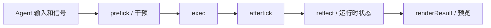
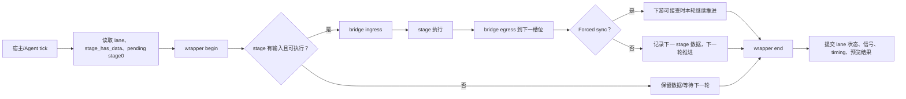
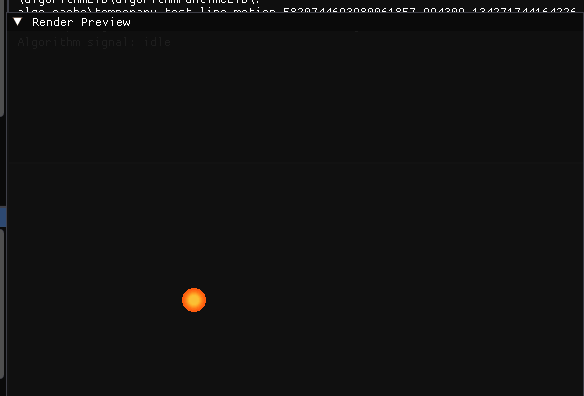
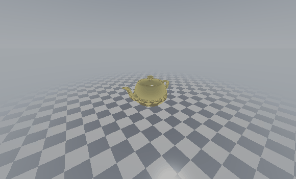
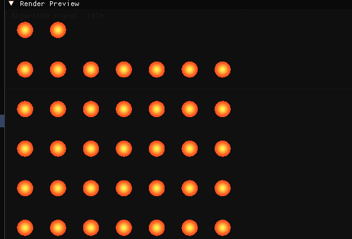
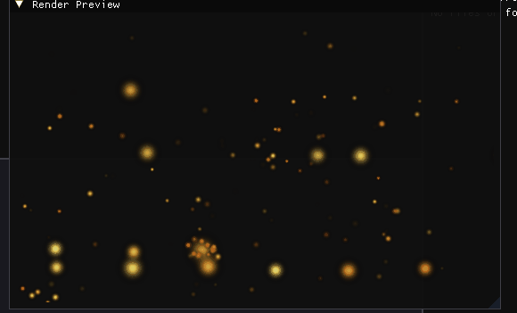
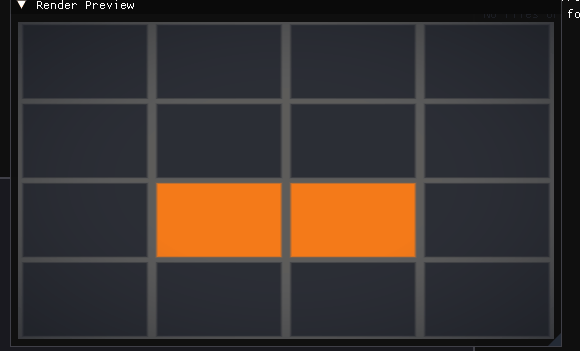
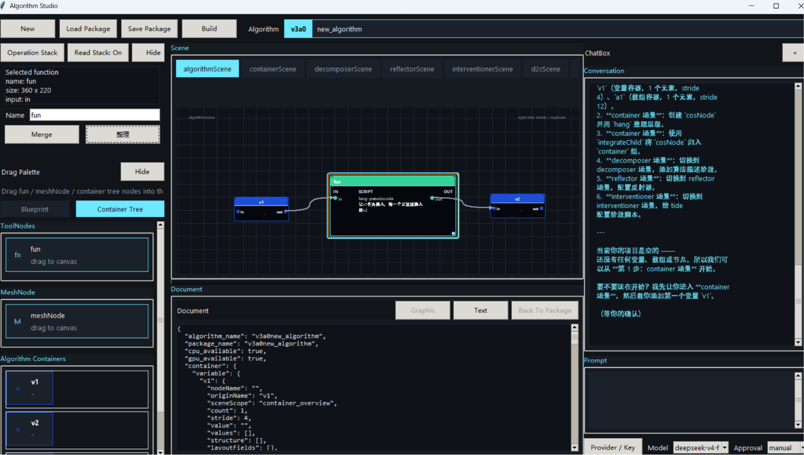
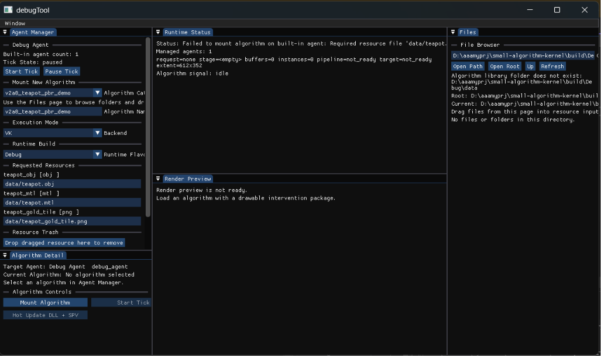

# AlgoForge Studio

[English README](README.md)

AlgoForge Studio 是一个面向算法生产的工具链。它可以把一个新设计的算法，或者一个已有的第三方算法库，整理成可构建、可调试、可预览、可被宿主程序集成使用的 `.algo` 算法包。

你不必一定从零设计算法：目前仓库已经提供 PhysX 兼容接入示例，未来还会继续增加其他第三方库的接入方式。AlgoForge 关注的是算法周围的工程流程——描述算法、组织数据、构建包、运行调试和集成使用——而不是限制算法必须由本项目重新实现。

## 项目能做什么

项目把算法工作拆成一条可复用的流程：

```text
可选：在 Algorithm DevTools 中设计新算法
或：接入已有算法/第三方算法库
        ↓
编写算法开发文档，描述数据、资源、阶段和执行偏好
        ↓
构建出真实可用的 .algo 算法包
        ↓
用 DebugTool 载入、预览、调试和测量
        ↓
用 SDK 把算法接入宿主程序
```

它的主要价值是：

- 算法以独立包存在，不必和某一个业务程序强绑定；
- 算法可以来自项目内实现，也可以来自第三方算法库；
- 在正式集成前，可以单独观察数据流、运行阶段、预览结果和计算耗时；
- 多阶段算法可以组合成 Pipeline，并通过统一的容器和阶段协议传递数据；
- 开发期的反射、干预、预览和调试能力由 DevTools/DebugTool 提供，正式宿主只需使用 SDK。

## 三个模块如何配合

### 1. Algorithm DevTools：算法开发文档和构建

Algorithm DevTools 本身就是项目原生提供的 Agent 软件。它同时提供 GUI 和 CLI 两种交互方式：GUI 用画布、节点和 ChatBox 组织算法开发；CLI 则通过 Agent command protocol 发送结构化命令，适合 ChatBox、脚本和自动化流程调用。CLI 命令采用一行一个 `cmd arg arg ...` 的形式。

它不只是画流程图，而是围绕算法开发文档组织算法对象、容器、资源、阶段、映射和构建信息。

它主要负责：

- 描述算法的数据、资源、执行阶段和阶段之间的连接关系；
- 查看数据流向，帮助确认数据从哪里来、经过哪些阶段、最终流向哪里；
- 借用 DebugTool 的能力提供粗粒度预览，用来快速确认算法是否按预期工作；
- 根据算法开发文档和实现文件，构建出真正可以被运行时载入的 `.algo` 文件；
- 通过 Agent/ChatBox 协助生成或修改 C++、GLSL、CUDA 以及第三方实现文件，也可以完全由开发者自行提供这些文件。

算法之所以能够被构建，是因为开发文档把“算法边界和运行契约”结构化描述出来，构建工具再根据这些描述找到实现、编译 plugin、编译 shader、准备运行时资源并打包。开发文档本身不是算法实现，只有和实现文件一起构建后才会得到可运行的 `.algo`。

当前 DevTools 的 `.algo` 构建能力只提供 Windows 支持；算法运行时和 SDK 的跨平台目标不等于 DevTools 构建能力已经在所有平台可用。

详见 [Algorithm Studio](algorithmDevTools/algorithm_studio/README.md) 和 [算法开发说明](doc/skills/debugtoolSkill/algorithm-development/SKILL.md)。

### 2. DebugTool：比预览更强的算法调试工具

DebugTool 是开发阶段的原生运行宿主。它载入已经构建好的算法包，让开发者在接入正式业务程序前，先把算法完整跑起来并观察运行过程。

它提供：

- 普通算法和 Pipeline 的载入与运行；
- Pipeline 的单 stage 调试，可以单独检查某个阶段的输入、输出和状态；
- 自定义载入资源和描述符，复现不同的运行条件；
- 变量、容器、stage 状态、bridge 状态以及运行时信号的查看；
- 显眼位置的算法预览，不把预览藏在调试信息之后；
- 算法总耗时、各 stage 耗时等计算性能信息；
- 对阶段间数据传递、bridge 和 wrapper 的检查。

这些能力全部通过 runner 以 CLI 形式对外提供，因此可以被 Python 脚本、自动化测试和 CI 调用，不需要人工操作 GUI。DebugTool 的定位不只是“看一张预览图”，而是对算法执行过程进行可重复的调试和测量。

DebugTool 对同一个 `.algo` 包提供两种挂载方式：`Debug` 挂载会加载反射信息，便于开发期检查；`releaseWithDebugInfo` 挂载使用同一个包但不加载反射。这是挂载方式的区别，不是两份算法包构建。

详见 [DebugTool 说明](src/debug_tool/README.md)、[调度器运行时说明](doc/skills/debugtoolSkill/scheduler-runtime/SKILL.md) 和 [包与 manifest 说明](doc/skills/debugtoolSkill/decomposer-manifest/SKILL.md)。

### 3. SDK：把算法集成到宿主程序

SDK 是正式集成边界。宿主程序通过 SDK 创建 Agent、载入算法、提供资源，然后把 Agent 提交到自己的生命周期中。

集成时，宿主除了告诉 Agent“运行哪个算法”，还需要告诉它采用什么执行方式和 Pipeline 配置。Agent 不负责决定宿主多久调用一次它；它只处理收到的 tick 或执行请求。

- 算法是跟随 Agent tick 持续执行，还是执行一次直到当前执行路径结束并保持完成状态；
- 算法选择 Jobs、Vulkan 或其他可用执行偏好；
- Pipeline 的阶段拓扑、同步方式和推进策略。

算法运行时的执行方式主要有两种：

- `Continuous`：每次收到允许执行的 Agent tick，都推进一次算法；
- `LaunchOnceThenHold`：算法被启动并执行一次，完成当前执行路径后保持完成状态，后续 tick 不再重复执行。

调用频率属于宿主/`AgentManager` 的 tick 投递策略。宿主可以按自己的更新循环调用 `Agent.Tick`，也可以通过管理层的节流设置控制调用频率；这不改变 Agent 对上述两种算法执行方式的理解。

一个典型的集成过程是：

1. 创建 Agent；
2. 按算法包名称载入算法；
3. 提供算法需要的资源和描述符；
4. 设置调度策略并提交算法；
5. 将 Agent 放入宿主程序自己的更新循环；
6. 在不再需要时卸载算法或销毁 Agent。

宿主程序不需要了解每个 Pipeline 内部有多少 stage，也不需要复制算法的私有容器。算法负责自己的语义和数据，SDK/Agent 负责生命周期、调度和运行时连接。

详见 [SDK 说明](src/sdk/README.md)。

## 算法包里有什么

一个算法包至少需要声明算法边界，并提供一个 `exec` 阶段的实现偏好。最小包可以只有一个可执行的 `exec` 实现，以及一个执行偏好，例如 Jobs、Vulkan 或 CUDA 中的一种。

更复杂的算法包可能包含：

- C++ plugin；
- GLSL shader；
- CUDA 实现；
- 第三方库文件；
- 反射器需要的复杂内部文件或其他运行时资源。

这些内容都属于算法包的内部实现。对上层宿主来说，最终只需要载入一个 `.algo` 文件。第三方实现并不被排除；当前仓库已有 PhysX 兼容示例，后续可以扩展更多库。

## 基础概念

### AlgorithmObject：算法对象

`AlgorithmObject` 是算法包完成载入和组装后的运行时对象。Agent 持有它，调度器推进它，算法的阶段、容器、资源和结果都属于这个对象的运行范围。普通算法和 Pipeline 对 Agent 来说都以算法对象的形式存在。

### 算法阶段

算法由若干有明确职责的阶段组成，最常见的是：

| 阶段 | 作用 |
| --- | --- |
| `pretick` | 执行前初始化或修改数据 |
| `exec` | 算法的主要计算，最小算法必须有可执行的 `exec` |
| `aftertick` | 执行后更新或整理数据 |
| `renderResult` | 将当前结果提交给预览渲染 |
| `reflect` | 将运行时状态暴露给 DebugTool 等调试工具 |

并不是每个算法都必须实现全部阶段。阶段和执行偏好由算法包声明，宿主不会通过数组长度或容器数量猜测算法行为。

### Agent：算法运行时的管理者

Agent 持有已载入的算法对象，转发资源和控制信号，根据宿主提供的调度策略推进 tick，并收集算法结果。`AgentManager` 可以管理多个 Agent。SDK 和 DebugTool 都通过 Agent 层使用算法，而不是直接操作调度器内部对象。

### 标准容器

标准容器是 Pipeline 阶段之间共享的公共容器槽位，不承载干预控制位。它由 `standard_layout` 描述，通常使用规范化的名字：变量槽位如 `v1`、`v2`，数组槽位如 `a1`、`a2`。开发文档中可以用更易读的 alias 描述它们，但运行时会把 alias 解析回这些标准槽位。

挂载 Pipeline 时，运行时建立一个共享的 standard container set，并把各个 stage 的容器视图绑定到它。这样 stage 可以通过相同的公共槽位交换数据，不需要把每个 stage 的私有容器全部复制到主线。Jobs Pipeline 还要求一个标准的 stage buffer 槽位，用来承载阶段间的执行数据；其具体传递由调度器和 bridge 完成。

标准容器解决的是“阶段之间使用哪个公共数据槽位”，干预信号解决的是“运行时如何传递控制状态”，二者不能混用。

### Pipeline、mapping 和 bridge

Pipeline 把多个算法阶段组合成一个更大的算法对象。Pipeline 的描述会声明 stage 顺序、阶段边界以及可选的 wrapper。

- `mapping` 描述两个 stage 之间哪些命名容器彼此对应；
- `bridge` 负责运行时的数据传递，以及必要的输入/输出调试信息；
- `standard container` 提供阶段之间可以直接使用的公共数据槽位，并由 Pipeline 的共享容器集维护；
- `wrapper` 可以提供 Pipeline 的整体头部或尾部逻辑。

mapping 是“对应关系”，bridge 是“运行时传递机制”，两者相关但不是同一个概念。这样可以让主线只负责运行环境，不需要理解算法内部的对象数量、粒子数量或渲染数量。

更多规则见 [代码分层说明](src/README.md) 和 [包与 manifest 说明](doc/skills/debugtoolSkill/decomposer-manifest/SKILL.md)。

## 一轮 tick 怎么运行

`tick` 不是算法阶段，也不是“自动把所有 stage 顺序执行一遍”的命令。它是宿主向 Agent/AgentManager 发出的推进信号。当前源码中的一轮调用大致是：

1. 宿主调用 `AgentManager.Tick`，或者直接调用 Agent 的 tick 入口，并提供输入、`dt`、鼠标位置和预览尺寸等上下文；
2. AgentManager 根据自身的 tick 开关和投递策略决定是否把这一轮交给 Agent；
3. Agent 刷新干预信号，生成每个已挂载算法的 `allow_tick` 状态，然后调用 `Agent::Tick`；
4. Agent 将上下文、输入信号和算法对象交给算法调度器；
5. 调度器执行普通算法或推进 Pipeline，并把算法信号、运行时状态、调试状态和 timing 写回 Agent；
6. Agent 汇总这些结果，返回 `AgentTickResult`，由 AgentManager/宿主继续处理。

普通算法的单轮执行路径通常是：



对于 Pipeline，调度器不是无条件地执行 `stage 1 → stage 2 → … → stage N`。它会维护 Pipeline 注册信息、lane、每个 stage 的 `stage_has_data` 状态和待提交的 stage0 数据。只有拥有输入数据、已经组装完成、允许执行且没有处于 launch-once 完成状态的 stage 才会执行。



在 `Forced` 同步模式下，如果下游能够接收输出，调度器可以在同一轮把数据继续转发给相邻且执行偏好兼容的 stage；在非强制同步模式下，一轮只推进当前可执行 bundle，下一 stage 的数据留到后续 tick。Pipeline 的最后一个 body stage 在循环拓扑下会回写到首 stage，否则数据在 wrapper end 处形成 Pipeline 结果。

每个 body stage 的 ingress 会根据 manifest 的 mapping 和 bridge 规则准备输入，执行算法后再进行 egress；调度器同时更新 lane、stage 数据状态、活跃 stage、stall 状态和 timing。Agent 不需要知道 lane 的内部实现，只接收调度结果。

详见 [调度器运行时说明](doc/skills/debugtoolSkill/scheduler-runtime/SKILL.md)。

## Demo 分别展示什么

### Tempo 和 Teapot：最小算法包闭环

展示算法包的整理、构建、载入、执行和结果预览。Teapot 还展示 mesh、材质、纹理和场景数据如何作为算法资源准备。





### Collision：算法不仅是一个函数

展示 PBD 风格的碰撞计算、BVH 数据、描述符初始化、干预阶段、反射和最终渲染，体现算法对象如何管理完整运行过程。



### PhysX Compatibility：第三方物理库兼容执行

这个 Demo 用真实的 PhysX 刚体场景验证第三方库兼容性：在无重力场景中创建两个动态盒体，随机生成起点和相向速度，并保证它们会相遇；场景每八秒重置一次。算法把 PhysX 的位姿和速度写入标准容器，再通过算法自己提供的间接绘制命令和自定义 instance 数量绘制两个刚体；接触强度还会驱动短暂的简单形变。

它体现的边界是：AlgoForge 只负责 `.algo` 的载入、容器、阶段和调度；PhysX 类型、场景生命周期、刚体创建、碰撞模拟，以及状态转成渲染数据，都由算法插件自己负责。`.algo` 将插件、渲染资源和匹配的 PhysX runtime DLL 一起携带。

先安装并激活 Anaconda，再使用仓库提供的跨平台算法构建入口：

```text
python boot/booterNinjaClang.py physics_sdk_compat_demo
```

启动 runner server 后，使用跨平台 CLI 协议，以 PhysX compatibility 偏好执行：

```text
debugTool --algorithm-runner --algorithm physics_sdk_compat_demo --execution compatibility --preview-gif demo/physics/physics_sdk_compat_demo_collision.gif --gif-duration 10
```

Python 也可以通过 `aglopy.DebugToolRunner.run_algorithm(..., execution="compatibility")` 提交同一个请求，详见 [runner 说明](doc/skills/debugtoolSkill/debugtool-cli-runner/SKILL.md)。

可执行包是 [`physics_sdk_compat_demo.algo`](algorithmLib/algorithmruntimeLib/norm/physics_sdk_compat_demo/physics_sdk_compat_demo.algo)。下面的录制结果展示两个 instance 接近、接触、短暂形变后再次分离；instance 数量和绘制命令由算法提供，宿主只负责传输标准容器并执行声明的阶段。


### Firework Pipeline：模块组合和跨阶段传递

展示多个 stage、standard container mapping、bridge、wrapper、调度器推进、Vulkan 执行，以及 Pipeline timing/preview。



### Precise Grid：容器精度和数据布局

展示算法描述如何控制数据布局和精度，让算法不同部分使用不同精度，同时不改变宿主程序的集成方式。



### DevTools 和 DebugTool UI：两种开发视角

DevTools 展示算法开发文档、Agent 协助和构建流程；DebugTool 展示算法载入、运行、预览、调试和耗时测量。





## 构建和启动

开始之前，请先安装 [Anaconda](https://www.anaconda.com/download) 或 Miniconda，并准备 Python 3.10+。项目的 Python 入口使用 conda 环境，不建议直接使用系统 Python。

项目提供两条构建路线：

- Windows 的 MSVC/Visual Studio：`boot/booterMSVC.py`；
- Windows 的 LLVM `clang-cl` + Ninja，以及其他支持平台上的 LLVM `clang` + Ninja：`boot/booterNinjaClang.py`。

运行时使用 SDL 和 Vulkan；因此 SDK 面向能够提供所需 Vulkan 支持的宿主平台。Algorithm DevTools 的 `.algo` 构建功能目前只支持 Windows，但 Python 启动入口和 SDK 的目标是跨平台的。

最短流程如下：

```text
conda create -n algoforge python=3.11
conda activate algoforge
python boot/quick_begin.py
python boot/booterMSVC.py
```

`quick_begin.py` 会安装 Python 依赖，然后自动构建主线、SDK 和全部算法包。Windows 默认使用 MSVC；需要走 LLVM/Ninja 时使用 `python boot/quick_begin.py OpenSource`。如果依赖已经安装，直接运行 `booterMSVC.py` 或 `booterNinjaClang.py`，不带算法名同样会构建全部算法包。需要只构建一个算法时，再把算法包名作为参数传入。

如果要同时构建某个算法包：

```text
python boot/booterMSVC.py v6a6_pbd_ball_collision_demo
```

构建完成后，在仓库根目录启动 DevTools：

```text
python boot/launch_devTools.py
```

Windows 上也可以直接启动构建后的 DebugTool：

```text
build/Microsoft/RelWithDebInfo/debugTool.exe
```

如果 Windows 的 `PATH` 环境异常，查看 [Windows 环境说明](doc/skills/debugtoolSkill/windows-path-environment/SKILL.md)。

## Runner 是什么

Runner 是 DebugTool 的命令行运行能力。它复用和 GUI 相同的算法包加载、运行时和执行路径，但允许脚本或 CI 固定运行若干 tick，并导出预览和 timing 结果。

### CLI 调用

Runner CLI 由一个 server 进程和一个 client 进程组成。下面的 `debugTool` 表示构建后的 DebugTool 可执行文件：Windows 是 `build/Microsoft/RelWithDebInfo/debugTool.exe`，其他平台是 `build/OpenSource/RelWithDebInfo/debugTool`。下面的参数写法不依赖 PowerShell、cmd 或其他 Windows 命令行工具，请在两个终端中分别执行。需要注意：当前仓库的 runner control socket 实现仍只支持 Windows，跨平台的是 CLI 参数/调用形式，不代表当前 runner 后端已经在非 Windows 平台可用。

终端 A，启动 runner server：

```text
debugTool --runner-server --runner-endpoint 127.0.0.1:0
```

终端 B，运行普通算法：

```text
debugTool --algorithm-runner --algorithm v6a6_pbd_ball_collision_demo --ticks 1 --execution jobs --preview-output testData/collision_preview.ppm
```

运行 Pipeline 时，把 client 命令替换为：

```text
debugTool --pipeline-runner --algorithm v4a16_fireworks_pipeline_demo --ticks 12 --execution vk --preview-output testData/fireworks_preview.ppm
```

server 会把实际 endpoint 写入 `testData/runner_control/endpoint.txt`，client 使用 `--runner-endpoint 127.0.0.1:0` 时会读取它。CLI 运行成功时应收到 `OK algorithm_runner` 或 `OK pipeline_runner`。

### Python 调用

Python facade 会自动管理 runner server，因此脚本通常不需要手写 server/client 命令。创建 `run_demo.py`：

```python
from pathlib import Path
from aglopy import DebugToolRunner

repo = Path.cwd()
with DebugToolRunner(repo) as runner:
    collision = runner.run_algorithm(
        "v6a6_pbd_ball_collision_demo",
        execution="jobs",
        preview_output=repo / "testData" / "collision_preview.ppm",
    ).require_ok()
    fireworks = runner.run_pipeline(
        "v4a16_fireworks_pipeline_demo",
        execution="vk",
        ticks=12,
        preview_output=repo / "testData" / "fireworks_preview.ppm",
    ).require_ok()
    print(collision.response, collision.preview_pixels)
    print(fireworks.response, fireworks.preview_pixels)
```

在仓库根目录执行：

```text
python run_demo.py
```

这个 Python 调用形式可以跨平台复用。当前仓库的原生 DebugTool/runner 验证主要在 Windows 上完成。成功条件是收到 `OK algorithm_runner` 或 `OK pipeline_runner`，而不是只看到 `runner_client.begin`。Pipeline 的 timing 产物应写入 `testData/pipeline_timing/`。

详见 [CLI Runner 说明](doc/skills/debugtoolSkill/debugtool-cli-runner/SKILL.md) 和 [aglopy 使用说明](aglopy/README.md)。

## 相关文档

- [Algorithm Studio](algorithmDevTools/algorithm_studio/README.md)
- [SDK 说明](src/sdk/README.md)
- [代码分层说明](src/README.md)
- [算法开发说明](doc/skills/debugtoolSkill/algorithm-development/SKILL.md)
- [调度器运行时](doc/skills/debugtoolSkill/scheduler-runtime/SKILL.md)
- [包与 manifest](doc/skills/debugtoolSkill/decomposer-manifest/SKILL.md)
- [CLI Runner](doc/skills/debugtoolSkill/debugtool-cli-runner/SKILL.md)
- [构建说明](buildProject/README.md)
- [项目愿景](doc/VISION.md)
