# Agent 级自适应复合棱柱元系统

## 1. 命名基线

本系统统一使用“棱柱元”作为几何、物理和调度单位名称。

~~~text
整体系统：Agent级自适应复合棱柱元系统
运行组件：AgentAdaptivePrismElementComponent
数据场：AdaptivePrismElementField
文件格式：.prism
~~~

~~~mermaid
flowchart TD
    A[AdaptivePrismElementField] --> B[PrismElement]
    A --> C[SuperPrismElement]
    A --> D[SurfaceTransitionPrismElement]
    D --> E[TetCap]
    D --> F[DualTetCap]
    B --> G[TetrahedralSolverPrimitive]
    D --> G
~~~

系统不以固定规则立方体作为架构前提。普通单元是四棱柱元，边界单元可以退化为一个或两个四面体。

## 2. 尺度命名

~~~text
lg0       = 1m 参考尺度
-lg1      = 0.5m
-lg2      = 0.25m
-lg3      = 0.125m
...
-lg7      = 1/128m，普通材料实时生产管线的最深预算级

lg1       = 2m
lg2       = 4m
lg3       = 8m
~~~

~~~mermaid
flowchart LR
    A[lg2 SuperPrismElement] --> B[lg1 SuperPrismElement]
    B --> C[lg0 PrismElement]
    C --> D[-lg1 PrismElement]
    D --> E[-lg2 PrismElement]
    E --> F[-lg7 PrismElement]
~~~

lg0 是一米级参考组，不要求实际 mesh 尺寸精确等于一米。长度为 0.8m 的对象仍属于 lg0，其精算点使用 lg0 的固定父空间坐标。

`lg` 切分点锚定在对象的参考 / 材料坐标，不取当前变形后几何的包围盒中点。以局部区间 `[0m,0.8m]` 为例：

~~~text
-lg1 切分点：0.5m
-lg2 新切分点：0.25m、0.75m
1.0m 在实际物体外，不生成切分点
~~~

因此“取中点”指的是当前 canonical `lg` 单元的中点。完整单元上它等于几何中点；被 mesh 边界截短的表面单元上，它不一定等于剩余几何的中点。

## 3. 普通棱柱元

普通四棱柱元使用自身局部坐标：

~~~text
u = 长度方向
v = 宽度方向
w = 高度 / 纵向方向

refine_level = (lu, lv, lw)
~~~

令 `h0=1m`，当前负层级的 canonical 间距为：

~~~text
h(l)=h0/2^l

u_grid(k,l)=u_origin+k·h(l)
v_grid(k,l)=v_origin+k·h(l)
w_grid(k,l)=w_origin+k·h(l)
~~~

只保留落入实际 mesh 体积的子单元。被物体边界截断的最后一个子单元可以短于 `h(l)`，但下一层切分点仍来自 canonical `lg` 网格，不重新取截断部分的几何中点。

u、v、w 是棱柱经过 transformer 后的局部物理方向，不是固定的世界 X、Y、Z 方向。

三种基本细化：

~~~text
横向四分：
    (lu, lv, lw) → (lu+1, lv+1, lw)

纵向二分：
    (lu, lv, lw) → (lu, lv, lw+1)

完整八分：
    (lu, lv, lw) → (lu+1, lv+1, lw+1)
~~~

对一个完整三棱柱，横向四分使用三角截面三条边的 canonical 中点：

~~~text
M_AB=(A+B)/2
M_BC=(B+C)/2
M_CA=(C+A)/2

ABC
  → A M_AB M_CA
  → M_AB B M_BC
  → M_CA M_BC C
  → M_AB M_BC M_CA
~~~

纵向二分在 canonical 参数 `t=1/2` 处切开当前父单元。上下端面不平行、母线不平行时，仍对三条对应母线分别取 `t=1/2` 的参考插值点，不改成世界空间包围盒中点。

`full8` 就是横向四分与纵向二分的组合。普通三棱柱的几何细分规则已经闭合，不需要根据受力位置临时发明 `2/5` 切面。

~~~mermaid
flowchart TD
    A[局部误差] --> B{误差方向}
    B -->|横向 / 剪切 / 接触面| C[横向四分]
    B -->|高度压缩 / 纵向波| D[纵向二分]
    B -->|多方向同时异常| E[完整八分]
~~~

普通棱柱元的物理细化上限为：

~~~text
0 ≤ lu ≤ 7
0 ≤ lv ≤ 7
0 ≤ lw ≤ 7
~~~

## 4. 物理求解基元

一个规则四棱柱元可以沿固定底面对角线拆成两个三棱柱，每个三棱柱再拆成三个四面体：

~~~mermaid
flowchart LR
    A[PrismElement] --> B[Triangular Prism 1]
    A --> C[Triangular Prism 2]
    B --> D[3 tetrahedra]
    C --> E[3 tetrahedra]
~~~

因此一个规则四棱柱元默认对应六个四面体求解基元。

四面体负责：

~~~text
变形梯度
应力
应变能
损伤变量
内部力
~~~

棱柱元负责：

~~~text
层级拓扑
细化 / 合并
材料归属
界面组织
渲染和物理快照
~~~

## 5. 超级棱柱元

超过一米且可以由四棱柱描述的对象，使用 SuperPrismElement。

~~~text
SuperPrismElement
    pos
    scale
    transformer
    mesh_reference
    material_profile
    base_cell_size_m = 1.0
    active_refine_windows
~~~

超级棱柱元只保存宏观描述，不保存所有更小层级子组：

~~~mermaid
flowchart TD
    A[当前 lgN SuperPrismElement] --> B[当前层级扫描]
    B --> C{当前层级能否表达}
    C -->|能| D[保持当前 lgN]
    C -->|不能| E[只生成局部 lgN-1 活动窗口]
    E --> F[在下一层重新判断]
~~~

超级棱柱元不直接跳到 `lg0` 或普通负层级。`lgN` 不能表达时只生成受影响的 `lgN-1` 活动窗口；`lg1` 仍不能表达时，才允许生成局部 `lg0` 活动窗口。正层级的下降次数不计入普通材料实时生产管线的 `-lg1` 至 `-lg7` 七级细分限制。

## 6. 表面过渡棱柱元

曲面边界无法始终容纳一个完整四棱柱，因此使用 SurfaceTransitionPrismElement。

~~~mermaid
flowchart TD
    A[mesh 曲面与规则棱柱相交] --> B{能否保留完整棱柱}
    B -->|是| C[PrismElement]
    B -->|否| D[SurfaceTransitionPrismElement]
    D --> E[TetCap：1 个四面体]
    D --> F[DualTetCap：2 个共享面的四面体]
~~~

~~~text
TetCap
    一个四面体

DualTetCap
    两个共享内部面的四面体
~~~

DualTetCap 是一个复合表面棱柱元，不是两个独立粒子。内部共享面力相互抵消，外部边界面负责与相邻单元传力。

## 7. 撞击与层级力场

速度本身不是力。撞击力由相对速度、有效质量、接触几何、材料刚度和接触模型共同产生：

~~~text
v_relative
    + effective_mass
    + contact_geometry
    + material_stiffness
    → contact force F(t)

J = ∫F(t)dt
~~~

lg0、-lg1、-lg2 不是把总力切成固定比例，而是同一力场的不同分辨率：

~~~mermaid
flowchart TD
    A[总接触力 F(t)] --> B[lg0 粗场]
    A --> C[-lg1 局部修正]
    A --> D[-lg2 更高频局部修正]
    B --> E[大尺度 / 低频]
    C --> F[lg0 无法表达的应力梯度]
    D --> G[-lg1 无法表达的接触细节]
~~~

只有活动叶节点真正承担物理求解；父元只保存摘要，不与子元重复接收质量和外力。

## 8. 同级棱柱元之间的传力

同一 -lg1 层内的相邻棱柱元直接通过共享 InterfacePatch 传力，不经过 lg0：

~~~mermaid
flowchart LR
    A[-lg1 棱柱元 A] --> C[共享 InterfacePatch]
    B[-lg1 棱柱元 B] --> C
    C --> D[-lg1 棱柱元 C]
~~~

~~~text
t = stress × normal
F_interface = ∫Γ t dA
F_left  += F_interface
F_right -= F_interface
~~~

力的分流由界面面积、法向、两侧应力、材料刚度、相对速度和接触状态决定，不使用预设百分比。

跨尺度相邻时才使用延拓和限制映射：

~~~text
δu_fine = P × δu_coarse
f_coarse = Pᵀ × f_fine
~~~

## 9. CUDA wrapper 调度

Agent 组件内部使用 GPU 精算队列，不由主干线程递归调度：

~~~mermaid
flowchart TD
    A[lg0 CUDA wrapper] --> B[精算组队列]
    B --> C[空闲 wrapper 领取]
    C --> D[-lg1 应力 / 界面计算]
    D --> E{是否收敛}
    E -->|是| F[final force queue]
    E -->|否| G[-lg2 精算组队列]
    G --> C
~~~

wrapper 输出：

~~~text
cell_result
interface_force_packet
next_refine_group
next_refine_point
~~~

同一层级的任务可以并行执行；拓扑在当前精算前沿完成前保持不变。

## 10. Agent 边界

~~~text
主干提供：Agent 生命周期、通用挂载边界、执行边界
组件提供：棱柱元语义、拓扑、粒度、预算、CUDA 调度、物理快照
~~~

普通 Agent 可以挂载多个算法。DebugTool debug agent 仍然只允许挂载一个 debug 算法；该限制属于 DebugTool 适配层，不写入通用 Agent。

## 11. 实现顺序

~~~mermaid
flowchart LR
    A[.prism 描述] --> B[mesh 链接]
    B --> C[lg0 棱柱元生成]
    C --> D[四面体求解基元]
    D --> E[CUDA 粗算 wrapper]
    E --> F[-lg1 至 -lg7 自适应精算]
    F --> G[表面过渡棱柱元]
    G --> H[简单城市街区验证]
~~~

第一版优先验证：

~~~text
lg0 棱柱元场
超级棱柱元压缩描述
横向四分 / 纵向二分 / 完整八分
同级与跨级界面传力
TetCap / DualTetCap 曲面边界
CUDA 精算队列
~~~

## 12. lg0 进入 -lg1 的判据

### 12.1 粗算先做可表达性判断

lg0 wrapper 的第一轮不是只计算一个总力，而是判断 lg0 是否能够表达当前局部力场：

~~~mermaid
flowchart TD
    A[lg0 粗算] --> B[试算接触力]
    B --> C[父单元内采样精算点]
    C --> D[估计应力 / 力场残差]
    D --> E{lg0 是否足够表达}
    E -->|是| F[接受 lg0]
    E -->|否| G[生成 -lg1 精算组]
~~~

不能等力完全算不出来才进入 -lg1。细化判定发生在提交 lg0 最终结果之前。

### 12.2 细化评分

~~~text
refine_score =
    max(
        force_projection_error,
        stress_gradient_error,
        contact_localization_error,
        damage_proximity,
        wave_resolution_error
    )
~~~

当：

~~~text
refine_score > material_profile.refine_threshold
~~~

就生成 -lg1 精算任务。

### 12.3 五类触发因素

~~~text
force_projection_error
    lg0 力场投影到父节点后，无法复原局部试算力

stress_gradient_error
    同一 lg0 单元内部的应力变化过大

contact_localization_error
    接触区域远小于 lg0 单元尺度

damage_proximity
    最大主应力、塑性应变或损伤变量接近材料破坏阈值

wave_resolution_error
    冲击波特征长度小于 lg0 能够解析的空间尺度
~~~

大力本身不是细化条件。均匀压缩即使力很大，也可能继续停留在 lg0；局部接触和高应力梯度才是骑枪尖端需要进入 -lg1 的主要原因。

### 12.4 力场投影残差

~~~text
f_lg0 = R_lg0(f_trial)
f_reconstructed = P_lg0(f_lg0)
r_lg0 = f_trial - f_reconstructed
~~~

当：

~~~text
r_lg0 > refine_threshold
    → 进入 -lg1
~~~

进入 -lg1 后，只有活动叶节点承担最终物理求解；lg0 保存状态摘要和粗粒度结果。

### 12.5 骑枪撞击示例

~~~mermaid
flowchart TD
    A[骑枪 lg0 棱柱元] --> B[枪尖接触]
    B --> C[接触区域远小于 lg0]
    C --> D[枪尖附近应力梯度升高]
    D --> E[lg0 投影残差升高]
    E --> F[生成枪尖周围 -lg1 精算组]
    F --> G[沿弯曲 / 应力传播路径继续生成精算组]
~~~

不会把整根骑枪一次性细化。初始精算组至少包括：

~~~text
撞击棱柱元
接触界面相邻棱柱元
弯矩最大的相邻棱柱元
必要的 2:1 邻接平衡单元
~~~

如果 -lg1 仍然无法表达局部力场，再递归进入 -lg2。

### 12.6 破裂与细化的顺序

~~~mermaid
flowchart TD
    A[lg0 试算] --> B{表达误差是否超限}
    B -->|是| C[先进入 -lg1]
    B -->|否| D{材料破裂指标是否达到}
    D -->|否| E[接受当前层]
    D -->|是| F[在当前层判定损伤 / 破裂]
    C --> G[-lg1 重算]
    G --> H{精算误差是否超限}
    H -->|是| I[进入 -lg2]
    H -->|否| J[用 -lg1 结果判定材料状态]
~~~

即使 lg0 的应力已经超过强度，也应该优先判断它是否具有足够的空间分辨率。粗单元无法定位裂纹时，先细化，再使用接受层的应力、应变能和损伤变量判定破裂。

### 12.7 CUDA wrapper 输出

~~~text
RefineDecision
    cell_id
    source_level = lg0
    target_level = -lg1
    refine_mode = lateral4 | longitudinal2 | full8
    refine_score
    reason_mask
    refine_points
    refine_group
~~~

~~~mermaid
flowchart LR
    A[lg0 wrapper] --> B[RefineDecision]
    B --> C[-lg1 精算组队列]
    C --> D[空闲 CUDA wrapper]
    D --> E[局部重算]
    E --> F{误差是否仍超限}
    F -->|是| G[-lg2 队列]
    F -->|否| H[提交 -lg1 结果]
~~~

进入 -lg1 的本质不是这一层的力不够大，而是：

~~~text
lg0 无法用当前自由度表达冲击造成的局部力场
~~~

## 13. 三棱柱在 t = 2/5 处受力的精算组

### 13.1 几何假设

设一个 lg0 三棱柱的轴向局部坐标为 t：

~~~text
t = 0      下端三角面
t = 1      上端三角面
受力点：t = 2/5
~~~

三角形截面使用重心坐标：

~~~text
λ1 + λ2 + λ3 = 1
~~~

本例先取截面中心：

~~~text
λ1 = λ2 = λ3 = 1/3
~~~

~~~mermaid
flowchart LR
    A[t=0 三角面] --> B[受力点 t=2/5]
    B --> C[t=1 三角面]
~~~

### 13.2 lg0 粗层的受力

设接触求解已经产生外力向量 F。三棱柱的六个节点使用棱柱形函数分配：

~~~text
底面节点 Ai：
    f_Ai = (1 - t) × λi × F

顶面节点 Ai'：
    f_Ai' = t × λi × F
~~~

在 t = 2/5 且截面中心时：

~~~text
三个底面节点：
    f_A = f_B = f_C = 0.2F

三个顶面节点：
    f_A' = f_B' = f_C' = 2/15F
~~~

六个节点受力总和为：

~~~text
3 × 0.2F + 3 × (2/15F) = F
~~~

所以 2/5 位置可以被 lg0 直接表达。非 dyadic 位置本身不是进入 -lg1 的理由。

### 13.3 什么时候生成精算组

lg0 wrapper 在受力点周围生成探针，并计算：

~~~text
force_projection_error
stress_gradient_error
contact_localization_error
damage_proximity
wave_resolution_error
~~~

~~~text
refine_score =
    max(
        force_projection_error,
        stress_gradient_error,
        contact_localization_error,
        damage_proximity,
        wave_resolution_error
    )
~~~

只有在：

~~~text
refine_score > refine_threshold
~~~

时才生成精算组。

例如：

~~~text
受力均匀、应力梯度小、接触面宽
    → lg0 可以接受

受力集中、弯矩快速变化、应力梯度大
    → 进入 -lg1

受力点靠近三角截面边缘，表面几何无法由规则棱柱表达
    → 进入 lateral4 或 SurfaceTransitionPrismElement
~~~

### 13.4 最简单的 -lg1 精算组

假设只有纵向误差，横截面没有足够大的误差，则采用纵向二分：

~~~text
父棱柱 P(lg0)
    → P_left(-lg1):  t ∈ [0, 1/2]
    → P_right(-lg1): t ∈ [1/2, 1]
~~~

受力点 t = 2/5 落在：

~~~text
P_left(-lg1)
~~~

但精算组不能只包含左半个子棱柱。因为一次纵向二分必须覆盖整个父棱柱，所以最小精算组是：

~~~text
RefineGroup = {
    P_left(-lg1),
    P_right(-lg1)
}
~~~

~~~mermaid
flowchart LR
    A[lg0 父三棱柱] --> B[P_left -lg1]
    A --> C[P_right -lg1]
    D[受力点 t=2/5] --> B
    B <-->|内部共享三角面| C
~~~

右侧子棱柱没有直接外力，但它通过中间共享面接收左侧传来的内部力。

### 13.5 -lg1 子棱柱中的受力

在左侧子棱柱中，局部轴向坐标为：

~~~text
t_left = (2/5) / (1/2) = 4/5
~~~

因此左侧子棱柱的节点力为：

~~~text
左子棱柱底面节点：
    f_A = (1 - 4/5) × λi × F
        = 1/5 × λi × F

左子棱柱顶面节点：
    f_A' = 4/5 × λi × F
~~~

对于中心受力点：

~~~text
左子棱柱底面三个节点：
    各得到 1/15F

左子棱柱顶面三个节点：
    各得到 4/15F
~~~

右侧子棱柱的直接外力为零：

~~~text
F_external(P_right) = 0
~~~

但它不是没有受力。左、右子棱柱在共享三角面上计算内部牵引力：

~~~text
F_left_interface  = ∫Γ stress_left × normal dA
F_right_interface = -F_left_interface
~~~

这就是力从左侧 -lg1 子棱柱进入右侧 -lg1 子棱柱的方式。

### 13.6 什么时候把邻居也加入精算组

父三棱柱内部的两个 -lg1 子棱柱一定进入同一精算组。父三棱柱外部的邻居只有满足以下条件时才加入：

~~~text
接触影响半径跨过父棱柱边界
应力传播方向指向该邻居
邻居与精算组形成超过一级的粒度差
邻居本身的 refine_score 超过阈值
~~~

~~~mermaid
flowchart TD
    A[受力父棱柱] --> B[内部两个 -lg1 子棱柱]
    A --> C{外部邻居是否受影响}
    C -->|否| D[保持原级别，通过 InterfacePatch 传力]
    C -->|是| E[邻居父棱柱加入精算组]
    E --> F[邻居也生成对应 -lg1 子棱柱]
~~~

因此，最小组和扩展组要区分：

~~~text
最小精算组：
    当前父三棱柱切出的两个 -lg1 子棱柱

扩展精算组：
    最小组 + 接触 / 应力传播范围内的邻居子棱柱
~~~

### 13.7 横向细化的条件

如果受力点在三角截面中心，且横向应力梯度低，不需要横向四分。

如果受力点接近三角截面边缘，或者三个重心坐标差异很大，则比较三角截面内的探针误差：

~~~text
η_base =
    max(
        stress_probe_variation,
        contact_patch_variation,
        force_projection_residual
    )
~~~

当 η_base 超过阈值时：

~~~text
纵向二分：
    2 个 -lg1 三棱柱

横向四分 + 纵向二分：
    8 个 -lg1 子棱柱
~~~

### 13.8 CUDA wrapper 输出

~~~text
RefineDecision
    source_cell_id
    source_level = lg0
    target_level = -lg1
    mode = longitudinal2 | lateral4 | full8
    seed_point = (λ1, λ2, λ3, t=2/5)
    refine_group
    reason_mask
    refine_score
~~~

~~~mermaid
flowchart TD
    A[lg0 三棱柱 wrapper] --> B[定位 λ1 λ2 λ3 t=2/5]
    B --> C[采样粗层误差]
    C --> D{选择细化方式}
    D -->|纵向误差| E[2 个 -lg1 子棱柱]
    D -->|横向误差| F[4 个横向子棱柱]
    D -->|多方向误差| G[8 个 -lg1 子棱柱]
    E --> H[-lg1 精算组队列]
    F --> H
    G --> H
~~~

本例的核心结论：

~~~text
2/5 位置可以直接计算，不因非 dyadic 自动细化。

如果 lg0 表达能力足够：
    不生成精算组。

如果只有纵向局部误差：
    生成父棱柱切出的两个 -lg1 子棱柱。

如果横向也出现高梯度：
    生成四分或完整八分的子棱柱组。

力通过共享界面牵引力在不同 -lg1 棱柱之间传递。
~~~

## 14. 三棱柱六节点受力的推导

### 14.1 节点定义

底面三角形节点：

~~~text
A、B、C
~~~

顶面三角形节点：

~~~text
A'、B'、C'
~~~

三角形截面内使用重心坐标：

~~~text
λ1 + λ2 + λ3 = 1
~~~

沿棱柱轴向使用归一化坐标：

~~~text
t = 0    底面
t = 1    顶面
~~~

### 14.2 六节点形函数

六节点三棱柱的形函数是三角形重心函数与轴向线性函数的乘积：

~~~text
N_A  = (1 - t) × λ1
N_B  = (1 - t) × λ2
N_C  = (1 - t) × λ3

N_A' = t × λ1
N_B' = t × λ2
N_C' = t × λ3
~~~

六个形函数始终满足：

~~~text
N_A + N_B + N_C + N_A' + N_B' + N_C' = 1
~~~

### 14.3 点力如何转换成节点力

设受力点的外力向量为 F。点力的虚功为：

~~~text
δW_point = F · δu(x)
~~~

而棱柱内部位移由六个节点插值得到：

~~~text
δu(x) = Σ N_i(x) × δu_i
~~~

代入点力虚功：

~~~text
δW_point
    = F · Σ N_i × δu_i
    = Σ (N_i × F) · δu_i
~~~

因此每个节点的等效节点力就是：

~~~text
f_i = N_i(x) × F
~~~

这就是六个节点受力的来源。

### 14.4 t = 2/5、截面中心的数值

截面中心：

~~~text
λ1 = λ2 = λ3 = 1/3
~~~

受力位置：

~~~text
t = 2/5
1 - t = 3/5
~~~

底面节点：

~~~text
N_A = N_B = N_C
    = (3/5) × (1/3)
    = 1/5
    = 0.2
~~~

顶面节点：

~~~text
N_A' = N_B' = N_C'
     = (2/5) × (1/3)
     = 2/15
~~~

所以：

~~~text
f_A = f_B = f_C = 0.2F

f_A' = f_B' = f_C' = 2/15F
~~~

总力守恒：

~~~text
3 × 0.2F + 3 × (2/15F) = F
~~~

### 14.5 力矩也保持一致

线性棱柱形函数满足几何插值关系：

~~~text
x = Σ N_i(x) × x_i
~~~

因此节点力不仅保持总力：

~~~text
Σ f_i = F
~~~

还保持受力点的力矩：

~~~text
Σ x_i × f_i = x × F
~~~

这意味着把点力转换成六个节点力后，合力和力矩都不会改变。

### 14.6 面力或接触力

如果不是一个点力，而是接触面上的牵引力 t，则对接触面进行积分：

~~~text
f_i = ∫Γ N_i × t dA
~~~

点力公式是面力公式在单个积分点上的特例：

~~~text
f_i = N_i(x_contact) × F_contact
~~~

### 14.7 与四面体求解基元的关系

如果受力点已经定位到棱柱内部的某一个四面体求解基元，则应使用该四面体的四节点形函数：

~~~text
f_j = N_j_tetra(x_contact) × F_contact
~~~

六节点棱柱公式用于：

~~~text
宏观棱柱元的节点受力
棱柱界面上的面力积分
父子棱柱之间的状态延拓
~~~

四节点四面体公式用于：

~~~text
具体四面体内部的局部物理求解
~~~

因此，六节点分配和四面体分配不是两套互相冲突的力，而是不同求解层级下的形函数映射。

### 14.8 λ 的几何含义：广义三棱柱

λ1、λ2、λ3 不是某个固定底面的投影坐标，也不属于三个四面体。它们是三棱柱参考三角形的三个重心坐标。

六个顶点为：

~~~text
底部：A、B、C
顶部：A'、B'、C'
~~~

对于任意轴向参数 t，先定义该参数截面的三个对应点：

~~~text
A_t = (1-t)A + tA'
B_t = (1-t)B + tB'
C_t = (1-t)C + tC'
~~~

受力点 P 位于这个截面三角形内：

~~~text
P = λ1 A_t + λ2 B_t + λ3 C_t
λ1 + λ2 + λ3 = 1
~~~

展开后得到六节点广义三棱柱映射：

~~~text
P = λ1[(1-t)A + tA']
  + λ2[(1-t)B + tB']
  + λ3[(1-t)C + tC']
~~~

~~~mermaid
flowchart TD
    A[三角形 ABC] --> B[参数截面 t]
    C[三角形 A'B'C'] --> B
    B --> D[截面三角形 At Bt Ct]
    D --> E[P 受力点]
~~~

因此，即使上下端面不平行、三条对应母线不平行，λ 仍然有效。它表示 P 在当前截面三角形 At Bt Ct 中的位置。

如果 P 位于当前截面三角形中心：

~~~text
λ1 = λ2 = λ3 = 1/3
~~~

如果 P 偏向 At，则 λ1 增大，A 和 A' 获得的节点力增大。

### 14.8.1 形函数仍然成立

六个节点形函数仍为：

~~~text
N_A  = (1-t)λ1
N_B  = (1-t)λ2
N_C  = (1-t)λ3

N_A' = tλ1
N_B' = tλ2
N_C' = tλ3
~~~

因为它们来自同一个广义坐标映射，而不是来自上下端面平行这一假设。

点力 F 的等效节点力仍为：

~~~text
f_i = N_i(P) × F
~~~

这个分配保持虚功、合力和力矩一致。

### 14.8.2 如何求 P 的 λ 和 t

对于规则棱柱，t 可以通过轴向投影直接得到。

对于端面不平行、母线不平行的广义三棱柱，应反解：

~~~text
P = λ1[(1-t)A + tA']
  + λ2[(1-t)B + tB']
  + λ3[(1-t)C + tC']
~~~

约束为：

~~~text
λ1 + λ2 + λ3 = 1
λ1 ≥ 0
λ2 ≥ 0
λ3 ≥ 0
0 ≤ t ≤ 1
~~~

求得 t 后，在截面三角形 At Bt Ct 中计算 λ。CUDA wrapper 可以使用固定次数的局部迭代或预先生成的参数空间定位表。

### 14.8.3 母线为曲线时

如果三条对应母线不是直线，而是曲线，则六节点线性广义三棱柱不足以精确描述几何。此时必须：

~~~text
使用高阶棱柱元
或沿母线切成多个广义三棱柱元
或在曲面边界使用 SurfaceTransitionPrismElement
~~~

“母线不平行”不影响六节点映射；“母线不是直线”才会要求更高阶几何描述。

三棱柱拆成四面体后，包含受力点的四面体会有另一套四节点重心坐标。那套坐标只属于该四面体，不能与广义三棱柱的 λ1、λ2、λ3 混用。

### 14.8.4 λ 对应的是一个三角形，不是三个三角形

三棱柱的几何结构是：

~~~text
底端三角形：ABC
顶端三角形：A'B'C'
中间截面：每一个 t 都有一个三角形 AtBtCt
~~~

~~~mermaid
flowchart TD
    A[底端三角形 ABC] --> B[t=2/5 截面三角形 At Bt Ct]
    B --> C[顶端三角形 A'B'C']
    B --> D[P 受力点]
~~~

在 t = 2/5 时：

~~~text
At = (3/5)A + (2/5)A'
Bt = (3/5)B + (2/5)B'
Ct = (3/5)C + (2/5)C'
~~~

λ1、λ2、λ3 是 P 在这一个截面三角形 AtBtCt 中相对于三个顶点的重心坐标：

~~~text
P = λ1At + λ2Bt + λ3Ct
λ1 + λ2 + λ3 = 1
~~~

所以：

~~~text
λ1 → 截面顶点 At 的权重
λ2 → 截面顶点 Bt 的权重
λ3 → 截面顶点 Ct 的权重
~~~

如果 P 是截面三角形的中心：

~~~text
λ1 = λ2 = λ3 = 1/3
~~~

三棱柱本身只有两个三角形端面和三个侧面。三个侧面通常是四边形；如果为四面体求解而拆成三角面，那些三角面属于四面体拓扑，不是 λ1、λ2、λ3 的来源。


### 14.9 缺棱时的边界复合棱柱元

如果曲面裁剪导致一条或两条对应母线 `AA'、BB'、CC'` 不再具有独立长度，单元已经不再是完整的六节点广义三棱柱。此时不能把它继续塞进六节点 wrapper，也不能把重复节点留在六节点数组里。

这里必须区分两类几何：

~~~text
规范塌缩：
  一对端点合并成同一个真实边界点
  可以使用固定的 2-tetra / 1-tetra 快速拓扑

任意裁剪：
  曲面切出新的交点、切面或更多边
  必须保存实际交集体积，tetra 数量不固定
~~~

~~~mermaid
flowchart TD
    A[广义三棱柱候选单元] --> B{三条对应棱是否都存在}
    B -->|是| C[GeneralizedTriangularPrismElement]
    B -->|否| D{是否为规范母线塌缩}
    D -->|缺一条| E[DualTetrahedralCapElement：2 tetra]
    D -->|缺两条| F[TetrahedralCapElement：1 tetra]
    D -->|否| G[显式裁剪四面体集合]
~~~

边界复合棱柱元的几何来源是 mesh 与父棱柱元的实际交集：

~~~text
parent prism ∩ mesh solid
    → actual boundary polyhedron
    → tetrahedral decomposition
~~~

它不保存不存在的几何边，而是保存实际存在的求解基元：

~~~text
BoundaryCompositePrismElement
    kind
    actual_nodes
    tetrahedra
    boundary_faces
    occupied_volume
    mesh_surface_patch
    refine_policy
~~~

建议的 kind：

~~~text
generalized_triangular_prism
one_mother_line_collapsed
two_mother_lines_collapsed
arbitrary_boundary_composite
~~~

### 14.9.1 缺一棱

以 `AA'` 为例。如果它规范地塌缩为一个真实点 `P`：

~~~text
A=A'=P

实际节点：P、B、C、B'、C'

T0=(B,C,P,B')
T1=(C,P,B',C')

内部共享面：
F01=(C,P,B')
~~~

这是五个实际节点、两个四面体的 `DualTetrahedralCapElement`，不是含一条零长度棱的六节点棱柱。

如果所谓“缺一棱”是曲面切掉角部并产生了新的交点，则不能套用上面的两个四面体。它必须：

~~~text
1. 求 mesh 与父棱柱的交集
2. 生成实际边界面
3. 将交集体积拆成实际四面体
4. 对每个四面体使用四节点重心坐标
~~~

~~~mermaid
flowchart LR
    A[缺一母线候选] --> B{端点是否合并为一个点}
    B -->|是| C[5 节点 DualTetrahedralCap]
    C --> D[固定 2 tetra]
    B -->|否| E[实际裁剪体积]
    E --> F[显式 tetra 集合]
~~~

### 14.9.2 缺两棱

以 `AA'、BB'` 为例。如果两条母线分别规范地塌缩为 `P、Q`：

~~~text
A=A'=P
B=B'=Q

实际节点：P、Q、C、C'

T0=(P,Q,C,C')
~~~

这正好是一个四节点 `TetrahedralCapElement`。如果裁剪表面产生了额外交点，则仍然是显式裁剪四面体集合，不保证只有一个四面体。

~~~mermaid
flowchart LR
    A[缺两母线候选] --> B{是否形成四个独立节点}
    B -->|是| C[TetrahedralCap：1 tetra]
    B -->|否但仍有封闭体积| D[BoundaryCompositePrismElement]
    D --> E[多个 tetra]
~~~

因此只有“规范塌缩”拥有固定数量：缺一条母线为两个四面体，缺两条母线为一个四面体。任意 mesh 裁剪的四面体数量仍由实际交集体积和质量要求决定。

### 14.9.3 缺棱单元的受力

如果受力点落入某个实际四面体，则使用该四面体的四节点重心坐标：

~~~text
f_j = N_j_tetra × F
~~~

如果是表面牵引力，则只在实际边界面上积分：

~~~text
f_j = ∫actual_boundary N_j_tetra × traction dA
~~~

不能把不存在的棱、虚假节点或空材料区域加入受力计算。

### 14.9.4 拓扑切换条件

~~~text
三条对应棱完整、Jacobian 有效
    → 使用 GeneralizedTriangularPrismElement

一条母线规范塌缩
    → DualTetrahedralCapElement

两条母线规范塌缩
    → TetrahedralCapElement

任意裁剪或非规范 Jacobian 退化
    → BoundaryCompositePrismElement / TetrahedralGroup

边界交集进一步缩小
    → TetCap / DualTetCap 或新的 tetra 复合单元
~~~

标准六节点形函数只对完整广义三棱柱有效。拓扑一旦退化，必须先切换单元类型，再进行定位、受力和细化。

### 14.9.5 CUDA 分桶

不同拓扑不能混在同一个分支密集的 wrapper 中：

~~~mermaid
flowchart TD
    A[活动精算组] --> B{cell kind}
    B --> C[GeneralizedPrismQueue]
    B --> D[OneMotherLineCollapsedQueue]
    B --> E[TwoMotherLinesCollapsedQueue]
    B --> F[BoundaryCompositeQueue]
    C --> G[统一界面力 packet]
    D --> G
    E --> G
    F --> G
~~~

所有类型最终输出统一结果：

~~~text
cell_result
interface_force_packet
next_refine_group
next_refine_point
~~~

边界复合棱柱元解决的是几何拓扑退化问题，不是给普通棱柱元增加更多 λ。

## 15. 一般三棱柱与广义三棱柱

### 15.1 统一参考坐标

三棱柱统一使用：

~~~text
λ1 + λ2 + λ3 = 1
λ1、λ2、λ3 ≥ 0
0 ≤ t ≤ 1
~~~

六个几何节点为：

~~~text
底端：A、B、C
顶端：A'、B'、C'
~~~

广义三棱柱的物理坐标映射为：

~~~text
x(λ,t) =
    λ1[(1-t)A + tA']
  + λ2[(1-t)B + tB']
  + λ3[(1-t)C + tC']
~~~

这个映射允许：

~~~text
上下端面不平行
A-A'、B-B'、C-C' 不平行
三个对应侧面发生扭转
~~~

### 15.2 Jacobian 与几何有效性

令：

~~~text
λ1 = 1 - r - s
λ2 = r
λ3 = s
~~~

则：

~~~text
x(r,s,t)
  = A + r(B-A) + s(C-A)
  + t[
      (A'-A)
      + r((B'-B)-(A'-A))
      + s((C'-C)-(A'-A))
    ]
~~~

几何 Jacobian 为：

~~~text
J = [∂x/∂r, ∂x/∂s, ∂x/∂t]
~~~

只有满足以下条件，才能使用六节点广义三棱柱公式：

~~~text
det(J) 不退化
当前点位于 λ1、λ2、λ3、t 的合法范围
mesh 表面没有切掉当前必要的几何边
~~~

否则切换为 BoundaryCompositePrismElement。

## 16. lg0 粗算需要观察的数据

lg0 wrapper 不只接收一个力，而是接收当前活动叶棱柱的完整观察包：

~~~text
PrismObservation
    cell_id
    level
    node_positions_rest
    node_positions_current
    node_velocities
    material_profile
    contact_points
    contact_force
    contact_impulse
    contact_normal
    contact_area
    contact_duration
    stress_samples
    strain_samples
    deformation_gradient_samples
    damage_state
    interface_traction_samples
    geometry_jacobian_samples
    wave_speed
    influence_radius
    local_budget
~~~

每个接触点使用：

~~~text
contact_point
    position_local = (λ1, λ2, λ3, t)
    force_vector
    impulse
    normal
    area
    influence_radius
~~~

### 16.1 粗算探针

wrapper 在当前棱柱内部生成固定探针：

~~~mermaid
flowchart TD
    A[lg0 PrismObservation] --> B[接触点探针]
    A --> C[子区域中心探针]
    A --> D[界面探针]
    A --> E[曲面边界探针]
    B --> F[局部误差数据]
    C --> F
    D --> F
    E --> F
~~~

探针不是新粒子，只是判断当前棱柱是否需要更高分辨率的采样位置。

## 17. 精算触发评分

每个观察包输出：

~~~text
force_projection_error
stress_gradient_error
contact_localization_error
damage_proximity
wave_resolution_error
interface_traction_error
geometry_quality_error
~~~

统一评分：

~~~text
refine_score =
    max(
        force_projection_error,
        stress_gradient_error,
        contact_localization_error,
        damage_proximity,
        wave_resolution_error,
        interface_traction_error,
        geometry_quality_error
    )
~~~

### 17.1 各项含义

~~~text
force_projection_error
    lg0 节点力重构后无法复原接触点附近的试算力

stress_gradient_error
    探针之间的应力 / 应变变化超过当前单元可表达范围

contact_localization_error
    接触面积或影响半径小于 lg0 的可解析尺度

damage_proximity
    当前应力、塑性应变或损伤变量接近材料破坏阈值

wave_resolution_error
    冲击波特征长度需要更小的棱柱元才能解析

interface_traction_error
    相邻界面两侧的牵引力或力矩不一致

geometry_quality_error
    Jacobian、扭曲度或曲面裁剪导致当前棱柱映射不可靠
~~~

### 17.2 触发规则

~~~text
geometry_quality_error 超限
    → 直接切换 BoundaryCompositePrismElement

其他任一物理误差超过 material_profile.refine_threshold
    → 生成下一层精算组

所有误差均未超限
    → 接受当前 lg0 结果
~~~

大力本身不是触发条件。均匀受压可以保持 lg0；局部接触、高应力梯度和几何不可表达才会触发细化。

## 18. 精算组包含哪些棱柱

精算组不是单个点，也不是整个模型，而是由种子棱柱和影响邻域闭包组成：

~~~text
RefineGroup
    group_id
    source_level
    target_level
    refine_mode
    seed_cells
    support_cells
    interface_ids
    refine_points
    parent_state_snapshot
    material_profile
    reason_mask
    refine_score
~~~

### 18.1 种子棱柱

下列数据会产生种子棱柱：

~~~text
包含 contact_point 的棱柱
包含 damage hotspot 的棱柱
包含最大应力梯度的棱柱
包含最大界面牵引力残差的棱柱
geometry_quality_error 超限的棱柱
~~~

### 18.2 支持棱柱

种子棱柱周围加入：

~~~text
接触影响半径覆盖到的棱柱
应力传播方向上的相邻棱柱
共享异常 InterfacePatch 的相邻棱柱
用于 2:1 粒度平衡的邻接棱柱
~~~

未被影响的邻居不必进入精算组，只通过 InterfacePatch 与精算区域传力。

### 18.3 由一个父棱柱生成的子棱柱

~~~text
longitudinal2：
    1 个父三棱柱 → 2 个子三棱柱

lateral4：
    1 个父三棱柱 → 4 个子三棱柱

full8：
    1 个父三棱柱 → 8 个子三棱柱

boundary composite：
    父棱柱与 mesh 求交 → 实际 tetra 集合
~~~

父棱柱一旦执行某种细化，它覆盖的全部子区域都进入该组，不能只生成包含受力点的半个子棱柱。

## 19. CUDA wrapper 的输入输出

~~~mermaid
flowchart LR
    A[lg0 PrismObservation] --> B[粗算 wrapper]
    B --> C[RefineDecision]
    C --> D[RefineGroup Queue]
    D --> E[空闲 CUDA wrapper]
    E --> F[生成子棱柱 / tetra]
    F --> G[局部应力与界面重算]
    G --> H[接受或追加下一层]
~~~

粗算 wrapper 输出：

~~~text
RefineDecision
    source_cell_id
    source_level
    target_level
    refine_mode
    refine_score
    reason_mask
    refine_points
    seed_cells
    support_cells
~~~

精算 wrapper 输出：

~~~text
cell_result
interface_force_packet
next_refine_group
next_refine_point
damage_update
geometry_update
~~~

本系统最终只需要回答一个问题：

~~~text
当前活动棱柱元的自由度，
是否足以表达当前接触、应力、几何和波传播状态？
~~~

如果答案是否定的，才把对应种子棱柱、支持棱柱和必要邻接棱柱送入下一层精算组。

## 20. 六节点三棱柱在 t = 2/5 受力的完整判断

以下按六节点三棱柱说明：两个三角端面，共六个角点。

### 20.1 几何参数

~~~text
λ1 + λ2 + λ3 = 1
λ1、λ2、λ3 ≥ 0
0 ≤ t ≤ 1
受力点：t = 2/5
~~~

如果受力点位于三角截面中心：

~~~text
λ1 = λ2 = λ3 = 1/3
~~~

这四个数描述受力点在三棱柱内部的位置，不是力的大小。

### 20.2 lg0 的外力计算

如果接触模型已经给出外力向量 F，六个节点的等效外力为：

~~~text
底面：
    f_A  = (1-t)λ1F
    f_B  = (1-t)λ2F
    f_C  = (1-t)λ3F

顶面：
    f_A' = tλ1F
    f_B' = tλ2F
    f_C' = tλ3F
~~~

在 t = 2/5、λ1 = λ2 = λ3 = 1/3 时：

~~~text
底面三个节点：各 1/5F
顶面三个节点：各 2/15F
~~~

如果输入是撞击速度，则还需要有效质量、接触刚度、接触阻尼、压入量和压入速度：

~~~text
F_normal = k_contact × penetration
          + c_contact × penetration_velocity

J = ∫F(t)dt
~~~

速度先经过接触模型产生 F(t)，再进行六节点外力分配。

### 20.3 lg0 的粗层物理量

使用静止和当前节点位置建立：

~~~text
J0 = rest_configuration_jacobian
J  = current_configuration_jacobian
~~~

变形梯度：

~~~text
deformation_gradient = J × inverse(J0)
~~~

材料模型根据变形梯度得到：

~~~text
stress
strain
damage
internal_force
~~~

### 20.4 判断 lg0 是否足够

lg0 wrapper 在棱柱内放置受力点、子区域中心、共享界面和边界探针，计算：

~~~text
force_projection_error
stress_gradient_error
contact_localization_error
damage_proximity
wave_resolution_error
interface_traction_error
geometry_quality_error
~~~

归一化后：

~~~text
η = max(
    η_force,
    η_stress,
    η_contact,
    η_damage,
    η_wave,
    η_interface,
    η_geometry
)
~~~

判断：

~~~text
η ≤ 1
    接受 lg0

η > 1
    生成 -lg1 精算组
~~~

大力本身不是细化条件。均匀压缩可能继续停留在 lg0；局部接触、高应力梯度或几何不可表达才会触发细化。

### 20.5 t = 2/5 的精算组

如果只有纵向误差：

~~~text
lg0 父三棱柱
    → P_left(-lg1):  t ∈ [0, 1/2]
    → P_right(-lg1): t ∈ [1/2, 1]
~~~

受力点位于 P_left，因为：

~~~text
2/5 < 1/2
~~~

但最小精算组仍然包含两个子棱柱：

~~~text
RefineGroup = {
    P_left(-lg1),
    P_right(-lg1)
}
~~~

左侧子棱柱中的局部位置：

~~~text
t_left = (2/5) / (1/2) = 4/5
~~~

左侧子棱柱接收直接接触力，右侧子棱柱通过两个子棱柱之间的共享面接收内部牵引力。

如果横向也出现误差：

~~~text
横向四分：4 个子棱柱
完整细化：8 个子棱柱
~~~

### 20.6 会被送入精算组的数据

~~~text
RefineGroup
    source_cell_id
    source_level = lg0
    target_level = -lg1
    refine_mode
    contact_points
    contact_force
    contact_impulse
    local_coordinates
    stress_samples
    strain_samples
    deformation_gradient_samples
    damage_state
    geometry_quality
    interface_ids
    support_cell_ids
    material_profile
    refine_score
    reason_mask
~~~

精算组包括：

~~~text
包含接触点的种子棱柱
接触影响半径覆盖的支持棱柱
应力传播方向上的邻居
界面残差过大的邻居
必要的 2:1 邻接平衡棱柱
~~~

核心判断：

~~~text
不是力大就细化，
而是当前棱柱的自由度无法表达局部力场时才细化。
~~~

## 21. t 参数截面

t 截面不是一个固定编号的三角形，而是由三条对应边上的三个插值点组成：

~~~text
At = (1-t)A + tA'
Bt = (1-t)B + tB'
Ct = (1-t)C + tC'
~~~

固定一个 t 后，At、Bt、Ct 组成一个截面三角形：

~~~text
T(t) = triangle(At, Bt, Ct)
~~~

~~~mermaid
flowchart LR
    A[底端三角形 T(0)] --> B[中间三角形 T(2/5)]
    B --> C[顶端三角形 T(1)]
~~~

普通规则三棱柱中：

~~~text
T(0)：底端三角形
T(1)：顶端三角形
T(2/5)：沿轴向 40% 位置的平行截面
~~~

广义三棱柱中，上下端面可以不平行，三条对应边也可以不平行，所以 T(t) 可以倾斜。此时 t 是参考空间参数，不一定等于物理距离百分比。

t = 2/5 的准确含义是：

~~~text
沿三条对应边完成 40% 的参数插值
~~~

如果受力点 P 已知于世界空间，需要同时反解：

~~~text
P = λ1At + λ2Bt + λ3Ct

λ1 + λ2 + λ3 = 1
0 ≤ t ≤ 1
~~~

t 决定 P 属于哪一个参数截面；λ1、λ2、λ3 决定 P 在该截面三角形中的位置。


### 20.7 点力的物理前提

连续介质中的绝对数学点力会在作用点附近产生理论应力奇异性：

~~~text
接触面积 → 0
接触压力 → 无限增大
局部应力 → 不收敛
~~~

因此，实际撞击不能只记录一个位置和一个力，还必须记录有限的接触描述：

~~~text
contact_area
contact_radius
contact_pressure_distribution
contact_duration
contact_normal
~~~

接触压力的基本关系：

~~~text
pressure = normal_force / contact_area
~~~

如果使用点坐标作为接触中心，也必须给出一个有限影响半径，使用归一化接触核：

~~~text
∫contact_kernel dA = 1
local_force(x) = contact_force × contact_kernel(x)
~~~

精算判据中的 contact_localization_error 比较的是：

~~~text
接触半径 / 当前棱柱特征尺寸
~~~

而不是单独比较点的位置。

所以对于 t = 2/5 的三棱柱：

~~~text
2/5 只负责定位受力中心
contact_area / contact_radius 负责决定力是否过于集中
contact_pressure_distribution 负责决定局部应力梯度
~~~

没有有限接触面积或接触核时，只能计算一个理想化节点载荷，不能得到可靠的破裂精算判据。

## 22. 外部压强函数与棱柱控制体平衡

### 22.1 外部载荷

棱柱直接接收边界上的压强函数或牵引力函数：

~~~text
pressure_face(x,t)
traction_face(x,t)
~~~

如果是法向压强：

~~~text
traction_external(x,t)
    = -pressure_face(x,t) × normal(x)
~~~

外部载荷可以来自场景、武器、其他算法或用户输入，不需要先构造一个自动接触点。

### 22.2 动量平衡

把棱柱看成控制体 V，边界为 Γ：

~~~text
d/dt ∫V density × velocity dV
    =
∫Γ traction dA
    +
∫V body_force dV
~~~

离散后：

~~~text
mass × acceleration
    =
所有边界面力之和
    +
体力
~~~

也就是：

~~~text
输入面力 - 输出面力 + 体力
    =
动量变化率
~~~

输入力和输出力不相等，不一定是力被吸收，也可能是棱柱正在加速。

### 22.3 数值积分

不需要解析地求出连续积分。每个三角面或四边形面放置有限积分点：

~~~text
积分点 q
积分权重 wq
面 Jacobian J_face(q)
面牵引力 traction(q)
~~~

面力近似为：

~~~text
F_face ≈ Σ [wq × abs(J_face(q)) × traction(q)]
~~~

因此 CUDA wrapper 只需要并行计算固定数量的面采样点，再做求和。

### 22.4 能量变化

力本身不会被吸收。外力做功后，能量会进入：

~~~text
动能
弹性储能
塑性耗散
损伤能
热能或其他材料耗散
~~~

能量平衡：

~~~text
dE/dt
    =
Σ face_force × face_velocity
    +
body_force × velocity
    -
dissipation_power
~~~

所以输入输出力的差值必须和动量变化、储能变化和耗散一起判断。

### 22.5 lg0 是否进入 -lg1

lg0 wrapper 输出：

~~~text
PrismBalanceObservation
    face_force_in
    face_force_out
    face_moment
    face_power
    body_force
    momentum_change
    elastic_energy_change
    plastic_dissipation
    damage_energy
    stress_samples
    traction_samples
    geometry_quality
~~~

计算三类主要残差：

~~~text
R_momentum
    = mass × acceleration
    - Σ face_force
    - body_force

R_energy
    = measured_energy_change
    - boundary_work
    - body_work
    + dissipation

R_interface
    = traction_left + traction_right
~~~

归一化后：

~~~text
η = max(
    momentum_residual / allowed_momentum_residual,
    energy_residual / allowed_energy_residual,
    interface_residual / allowed_interface_residual,
    stress_variation / allowed_stress_variation,
    geometry_error / allowed_geometry_error
)
~~~

判断：

~~~text
η ≤ 1
    接受当前 lg0

η > 1
    生成 -lg1 精算组
~~~

关键不是输入力和输出力完全相同，而是：

~~~text
输入力 - 输出力
是否能由当前棱柱的质量、加速度、储能和耗散解释
~~~

### 22.6 t = 2/5 的外部压强

如果压强函数沿棱柱轴向变化：

~~~text
pressure_face(t)
~~~

在 t = 2/5 附近，先用面积分点求输入面力，再计算输出面牵引力、体力和动量变化。

如果差值能够由加速度和能量变化解释：

~~~text
继续使用 lg0
~~~

如果差值同时伴随：

~~~text
局部压力峰值
内部应力快速变化
界面牵引力不平衡
能量平衡残差
~~~

则把该棱柱和支持邻居送入 -lg1 精算组。

本模型的核心是：

~~~text
棱柱接收边界压强函数，
计算边界力、动量、能量和界面牵引力，
再根据无法解释的平衡残差决定是否细化。
~~~

## 23. 外部合力必须先变成有限压强函数

即使上层输入只有一个合力 F 和一个作用中心，也不能把它直接作为点力送入棱柱物理求解。

应先构造一个有限载荷区 ΓL 和归一化载荷核 φ：

~~~text
φ(x) ≥ 0
support(φ) ⊂ ΓL
∫ΓL φ dA = 1
~~~

把总力转换为表面牵引力：

~~~text
traction(x,t)
    = F(t) × φ(x)
~~~

如果力有法向和切向分量，则分别使用：

~~~text
traction(x,t)
    = normal_force(t) × φn(x) × normal(x)
    + tangential_force(t) × φt(x)
~~~

这样可以严格保证总力：

~~~text
∫ΓL traction dA = F(t)
~~~

如果还要求力矩保持一致，则载荷核或修正系数必须满足：

~~~text
∫ΓL x × traction dA
    = application_point × F(t)
~~~

### 23.1 载荷核的选择

第一版可以支持三种载荷核：

~~~text
uniform_patch
    载荷区内压强均匀

tent_patch
    中心最大，向边界线性下降

gaussian_patch
    中心最大，向外平滑衰减
~~~

载荷核不是随便选的。它的支撑半径应来自武器尖端、接触几何或材料加载尺度；如果只有合力而没有半径，必须由加载模型提供一个 material_profile 或 load_profile。

### 23.2 映射到棱柱面

对棱柱表面上的数值积分点 q：

~~~text
F_face ≈ Σq wq × abs(J_face(q)) × traction(q)
~~~

等效节点力：

~~~text
f_i ≈ Σq wq × abs(J_face(q))
          × Ni(q) × traction(q)
~~~

这里的 Ni(q) 是棱柱表面形函数。它是有限压强函数积分后的节点载荷，不是点力直接乘形函数。

### 23.3 精算判据

lg0 wrapper 可以用两套面采样比较载荷分布：

~~~text
Q_lg0
    当前 lg0 面积分点

Q_child
    假想 -lg1 子面上的更密积分点
~~~

载荷分布残差：

~~~text
R_load = Q_child(traction) - prolong(Q_lg0(traction))
~~~

归一化后：

~~~text
η_load = norm(R_load) / allowed_load_residual
~~~

如果 η_load 超过阈值，就把该棱柱和必要支持邻居送入 -lg1。

因此，细化触发的原因是：

~~~text
当前 lg0 的表面积分点无法表达压强函数的空间变化
~~~

而不是：

~~~text
某个点受到了一个很大的点力
~~~

这种把有限载荷核传播到离散单元、同时保持总力和力矩的思想，与有限元的 consistent surface load 以及正则化力传播方法一致。[ANSYS distributed surface load](https://ansyshelp.ansys.com/public/Views/Secured/corp/v242/en/icm_user/iuser_force.html)、[regularized force spreading and moment conditions](https://pmc.ncbi.nlm.nih.gov/articles/PMC6781881/)

## 24. 算例：`t=2/5` 的六节点正三棱柱如何接收一个“点力”

> 本节把“正六棱柱”按前文的“六节点棱柱”解释：底面三角形 `ABC`，顶面三角形 `A'B'C'`。如果以后采用六边形截面，则每个节点载荷仍按同样的面积积分规则计算，只是节点数变成十二个。

### 24.1 先固定一个实际可计算的输入

外部系统不要直接提交一个数学点力，而提交下面这个载荷包：

```text
resultant F(t)       = 1000 N · d
load_center          = (s=1/2, t=2/5)
support              = 有限矩形 ΓL：s∈[0.4,0.6], t∈[0.3,0.5]
pressure_profile     = uniform_patch
d                    = 外部载荷方向
```

这里 `s` 是四边形侧面的横向坐标，`t` 是棱柱纵向参数。载荷区中心确实在 `t=2/5`，但载荷覆盖了一个面积，而不是覆盖一个数学点。

```text
       t=1       A'────────────B'
                  ╲    ΓL      ╱
       t=2/5       ╲────P─────╱
       t=0        A────────────B

                另一侧节点：C、C'
```

### 24.2 把合力转换为压强函数

令实际受力面的面积雅可比为 `J_face`，有限载荷区面积为：

```text
area(ΓL) = ∫ΓL dA
         = 0.2 × 0.2 × |J_face|
```

均匀压强为：

```text
traction(s,t) = F / area(ΓL),  (s,t)∈ΓL
                0,             (s,t)∉ΓL
```

因此一定有：

```text
∫ΓL traction dA = F = 1000 N · d
```

如果要让合力作用线经过 `P`，还要检查：

```text
∫ΓL x(s,t) × traction(s,t) dA = x(P) × F
```

若有限载荷区是关于 `P` 对称的，这个条件自动成立；不对称时，载荷核需要做一阶矩修正。

### 24.3 外部压强如何进入六节点棱柱

侧面 `ABB'A'` 的四个形函数为：

```text
N_A  = (1-s)(1-t)       N_B  = s(1-t)
N_A' = (1-s)t            N_B' = st
```

每个节点的等效外力不是“点力乘一个比例”，而是压强函数乘形函数后积分：

```text
f_i = ∫ΓL Ni(s,t) · traction(s,t) dA
```

本例压强在 `ΓL` 内均匀，所以积分等价于取 `s=1/2`、`t=2/5` 的形函数平均值：

```text
f_A  = (1-1/2)(1-2/5) F = 3/10 F = 300 N · d
f_B  = (1/2)(1-2/5)   F = 3/10 F = 300 N · d
f_A' = (1-1/2)(2/5)   F = 1/5  F = 200 N · d
f_B' = (1/2)(2/5)     F = 1/5  F = 200 N · d
f_C  = 0
f_C' = 0
```

校验：

```text
f_A + f_B + f_A' + f_B' + f_C + f_C' = F
300 + 300 + 200 + 200 + 0 + 0 = 1000 N · d
```

这组 `300/300/200/200/0/0` 只表示“外部边界压强映射到本棱柱节点”的结果。它不是六个节点最终的加速度，也不是六个节点永久分摊的力。

### 24.4 六个节点之后，力怎样继续传递

每个时间步解的是：

```text
M · a + fint = fexternal + fbody
```

```text
fexternal = [f_A, f_B, f_C, f_A', f_B', f_C']
          = [300, 300, 0, 200, 200, 0] N · d
```

其中：

```text
M       节点质量矩阵
a       六个节点的加速度
fint    棱柱内部弹性、塑性、损伤和邻接面传回来的内力
fbody   重力等体力
```

所以，不能只凭 `t=2/5` 推断六个节点最终各有多少力。最终结果还取决于材料、质量、约束和邻居。若使用最简单的对角质量矩阵，第一步外力加速度只在 `A、B、A'、B'` 上出现；若使用一致质量矩阵，质量耦合会让六个节点一起响应。

### 24.5 什么时候生成 `-lg1` 精算组

先在当前 `lg0` 面上做一次积分，再把同一个压强函数投影到候选子棱柱上做一次更密积分：

```text
F_lg0       = Σq wq · traction(q)
F_child     = Σc Σq wcq · traction(c,q)
R_load      = F_child - prolong(F_lg0)
η_load      = |R_load| / max(|F|, allowed_load_residual)
```

同时对力矩、动量和能量做同样的残差检查：

```text
η = max(η_load, η_moment, η_momentum, η_energy,
        η_interface, η_stress_gradient, η_geometry)
```

判定只有两种：

```text
η ≤ 1       当前 lg0 足以表示载荷与传递，继续粗算
η > 1       生成精算组，进入 -lg1
```

本例中：

```text
均匀 ΓL + 仿射面 + 足够面采样       η_load≈0  → 不因载荷积分细化
ΓL 很窄、跨越子棱柱边界             η_load>1  → 进入 -lg1
压强在 t=2/5 附近快速变化             η_longitudinal>1 → 纵向二分
压强同时在 s 方向快速变化             η_lateral>1      → 横向四分
两者都超过阈值                       → 横向四分 × 纵向二分，共八个
```

精算组至少包含所有与 `ΓL` 相交的子棱柱，并补齐保持力传递连续性所需的邻接子棱柱。进入 `-lg1` 的依据不是“点力很大”，而是：`lg0` 的有限积分点无法解释这组有限压强在空间上的分布、力矩或后续内力。

### 24.6 这一算例的结论

```text
点力输入
   ↓ 载荷核 + 支撑半径
有限压强函数 traction(x,t)
   ↓ 面积分
边界节点等效力 [300,300,0,200,200,0] N·d
   ↓ M·a + fint = fexternal + fbody
棱柱内部应力与邻接面传力
   ↓ 粗积分与子棱柱积分比较
残差超限？ ──否──> 留在 lg0
      └──是──> 生成 -lg1 精算组
```

`2/5` 只决定载荷函数在棱柱纵向的参数位置；真正决定是否细化的是有限压强函数经过积分后产生的载荷、力矩、动量、能量和界面残差。

## 25. 入门图解：先不看公式，先看力的“分账”

### 25.1 先把棱柱想成一个盒子

只看受到外部载荷的这一张侧面：

```text
       上边
    A'──────B'
     │  压力 │       撞击位置在高度 40%
     │  ███ │       不是一个点，而是一小块区域
    A──────B
       下边
```

`t=2/5` 的意思只有一句话：

```text
从下边往上量，撞击中心在 40% 的高度。
```

### 25.2 竖直方向怎么分

先暂时不看左右，只看一根竖线：

```text
       A' / B'
          ↑
          │  上方距离：60%
          ●  撞击点：40%
          │  下方距离：40%
          ↓
       A  / B
```

受力点离下边更近，所以静态等效分账是：

```text
下边收到 60%
上边收到 40%
```

这不是说力真的停在上下两条边上，而是说：为了让棱柱整体的平移和转动效果相同，节点载荷要这样分配。

### 25.3 水平方向再分一次

撞击中心在左右正中间，所以每一条边再左右平分：

```text
       A'             B'
        20%          20%
          ┌──压力──┐
        30%          30%
       A               B
```

因此这一张侧面的四个角点收到：

```text
A  = 30%
B  = 30%
A' = 20%
B' = 20%
```

如果外部合力是 `1000N`，就是：

```text
A  = 300N
B  = 300N
A' = 200N
B' = 200N
```

### 25.4 为什么 C、C' 现在是 0

因为这一次外部压力只压在 `ABB'A'` 这一张侧面：

```text
              A'────B'
             /       /
            /       /
           C'───────?       ← C、C' 不在受压面上
           A───────B
```

所以：

```text
这一次外部输入：C、C' = 0
```

但下一步，`A、B、A'、B'` 会通过棱柱内部的材料弹性和邻接面，把运动和内力传给 `C、C'` 以及周围棱柱。那一步不是“重新分配外部压力”，而是材料内部的力传递。

### 25.5 什么时候细化

先把这一小块压力整个放到 `lg0` 上算一次：

```text
lg0：一块大棱柱
┌────────────┐
│   ███压力  │  粗略计算
└────────────┘
```

再假想把它切细后算一次：

```text
-lg1：更小的棱柱
┌────┬────┐
│ ██ │    │
├────┼────┤
│    │    │
└────┴────┘
```

比较两次结果：

```text
粗算得到的总力、力矩、应力
                 和
细算得到的总力、力矩、应力
```

```text
差别小  → lg0 已经够用
差别大  → 产出 -lg1 精算组
```

最重要的一句话：

```text
不是“力大了就细化”，
而是“这一块大棱柱已经说不清压力怎么分布和传递了，才细化”。
```

这一版的具体顺序只有四步：

```text
点力
 ↓
小面积压力区
 ↓
受压面四个角点分账
 ↓
粗算和细算结果差太多，才生成 -lg1
```

对应的三棱柱矢量图：

`doc/Devlog/triangular_prism_pressure_split.svg`

## 26. 澄清：不是四个象限，也不是四个质点

上一张图的四支箭头只是画法上的简化，不能理解成“把受力面切成四个象限，再把四块当成四个粒子”。正确过程是：

```text
有限压强函数 traction(s,t)
          ↓
面上的若干数值采样点 q1、q2、q3……
          ↓ 积分
这一张受力面的总力和总力矩
          ↓ 形函数映射
四个角节点的等效节点载荷 A、B、A'、B'
          ↓ 质量矩阵 + 材料本构
棱柱内部应力，再传给 C、C' 和邻接棱柱
```

### 26.1 每一个采样点都会同时影响四个角节点

假设面上有一个采样点 `q`，它的压力贡献是 `ΔFq`。它不是只落到某一个象限，而是按照这个采样点的位置同时贡献给四个角节点：

```text
ΔF_A  = N_A(q)  · ΔFq
ΔF_B  = N_B(q)  · ΔFq
ΔF_A' = N_A'(q) · ΔFq
ΔF_B' = N_B'(q) · ΔFq
```

把全部采样点加起来，才得到：

```text
F_A  = Σq ΔF_A(q)
F_B  = Σq ΔF_B(q)
F_A' = Σq ΔF_A'(q)
F_B' = Σq ΔF_B'(q)
```

因此本例中的 `30%、30%、20%、20%` 是整个压力区积分后的四个“等效节点载荷”，不是四个压力象限各自的力。

### 26.2 这四个节点也不是四个独立质点

`A、B、A'、B'` 是这个三棱柱的离散自由度。它们共同描述棱柱的位移场：

```text
棱柱内部任意位置的位移
    = 四个或六个节点位移 × 对应形函数
```

节点载荷进入的是棱柱方程：

```text
M · a + f_internal = f_external
```

这里的 `M` 不是简单的“每个质点各算各的”时才存在；它描述整个棱柱的质量分布。`f_internal` 则来自棱柱内部变形和各个相邻棱柱的界面传力。

### 26.3 如果采用粒子化实现，粒子应该放在哪里

如果运行时确实要使用粒子化计算，粒子也不应该是“四个角点粒子”，而应该是：

```text
压力采样粒子：记录 ΓL 上的压强、面积权重、方向
材料积分点：记录应变、应力、塑性和损伤状态
棱柱节点：记录棱柱之间的位移和传力自由度
```

三者作用不同：

```text
压力采样粒子  → 提供外部载荷
材料积分点    → 计算材料内部状态
棱柱节点      → 把本棱柱和邻接棱柱连接起来
```

所以，外部载荷的最小正确路径是：

```text
压力采样粒子
      ↓
棱柱面载荷积分
      ↓
棱柱节点等效载荷
      ↓
棱柱本构和质量方程
      ↓
邻接棱柱
```

结论：

```text
不是四象限分账
不是四个质点受力
而是有限压强经过数值积分后，映射为一个三棱柱的节点载荷向量
```

## 27. 由等效节点载荷判断是否进入 `-lg1`

### 27.1 不能只比较总力

粗算和细算都必须满足：

```text
Σ 节点力 = 外部总力 F
```

所以只比较总力没有意义。即使空间分布已经完全不同，总力仍然可能都是 `1000N`。

真正要比较的是：

```text
节点力分布
力矩分布
受力面各子区域的力流
粗算后得到的应力变化
粗算与邻接棱柱之间的界面传力
```

### 27.2 `lg0 wrapper` 先做一次“细化预演算”

这里的预演算不是完整求解 `-lg1`，只是在 GPU 上用同一个压强函数多取一些采样点：

```text
步骤 1：lg0 面积分
        得到 f_lg0 = [f_A, f_B, f_A', f_B']

步骤 2：假想切出候选 -lg1 子棱柱
        不求完整材料状态，只对每个子面重新积分

步骤 3：把子棱柱节点力重新合并回父棱柱
        得到 f_child_to_parent

步骤 4：比较 f_lg0 与 f_child_to_parent

步骤 5：误差超限，才真正产出 RefineGroup
```

### 27.3 最直接的载荷分布误差

```text
r_force = norm(f_child_to_parent - f_lg0)
          / max(norm(f_child_to_parent), force_tolerance)
```

例如粗算得到：

```text
f_lg0 = [300, 300, 200, 200] N
```

对于当前这个“左右正中、左右对称”的压力区，假想切细、重新积分，再合并回父棱柱后也必须得到：

```text
f_child_to_parent = [300, 300, 200, 200] N
```

所以：

```text
r_force = 0
```

本题不能凭载荷节点映射误差触发细化。如果在完全对称的输入下算出 `A≠B` 或 `A'≠B'`，首先说明采样、几何映射或实现破坏了对称性，而不是说明物理上需要细化。

例如把压力中心故意移动到 `s=0.65`，这已经是另一个非对称输入，此时节点载荷可以变成：

```text
[A, B, A', B'] = [210, 390, 140, 260] N
```

这里 `A≠B` 是因为压力真的偏向 `B`，不是因为细算误差。

### 27.4 还必须检查力矩误差

节点力分布不同，最直接的物理后果是旋转效果不同。因此还要计算：

```text
M_lg0          = Σi (xi - xref) × f_i
M_child_parent = Σi (xi - xref) × f_child_to_parent_i

r_moment = norm(M_child_parent - M_lg0)
           / max(L · norm(F), moment_tolerance)
```

`xref` 是棱柱参考点，`L` 是棱柱特征长度。总力相同但力矩差异很大时，也必须细化。

### 27.5 判断沿哪个方向细化

不要默认每次都八分。把误差分成方向：

```text
r_lateral       压力在三角形横向的分布误差
r_longitudinal  压力在 t 方向的分布误差
```

```text
r_lateral 小，r_longitudinal 大
    → 纵向二分，产生 2 个 -lg1 子棱柱

r_lateral 大，r_longitudinal 小
    → 横向四分，产生 4 个 -lg1 子棱柱

r_lateral 大，r_longitudinal 大
    → 横向四分 × 纵向二分，产生 8 个 -lg1 子棱柱
```

只有与有限压力区 `ΓL` 相交的子棱柱进入精算组；为了保证邻接面传力连续，再附带加入必要的邻居。

### 27.6 粗算后还要检查材料响应

载荷分布误差通过后，`lg0` 仍然可能因为材料响应过于集中而需要细化：

```text
r_stress     = 棱柱内应力梯度 / 允许应力梯度
r_interface  = 相邻棱柱两侧界面牵引力跳变
r_energy     = 子棱柱内能与父棱柱内能的差异
```

最终判定：

```text
η = max(r_force, r_moment, r_lateral, r_longitudinal,
        r_stress, r_interface, r_energy)
```

```text
η ≤ 1  → 继续使用 lg0
η > 1  → 产生 -lg1 RefineGroup，提交 CUDA wrapper 队列
```

因此，`-lg1` 的触发逻辑可以压缩成一句话：

```text
把同一压强函数在“粗棱柱”和“假想细棱柱”上各算一次；
如果合并后的节点力、力矩或材料响应不一致，就细化。
```

## 28. “假定细算”究竟怎么算

### 28.1 它不是完整的 `-lg1` 物理解算

要严格区分两个动作：

```text
假定细算：只预演几何切分和压强积分，用来决定要不要细化
真正细算：确认细化后，带材料状态、质量、内力和邻接传力正式求解
```

假定细算只能使用当前 `lg0` 已有的数据：

```text
父棱柱几何
外部压强函数
压力区 ΓL
当前材料参数和当前时间步状态
```

### 28.2 第一步：按真实规则切出候选子棱柱

纵向二分：

```text
ABC ───────── A'B'C'
       ↓ 在 AA'、BB'、CC' 上取中点
ABC ─── AmBmCm ─── A'B'C'
```

得到两个三棱柱：

```text
子 0：ABC-AmBmCm
子 1：AmBmCm-A'B'C'
```

横向四分：

```text
把三角形 ABC 用三条边中点切成 4 个小三角形
再沿纵向挤出
得到 4 个横向子棱柱
```

横向四分和纵向二分同时做，就是 8 个候选子棱柱。

### 28.3 第二步：在每个子棱柱上重新积分压强

父棱柱的粗算是：

```text
f_parent = Σq wq · J_parent(q)
                 · N_parent(q)
                 · traction(x_parent(q))
```

假定细算对每个子棱柱 `c` 单独算：

```text
f_child[c] = Σq wcq · J_child[c](q)
                    · N_child[c](q)
                    · traction(x_child[c](q))
```

父棱柱和子棱柱使用同一个 `traction(x)`，只是采样位置和采样密度不同。假定细算不是把父棱柱得到的力平均分给子棱柱，而是让每个子棱柱重新读取压力函数。

### 28.4 第三步：把子节点结果合并回父棱柱

子棱柱会产生新的中间节点，例如：

```text
Am、Bm、Cm
```

这些中间节点不是父棱柱的永久节点，所以不能直接和 `A、B、C、A'、B'、C'` 相加。要按位置把子节点载荷反投影回父节点：

```text
f_child_to_parent = Σc Pcᵀ · f_child[c]
```

`Pc` 的含义是“子节点位置对应父节点比例”的表。例如纵向中点 `Am` 位于 `A` 和 `A'` 的正中间：

```text
u_Am = 1/2 · u_A + 1/2 · u_A'
```

因此 `Am` 上的载荷也要按同一个关系反投影回 `A` 和 `A'`。这叫做虚功一致的合并，不是简单平均。

### 28.5 第四步：检查守恒和差异

假定细算合并后必须先通过两个硬检查：

```text
Σ f_child_to_parent = F_external

Σ xi × f_child_to_parent_i = M_external
```

然后比较粗算和假定细算：

```text
r_force  = norm(f_child_to_parent - f_parent)
           / max(norm(F_external), force_tolerance)

r_moment = norm(M_child_to_parent - M_parent)
           / max(L · norm(F_external), moment_tolerance)
```

如果总力相同但力矩、节点分布差异很大，仍然必须细化。

### 28.6 用本例走一遍

父棱柱粗算：

```text
[A, B, C, A', B', C']
[300, 300, 0, 200, 200, 0] N
```

假定沿纵向二分后：

```text
1. 切出两个子棱柱
2. 每个子棱柱重新读取 ΓL 上的压强
3. 对两个子棱柱的受力面重新积分
4. 把 Am、Bm、Cm 等中间节点反投影回父节点
5. 得到 f_child_to_parent
```

由于本例的压力和几何左右对称，正确的合并结果仍然是：

```text
[300, 300, 0, 200, 200, 0] N
```

因此载荷分布误差为零：

```text
差异向量 = [0, 0, 0, 0, 0, 0] N
```

这说明：本例如果要进入 `-lg1`，原因必须来自压力区内部的高梯度、材料应力、损伤、界面传力或几何误差，而不能来自这组对称压力的节点分配。

## 29. 对称性与“节点力误差看不出来”的情况

### 29.1 对称压力必须保持对称节点力

如果几何、压力区、压力方向和采样规则都关于左右中线对称，则必须满足：

```text
f_A  = f_B
f_A' = f_B'
```

因此，下面这种结果在本例中是错误的：

```text
[180, 360, 0, 160, 300, 0] N
```

它破坏了左右对称性。除非压力本身偏向 `B/B'`，否则不能把这种结果当成物理细算结果。

### 29.2 节点力相同，也不代表压力细节相同

四节点形函数只能直接保留压力的低阶信息：

```text
总力
一阶力矩
```

两种完全不同的压力分布，只要总力和一阶力矩相同，映射出来的四个节点力就可能完全相同。

所以不能只检查：

```text
f_child_to_parent - f_parent
```

还必须检查压力函数在子面内部的变化：

```text
r_pressure = norm(
    traction_child(q)
    - interpolate_from_parent(traction_parent, q)
) / allowed_pressure_residual
```

以及每个子面的力：

```text
F_child_surface[c] = ∫Γc traction dA
```

### 29.3 当前对称算例的正确结论

```text
节点力：
[300, 300, 0, 200, 200, 0] N

粗细节点力差：
[0, 0, 0, 0, 0, 0] N
```

这只说明四节点低阶载荷映射没有变化，不代表一定不需要细化。

如果压力区很窄、压力函数在区内变化很快，即使节点力仍然对称，也可能出现：

```text
r_pressure 超限
r_stress 超限
r_energy 超限
```

这时仍然进入 `-lg1`。

最终的载荷细化判定应该是：

```text
η_load = max(
    η_node_force,
    η_moment,
    η_subface_force,
    η_pressure_field
)
```

而不是只看四个等效节点力。

### 28.7 wrapper 的实际输出

```text
输入：lg0 棱柱 + 压强函数 + 当前状态

内部：
  生成候选 2 分、4 分、8 分
  对候选子面重新积分
  反投影并比较载荷分布、力矩

输出：
  不细化：空精算组
  需要细化：RefineGroup
            ├─ source_lg0_id
            ├─ child_layout = lateral4 / longitudinal2 / full8
            ├─ child_geometry
            ├─ child_pressure_samples
            ├─ child_equivalent_forces
            └─ error_scores
```

这就是“假定细算”：它算的是“如果现在切细，压力会怎样落到这些子棱柱上”，不是提前把完整材料仿真偷偷算完。

### 28.8 如果还要检查应力，增加一个局部预测步

压力积分只能检查载荷表示误差。若要检查“细化后材料应力会不会完全不同”，再增加一个很短的预测步骤：

```text
1. 用父棱柱当前的位移、速度、应变状态初始化子棱柱
2. 给子棱柱施加刚才重新积分得到的外力
3. 只推进一个很小的局部时间步
4. 计算子棱柱的应力、损伤、内能和界面牵引力
5. 把结果合并回父棱柱后与 lg0 结果比较
```

这仍然不是正式的 `-lg1` 长时间求解，而是一次局部试算：

```text
载荷预演算通过       → 检查压力分布
局部材料预测超限     → 产出 -lg1 精算组
局部材料预测不过限   → 留在 lg0
```

正式精算组只有在判定完成后才进入 CUDA wrapper 队列；预测阶段产生的临时子棱柱状态不直接写回正式场。

## 30. 最终准入规则：怎样决定是否进入精算

### 30.1 wrapper 的判定顺序

每个 `lg0` 棱柱进入 wrapper 后，固定执行：

```text
1. 用当前压强函数做 lg0 面积分
2. 生成候选的横向4分、纵向2分、全8分几何
3. 在候选子面上重新采样同一个压强函数
4. 计算压力场、子面合力、节点力和力矩误差
5. 必要时做一个局部材料预测步
6. 选择最小的、能够满足误差要求的细化方式
```

### 30.2 所有指标先归一化

每个误差都必须是无量纲数：

```text
η_pressure   = 压力场插值误差 / pressure_tolerance
η_subface    = 子面合力误差 / force_tolerance
η_node       = 节点力分布误差 / force_tolerance
η_moment     = 力矩误差 / moment_tolerance
η_stress     = 应力预测误差 / stress_tolerance
η_energy     = 能量预测误差 / energy_tolerance
```

总指标：

```text
η_all = max(
    η_pressure,
    η_subface,
    η_node,
    η_moment,
    η_stress,
    η_energy
)
```

### 30.3 直接判定

```text
η_all ≤ 1
    → 当前 lg0 足够，不生成精算组

η_all > 1
    → 生成精算组
```

不是看力大不大，而是看 `lg0` 对压力和材料响应的误差是否超过允许值。

### 30.4 决定横向、纵向还是全八分

分别计算三个候选误差：

```text
η_lateral       使用横向4分后的误差
η_longitudinal  使用纵向2分后的误差
η_full          使用全8分后的误差
```

```text
η_lateral ≤ 1，η_longitudinal > 1
    → 只做纵向二分

η_lateral > 1，η_longitudinal ≤ 1
    → 只做横向四分

η_lateral > 1，η_longitudinal > 1
    → 做横向四分 × 纵向二分
```

如果全8分之后仍然 `η_full > 1`，就把全8分的子棱柱递归送入下一层 `-lg2`，直到实时生产上限 `-lg7`。达到 `-lg7` 后，本帧实时主路径不再继续细化，转入材料的破坏、断裂或误差封顶策略；`-lg8` 以下只允许进入独立的前瞻性研究子模型。

### 30.5 当前对称算例的判断

对于左右对称、压力中心在 `t=2/5`、压力区均匀、棱柱几何为仿射的情况：

```text
η_node   = 0
η_moment = 0
```

如果压力函数在受力区内部也变化缓慢，并且材料响应没有集中：

```text
η_all ≤ 1 → 留在 lg0
```

只有当压力区很窄、压力梯度很大，或者局部应力/能量集中时，即使 `A=B、A'=B'` 仍然成立，也必须进入精算。

### 30.6 wrapper 的最终伪代码

```text
coarse = integrate_pressure(lg0)
candidate_lateral = preview_children(lateral4)
candidate_longitudinal = preview_children(longitudinal2)
candidate_full = preview_children(full8)

η_lateral = compare(coarse, candidate_lateral)
η_longitudinal = compare(coarse, candidate_longitudinal)
η_full = compare(coarse, candidate_full)

if η_lateral ≤ 1 and η_longitudinal ≤ 1:
    return ACCEPT_LG0

if η_lateral > 1 and η_longitudinal ≤ 1:
    return REFINE_LATERAL4

if η_lateral ≤ 1 and η_longitudinal > 1:
    return REFINE_LONGITUDINAL2

if η_full ≤ 1:
    return REFINE_FULL8

return RECURSE_TO_NEXT_LEVEL
```

## 31. `lg0` 粗算到底怎么算

### 31.1 粗算的定义

粗算不是只算总压力，也不是把棱柱变成几个互不相干的点。粗算是：

```text
一个 lg0 三棱柱
  + 少量面采样点
  + 3 个四面体求解原语
  + 一次当前时间步
```

它必须完成一次最小的力学闭环，但不生成任何 `-lg1` 子棱柱。

### 31.2 粗算输入

```text
六个顶点：A、B、C、A'、B'、C'
上一时间步的位置、速度、应变和损伤状态
材料参数
外部压强函数 traction(x,t)
体力，例如重力
邻接棱柱上一时间步传来的界面牵引力
```

### 31.3 第一步：粗略积分外部压强

对每一个外部受力面放置少量固定采样点：

```text
四边形侧面：低阶 2×2 采样
三角形端面：低阶三角形采样
```

每个采样点计算：

```text
ΔFq = wq · Jface(q) · traction(q)
```

再用该面形函数映射到面节点：

```text
f_face_i = Σq Ni(q) · ΔFq
```

所有外部面累加到六个棱柱节点，得到：

```text
f_external
```

对于当前对称例子：

```text
f_external = [300, 300, 0, 200, 200, 0] N · d
```

这一步只解决“外部压力怎样进入棱柱”。

### 31.4 第二步：把三棱柱拆成三个四面体原语

粗算阶段使用固定拓扑：

```text
T0 = [A,  B,  C,  A']
T1 = [B,  C,  A', B']
T2 = [C,  A', B', C']
```

三个四面体共享内部面。它们不是三个独立物体，而是同一个三棱柱的三个力学积分块。

### 31.5 第三步：每个四面体算一次材料响应

对每个四面体 `Tk`：

```text
1. 由当前六节点位置得到四面体变形矩阵
2. 与初始变形矩阵相除，得到变形梯度 Fk
3. 根据材料本构计算应力 σk
4. 计算弹性能、塑性耗散和损伤量
5. 把应力转换成四面体四个顶点的内力
```

线性四面体的最小形式可以写成：

```text
f_internal_k = Vk · Bkᵀ · σk
```

其中：

```text
Vk  四面体体积
Bk  位移到应变的矩阵
σk  材料应力
```

粗算只在每个四面体放很少的材料积分点；精算时才增加子棱柱、四面体和材料积分点数量。

### 31.6 第四步：组装三棱柱内力

把三个四面体的节点内力按公共顶点累加：

```text
f_internal = assemble(
    f_internal_T0,
    f_internal_T1,
    f_internal_T2
)
```

内部公共面的作用力必须相互抵消；外部面上的力和邻接棱柱界面力不能被抵消，它们要继续进入棱柱平衡方程。

### 31.7 第五步：更新这个 `lg0` 棱柱

粗算的当前时间步解：

```text
M · a = f_external + f_interface + f_body - f_internal
```

然后更新：

```text
velocity_next = velocity_now + a · Δt
position_next = position_now + velocity_next · Δt
```

如果使用显式 GPU 求解，`M` 可以采用对角质量矩阵；如果使用一致质量矩阵，则执行小型局部矩阵求解。无论哪种方式，三棱柱都仍然是一个整体力学单元。

### 31.8 第六步：粗算输出什么

粗算结束后，wrapper 返回：

```text
六节点位置和速度
六节点外部等效力
六节点内部力
三个四面体的应力
三个四面体的能量和损伤
外部面压力采样摘要
邻接界面牵引力摘要
细化指标 η
```

### 31.9 粗算和精算的区别

```text
lg0 粗算：
  1 个三棱柱
  3 个四面体原语
  少量压力采样点
  少量材料积分点
  1 个时间步

-lg1 精算：
  2、4 或 8 个子三棱柱
  每个子棱柱再拆四面体
  更密的压力采样
  更多材料积分点
  同样推进当前时间步
```

因此，粗算的结果不是“压力分账结果”本身，而是：

```text
压力进入
  → 三个四面体产生应力
  → 组装回一个三棱柱
  → 更新节点状态
  → 根据粗算结果判断是否需要 -lg1
```

## 32. 具体粗算：负压均匀投影到一条棱的两侧

> 最终确认：本节的“标量负压乘各侧面单位法线”是正式力学模型；但本节把 `0.2×0.2m²` 当成了每侧面积。用户最终说明它是跨越公共棱的总矩形面积，两侧各占一半，因此最终数值见第 35 节。

### 32.1 计算假设

为了得到可以核对的数字，先固定一个最小例子：

```text
三棱柱横截面：正三角形，三条边 1m
棱柱长度：1m
公共受力棱：AA'
受力侧面：ABB'A' 和 CAA'C'
两侧各有一块矩形压力区：u∈[0,0.2], t∈[0.3,0.5]
压力中心：t=0.4=2/5
每个侧面压力区面积：0.2×0.2=0.04m²
负压：p=-100kPa
```

这里采用压力约定：

```text
traction = -p · outward_normal
```

所以 `p=-100kPa` 表示向外拉，两个侧面各自的压力合力大小是：

```text
|F_face| = 100000Pa × 0.04m² = 4000N
```

如果你说的矩形区域 `0.04m²` 是“两侧合计面积”，下面所有数字再除以 2；本节暂定 `0.04m²` 是每个侧面的面积。

### 32.2 两个侧面的压力合力

在横截面坐标中，取两个侧面外法线：

```text
n_AB = (0, -1, 0)
n_AC = (-√3/2, 1/2, 0)
```

所以：

```text
F_AB = 4000 · n_AB
     = (0, -4000, 0) N

F_AC = 4000 · n_AC
     = (-3464.10, 2000, 0) N
```

两侧合力：

```text
F_total = F_AB + F_AC
        = (-3464.10, -2000, 0) N
```

这个合力沿两侧面的外法线角平分方向。左右对称体现在“两侧的载荷大小相等、关于棱 `AA'` 镜像”，不是要求所有全局坐标分量相等。

### 32.3 第一侧面 ABB'A' 的节点力

对侧面 `ABB'A'`，从公共棱 `AA'` 向 `BB'` 的局部坐标是 `u`。压力区中心为：

```text
u=0.1，t=0.4
```

四个面形函数在压力中心的权重为：

```text
A  ：(1-0.1)(1-0.4) = 0.54
B  ：0.1(1-0.4)     = 0.06
A' ：(1-0.1)0.4     = 0.36
B' ：0.1×0.4        = 0.04
```

因此：

```text
f_A  = 0.54 F_AB = (0, -2160, 0) N
f_B  = 0.06 F_AB = (0,  -240, 0) N
f_A' = 0.36 F_AB = (0, -1440, 0) N
f_B' = 0.04 F_AB = (0,  -160, 0) N
```

### 32.4 第二侧面 CAA'C' 的节点力

第二侧面与第一侧面完全对称，只是 `B/B'` 换成 `C/C'`：

```text
f_A  += 0.54 F_AC = (-1870.61, 1080, 0) N
f_C  = 0.06 F_AC = ( -207.85,  120, 0) N
f_A' += 0.36 F_AC = (-1247.08,  720, 0) N
f_C' = 0.04 F_AC = ( -138.56,   80, 0) N
```

把两张受力面累加，三棱柱六个节点的粗算外力为：

```text
[A, B, C, A', B', C']

A  = (-1870.61, -1080, 0) N
B  = (0,        -240,  0) N
C  = (-207.85,   120,  0) N
A' = (-1247.08,  -720, 0) N
B' = (0,        -160,  0) N
C' = (-138.56,    80,  0) N
```

校验总和：

```text
Σ f_i = (-3464.10, -2000, 0) N = F_total
```

### 32.5 这一轮的三棱柱粗算

把三棱柱拆为：

```text
T0 = [A, B, C, A']
T1 = [B, C, A', B']
T2 = [C, A', B', C']
```

然后每个四面体用当前材料状态计算应力和内力，组装成：

```text
f_internal
```

当前假设还缺少材料刚度、密度、约束和邻居，所以不能继续给出唯一的应力与加速度。若暂时假设：

```text
初始无应力
没有约束
没有邻居传力
没有重力
采用密度 1000kg/m³
采用六节点等质量集中
```

正三角形棱柱体积为：

```text
V = √3/4 × 1 × 1 = 0.433013m³
```

总质量约为 `433.013kg`，每个节点集中质量约为 `72.169kg`。第一步初始加速度约为：

```text
A  = (-25.92, -14.97, 0) m/s²
B  = (  0,    -3.33, 0) m/s²
C  = ( -2.88,  1.66, 0) m/s²
A' = (-17.28,  -9.98, 0) m/s²
B' = (  0,    -2.22, 0) m/s²
C' = ( -1.92,  1.11, 0) m/s²
```

这只是“无约束、无内力”的第一步示例；真实粗算要把 `f_internal`、邻接界面力和材料质量矩阵加入方程。

### 32.6 这一轮是否因压力积分进入 `-lg1`

本例满足：

```text
两侧压力均匀
两侧几何仿射
压力区位置关于公共棱对称
压力区边界被积分器准确识别
```

因此，粗面和假定细面合并后会得到相同的低阶节点力与力矩：

```text
η_node   ≈ 0
η_moment ≈ 0
```

所以：

```text
仅凭这次压力积分：不进入 -lg1
```

但是这股压力正好作用在一条棱的两侧，棱附近可能产生很大的应力梯度。如果三棱柱的局部材料预测得到：

```text
η_stress > 1
或 η_energy > 1
或 η_interface > 1
```

那么仍然要进入 `-lg1`。此时触发原因不是“节点力左右不对称”，而是“棱边附近的材料响应在 `lg0` 中无法解析”。

## 33. 公共棱两侧合力的方向解释

必须区分两种输入：

```text
模型 A：标量负压
  每个面收到相同的负压值
  每个面的牵引方向沿该面的外法线
  两侧合力大小相等，但全局向量是镜像关系

模型 B：定向牵引力场
  外部算法给每个压力单元同一个向量 traction
  两侧合力向量完全一致
```

如果使用模型 A，公共棱两侧的正确关系是：

```text
|F_AB| = |F_AC|
F_AB ≠ F_AC
```

这是因为 `ABB'A'` 与 `CAA'C'` 的面法线不同。两侧在面局部坐标中的节点比例完全一致：

```text
[A, 远端节点, A', 远端上节点]
[0.54, 0.06, 0.36, 0.04]
```

但映射到世界坐标后，两个面要分别乘以各自的外法线。

如果使用模型 B，则不能再把输入称为“标量负压”。它应该是：

```text
定向牵引力场 traction(x,t)
```

此时两侧面确实可以满足：

```text
F_AB = F_AC
```

最终确认正式模型选择模型 A：标量负压乘各侧面单位法线。模型 B 只保留为概念对比。模型 A 对应矢量图：

`doc/Devlog/edge_two_face_negative_pressure.svg`

## 34. 被排除的解释：公共棱两侧承受同向牵引

> 本节不是正式模型。它记录了把压力矩阵误解成定向牵引力场时的结果，供区分数据类型使用。正式模型见第 32 节和第 35 节。

### 34.1 草图对应的几何与载荷

```text
AA'                公共纵向棱
ABB'A'             左侧受力面
ACA'C'             右侧受力面
ΓL、ΓR             两块关于 AA' 对称的矩形受力区
area(ΓL)=area(ΓR)  两侧面积相等
d ∥ AA'            所有载荷向量都与公共棱平行
tractionL=tractionR=p·d
t0=2/5             压力区纵向中心
```

这里不能使用：

```text
traction = -p · face_normal
```

因为用户给出的载荷方向不随面法线变化。正式输入是一个定向牵引力场：

```text
traction(x,t) = p(x,t) · d
```

### 34.2 两侧合力完全一致

如果两侧压强均匀、面积相等：

```text
F0 = p · area(ΓL) = p · area(ΓR)

F_left  = F0 · d
F_right = F0 · d
```

因此：

```text
F_left = F_right
F_total = 2F0 · d
```

这次相等的是完整向量，不只是大小。

### 34.3 六节点粗算的通用结果

设受力区从公共棱向两侧展开后的平均横向位置为 `ū`，其中：

```text
ū=0       压力全部贴在公共棱上
ū=1       压力全部落在侧面远端棱上
```

在 `t0=2/5` 时，每个侧面的节点权重为：

```text
公共棱上端节点 A       = (1-ū)(1-2/5) = 0.6(1-ū)
侧面远端上节点 B/C     = ū(1-2/5)     = 0.6ū
公共棱下端节点 A'      = (1-ū)(2/5)   = 0.4(1-ū)
侧面远端下节点 B'/C'   = ū(2/5)       = 0.4ū
```

两侧合并后：

```text
f_A  = 1.2(1-ū) F0 · d
f_B  = 0.6ū F0 · d
f_C  = 0.6ū F0 · d
f_A' = 0.8(1-ū) F0 · d
f_B' = 0.4ū F0 · d
f_C' = 0.4ū F0 · d
```

校验：

```text
Σ f_i = 2F0 · d
```

### 34.4 延续前一算例的具体数字

继续采用：

```text
p=100kPa
每侧受力面积=0.04m²
ū=0.1
F0=100000×0.04=4000N
```

六节点粗算外力为：

```text
[A, B, C, A', B', C']

A  = 4320N · d
B  =  240N · d
C  =  240N · d
A' = 2880N · d
B' =  160N · d
C' =  160N · d
```

总力：

```text
4320+240+240+2880+160+160
=8000N
=2F0
```

所有六个节点力都沿同一个 `d` 方向，不再分别乘两个侧面的法线。

### 34.5 第一粗算时间步

如果仍采用上一节的演示条件：

```text
正三角形边长 1m
棱柱长度 1m
密度 1000kg/m³
六节点等质量集中
初始无应力、无约束、无邻接力、无重力
```

每个节点质量约为 `72.169kg`，于是第一步加速度为：

```text
a_A  = 59.86m/s² · d
a_B  =  3.33m/s² · d
a_C  =  3.33m/s² · d
a_A' = 39.91m/s² · d
a_B' =  2.22m/s² · d
a_C' =  2.22m/s² · d
```

材料一旦产生变形，下一步必须加入三个四面体组装出的 `f_internal`，不能继续只用外力除质量。

### 34.6 这一轮是否进入精算

如果两侧矩形区均匀、对称、面积边界被准确积分，则载荷映射本身满足：

```text
η_pressure ≈ 0
η_node ≈ 0
η_moment ≈ 0
```

因此仅凭载荷积分不进入 `-lg1`。

但该载荷沿 `AA'` 方向作用在公共棱附近，属于两张侧面上的同向切向牵引。三个四面体完成粗算后，如果棱附近出现：

```text
η_stress > 1
η_energy > 1
η_interface > 1
```

则由材料响应触发 `-lg1`。

正式模型矢量图：

`doc/Devlog/edge_parallel_traction_model.svg`

## 35. 最终算例：总矩形 `0.2×0.2m²` 跨越公共棱

### 35.1 面积必须先分成两半

用户给出的矩形总面积为：

```text
A_total = 0.2×0.2 = 0.04m²
```

矩形关于公共棱 `AA'` 对称，所以投影到每个侧面的条带尺寸为：

```text
横向宽度 = 0.1m
纵向高度 = 0.2m
A_left=A_right=0.1×0.2=0.02m²
```

### 35.2 每侧负压合力必须乘法线

```text
F_left  = -p · 0.02 · n_left
F_right = -p · 0.02 · n_right
```

若 `p=-100kPa`：

```text
F0=|-p|×0.02=2000N
```

取单位正三棱柱两个相邻侧面的外法线：

```text
n_left  = (0,-1,0)
n_right = (-√3/2,1/2,0)
```

则：

```text
F_left  = (0,-2000,0)N
F_right = (-1732.05,1000,0)N
```

两者大小都为 `2000N`，方向互为镜像。

### 35.3 为什么精确比例是 `19:1:1`

每侧条带从公共棱向外宽 `0.1m`，所以其横向平均位置为：

```text
ū=0.05
```

纵向中心仍为：

```text
t̄=2/5=0.4
```

每侧上端节点的形函数权重：

```text
公共棱节点 A：(1-ū)(1-t̄)
              =0.95×0.6
              =0.57

远端节点 B/C：ū(1-t̄)
              =0.05×0.6
              =0.03
```

公共节点 `A` 同时接收左右两侧的镜像法向力：

```text
f_A=0.57F0(n_left+n_right)
```

单位正三角形两侧外法线夹角为 `120°`，所以：

```text
|n_left+n_right|=1
```

因此：

```text
|f_A|=0.57F0
|f_B|=0.03F0
|f_C|=0.03F0

A:B:C=0.57:0.03:0.03=19:1:1
```

`20:1:1` 是把窄条带近似成完全贴在公共棱上、同时仍保留远端少量分配得到的近似值；严格一致积分给出 `19:1:1`。

### 35.4 下端节点比例相同

```text
公共棱节点 A'：(1-ū)t̄=0.95×0.4=0.38
远端节点 B'/C'：ūt̄=0.05×0.4=0.02
```

所以：

```text
A':B':C'=0.38:0.02:0.02=19:1:1
```

### 35.5 六节点世界坐标力

取 `F0=2000N`：

```text
f_A  =0.57F0(n_left+n_right)=(-987.27,-570,0)N
f_B  =0.03F0n_left         =(0,-60,0)N
f_C  =0.03F0n_right        =(-51.96,30,0)N

f_A' =0.38F0(n_left+n_right)=(-658.18,-380,0)N
f_B' =0.02F0n_left          =(0,-40,0)N
f_C' =0.02F0n_right         =(-34.64,20,0)N
```

总和校验：

```text
Σf=(-1732.05,-1000,0)N
  =F_left+F_right
```

## 36. 当前算例的 `full8` 伪细算

### 36.1 哪个候选子棱柱直接受力

父棱柱横向四分后，公共顶点 `A` 附近的角子三角形边长为 `0.5m`。原压力条带在每侧只从公共棱向外延伸 `0.1m`，所以它完全落在这个角子棱柱内。

父棱柱纵向二分后，第一半段是：

```text
t∈[0,0.5]
```

压力区是：

```text
t∈[0.3,0.5]
```

所以它也完全落在第一纵向子棱柱内。因此 `full8` 的 8 个候选子棱柱中，只有“横向 A 角 × 纵向第一半段”这个子棱柱直接承受外部压力；其余 7 个外部压力为零。

### 36.2 压力区在子棱柱中的局部坐标

横向子棱柱边长为父棱柱的一半：

```text
ū_child=0.05/0.5=0.1
```

纵向第一半段长度也是父棱柱的一半：

```text
t̄_child=0.4/0.5=0.8
```

所以每个受力子侧面的四节点权重为：

```text
公共棱原节点       =(1-0.1)(1-0.8)=0.18
横向中点节点       =0.1(1-0.8)    =0.02
公共棱纵向中点     =(1-0.1)0.8    =0.72
横纵双中点         =0.1×0.8       =0.08
```

### 36.3 每侧合力仍为 `F0=2000N`

左侧子面：

```text
A              =0.18F0 n_left
M_AB           =0.02F0 n_left
M_AA'          =0.72F0 n_left
M_AB_AA'       =0.08F0 n_left
```

右侧子面：

```text
A              =0.18F0 n_right
M_AC           =0.02F0 n_right
M_AA'          =0.72F0 n_right
M_AC_AA'       =0.08F0 n_right
```

两个侧面合并后的直接受力子节点为：

```text
f_A        =0.18F0(n_left+n_right)
f_MAB      =0.02F0n_left
f_MAC      =0.02F0n_right
f_MAA'     =0.72F0(n_left+n_right)
f_MAB_AA'  =0.08F0n_left
f_MAC_AA'  =0.08F0n_right
```

取：

```text
n_left=(0,-1,0)
n_right=(-√3/2,1/2,0)
F0=2000N
```

世界坐标结果为：

```text
f_A        =(-311.77,-180,0)N
f_MAB      =(0,-40,0)N
f_MAC      =(-34.64,20,0)N
f_MAA'     =(-1247.08,-720,0)N
f_MAB_AA'  =(0,-160,0)N
f_MAC_AA'  =(-138.56,80,0)N
```

总和仍为：

```text
(-1732.05,-1000,0)N
```

### 36.4 反投影回父棱柱

子节点按其在父棱柱中的位置做虚功一致反投影：

```text
M_AB       → 1/2 A + 1/2 B
M_AC       → 1/2 A + 1/2 C
M_AA'      → 1/2 A + 1/2 A'
M_AB_AA'   → 1/4 A + 1/4 B + 1/4 A' + 1/4 B'
M_AC_AA'   → 1/4 A + 1/4 C + 1/4 A' + 1/4 C'
```

反投影结果：

```text
f_A  =0.57F0(n_left+n_right)
f_B  =0.03F0n_left
f_C  =0.03F0n_right
f_A' =0.38F0(n_left+n_right)
f_B' =0.02F0n_left
f_C' =0.02F0n_right
```

也就是与粗算完全相同：

```text
A:B:C=19:1:1
A':B':C'=19:1:1
```

因此纯载荷反投影误差为：

```text
η_node=0
η_moment=0
```

伪细算真正新增的信息是：8 个候选子棱柱中只有 1 个直接承受全部外部压力。是否正式进入 `-lg1`，必须继续比较这个受力子棱柱与父棱柱的应力、应变能和界面牵引预测；仅比较父节点合力无法触发细化。

## 37. 从粗算和伪细算决定是否提交精算

### 37.1 禁止只比较反投影后的父节点力

当前算例满足：

```text
粗算父节点力
=伪细算反投影后的父节点力
```

所以：

```text
η_node=0
η_moment=0
```

但伪细算同时发现：

```text
8 个候选子棱柱中只有 1 个直接承受全部外部压力
```

因此，反投影会丢失最关键的局部信息。正式判据必须留在子棱柱空间计算。

### 37.2 把粗算状态插值到候选子棱柱

粗算已经得到父棱柱的：

```text
位移 u0
速度 v0
加速度 a0
应力 σ0
内力 f_internal_0
```

先把这些状态插值到每个候选子棱柱：

```text
u0_child=Pcu0
v0_child=Pcv0
a0_child=Pca0
σ0_child=sample(σ0, child)
```

这表示：“如果继续相信 lg0，lg0 认为每个子棱柱应该怎样运动和承受内力。”

### 37.3 在每个候选子棱柱计算不平衡力

伪细算已经得到真实的子棱柱外力 `f_external_child`。用粗算状态计算子棱柱预测内力和惯性力：

```text
R_child
  = f_external_child
  + f_interface_child
  + f_body_child
  - f_internal(u0_child,σ0_child)
  - M_child a0_child
```

`R_child` 的含义：

```text
如果 lg0 真能解释当前载荷，
那么把 lg0 状态放到子棱柱上以后，
每个子棱柱都应该接近平衡，R_child 应该很小。
```

如果受力子棱柱的 `R_child` 很大，同时其他子棱柱出现相反的不平衡，说明父棱柱把局部载荷抹平了，必须精算。

### 37.4 归一化残差

每种材料提供自己的允许尺度：

```text
force_error_limit
stress_error_limit
energy_error_limit
interface_error_limit
load_support_limit
```

对每个候选子棱柱计算：

```text
η_balance[c]   = norm(R_child[c]) / force_error_limit[c]
η_stress[c]    = norm(σ_preview[c]-σ0_child[c]) / stress_error_limit[c]
η_energy[c]    = abs(U_preview[c]-U0_child[c]) / energy_error_limit[c]
η_interface[c] = interface_jump[c] / interface_error_limit[c]
```

再计算载荷集中度：

```text
concentration
  = max_c norm(F_external_child[c])
    / sum_c norm(F_external_child[c])
```

当前算例只有一个候选子棱柱直接受力，所以：

```text
concentration=1
```

材料配置把允许的最大集中度写成 `load_support_limit`：

```text
η_support=concentration/load_support_limit
```

### 37.5 最终提交条件

```text
η_group=max_c(
    η_balance[c],
    η_stress[c],
    η_energy[c],
    η_interface[c],
    η_support
)
```

```text
η_group≤1
    → 丢弃临时候选子棱柱，保留 lg0

η_group>1
    → 把非平衡子棱柱及必要邻居组成 RefineGroup
      提交正式 -lg1 CUDA wrapper
```

### 37.6 当前算例的结论

当前算例不能通过父节点载荷误差触发细化，因为该误差为零。但是：

```text
只有 1/8 子棱柱承受全部外部压力
横向载荷宽度只有 0.1m
纵向载荷高度只有 0.2m
lg0 尺度为 1m
```

所以它必须进入局部材料预测。若材料配置不允许单个候选子棱柱承受整个精算组的全部载荷，或者局部预测的平衡、应力、能量、界面残差任一超限，则提交 `full8 -lg1` 精算组。

这个算例在面向断裂的默认材料配置下应当进入 `full8 -lg1`；只有材料明确允许该尺度的载荷集中、并且局部预测残差全部不过限时，才保留 `lg0`。

## 38. 当前算例的载荷空间预筛计算

### 38.1 使用压力场表示误差，而不是父节点合力误差

单个侧面使用归一化坐标：

```text
u∈[0,1]
t∈[0,1]
```

真实均匀矩形压力区为：

```text
u∈[0,0.1]
t∈[0.3,0.5]
```

定义归一化压力掩码：

```text
χ(u,t)=1  压力区内部
χ(u,t)=0  压力区外部
```

压强绝对值和侧面法线在归一化误差中会约掉，所以左右两个侧面的误差完全相同。

### 38.2 `lg0` 能表达的最佳双线性压力场

`lg0` 四节点侧面只能表达双线性场。把真实矩形压力场做最小二乘投影，横向和纵向的一阶近似分别为：

```text
χ̂u(u)=0.37-0.54u
χ̂t(t)=0.32-0.24t
```

所以：

```text
χ̂0(u,t)=(0.37-0.54u)(0.32-0.24t)
```

它仍能保持总力和一阶力矩，但已经把窄矩形压力区摊到了整个父侧面上。

### 38.3 `lg0` 压力场相对误差

使用相对 `L2` 误差：

```text
e_pressure_lg0
  = norm(χ-χ̂0) / norm(χ)
  = 0.960816
```

也就是：

```text
lg0 压力场表示误差 = 96.08%
```

如果材料配置采用一个很宽松的压力场误差上限：

```text
load_oscillation_limit=25%
```

则准入分数为：

```text
η_pressure_lg0
  = 0.960816/0.25
  = 3.8433
```

因为：

```text
3.8433>1
```

所以当前 `lg0` 必须进入 `full8 -lg1` 的候选组和局部材料预测，但不能只凭这个数值直接提交正式精算。它证明的是载荷数据在 `lg0` 上发生了严重空间振荡，不等于已经证明应力、位移或断裂量误差超限。

### 38.4 `-lg1` 是否已经足够

在直接受力的 `-lg1` 子侧面内，矩形压力区局部坐标为：

```text
u_child∈[0,0.2]
t_child∈[0.6,1]
```

同样计算其最佳双线性压力场，相对误差为：

```text
e_pressure_lg1=0.717016=71.70%
```

使用相同的 `25%` 上限：

```text
η_pressure_lg1
  =0.717016/0.25
  =2.8681>1
```

因此：

```text
lg0 → 进入 full8 -lg1 候选与局部材料预测
-lg1 → 载荷空间误差仍大，保留为 -lg2 候选
```

这次计算只能触发候选和预测调度。正式进入精算仍由平衡残差、应力/能量误差或断裂目标量决定。

## 39. 精算判据的物理依据与理论层级

### 39.1 压力采样误差只属于“载荷数据误差”

有限单元把连续载荷投影到有限维空间时，会丢失平均过程无法保留的空间信息。自适应有限元理论把这类误差称为 `data oscillation`。它是应该控制的误差来源，但不是解误差本身。[Data Oscillation and Convergence of Adaptive FEM](https://epubs.siam.org/doi/abs/10.1137/S0036142999360044)

因此第 38 节的 `96.08%` 只能说明：

```text
lg0 双线性面无法表达这个窄矩形压力场
```

不能单独推出：

```text
lg0 位移、应力或断裂结果已经有 96.08% 误差
```

### 39.2 真正的物理依据是动量平衡和边界牵引条件

连续体内部必须满足：

```text
ρa-div(σ)-b=0
```

受力边界必须满足：

```text
σn-traction_external=0
```

相邻棱柱界面必须满足：

```text
traction_left+traction_right=0
```

所以物理残差应当是：

```text
r_volume    =ρa-div(σ)-b
r_boundary  =σn-traction_external
r_interface =traction_left+traction_right
```

残差型后验估计器正是用离散解对控制方程、牵引边界和界面平衡的违反程度估计解误差。针对纯牵引线弹性问题，已有可靠且有效的残差型后验误差估计理论。[Residual-based a posteriori estimator for elasticity with traction boundaries](https://doi.org/10.1016/j.cam.2015.07.020)

### 39.3 为什么不能只求采样点压强差

直接比较采样点压强：

```text
max_q abs(p_fine(q)-p_coarse(q))
```

可以作为快速预筛，但不能作为最终物理判据，原因有四个：

```text
1. 采样点可能刚好避开窄峰，产生混叠和漏检
2. 压强差很大，但总力、力矩和结构响应可能几乎不变
3. 压强差很小，材料界面、几何尖角或裂纹附近仍可能应力奇异
4. 点值差不衡量外力做功，也不直接对应位移或能量误差
```

理论研究也指出，一般载荷的局部误差不能总靠有限个点值评价完整量化；载荷振荡要作为残差估计中的独立项处理。[Oscillation in a posteriori error estimation](https://arxiv.org/abs/1903.05915)

如果只想判断“压力函数有没有被当前面空间表达好”，应使用积分范数：

```text
η_load²
  =∫Γ weight(x)·|traction(x)-projection_lg0(traction)(x)|² dA
```

而不是只取最大采样点差。

### 39.4 理论上最完美的判据

如果精确解 `u_exact` 已知，最完美的判据是直接检查目标解误差：

```text
位移/应力问题：
η_exact=norm(u_exact-u_lg0)_energy

断裂问题：
η_goal=abs(G_exact-G_lg0)
```

其中 `G` 可以是能量释放率、损伤驱动力或其他真正决定断裂的目标量。

但运行时不知道精确解。因此工程上最接近的方案是完整求一次候选细网格：

```text
η_two_grid
  =norm(u_lg1-prolong(u_lg0))_energy
```

这比压强点差更接近真实误差，但成本几乎就是做了一次精算，失去预判调度的意义。

### 39.5 本系统采用三级门控

```text
第一级：载荷空间预筛
  积分计算 data oscillation
  很便宜，只产生候选组

第二级：子棱柱平衡残差
  把 lg0 状态插值到候选子棱柱
  检查 r_volume、r_boundary、r_interface
  这是正式精算准入的主判据

第三级：局部一步材料预测
  仅对边界情况运行一个微时间步
  比较应力、应变能、损伤驱动力
  用于断裂敏感材料和阈值附近情况
```

最终分数：

```text
η_refine=max(
    η_residual,
    η_boundary,
    η_interface,
    η_energy,
    η_damage,
    w_load·η_load
)
```

其中 `w_load·η_load` 是载荷预筛贡献，权重由材料 Agent 决定；它不能覆盖物理残差。

```text
η_refine≤1 → 保留当前层级
η_refine>1 → 提交正式精算
```

### 39.6 对当前算例的修正结论

```text
η_load=96.08%
```

因此当前棱柱必须进入 `full8 -lg1` 候选组，但还不能仅凭这个百分比宣布正式精算。正式决定需要至少计算一次子棱柱平衡残差：

```text
R_child
  =f_external_child
  +f_interface_child
  +f_body_child
  -f_internal_child(prolong(lg0))
  -M_child·prolong(a_lg0)
```

如果该残差超出材料允许值，才正式提交 `full8 -lg1`。在断裂敏感材料中，还要把应变能和损伤驱动力加入准入分数。

实际 AMR 库也通常由解或通量误差估计器驱动，而不是仅凭载荷点差；例如 MFEM 提供 ZZ、Kelly 等估计器，Kelly 类方法使用界面通量跳变作为局部误差指标。[MFEM adaptive refinement](https://mfem.org/tutorial/examples/)、[MFEM Kelly estimator](https://docs.mfem.org/html/classmfem_1_1KellyErrorEstimator.html)

## 40. 只用运动学理解为什么进入精算

### 40.1 `lg0` 真正做出的假设

一个 `1m` 的 `lg0` 三棱柱只有六个节点。它没有中点自由度，所以它只能假设：

```text
棱中点怎样运动
=两端节点运动的插值
```

例如：

```text
a_MAA'_interp=(a_A+a_A')/2

a_MAB_interp=(a_A+a_B)/2

a_MAB_AA'_interp=(a_A+a_B+a_A'+a_B')/4
```

只要这些假设足够准确，就没有必要创建更多节点。

### 40.2 `-lg1` 增加了什么

折半到 `-lg1` 后，`MAA'、MAB、MAC` 等中点变成真正可以独立运动的节点。

伪细算要问的不是“压强差多少”，而是：

```text
如果允许这些中点独立运动，
它们会不会明显偏离 lg0 给出的插值轨迹？
```

### 40.3 最容易理解的完整判断

从完全相同的起始状态出发，同时预演一个很小时间步：

```text
路线 A：lg0 粗算一个微时间步
路线 B：候选 -lg1 算一个微时间步
```

把 `lg0` 结果插值到候选中点，再比较：

```text
Δx_M=|x_M细-x_M粗插值|
Δv_M=|v_M细-v_M粗插值|
```

用 `-lg1` 尺度 `h_child=0.5m` 归一化：

```text
η_motion
  =max_M(
      Δx_M/h_child,
      Δv_M·Δt/h_child
    ) / motion_tolerance
```

```text
η_motion≤1 → 中点并不需要独立运动，保留 lg0
η_motion>1 → 中点运动明显不同，正式进入 -lg1
```

### 40.4 只预演加速度的更便宜版本

如果连一个完整微时间步都嫌贵，可以只比较加速度：

```text
a_M_interp=父节点加速度插值
a_M细=候选子节点合力/候选子节点质量
```

再估算一个时间步后的位置分歧：

```text
Δx_predict≈1/2·|a_M细-a_M_interp|·Δt²
```

判定：

```text
η_accel
  =max_M(Δx_predict/h_child)
   / motion_tolerance
```

这就是一个只使用力、质量、加速度、时间和距离的精算准入规则。

### 40.5 当前压力算例为什么成为候选

当前 `full8` 伪细算中：

```text
8 个子棱柱只有 1 个直接受力
公共棱纵向中点 MAA' 接收了最大的局部外力
其余大部分子棱柱没有外部压力
```

而 `lg0` 没有 `MAA'` 这个独立节点，只能规定：

```text
a_MAA'_interp=(a_A+a_A')/2
```

候选 `-lg1` 则实际计算：

```text
a_MAA'细=F_MAA'合力/m_MAA'
```

如果两者在一个微时间步后造成的预测位置差超过允许值，就进入精算。

### 40.6 为什么材料仍然需要提供少量数据

相同压力作用在钢块和软胶上，外力完全一样，但中点的实际运动不会一样。所以仅有压力函数无法判断运动误差。

调度器不需要理解复杂材料力学。材料 Agent 只需提供：

```text
节点质量或密度
计算子节点合力所需的材料响应
motion_tolerance
局部预测时间步 Δt
```

例如临时规定：

```text
motion_tolerance=0.02
```

对 `-lg1` 的 `0.5m` 子棱柱，允许的位置分歧就是：

```text
0.02×0.5m=0.01m=1cm
```

```text
预测中点分歧≤1cm → 保留 lg0
预测中点分歧>1cm → 正式进入 -lg1
```

这是最适合当前 Agent/CUDA 调度结构的第一版判据：GPU 同时预演候选子节点的加速度，返回超过运动误差上限的精算组。

### 40.7 `M` 只存在于伪细算阶段

```text
lg0 粗算：
  只计算并保存 A、B、C、A'、B'、C'
  不存在 M
  不计算 a_M

伪细算 wrapper：
  临时生成候选中点 M
  用父节点结果插值得到 a_M_interp
  再按候选子棱柱计算 a_M_fine
  比较两者

不进入精算：
  直接丢弃所有临时 M

进入精算：
  把 M 提升为 -lg1 的正式节点和状态
```

因此 `a_M_interp` 不是粗算输出，而是伪细算对粗算结果提出的一个查询：

```text
“如果我不细分，lg0 认为这个位置应该怎样运动？”
```

## 41. 插值位置与无约束试探位置

### 41.1 两个位置的含义

伪细算临时创建中点 `M` 后，同时构造两个未来位置：

```text
x_M_interp
  如果不细分，M 被迫跟随 lg0 六节点插值后的位置

x_M_free
  假设 M 在一个很小时间步内不受材料阻力，
  只按候选局部外力产生的加速度自由移动后的位置
```

`x_M_free` 不能称为真实位置或理想解。它是一个偏大的、保守的无约束试探位置。

### 41.2 从相同起点出发

伪细算开始时：

```text
x_M_now=父棱柱几何插值得到的位置
v_M_now=父棱柱速度插值得到的速度
```

lg0 插值路线：

```text
x_M_interp_next
  =父棱柱六节点在下一时刻的位置插值
```

无约束试探路线：

```text
a_M_free=F_M_external/m_M_candidate

x_M_free_next
  =x_M_now
   +v_M_now·Δt
   +1/2·a_M_free·Δt²
```

如果同时使用父节点加速度插值：

```text
a_M_interp=父节点加速度插值
```

则两条路线的位置差近似为：

```text
Δx_M
  =norm(x_M_free_next-x_M_interp_next)
  ≈1/2·norm(a_M_free-a_M_interp)·Δt²
```

### 41.3 运动差作为精算判据

```text
η_motion
  =max_M(Δx_M)
   /(h_child·motion_tolerance)
```

```text
η_motion≤1
  → 即使允许中点无阻碍自由移动，
    它也没有明显偏离 lg0 插值位置
  → 可以安全保留 lg0

η_motion>1
  → 中点存在明显脱离 lg0 插值轨迹的可能
  → 进入材料预测候选或直接保守细化
```

### 41.4 为什么它是单向可靠的预筛

无约束试探忽略了材料内部阻力，所以会夸大中点运动：

```text
无约束运动差很小
  → 加上材料阻力后只会更小
  → 不需要精算

无约束运动差很大
  → 加上材料阻力后可能明显减小
  → 只能证明值得检查，不能自动证明真实运动也很大
```

因此支持两种策略：

```text
保守模式：
  η_motion>1 立即提交精算

平衡模式：
  η_motion>1 先做一次带材料近似阻力的局部预测
  第二次仍超限才提交精算
```

### 41.5 对 CUDA 调度的意义

```text
粗算 wrapper：
  只输出父节点状态

无约束运动预筛 wrapper：
  临时创建候选 M
  并行计算 x_M_interp 和 x_M_free
  返回 η_motion 和超限中点

材料预测 wrapper：
  只接收 η_motion>1 的候选组

正式精算 wrapper：
  只持久化最终通过的 -lg1 子棱柱
```

## 42. 非刚体材料怎样判断精算

### 42.1 无约束位置只作为第一道上界

非刚体内部会变形，临时中点 `M` 同时受到：

```text
外部压力产生的力
周围材料把它拉回去的力
材料阻尼
塑性或损伤造成的阻力变化
```

所以：

```text
a_M_free=F_external/m_M
```

只表示完全不考虑材料连接时的最大试探运动，不是非刚体的真实预测。

### 42.2 用插值轨迹代表周围材料当前的整体运动

```text
x_M_interp=lg0 父节点给出的插值位置
v_M_interp=lg0 父节点给出的插值速度
```

临时中点相对插值轨迹的偏离：

```text
δx=x_M-x_M_interp
δv=v_M-v_M_interp
```

第一版可以把周围材料的作用简化成：

```text
F_restore=-k_M·δx
F_damping=-c_M·δv
```

于是候选中点的加速度为：

```text
a_M_candidate
  =(F_external+F_restore+F_damping)/m_M
```

其中：

```text
k_M  材料对局部偏离的拉回强度
c_M  材料阻尼
```

这两个量由材料 Agent 提供。

### 42.3 一个微时间步的材料感知伪细算

从父棱柱插值得到的相同起点开始：

```text
x_M=x_M_interp
v_M=v_M_interp
```

不能直接从 `δx=0、δv=0` 只做一次最朴素显式步，因为那一刻弹性拉力仍为零，看不出软硬材料的区别。第一版至少采用一次预测—修正：

```text
第一步：无约束预测
a_free=F_external/m_M
v_trial=v_M+a_free·Δt
x_trial=x_M+v_M·Δt+1/2·a_free·Δt²

第二步：在试探位置计算材料拉回
δx_trial=x_trial-x_M_interp_next
δv_trial=v_trial-v_M_interp_next
F_material=-k_Mδx_trial-c_Mδv_trial

第三步：修正运动
a_corrected=(F_external+F_material)/m_M
x_M_candidate_next
  =x_M+v_M·Δt
   +1/4·(a_free+a_corrected)·Δt²
```

`1/4·(a_free+a_corrected)·Δt²` 表示使用预测前后加速度的平均值完成位移更新。更完整的实现可以直接使用候选四面体材料模型的隐式微时间步。

再比较：

```text
Δx_M
  =norm(x_M_candidate_next-x_M_interp_next)
```

### 42.4 软材料与硬材料的区别

```text
k_M 很大：
  中点被周围材料强力拉住
  Δx_M 小
  lg0 可能足够

k_M 很小：
  中点容易脱离插值轨迹
  Δx_M 大
  更容易进入 -lg1
```

因此，相同压力作用在不同材料上会自然得到不同细化结果。

### 42.5 塑性和断裂材料

材料 Agent 还可以提供：

```text
yield_limit      开始永久变形的阈值
damage_limit     开始损伤的阈值
break_limit      断裂阈值
```

候选微时间步中：

```text
没有达到 yield_limit
  → 使用弹性拉回

达到 yield_limit
  → 降低拉回强度，记录塑性候选

达到 damage_limit
  → 进入精算，建立损伤状态

达到 break_limit
  → 必须进入精算，准备断裂拓扑
```

### 42.6 推荐的两级判定

```text
第一关：无约束运动预筛
  Δx_free 很小 → 直接保留 lg0
  Δx_free 很大 → 进入第二关

第二关：材料感知微时间步
  Δx_material≤允许值 → 保留 lg0
  Δx_material>允许值 → 正式进入 -lg1
```

第一版可以使用材料 Agent 给出的局部 `k_M、c_M`。更完整的版本则让候选子棱柱的三个四面体直接运行一次真实材料本构微时间步，但调度判据仍然只比较运动位置差。

## 43. 其他精算条件与“最大运动比”的来源

### 43.1 最大运动比不是物理常数

这里比较的不是两个运动行程相除：

```text
错误：norm(s_candidate)/norm(s_interp)
```

如果插值结果刚好几乎不动，上式会趋向无穷；如果整个物体正在高速平移，上式又可能掩盖真正的局部误差。

正确做法是让两条路线从同一个起点出发，先求它们的位移差：

```text
s_interp=x_M_interp-x_M_now
s_candidate=x_M_candidate-x_M_now

δx_M=norm(s_candidate-s_interp)
    =norm(x_M_candidate-x_M_interp)
```

对每个临时候选点 `M`：

```text
δx_M=norm(x_M_candidate-x_M_interp)
```

把它除以候选子棱柱尺寸：

```text
r_motion[M]=δx_M/h_child
```

这样做的原因是尺度统一：

```text
同样 1cm 的误差
对于 1m 单元只占 1%
对于 5cm 单元已经占 20%
```

取所有候选点中的最大值：

```text
r_motion_max=max_M(r_motion[M])
```

是因为局部撞击和断裂不能被平均值掩盖。只要一个关键中点明显走错，当前棱柱就可能需要细化。

`motion_tolerance=2%` 只是前文用于说明计算的临时例子，不是理论常数。它真正表示：

```text
允许 lg0 漏掉的局部运动
不得超过候选子棱柱尺寸的多少比例
```

材料 Agent 或精度配置应提供这个比例。

从数学上看，`δx_M/h_child` 是一个无量纲的局部离散误差指标；从最简单的力学直觉看，它近似表示“粗棱柱漏掉的局部相对变形”。因为应变最朴素的含义就是相对位移除以原始距离。

这里的 `candidate` 有两种级别：

```text
x_free      只考虑外力的无约束试探位置，用于廉价预筛
x_material  包含材料内力的候选微步位置，用于最终判定
```

因此无约束试探得到的大误差只能生成候选，不能单独证明必须永久细化。

### 43.2 条件一：位置行程差

```text
r_position
  =max_M norm(x_M_candidate-x_M_interp)
   /allowed_position_error
```

```text
r_position>1 → 进入精算
```

它检查新增中点是否真的需要独立位置自由度，是第一版最重要的条件。

### 43.3 条件二：速度差

有些冲击刚开始时位置还没来得及拉开，但速度已经明显不同：

```text
r_velocity
  =max_M norm(v_M_candidate-v_M_interp)·Δt
   /allowed_position_error
```

乘 `Δt` 是把速度差换算成下一个微时间步会产生的位置差。

```text
r_velocity>1 → 进入精算
```

### 43.4 条件三：棱长变化差

对子棱柱每条候选棱：

```text
L_interp=两个插值端点之间的长度
L_candidate=材料预测后两个端点之间的长度

r_length
  =abs(L_candidate-L_interp)
   /allowed_length_error
```

它直接检查局部拉伸或压缩是否被粗棱柱漏掉。

### 43.5 条件四：方向或弯曲角差

取一条候选棱或一个候选面在两种预测下的单位方向：

```text
d_interp
d_candidate
```

计算夹角：

```text
θ=acos(dot(d_interp,d_candidate))
r_angle=θ/allowed_angle_error
```

```text
r_angle>1 → 局部弯曲不能由 lg0 表达，进入精算
```

### 43.6 条件五：体积变化差

```text
V_interp=插值运动后的候选子棱柱体积
V_candidate=材料预测后的候选子棱柱体积

r_volume
  =abs(V_candidate-V_interp)
   /allowed_volume_error
```

它用于发现局部挤压、膨胀或剪切导致的体积响应差异。

### 43.7 条件六：邻接面裂缝或错位趋势

同一共享面从左右两个棱柱分别预测后：

```text
gap_position=左右预测位置差
gap_velocity=左右预测速度差
```

```text
r_interface
  =max(
      gap_position/allowed_interface_gap,
      gap_velocity·Δt/allowed_interface_gap
    )
```

```text
r_interface>1
  → 两侧不能继续共享一个粗界面
  → 把两侧一起加入精算组
```

### 43.8 条件七：材料直接要求细化

调度器不需要理解材料理论。材料 Agent 可以直接输出：

```text
plastic_candidate  是否出现永久变形候选
damage_candidate   是否出现损伤候选
break_candidate    是否出现断裂候选
```

```text
damage_candidate=true
或 break_candidate=true
  → 强制进入精算
```

### 43.9 条件八：载荷区域比棱柱小很多

```text
r_load_u=h_child_u/load_width_u
r_load_t=h_child_t/load_width_t
```

它只说明载荷可能过于集中，适合作为伪细算候选生成条件：

```text
r_load 很大 → 生成候选
```

但不能单独证明材料运动一定需要精算。

### 43.10 条件九：候选新点的细网格残余力

这是比纯无约束试探更有物理依据、同时又不必完整求解候选子棱柱的条件。

先把父棱柱运动插值到候选新点 `M`，然后暂时假设这个插值答案就是正确答案。把它代回候选子四面体的运动方程：

```text
R_M
  =f_external_M
  +f_interface_M
  +f_body_M
  -f_internal_M
  -m_M·a_M_interp
```

`R_M` 的含义是：如果强迫新点完全服从父棱柱插值，还有多少力没有被解释掉。

```text
R_M≈0
  → 候选新点没有理由脱离插值运动

R_M 很大
  → 候选新点想获得自己的加速度自由度
```

把残余力换算成一个微时间步内可能造成的位置差：

```text
δx_residual[M]
  ≈1/2·norm(R_M)/m_M·Δt²

r_residual
  =max_M δx_residual[M]
   /allowed_position_error
```

```text
r_residual>1 → 提交材料感知伪细算
```

它与无约束试探的区别是：无约束试探只问“外力最多能把点推多远”，残余力检查还把材料内力、邻接面传力、惯性和父级插值加速度一起算进来了。

### 43.11 不能误判成空间细化的情况

如果所有点都运动得很快，但候选点仍然严格跟随插值：

```text
整体速度很大
但 r_position、r_velocity、r_length、r_angle 都很小
```

这不需要空间细化。若单个时间步走得太远，应缩短 `Δt`，而不是生成更多棱柱。

### 43.12 第一版推荐组合

```text
r_refine=max(
    r_residual,
    r_position,
    r_velocity,
    r_length,
    r_angle,
    r_volume,
    r_interface,
    material_force_refine
)
```

```text
r_refine≤1 → 保留当前层级
r_refine>1 → 提交精算
```

载荷尺寸比只负责生成伪细算候选，不直接放入最终 `r_refine`。

## 44. 实时计算约束下的方案收缩

### 44.1 `-lg7` 是实时生产上限，不是常驻求解尺度

```text
lgN...lg1 负责能够由超级棱柱表达的更大尺度区域
lg0   只负责正层级已经无法表达的一米级活动窗口
-lg1 只出现在粗层无法表达的局部区域
-lg2...-lg7 只出现在更小的局部损伤、接触或断裂区域
```

任何实现都不得默认把整件物体展开到 `-lg7`，也不得每帧重新生成整棵细分树。

以 `1m` 为 `lg0` 时：

```text
-lg7 尺度 = 1/128m = 7.8125mm
```

对于钢一类高波速材料，若采用最简单的显式积分，稳定时间步近似受限于：

```text
Δt_stable ≲ h/c
```

取 `h=0.0078125m`、波速约 `5000m/s`：

```text
Δt_stable≈1.56μs
16.67ms 一帧需要约 10680 个细时间步
```

因此“所有层级统一显式推进”不具备实时可行性。CUDA 可以增加每个时间步处理的单元数，但不能消除这万个串行时间步。

### 44.2 实时版本不得执行的主路径

```text
不得对所有 lg0 棱柱完整建立 -lg1 再比较
不得对所有候选运行完整材料微求解
不得在 CUDA 内动态递归申请子棱柱内存
不得让一个局部 -lg7 单元迫使整件物体采用 -lg7 时间步
不得每帧重建所有邻接关系
```

### 44.3 三层准入，而不是全量伪细算

```text
第一层：廉价筛选
  已有接触、压力足迹、损伤历史、邻接面信息
  只生成少量候选

第二层：细网格残余力
  把父级插值状态代入候选节点方程
  不移动节点，不进行完整子级求解
  R_M 很小就立即丢弃候选

第三层：材料感知微步
  只对第二层通过并且预算允许的候选执行
  比较位置、应变、应力、界面传力和损伤
```

无约束试探只能放在第一层，作为比残余力检查更廉价的可选预筛；它不再作为最终精算依据。

### 44.4 实时优先使用的应力与应变指标

每个现有四面体在正常粗算时已经需要计算变形梯度、应变和应力。精算筛选复用这些结果，不额外运行一次完整求解。

```text
η_strain
  = 相邻四面体应变差 / 允许应变差

η_stress
  = 相邻四面体应力差 / 允许应力差

η_traction
  = 共享面两侧牵引力不平衡 / 允许牵引力误差

η_damage
  = 当前损伤驱动力 / 材料损伤阈值
```

共享面牵引力不平衡使用：

```text
J_face=σ_left·n_left+σ_right·n_right
```

理想连续界面上两侧作用力应当互相抵消，所以 `J_face` 越大，说明粗层越不能正确表达该处传力。

第一版廉价筛选指标：

```text
η_cheap=max(η_strain,η_stress,η_traction,η_damage,η_load)
```

```text
η_cheap≤1 → 不生成材料微步
η_cheap>1 → 写入候选队列
```

### 44.5 CUDA 使用逐层队列，不使用动态递归

```text
active lg0 queue
        ↓ coarse wrapper
candidate -lg1 queue
        ↓ compact + budget select
accepted -lg1 wrapper
        ↓
candidate -lg2 queue
        ↓ compact + budget select
accepted -lg2 wrapper
        ↓
      ... -lg7
```

每个 wrapper 只处理一个扁平数组，并输出：

```text
keep_current[]
refine_candidate[]
refine_points[]
neighbor_halo[]
priority[]
estimated_cost[]
```

使用前缀和压紧候选队列。子级递归被展开为最多七轮 GPU 波前处理，不在单个 CUDA 线程内递归，也不进行设备端动态内存分配。

### 44.6 Agent 必须拥有硬预算

Agent 维护：

```text
physics_time_budget_ms
candidate_microstep_budget
active_tetra_budget
refined_node_memory_budget
maximum_realtime_refine_depth=-lg7
```

材料算法为候选输出误差、事件严重度和预计成本；Agent 的调度逻辑在自己的预算内选择任务，主干不解释材料、单元数量或精算含义。

```text
priority
  = 物理事件严重度
  × 超阈值程度
  ÷ 预计计算成本
```

断裂阈值已被跨越、共享面即将分离的候选优先级高于普通视觉形变。

如果本帧预算耗尽：

```text
尚未接纳的候选保留父级解并继续排队
已经接纳的精算任务必须履行它的最低完成层级承诺
最低完成层级之后不得为了追求更深精度无限突破时间预算
```

这意味着调度器必须在接纳任务前预留最低完成所需的计算额度和内存；不能先接纳无限任务，再依赖中途取消维持实时性。

### 44.7 不同材料不能共用一种时间推进方式

```text
软材料、低波速材料
  可使用少量显式微步

高刚度材料
  深层局部块使用隐式或准静态材料微解
  lg0 继续负责整件物体的惯性和波传播近似

脆性断裂材料
  深层求解重点计算局部应力集中、损伤和断裂面
  不让精细波传播遍历整件物体

颗粒材料
  使用独立的材料算法和更深粒度预算
```

所以细分层级决定空间自由度，材料 Agent 决定该局部块采用什么积分器；两者不能绑定成“每细一级就统一缩短整个世界的时间步”。

### 44.8 时间相干性

已经细化的区域应跨帧保留，避免每帧拆解和重建：

```text
接触或损伤持续       → 保持当前层级
误差连续多帧低于退出阈值 → 才允许合并
刚发生断裂           → 保持断裂拓扑，不回并
```

进入阈值必须高于退出阈值，避免棱柱在两个层级之间来回振荡。

### 44.9 可行性验证方式

在不知道目标 GPU 型号前，不能承诺固定的可求解棱柱数量。实现必须先对每种材料 wrapper 测量：

```text
每毫秒可处理的粗棱柱数
每毫秒可处理的候选残余数
每毫秒可处理的材料微步数
每个活动四面体和候选点的显存成本
```

随后以实测吞吐量换算每帧硬上限。实时验收必须同时满足：

```text
帧预算没有超时
活动单元和显存没有超过上限
断裂测试中的动量与能量误差在配置容差内
同一算例重复运行时调度结果稳定
```

## 45. Batch32、精算队列与实时截断的数据组织

### 45.1 `warp` 与 `wrapper` 分开命名

```text
CUDA warp
  = 32 个硬件线程

Batch32
  = 连续存放的 32 个棱柱元任务

wrapper
  = Agent 提交的一次 CUDA 调度包装
  = 一次处理许多个 Batch32，而不是只处理 32 个棱柱
```

第一版按以下映射：

```text
一个 warp 读取一个 Batch32
一个 lane 处理一个棱柱元
一个棱柱元内部顺序计算它的三个四面体求解原语
```

不能为每 32 个棱柱单独启动一次 kernel，否则 kernel 启动开销和队列提交开销会吞掉实时预算。

### 45.2 粗算 Batch32 输出

每个 lane 完成当前棱柱元的粗算后，只输出定长状态和标志：

```text
coarse_state[element]
error_metric[element]
refine_mode[element]       // none、longitudinal2、lateral4、full8
refine_level[element]
material_program[element]
refine_flag[element]
```

warp 使用：

```text
refine_mask=ballot(refine_flag)
refine_count=popcount(refine_mask)
lane_rank=popcount(refine_mask & lower_lane_mask)
```

每个 warp 只对全局队列计数器执行一次空间预留，然后被标记的 lane 按 `lane_rank` 连续写入精算队列。禁止每个棱柱各自执行一次全局原子入队。

### 45.3 精算队列只保存句柄

```text
RefineTask {
    parent_element_index
    parent_level
    refine_mode
    material_program
    state_offset
    output_block_offset
    priority
}
```

队列不保存树节点裸指针。所有引用都使用数组索引或池内偏移，这样重新压紧、搬移和批处理时不会失效。

队列按照以下维度分桶：

```text
level
refine_mode
material_program
```

同一个 warp 因此尽量运行同一个材料程序和同一种细分方式，减少 warp 内分支分歧。

### 45.4 热路径中不分配显存

Agent 挂载时预分配：

```text
coarse_element_arena
refined_element_arena[level]
tetra_state_arena[level]
refine_task_queue[level]
refine_point_arena[level]
neighbor_halo_queue[level]
scratch_arena[frame_slot]
```

运行期间的“分内存”实际只允许执行：

```text
offset=atomicAdd(arena_tail,requested_count)
```

不在热路径调用 `cudaMalloc`，也不为单个子棱柱建立独立堆对象。

### 45.5 连续内存按层级和任务块组织

完整预留一个父棱柱到 `-lg7` 的所有可能后代不可行。若每层采用 `full8`：

```text
第七层叶子数=8^7=2,097,152
```

所以连续分配单位不是“完整潜在子树”，而是已经获准执行的任务块：

```text
一个父任务获准 full8
  → 一次连续预留 8 个子棱柱

一组相邻父任务共同精算
  → 一次连续预留整个精算组的子棱柱
```

各层使用独立的 SoA 连续数组：

```text
position_x[level][]
position_y[level][]
position_z[level][]
velocity_x[level][]
velocity_y[level][]
velocity_z[level][]
deformation_gradient[level][]
stress[level][]
material_state[level][]
parent_index[level][]
child_begin[level][]
child_count[level][]
```

GPU 真正需要避免的是同一个 warp 的 lane 访问互不相干的地址。按层压紧的 SoA 比一条跨层指针链更容易形成合并访存。

如果同一局部精算组连续进入多层，可以一次从预留页中领取较大的连续块；但仍然通过偏移访问，不建立父子裸指针链。

### 45.6 队列出现任务后的执行方式

```text
coarse wrapper 处理许多个 Batch32
        ↓
ballot 压紧 refine task
        ↓
任务进入对应 level/material/refine_mode 队列
        ↓
空闲 warp 从已有队列领取下一个 Batch32
        ↓
执行精算并产生下一层候选
```

可以采用短波前 kernel 或常驻消费者 kernel。无论采用哪一种，调度量子都是 `Batch32`，而不是一个棱柱或一次完整递归。

### 45.7 32 分和 64 分是实时可提交检查点

以 `1m=lg0` 且线性尺度折半：

```text
-lg5 = 1/32m = 3.125cm
-lg6 = 1/64m = 1.5625cm
-lg7 = 1/128m = 0.78125cm
```

`-lg5` 和 `-lg6` 的已完成结果必须是独立有效的可提交状态，不能只有到达 `-lg7` 后才得到有效结果。

每个精算组维护：

```text
committed_level
committed_state_offset
working_level
working_state_offset
pending_child_count
```

只有某一层的整个精算组完成力、应力、应变、邻接交换和状态更新后，才能原子地把 `working` 提交为 `committed`。

### 45.8 实时预算耗尽时的停止语义

CUDA 已经开始执行的 warp 不尝试从中间强行杀死。每个 Batch32 保持足够短，只在 Batch32 或层级边界检查停止状态。

一个请求目标达到 `-lg5/-lg6/-lg7` 的深层精算任务一旦被正式接纳，就获得最低完成承诺：

```text
minimum_committed_level=-lg5
```

如果规定时间到达时：

```text
已经完整完成 -lg6
  → 取走 -lg6

已经完整完成 -lg5，但 -lg6 尚未完成
  → 立即取走 -lg5

-lg5 尚未完整完成
  → 等待该精算组完成 -lg5，再取走 -lg5
```

因此对于深层精算任务，`-lg5` 是第一个允许交付的精算检查点。普通浅层候选如果在 `-lg1...-lg4` 已经证明误差被解决，可以直接停在对应层级，不得为了凑到 `-lg5` 而继续细分。

当 Agent 判断剩余时间不足，并且精算组已经完成 `-lg5` 或 `-lg6`：

```text
1. 读取该组最后一个 committed 状态
2. 把该状态写入本帧物理结果队列
3. 将该组标记为 terminal_for_frame
4. 不再为它生成下一层任务
5. 清空尚未开始的更深层任务计数
6. working 状态若未完整提交，则通过重置 scratch tail 整批丢弃
```

这里的“通知 CUDA 放弃”定义为：不再领取和生成该精算组的后续 Batch32；不是在任意指令位置抢占一个正在运行的 warp。

如果 `-lg6` 尚未完整提交，可以使用已经完成的 `-lg5` 作为当前帧结果；未完成的 `-lg6 working` 状态可以留到下一帧继续，也可以整块丢弃，不能混入本帧 committed 状态。

### 45.9 截断结果仍要守住的物理底线

`-lg5/-lg6` 截断允许损失局部精度，但提交状态必须保证：

```text
本层质量已经确定
本层线动量已经完成汇总
本层角动量已经完成汇总
对外共享面的合力和力矩可以回投到父级
未完成的更深层损伤不得提前写入 committed 状态
```

因此实时截断发生在完整层级检查点，不发生在一半子棱柱已经更新、另一半尚未更新的中间状态。

### 45.10 下一帧继续，而不是永久放弃

```text
terminal_for_frame
  ≠ 永久禁止细化
```

被截断精算组保留：

```text
最后 committed 状态
未满足的误差指标
损伤和断裂优先级
建议的下一细分模式
```

下一帧如果预算允许，它可以从最后检查点继续进入更深层，而不从 `lg0` 重新计算整条细分链。

### 45.11 接纳控制：嵌套过深或活跃前沿过多

这里把“前台”定义为当前同时活跃、正在等待或执行下一层细化的精算前沿：

```text
active_refinement_front
```

Agent 维护：

```text
max_active_refinement_fronts
max_nested_refinement_depth
minimum_lg5_compute_reservation
minimum_lg5_memory_reservation
```

精算任务分为两个状态：

```text
queued
  只有任务描述
  尚未承诺本帧完成
  不得占用完整深层状态块

admitted
  深层任务已经预留走到 -lg5 所需的最小内存块
  深层任务已经预留最低计算额度
  深层任务必须运行到 -lg5 检查点
```

接纳条件：

```text
active_front_count < max_active_refinement_fronts
并且 nested_depth 仍允许到达 -lg5
并且最小计算预留足够
并且最小内存预留足够
```

只要任意条件不满足：

```text
任务保留在 queued
当前父级结果继续有效
不建立无法完成到 -lg5 的半截精算链
```

一旦任务进入 `admitted`：

```text
优先推进到 -lg5
到达 -lg5 后释放最低完成承诺
剩余预算允许时继续 -lg6、-lg7
剩余预算不足时立即交付最后 committed 检查点
```

### 45.12 连续预留只覆盖最低完成路径

接纳时可以为 `lg0 → -lg5` 的预计精算路径领取一组连续页，以减少反复领取内存和跨页跳转。

但预留范围只覆盖已经识别出的精算锥和必要邻接 halo，不覆盖该父棱柱所有可能的完整后代树：

```text
正确：当前受力区域会经过的子棱柱块 + 必要相邻块
错误：无条件预留 full8^5 的完整体积树
```

如果精算前沿过多，新的任务只能排队，不能通过超额预留把显存池耗尽。

### 45.13 实时 `-lg7` 只允许出现在稀疏精算锥中

默认规则：

```text
当前层级结果足够
  → 不生成任何子棱柱

只有某个子区域误差仍然超标
  → 只把该子区域和必要界面邻居写入下一层队列
```

每完成一层都重新计算：

```text
η_child=max(
    strain_variation,
    stress_variation,
    traction_jump,
    motion_residual,
    damage_localization
)
```

```text
η_child≤1
  → 当前子棱柱成为叶子，不再细分

η_child>1
  → 只有该子棱柱进入下一层候选
```

高应力或高速度本身不构成继续细分条件：

```text
应力很高但在当前棱柱内近似均匀
  → 当前层级可能已经足够

整体高速平移但局部运动可由插值表达
  → 当前层级已经足够
```

继续细分必须证明当前层级遗漏了空间变化、界面传力、局部损伤或断裂位置。

### 45.14 深层目标与最低交付层级分开

每个候选包含：

```text
requested_next_level
maximum_realtime_level=-lg7
minimum_committed_level
current_committed_level
```

系统不允许从任意层级预先下达“直接算到 `-lg7`”的目标。每次只能请求下一层：

```text
lgN 被证明不可用  → 请求 lgN-1
...
lg2 被证明不可用  → 请求 lg1
lg1 被证明不可用  → 请求 lg0
lg0 被证明不可用  → 请求 -lg1
-lg1 被证明不可用 → 请求 -lg2
...
-lg6 被证明不可用 → 请求 -lg7
```

当 `-lg4` 被证明不可用并且任务获准进入 `-lg5` 时，它成为深层任务：

```text
minimum_committed_level=-lg5
```

执行语义：

```text
每一级都证明仍需继续，并且能够正常算到 -lg7
  → 交付 1/128m 结果

规定时间内只完成 -lg6
  → 交付 1/64m 结果

规定时间内只完成 -lg5
  → 交付 1/32m 结果

深层任务连 -lg5 都没有完成
  → 等到 -lg5 完整提交后再交付
```

这里的层级只描述精算锥最深叶子的线性尺度，不要求同一父棱柱的所有后代都达到相同深度。

### 45.15 粗细界面不能强迫邻居跟随细分

若为了消除悬挂点而要求所有相邻棱柱跟随细分，局部 `-lg7` 会沿网格扩散，最终导致整件物体被细化。

本系统改用粗细界面传力：

```text
细侧 → 粗侧
  汇总所有细子面的合力和合力矩
  作为粗侧共享面的等效牵引力

粗侧 → 细侧
  将粗侧共享面的牵引力函数
  按细子面的面积和形函数分配
```

必须保持：

```text
sum(F_fine_faces)=F_coarse_face
sum(M_fine_faces)=M_coarse_face
```

邻接棱柱只有在自己的 `traction_jump`、应变差、运动残余或损伤指标超标时才进入精算；不能仅因为共享面的另一侧更细就跟随细分。

### 45.16 限制深层精算的宽度

Agent 维护独立的深层上限：

```text
max_active_lg5_fronts
max_active_lg6_fronts
max_active_lg7_fronts
max_lg7_leaf_count
max_deep_refined_memory
```

深层任务按照局部事件组织，而不是按照整个物体组织：

```text
接触点附近
裂纹尖端附近
损伤局部极大值附近
粗细界面残余明显的位置
```

如果大面积单元同时超过损伤阈值，不允许把全部单元直接推进 `-lg7`。先把相邻候选合并成连通区域，再选取局部极大值和活动断裂前沿作为深层种子，其余区域保留较粗的损伤表示。

因此 `-lg7` 是实时生产管线中稀疏、局部、按误差推进的最高精度，不是任何物体的统一最终形态，也不是物理研究的数学终点。

### 45.17 最粗可用层级优先不变量

这是整个自适应系统的最高优先级规则：

```text
lgN 能用，绝对不进入 lgN-1
...
lg2 能用，绝对不进入 lg1
lg1 能用，绝对不进入 lg0
lg0 能用，绝对不进入 -lg1
-lg1 能用，绝对不进入 -lg2
-lg2 能用，绝对不进入 -lg3
...
-lg6 能用，绝对不进入 -lg7
```

实时生产尺度顺序是：

```text
... → lg3 → lg2 → lg1 → lg0 → -lg1 → -lg2 → ... → -lg7
```

系统始终选择这条尺度链中最靠左、同时又满足当前误差要求的层级。

“能用”定义为当前层级同时满足：

```text
运动残余在允许范围内
应变空间变化在允许范围内
应力空间变化在允许范围内
共享面牵引力残余在允许范围内
当前层级能够定位正在发生的损伤或断裂
当前层级能够表达外部载荷的有效作用区域
```

判定流程：

```text
当前层级粗算
    ↓
廉价指标全部通过
    → 当前层级直接成为 committed 叶子
    → 不生成下一层任务

廉价指标存在疑点
    → 只在 scratch 中生成临时探针
    → 探针通过：丢弃 scratch，仍保留当前层级
    → 探针失败：当前层级被证明不可用，才请求下一层
```

临时探针不算正式进入下一层。只有下一层任务通过接纳控制、领取状态块并被写入活动树，才算真正细分。

禁止以下行为：

```text
GPU 有空闲算力就投机细分
仅因为应力数值很高就细分
仅因为物体运动速度很快就细分
仅因为相邻棱柱更细就跟随细分
仅因为最终上限允许 -lg7 就提前向 -lg7 展开
```

细分标志的语义必须是：

```text
needs_refine
  = 当前层级已经被证明不能满足配置精度
```

不得把它实现成：

```text
may_look_better_if_refined
```

## 46. `2/5` 棱边负压算例的精算与断裂判定

### 46.1 已知条件只能确定外力，不能直接确定断裂

继续使用前面的单位三棱柱局部算例：

```text
所有棱长 1m
共同棱为 AA'
压力矩形总尺寸 0.2m × 0.2m
沿 AA' 的中心位置 t=2/5=0.4
棱两侧面积相等
每个侧面受压面积 0.1m × 0.2m=0.02m²
p=-100kPa
```

每个侧面的合力大小：

```text
F0=abs(p)·A
  =100000×0.02
  =2000N
```

两侧单位法线夹角为 `120°`，所以两侧合力大小相同，但世界坐标向量不同；合成力大小仍为 `2000N`。

这些数据只确定边界牵引力。要计算内部应力、应变和断裂，还必须有：

```text
密度 ρ
弹性参数 E、ν 或完整本构
拉伸、剪切、压缩强度
断裂能 Gc 或损伤演化参数
当前速度和历史应变
另一端是否固定以及邻接棱柱如何传力
局部时间步 Δt
```

同样的 `2000N` 作用在自由飞行的棱柱和一端固定的棱柱上，内部应力不会相同。因此不能只根据压力积分确认断裂。

### 46.2 `2/5` 位置本身不是精算理由

`t=0.4` 可以被父棱柱形函数插值，所以：

```text
受力位置不是二分点
  ≠ 必须细分
```

真正的问题是当前层级能否表达这个位置周围的空间变化。当前压力条带只占每个侧面面积的：

```text
0.02/1.0=2%
```

如果把同一侧面的 `2000N` 平均到整个 `1m²` 侧面，平均牵引力只有：

```text
2000/1=2kPa
```

而真实条带内是 `100kPa`。父级节点力能够保存总力和总力矩，却可能把局部 `100kPa` 峰值平滑成宏观响应。所以该压力条带应该触发廉价探针，但仍不能单独强制进入 `-lg1`。

### 46.3 第一类精算条件：细网格残余力

在临时候选点 `M` 上，把 `lg0` 的位移、速度和加速度插值过去，再代入候选四面体方程：

```text
R_M
  =f_external_M
  +f_interface_M
  +f_body_M
  -f_internal_M
  -m_M·a_interp_M
```

把残余力换算成当前微时间步可能漏掉的位移：

```text
δx_R[M]≈1/2·norm(R_M)/m_M·Δt²

η_R=max_M δx_R[M]/allowed_position_error
```

```text
η_R≤1
  → lg0 插值能够解释候选点运动
  → 不进入 -lg1

η_R>1
  → 新点需要独立运动自由度
  → lg0 被证明不可用
```

### 46.4 第二类精算条件：应变空间变化

在当前三棱柱的三个四面体以及临时探针处计算应变：

```text
ε_parent       当前层级恢复出的应变
ε_probe[q]     压力条带附近探针应变
```

```text
η_strain
  =max_q norm(ε_probe[q]-ε_parent)
   /allowed_strain_variation
```

```text
η_strain≤1 → 当前层级能够表达局部变形
η_strain>1 → 需要下一层空间自由度
```

均匀应变即使数值很大，也不自动要求精算；只有当前层级漏掉了应变的空间变化才要求精算。

### 46.5 第三类精算条件：应力空间变化

```text
σ_parent       当前层级应力
σ_probe[q]     压力条带附近候选应力
```

```text
η_stress
  =max_q norm(σ_probe[q]-σ_parent)
   /allowed_stress_variation
```

对于这个算例，最值得检查的是：

```text
压力条带正下方
AA' 棱附近
条带的四条边缘
两个受力侧面之间的夹角区域
```

这里容易形成比整面平均值更高的拉应力、剪应力和应力梯度。

### 46.6 第四类精算条件：共享面牵引力不平衡

压力产生的内力必须继续传给相邻棱柱。共享面两侧检查：

```text
J_face=σ_left·n_left+σ_right·n_right

η_traction=norm(J_face)/allowed_traction_jump
```

```text
η_traction≤1 → 当前粗细界面能够正确传力
η_traction>1 → 该界面附近进入同一个精算组
```

### 46.7 第五类精算条件：材料事件无法在当前层级定位

材料 Agent 先检查材料事件，但事件发生和空间精算是两个问题：

```text
最大主拉应力接近拉伸强度
等效塑性应变开始增长
损伤变量在压力条带附近快速变化
裂纹候选方向穿过当前棱柱内部
```

如果 `lg0` 已经能够稳定定位并演化该事件，可以继续使用 `lg0`；如果一个 `lg0` 棱柱内同时混有明显的完好区和损伤区，则必须细分以分开这些区域。

### 46.8 当前算例的精算总判据

```text
η_refine=max(
    η_R,
    η_motion,
    η_strain,
    η_stress,
    η_traction,
    η_damage_localization
)
```

```text
η_refine≤1
  → lg0 能用
  → 绝对不进入 -lg1

η_refine>1
  → lg0 不能表达当前局部响应
  → 只把超标区域和必要界面 halo 写入 -lg1 队列
```

压力条带面积比只负责触发探针，不直接放进最终 `η_refine`。

### 46.9 超过屈服不等于断裂

对于延性材料：

```text
von Mises 应力 ≥ 屈服强度
  → 开始塑性变形
  → 不是断裂确认
```

随后需要累计等效塑性应变或材料损伤：

```text
D=D(等效塑性应变,应力三轴度,应变率,温度...)
```

只有损伤演化完成，才允许建立裂面。

对于脆性材料，可以使用最大主拉应力或最大主拉应变作为损伤起始条件：

```text
σ1≥tensile_strength
  → damage_started=true
  → 仍然只是开始损伤
```

### 46.10 使用断裂能确认局部裂面

为了避免一个积分点刚超过强度就瞬间删除整个棱柱，裂面使用牵引力—分离量演化：

```text
T             裂面当前牵引力
δ             裂面张开或滑移量
Gc            材料单位面积断裂能，J/m²
```

每个微步累计单位面积断裂功：

```text
G_face
  +=max(0,1/2·(T_old+T_new)·Δδ)
```

```text
G_face<Gc
  → 裂面正在损伤，但仍能传递一部分力

G_face≥Gc
  → D=1
  → 该局部裂面失去拉伸和剪切承载能力
```

压缩接触需要单独保留：两个已经断开的面再次互相压入时仍能产生接触力，不能因为 `D=1` 就允许它们互相穿透。

### 46.11 “局部裂面成立”和“整个物体断开”不同

局部裂面确认条件：

```text
D=1
并且 G_face≥Gc
并且拉伸/剪切牵引力已经按材料规律降到零
```

这只说明一个局部界面已经断裂。

整个棱柱组或骑枪确认断成两段，还需要：

```text
D=1 的裂面形成一张连续切面
该切面横穿当前承载截面
切面两侧在邻接图上已经属于两个独立连通分量
```

只有这时才执行：

```text
复制裂面节点
拆分邻接关系
分别提交两侧质量、线动量和角动量
```

### 46.12 当前算例的四种结果

```text
结果 A：
  压力很局部，但 η_refine≤1，材料远未达到损伤阈值
  → lg0 保留，不精算，不断裂

结果 B：
  η_refine>1，但所有候选应力仍低于损伤起始条件
  → 进入局部精算，只是为了算准，不断裂

结果 C：
  局部主拉应力超过强度，D 在 0 与 1 之间，G_face<Gc
  → 已开始损伤，继续局部精算，但尚未确认断裂

结果 D：
  D=1，G_face≥Gc，并形成连续承载截面切面
  → 确认断裂，提交拓扑分离
```

所以最短结论是：

```text
精算判断回答“当前空间分辨率够不够”
损伤判断回答“材料是否开始失效”
断裂确认回答“是否已经形成无法继续传力的连续裂面”
```

## 47. 这套框架如何直接表示裂纹和裂面

### 47.1 结论

```text
可以计算裂纹
可以生成裂面
不需要预先把模型切成碎块
```

第一版使用“沿四面体共享面断裂”的方案，不在一个四面体内部临时切任意曲面。

### 47.2 裂面是什么

两个四面体原本通过一个三角形共享面传力：

```text
Tet A ←→ SharedTriangleFace ←→ Tet B
```

共享面状态：

```text
bonded     正常连接
damaging   正在损伤，仍能传递部分力
broken     拉伸和剪切连接已经断开
contacting 已断裂，但两个断面正在互相挤压
```

当状态变成 `broken`，这个共享三角面就是一小片真实裂面。

许多相邻的 `broken` 三角面连接起来，就是完整裂面：

```text
broken face + broken face + broken face + ... = CrackSurface
```

### 47.3 裂纹是什么

```text
裂面内部
  = 已经断开的三角面

裂纹尖端 / 裂纹前沿
  = broken 三角面集合最外圈、仍连接材料的边
```

裂纹继续生长时，只需要检查裂纹前沿附近的相邻三角面。

### 47.4 `2/5` 算例中的过程

```text
AA' 棱两侧负压
        ↓
计算局部四面体应力
        ↓
找到最大拉应力方向
        ↓
选择朝向最接近潜在裂面的共享三角面
        ↓
该面开始 accumulating damage
        ↓
damage 未完成：仍然传力
damage 完成：共享面 broken
        ↓
把该三角面加入 CrackSurface
        ↓
检查裂纹前沿相邻面，决定裂纹是否继续生长
```

最大主拉应力方向是潜在裂面的法线方向；裂面本身与这个方向垂直。

### 47.5 当前层级没有合适裂面怎么办

如果潜在裂面穿过棱柱内部，但当前四面体共享面无法合理贴近它：

```text
当前层级不能表达裂面方向
  → 当前层级不可用
  → 只细分裂纹尖端附近
  → 在下一层得到更多候选三角面
```

如果当前层级已经有朝向和位置足够合适的共享面：

```text
当前层级能表达裂面
  → 不继续细分
```

### 47.6 裂面最小数据

```text
FractureFaceState {
    left_tetra
    right_tetra
    damage
    opening
    slip
    traction
    fracture_work
    state
}
```

断裂后加入：

```text
CrackSurfaceTriangle {
    vertex0
    vertex1
    vertex2
    side_a_material
    side_b_material
}
```

渲染器直接绘制 `CrackSurfaceTriangle`，不需要重新猜测裂面在哪里。

### 47.7 整件物体什么时候真正分成两块

```text
一个 broken face
  → 一小片裂纹

一组相连 broken faces
  → 一张裂面

裂面横穿承载截面
  → 四面体邻接图被切成两个连通分量
  → 物体正式分成两块
```

### 47.8 实时限制

```text
只在裂纹前沿附近更新详细 damage
只细分裂纹前沿附近的精算锥
已经形成的裂面直接保存，不重复求解裂面位置
不对整件物体搜索任意切割平面
```

这种方案的代价是裂面会受到四面体共享面方向的影响。自适应细分越深，候选三角面越密，裂面就越接近真实方向。需要完全任意地穿过四面体内部的裂面属于更昂贵的嵌入裂纹方案，不作为第一版实时路径。

## 48. 第一版精算条件的直观版本

### 48.1 三个问题只是阅读导航，不删除论文判据

对当前任意层级 `L`：

```text
问题一：临时新增点是否必须脱离父级插值，独立运动？
问题二：当前层级是否把局部应力 / 应变峰值抹平了？
问题三：当前已有三角面能否正确表示将要出现的裂面？
```

```text
三个问题全部回答“当前层级可以”
  → 保持 L
  → 绝不进入下一层

任意问题回答“当前层级不可以”
  → 只细分出问题的局部区域
```

这三个问题只用于帮助理解。正式实现仍分别保存载荷投影误差、平衡残差、层级缺陷、应力恢复误差、应变误差、界面牵引力跳跃、cohesive 激活条件和裂面几何误差，不把它们删除或混成一个缺少物理含义的经验数。

### 48.2 第零步：先判断是否值得做探针

以下情况完全不做精算探针：

```text
没有接触
没有外部压强
邻接面传力近似均匀
应力和应变没有明显空间变化
附近没有损伤和裂纹前沿
```

以下情况只生成 scratch 探针：

```text
压力区域明显小于当前面
压力方向在当前面内快速变化
相邻四面体应力差明显
共享面两侧传力差明显
材料接近损伤条件
附近已有裂纹尖端
```

scratch 探针不是正式细分。探针证明当前层级能用时，立即丢弃。

### 48.3 问题一：新点是否需要独立运动

以边 `AB` 上的临时中点 `M` 为例。

当前层级没有 `M`，所以它只能认为：

```text
M 跟着 A、B 一起运动
```

中点时：

```text
a_follow=(a_A+a_B)/2
```

scratch 探针暂时给 `M` 一份局部质量，并把外力、材料内力和邻接面传力都算到它身上：

```text
F_M=F_external_M+F_neighbor_M-F_material_M
a_own=F_M/m_M
```

比较一个微时间步后两种加速度造成的位置差：

```text
move_error
  =1/2·norm(a_own-a_follow)·Δt²
```

例子：

```text
允许位置误差 = 1mm

move_error = 0.2mm
  → M 没有必要成为正式节点
  → 当前层级保留

move_error = 4mm
  → M 明显不愿意跟随 A、B 的插值运动
  → 当前层级不能表达局部运动
  → 进入下一层
```

这一个检查已经包含了前文的残余力、速度差和运动位置差，不需要把它们理解成三个互不相关的系统。

### 48.4 问题二：局部应力是否被抹平

当前四面体只能给出它自己分辨率下的应力。探针在局部多取几个位置：

```text
当前层级：
  认为该区域主拉应力约为 30kPa

探针结果 A：
  29kPa、31kPa、30kPa、32kPa
  → 基本一致
  → 当前层级能用

探针结果 B：
  12kPa、18kPa、110kPa、14kPa
  → 当前层级把一个 110kPa 局部峰值抹成了 30kPa
  → 当前层级不能用
  → 只细分 110kPa 所在区域
```

这里比较的是空间分布，不是应力绝对值：

```text
所有位置都是 110kPa
  → 很高，但当前层级可能表达得很准确
  → 不因为“数值高”而细分

只有一个很小区域是 110kPa
  → 当前层级漏掉了局部峰值
  → 需要细分
```

应变完全使用同一逻辑。

### 48.5 问题三：当前三角面能否表示裂面

材料计算给出潜在裂面：

```text
裂面位置
裂面法线方向
本次能够扩展的裂面面积
```

当前层级已有一组三角形共享面。检查两个问题。

第一，方向是否合适：

```text
potential_normal = 最大主拉应力方向
face_normal      = 候选共享三角面法线

angle_error=夹角
```

```text
夹角在允许范围内
  → 现有三角面方向能用

夹角太大
  → 沿该面断裂会让裂纹走错方向
  → 只细分裂纹尖端附近，产生更多候选三角面
```

第二，三角面是否太大：

```text
Gc              = 产生 1m² 裂面需要的能量
W_available     = 当前局部可用于开裂的能量
A_affordable    = W_available/Gc
```

`A_affordable` 表示当前能量最多允许产生多大裂面。

```text
候选三角面面积 A_face≤A_affordable
  → 当前能量足以断开整个三角面

A_face 远大于 A_affordable
  → 当前能量只够断开这个面的很小一部分
  → 不能错误地把整张大三角面掰断
  → 先细分，得到更小的三角面
```

这给“为什么裂纹需要精算”提供了直接物理理由：不是为了让画面更细，而是防止一次释放过大的裂面面积和断裂能。

### 48.6 `2/5` 压力算例按三问执行

当前已知：

```text
AA' 棱两侧各受 2000N
压力条带中心在 t=0.4
每侧条带面积只有当前 1m² 侧面的 2%
```

第一步：

```text
压力条带很小
  → 生成 scratch 探针
  → 还没有正式进入 -lg1
```

第二步，问新点是否需要独立运动：

```text
把 lg0 的 A、A' 等节点运动插值到临时点
再计算临时点在局部压力、材料内力和邻接传力下想怎样运动

两者移动几乎相同
  → lg0 能用

两者移动差超过允许值
  → 只标记发生差异的区域
```

第三步，问应力峰值是否被抹平：

```text
探针应力与 lg0 应力接近
  → lg0 能用

AA' 棱或压力条带边缘出现 lg0 没有表达出的局部峰值
  → 对峰值区域进入下一层
```

第四步，如果材料开始损伤，问现有三角面能否当裂面：

```text
方向合适、位置合适、面积也不大于当前能量能产生的裂面
  → 直接损伤当前三角面
  → 不为裂面继续细分

方向错误或三角面太大
  → 当前层级不能正确表示裂面
  → 只细分裂纹尖端
```

### 48.7 三角裂面直接进入物理和渲染管线

共享三角面完全断开时：

```text
物理：
  删除该面两侧的拉伸 / 剪切连接
  保留断面之间的压缩接触

拓扑：
  必要时复制裂面节点
  更新四面体邻接分量

渲染：
  同一个三角面提交两次
  side A 使用正向绕序
  side B 使用反向绕序
  两面使用断面材质
```

```text
broken shared triangle
  → 两个可渲染的反向三角面
  → 天然进入现有三角形图形管线
```

### 48.8 CUDA 保留完整原因位，不压缩掉论文条件

```text
REFINE_LOAD_PROJECTION
REFINE_EQUILIBRIUM_RESIDUAL
REFINE_HIERARCHICAL_DEFECT
REFINE_STRAIN_RECOVERY
REFINE_STRESS_RECOVERY
REFINE_TRACTION_JUMP
REFINE_DAMAGE_LOCALIZATION
REFINE_FRACTURE_SURFACE
```

```text
refine_reason_mask = 上述原因位的按位或
needs_refine       = 正式判据中至少一个超限
```

`REFINE_LOAD_PROJECTION` 默认只触发后续探针；只有求解误差判据也证明当前层级不可用，才建立正式子层级。CUDA lane 输出 `needs_refine` 和完整 `refine_reason_mask`，调试工具能够看到究竟是哪一种论文判据要求细分。

## 49. 可并行论文判据逐项解释

### 49.1 为什么采用这些判据

有限元精算判据本质上是在回答：

```text
当前离散解 u_h 是否已经足够接近更细空间中的解？
```

真实精确解未知，所以论文方法通常从四个方向估算误差：

```text
输入有没有被当前网格抹掉
当前解是否满足局部平衡方程
把当前解放进更细空间后是否仍然成立
由当前解推导出的应力、应变和裂面是否稳定
```

这些量都可以在元素、节点或共享三角面上局部计算，适合 GPU。

### 49.2 判据一：边界载荷投影误差

来源类型：有限元数据振荡和边界残差估计。

当前层级只能保存有限个面自由度。令真实边界牵引力为：

```text
t_real(x)=p(x)·n(x)
```

令当前三角面或四边形面能够重建的牵引力为：

```text
t_level(x)=当前面形函数对载荷的投影
```

在面采样点计算：

```text
E_load
  =sum_q weight_q·area_q
     ·norm(t_real(q)-t_level(q))²

N_load
  =sum_q weight_q·area_q
     ·norm(t_real(q))²

η_load=sqrt(E_load/N_load)
```

无外部载荷的面不执行该式。

`2/5` 算例中，真实压力只存在于每侧 `0.02m²` 条带中，条带内为 `100kPa`，其余区域为零。当前大面即使保存了正确的 `2000N` 总力和正确力矩，也可能无法重建“窄条带内高、条带外零”的函数，所以 `η_load` 会很大。

它只能证明输入细节被抹掉，不能证明物体响应一定算错。因此：

```text
η_load 超限
  → 生成 scratch 探针
  → 不直接建立正式下一层
```

GPU 映射：一个 lane 负责一个受力面，固定数量积分点；所有面完全并行。

### 49.3 判据二：局部平衡残差

来源类型：residual-based a posteriori error estimator。

连续体的局部运动方程：

```text
ρ·a=div(σ)+b
```

移到同一侧：

```text
r_K=b+div(σ_h)-ρ·a_h
```

`r_K` 是四面体内部还有多少力没有被当前解解释。

对于内部共享三角面：

```text
j_f=σ_left·n_left+σ_right·n_right
```

`j_f` 是两侧牵引力没有互相抵消的部分。

对于受压边界面：

```text
r_boundary=t_real-σ_h·n
```

元素指标的典型结构：

```text
η_residual²
  =h_K²·volume_K·norm(r_K)²
   +sum_faces h_f·area_f·norm(face_residual_f)²
```

这里乘 `h` 是把不同尺寸元素上的残差换算到可比较尺度。

`2/5` 算例中需要看：

```text
压力条带所在边界面的 r_boundary
AA' 附近内部三角面的 j_f
三个四面体之间是否出现明显传力不平衡
```

如果这些残差小，说明虽然压力看起来很局部，当前解仍然满足允许精度下的局部平衡；当前层级可以保留。

GPU 映射：

```text
一个 lane / 四面体计算 r_K
一个 lane / 三角面计算 j_f 或 r_boundary
warp 内 max 或 sum reduction
```

### 49.4 判据三：层级缺陷 / 两网格误差

来源类型：hierarchical estimator、two-grid estimator、defect correction。

这是前面“临时中点想不想独立运动”的正式版本。

步骤一，把当前层级位移、速度和加速度插值到临时细层节点：

```text
u_I=P·u_coarse
v_I=P·v_coarse
a_I=P·a_coarse
```

步骤二，不真正推进细层，只把这个插值答案代入细层方程：

```text
R_f
  =f_external_f
  +f_interface_f
  +f_body_f
  -f_internal_f(u_I)
  -M_f·a_I
```

如果 `R_f=0`，说明临时新增自由度并不想脱离父级答案。

为了避免完整求解细层矩阵，使用 lumped mass 或块对角近似：

```text
δa≈M_lumped^-1·R_f
δu≈1/2·δa·Δt²
```

再计算：

```text
η_hierarchical
  =max_new_nodes norm(δu)
   /allowed_position_error
```

```text
η_hierarchical≤1
  → 临时新增点不需要独立自由度
  → 丢弃 scratch

η_hierarchical>1
  → 当前层级空间不足
  → 正式细分
```

`2/5` 算例中，压力条带附近的临时节点会得到自己的外力份额；父级插值则要求它跟随 `A、A'` 等老节点。两者差异是否超过允许位移，直接决定该处是否进入下一层。

GPU 映射：候选精算组一个或多个 warp；质量矩阵采用 lumped diagonal 后每个新节点独立，不需要全局线性求解。

### 49.5 判据四：ZZ 应力恢复误差

来源类型：Zienkiewicz–Zhu recovery-based error estimator。

线性四面体内部通常只有常量应变和常量应力。相邻四面体各有一个应力张量：

```text
σ_1、σ_2、σ_3、...
```

先在节点邻域中用加权平均或局部最小二乘恢复一个更平滑的应力：

```text
σ_star=邻域四面体应力恢复值
```

然后比较：

```text
e_σ=σ_star-σ_h

η_ZZ²
  =volume_K
   ·transpose(e_σ)·C^-1·e_σ
```

`C^-1` 是材料柔度矩阵。这个量近似表示当前应力误差对应的弹性能误差。

`2/5` 算例中，如果 `lg0` 给出约 `30kPa`，而压力条带附近恢复出的局部应力接近 `110kPa`，说明当前层级把应力峰值抹平，必须局部细分。

注意：已经断开的三角面两侧不能互相做应力平滑，否则会把真实裂纹重新抹掉。

GPU 映射：建议一个线程负责一个节点，从预构建的 incident-tetra 索引段中 gather；只读四面体应力，写自己的节点恢复值，避免元素线程同时原子写节点。

### 49.6 判据五：应变恢复与粗细层应变差

在线性弹性且材料均匀时，应力误差与应变误差高度相关。但以下情况必须单独保留应变：

```text
塑性材料
损伤软化材料
多材料界面
近不可压缩材料
大转动下的共旋转材料
```

可以比较邻域恢复应变：

```text
η_strain
  =norm(ε_star-ε_h)
   /allowed_strain_error
```

也可以比较粗层和 scratch 细层：

```text
η_strain_two_grid
  =max_child norm(ε_child-ε_parent_projected)
   /allowed_strain_error
```

GPU 映射与应力恢复相同；应变和应力已经是材料 wrapper 的正常输出，不额外运行完整时间步。

### 49.7 判据六：cohesive 裂面激活条件

来源类型：extrinsic cohesive zone model。

每个尚未断开的共享三角面都可以计算当前牵引力：

```text
t=σ·n
t_normal_scalar=dot(t,n)
t_n=max(0,t_normal_scalar)
t_s=t-t_normal_scalar·n
```

材料给出拉伸和剪切强度：

```text
Tn_critical
Ts_critical
```

一个简单混合模式激活函数：

```text
φ
  =(t_n/Tn_critical)²
   +(norm(t_s)/Ts_critical)²
```

```text
φ<1
  → 共享面保持 bonded

φ≥1
  → 该面满足 cohesive 激活条件
```

这一步表示“裂面开始形成”，不是“已经完全断开”。

对于拉伸主导的 `2/5` 算例，还可以使用 Rankine 条件：最大主拉应力达到材料拉伸强度。此时最大主拉应力特征向量可作为候选裂面法线。对于剪切、塑性或各向异性材料，裂面方向必须由对应材料模型提供，不能一律使用最大主拉应力方向。

GPU 映射：一个 lane 负责一个共享三角面，读取左右四面体应力，计算 `φ`，使用 ballot 压紧需要激活的裂面队列。

### 49.8 判据七：裂面几何分辨率

材料已经要求形成裂面时，当前三角面仍可能不够用。

方向误差：

```text
θ=acos(abs(dot(n_face,n_crack)))
```

```text
θ≤allowed_crack_angle
  → 当前面方向可用

θ>allowed_crack_angle
  → 当前面会让裂纹走错方向
  → 细分裂纹尖端
```

位置和面积误差：裂面完全形成需要消耗：

```text
E_face=Gc·A_face
```

`Gc` 是单位面积断裂能，`A_face` 是当前候选三角面面积。当前面过大时，把整面一次断开会释放过大的裂面面积；应先细分出更小的候选面，或让 cohesive 损伤保持在未完全断开状态。

材料还可以给出 cohesive process zone 的特征长度，典型尺度与以下量有关：

```text
l_cohesive ∝ E·Gc/T_critical²
```

比例常数取决于具体 cohesive 模型。只有裂纹尖端附近的面尺寸足以解析该特征长度，才允许把当前层级视为可用。

GPU 映射：一个 lane 负责一个候选三角面；法线、面积和能量全部是局部数据。

细分模板必须产生足够多的三角面法线方向。如果递归细分只复制原有面方向，位置会变细但裂纹方向仍然有网格偏置；实现必须准备多种四面体分割模板，或允许在局部精算组中选择不同对角线。

### 49.9 判据八：cohesive 损伤演化和断裂确认

cohesive 面激活后，使用牵引力—分离量关系：

```text
T=T(δ,D)
```

曲线下面积必须等于材料断裂能：

```text
integral_0^δc T(δ)·dδ=Gc
```

```text
0<D<1
  → 裂面正在形成，仍传递部分力

D=1 且 δ≥δc
  → 共享面完全断开
  → 停止传递拉伸和材料剪切力
  → 保留压缩接触
```

这是局部裂面确认，不是精算判据。若当前面能够正确表达裂面，就直接在当前层级演化 cohesive 状态，不继续细分。

GPU 映射：所有 active cohesive faces 独立更新；完全断开的面通过 scan/compact 写入 `CrackSurfaceTriangle` 队列。

### 49.10 判据九：裂纹前沿几何带

已经断开的三角面集合边界就是裂纹前沿。裂纹前沿附近需要更高分辨率，远处不需要。

```text
distance(element,crack_front)<front_band_radius
  → 允许执行更精确的误差检查

远离 crack_front
并且应力 / 应变粗细误差足够小
  → 允许合并
```

裂纹前沿距离只是激活探针或禁止过早合并的条件，不允许无条件把前沿周围全部推进到 `-lg7`。每一级仍执行前述残差、层级缺陷和裂面分辨率检查。

GPU 映射：裂纹前沿边写入空间桶；元素只查询邻近桶，不做全局裂面搜索。

### 49.11 全局能量误差只做审计

每个时间步可以检查：

```text
E_initial+W_external
≈KineticEnergy
 +ElasticEnergy
 +PlasticWork
 +FractureWork
 +DampingLoss
```

这个指标能够发现整个求解器是否在凭空制造或删除能量，但它需要全局 reduction，且不能直接说明该细分哪个棱柱。因此：

```text
全局能量误差
  → 调试、验收和时间步检查
  → 不作为单个棱柱的第一精算触发器
```

局部 `Gc·A_face` 和 cohesive work 仍按三角面并行计算。

### 49.12 `2/5` 算例的完整判定顺序

```text
1. 积分压力函数
   每侧得到 2000N
   保存总力和总力矩

2. 计算 η_load
   窄压力条带很可能无法由当前大面重建
   因此生成 scratch 探针，但不正式细分

3. 计算局部平衡残差
   检查压力边界残差和 AA' 附近共享面牵引力跳跃

4. 计算层级缺陷 R_f
   检查临时新增节点是否需要脱离父级插值运动

5. 计算应力 / 应变恢复误差
   检查局部峰值是否被当前层级抹平

6. 如果所有求解误差都在容差内
   当前层级能用
   丢弃 scratch
   绝不进入下一层

7. 如果任一求解误差超限
   只把超限位置和必要界面写入下一层队列

8. 如果共享三角面 φ≥1
   材料要求激活 cohesive 裂面

9. 检查现有三角面的方向、位置、面积和 process-zone 分辨率
   能表达：直接在当前层级损伤
   不能表达：只细分裂纹尖端

10. cohesive 面达到 D=1、δ≥δc
    该三角面正式 broken
    正反两面进入渲染管线
```

### 49.13 论文方法与本系统的对应关系

```text
Residual-based estimator
  → 四面体内部残差 + 三角面牵引力跳跃

Hierarchical / two-grid estimator
  → scratch 子层 + 插值状态的细层缺陷

Zienkiewicz–Zhu recovery
  → 节点邻域应力 / 应变恢复

Extrinsic cohesive zone model
  → 满足强度条件时按需激活共享三角裂面

GPU adaptive fracture
  → 节点 gather、face kernel、scan/compact、动态节点复制

Crack-band / characteristic-length regularization
  → 用 Gc 和当前面尺度保持不同 lg 层级的断裂能一致
```

相关论文入口：

```text
Pandolfi & Ortiz, 3D adaptive cohesive fragmentation:
https://arxiv.org/abs/cond-mat/0106318

Alhadeff, Celes & Paulino, cohesive fracture on GPU:
https://doi.org/10.1002/nme.4842

Alhadeff et al., massively parallel adaptive refinement for dynamic fracture:
https://paulino.scholar.princeton.edu/sites/g/files/toruqf6546/files/documents/EC_16_MassivelyParallelAdaptiveMeshRefinement.pdf

Parker & O'Brien, real-time tetrahedral deformation and fracture:
https://diglib.eg.org/items/9d53b569-c645-4244-afa6-e3f886f9bf97

Residual estimator for traction elasticity:
https://doi.org/10.1016/j.cam.2015.07.020
```

Pandolfi 与 Ortiz 的工作直接讨论三维四面体网格上的自适应 cohesive fragmentation。Alhadeff、Celes 与 Paulino 的 GPU 数据结构和自适应论文主要以二维三角形体单元验证，并明确讨论了向四面体扩展的可行性。因此本系统的三维 CUDA 实现是对两条论文路线的组合与扩展，不应描述成已有论文代码可以原样复制。

## 50. 裂纹自底向上合并与破碎结果渲染

### 50.1 三种数据不能混成一种

破碎完成后同时存在：

```text
VolumeMechanicsHierarchy
  棱柱和四面体的质量、运动、应力、应变、材料状态

CrackTopology
  哪些共享三角面已经断开、裂纹前沿和连通分量

FragmentRenderSurface
  最终提交图形管线的外表面和裂面三角形
```

物理层级回答“还能否传力”；裂面拓扑回答“物体分成几块”；渲染表面回答“屏幕上画什么”。三者可以共享索引和映射。最终显示结果可以是“网格体 + 顶点法线”，但这组渲染数据不能代替前两者。

### 50.2 自底向上从实际最深层开始

```text
某个局部最深只到 -lg4
  → 从 -lg4 开始向上尝试合并

某个裂纹尖端实际到达 -lg7
  → -lg7 → -lg6 → -lg5 → ... 逐级尝试合并
```

不能为了执行反向合并，先把所有裂纹无条件展开到 `-lg7`。这会违反“当前层级能用就绝不进入下一层”的最高优先级规则。

自底向上处理的是已经存在的 committed 裂纹叶子，不处理未完整提交的 working 层级。

### 50.3 GPU 自底向上合并流程

```text
deepest committed crack faces
        ↓
按 parent_face_index 分组
        ↓
一个 lane 检查一个父面候选
        ↓
输出 mergeable 标志和合并摘要
        ↓
warp ballot + scan/compact
        ↓
生成上一级 CrackFacePatch
        ↓
继续检查下一父层
```

最多只有现有正负层级数量这么多轮，不在单个 CUDA 线程中递归。

每层所有父面候选互相独立，可以并行；层与层之间顺序执行。

### 50.4 物理裂面允许合并的严格条件

若父三角面由一组子三角面覆盖，只有同时满足以下条件才允许合并。

第一，状态一致：

```text
所有子面都是 broken
或者所有子面都是 bonded
```

一部分 broken、一部分 bonded 或 damaging 时不能合并，否则会把局部裂纹扩大成整张父面。

第二，连通关系一致：

```text
所有子面的 side A 属于同一物理连通分量
所有子面的 side B 属于同一物理连通分量
合并前后物体分块数量不变
```

第三，不能吞掉裂纹前沿或分叉：

```text
父面内部不存在 crack-front edge
父面内部不存在 branch edge
父面内部不存在裂纹终点
```

第四，材料和断裂模式一致：

```text
material_id 相同
cohesive_model 相同
两侧材料顺序相同
```

第五，守恒摘要可以精确合并：

```text
A_parent=sum(A_child)
W_fracture_parent=sum(W_fracture_child)
F_parent=sum(F_child)
M_parent=sum((x_child-x_parent)×F_child+M_child)
```

完全 broken 且没有接触时，材料牵引力已经为零；若断面正在接触，只有合并后的面仍能表示接触位置、合力和合力矩时才允许物理合并。

第六，几何误差满足要求：

```text
子面顶点到父面近似平面的最大距离≤allowed_plane_error
子面法线与父面法线最大夹角≤allowed_normal_error
```

任意条件失败，当前子面集合保持原层级。

### 50.5 物理合并和渲染简化是两套不同操作

```text
PhysicsCoarsen
  必须保持连通性、传力、断裂能和接触
  误差条件严格

RenderSimplify
  只需要保持可见形状、轮廓、材质边界、顶点法线和屏幕误差
  可以比物理层更粗
```

因此允许：

```text
物理仍保存 200 个裂面三角形
渲染只使用 40 个几何三角形
渲染顶点保存对应的顶点法线
```

不允许反过来让低模渲染网格决定物理裂面是否仍然连接。

### 50.6 最终渲染表示：网格体加顶点法线

这里的法线不是纹理，而是随渲染顶点一起提交的三维向量：

```text
VertexBuffer {
    position
    vertex_normal
    component_id
    material_id
}

IndexBuffer
IndirectDrawCommand[]
```

在平滑裂面内部，相邻三角形可以共享一个渲染顶点及其顶点法线。

裂缝边缘和分叉位置的法线不是单值。虽然几张裂面可以拥有相同的空间位置，但不能共享一个被平均的 `vertex_normal`。实现上必须为每张裂面复制渲染顶点，使每个渲染顶点仍然只保存一个法线。

### 50.7 从细裂面生成粗渲染网格和顶点法线

输入：

```text
FineCrackSurface
  最深 committed 裂面三角形

CoarseCrackSurface
  通过合法边折叠或层级父面合并得到
```

流程：

```text
1. 锁定裂纹边界、分叉边、轮廓边和材料边界
2. 只简化裂面内部可折叠边
3. 为每个粗三角形计算几何面法线
4. 按裂面 sheet、材料边界和硬边拆分渲染顶点
5. 对同一平滑组中的相邻面法线进行加权并归一化
6. 将结果写入每个渲染顶点的 vertex_normal
7. 检查粗网格相对细裂面的几何误差和法线角误差
```

顶点法线只能控制现有网格顶点之间的光照插值，不能恢复已经删掉且没有顶点采样的高频几何。因此如果某处的法线变化对外观重要，就必须保留足够多的渲染顶点。

顶点法线不能代替：

```text
物体轮廓
真实孔洞
裂纹分叉拓扑
两张彼此交叉的裂面
碰撞几何
需要改变轮廓的深沟
```

这些必须保留为真实三角形。

### 50.8 活动破碎阶段与稳定碎片阶段

活动破碎阶段：

```text
裂纹仍在增长
  → 直接生成当前 committed 裂面三角形
  → 同步生成或更新顶点法线
  → 保持裂纹前沿所需物理层级
```

稳定碎片阶段：

```text
裂纹停止增长并且碎片准备进入 sleep
  → 物理裂面自底向上严格合并
  → 渲染裂面执行 QEM / progressive-mesh 简化
  → 重建并压缩顶点法线流
  → 生成稳定 FragmentRenderSurface
```

这样不需要等待任何纹理烘焙；稳定阶段只需要完成网格简化、顶点拆分和顶点法线重建。

### 50.9 分叉时的多组顶点法线

裂纹分叉首先意味着多个真实三角裂面 sheet：

```text
CrackSheet 0
CrackSheet 1
CrackSheet 2
...
```

分叉线上的一个几何位置可能对应多个渲染顶点：

```text
position P + normal N0  属于 CrackSheet 0
position P + normal N1  属于 CrackSheet 1
position P + normal N2  属于 CrackSheet 2
```

这三个渲染顶点的位置可以完全相同，但法线和索引归属不同。它们可以放在同一块连续 `VertexBuffer` 中，也可以按 `CrackSheet` 分成多个连续区间。是否分成多个区间由提交和压缩效率决定，不需要引入法线纹理。

### 50.10 一个、两个或多个碎片如何表示

物理上，断裂后四面体邻接图得到多个 connected component：

```text
component_count=1
  → 仍是一个物体，只存在未贯穿裂纹

component_count=2
  → 两个物体

component_count>2
  → 多个碎片
```

渲染上不要求为每个物体创建独立 GPU 大缓冲。可以把所有碎片放入同一组连续 vertex/index arena，通过：

```text
component_id
mesh_range
material_range
indirect_draw_command
```

分别提交。每个组件拥有自己的 transform、质量和惯量；裂面正反两侧分别属于对应组件。

### 50.11 稳定碎片仍要保留可重新激活的数据

稳定碎片可以使用低模渲染网格、顶点法线和低成本碰撞代理，但不能只剩下渲染数据。至少保留：

```text
压缩后的 VolumeMechanicsHierarchy
CrackTopology 摘要
材料历史和剩余损伤
粗细层级映射
```

碎片再次受到强撞击时，从接触区域重新激活局部棱柱和四面体，而不是从渲染网格和顶点法线反推物理结构。

### 50.12 与论文路线的关系

动态 cohesive fracture 的自适应加密与合并已有 `edge split / edge collapse / edge swap` 路线，并强调裂纹尖端附近的几何质量和裂面插入：

```text
https://doi.org/10.1002/nme.3163
```

GPU 自适应断裂论文使用应变粗细误差决定远离裂纹尖端区域的合并，并在 GPU 上进行并行标记和拓扑更新：

```text
https://paulino.scholar.princeton.edu/sites/g/files/toruqf6546/files/documents/EC_16_MassivelyParallelAdaptiveMeshRefinement.pdf
```

渲染裂面可以采用 progressive mesh 和 QEM，但边折叠误差中还要加入本系统自己的顶点法线角误差：

```text
Progressive Meshes:
https://www.microsoft.com/en-us/research/wp-content/uploads/2016/02/pm.pdf

Surface Simplification Using Quadric Error Metrics:
https://doi.org/10.1145/258734.258849
```

本系统不依赖法线贴图。若一次候选边折叠导致输出顶点法线相对细裂面偏差过大，就拒绝该次折叠并保留更细的渲染顶点。

## 51. 第一版解算器公式手册

本节只把第一版可编码主路径使用的公式集中在一起。前文保留推导、直观解释和算例，本节作为实现时的公式索引。

### 51.1 第一版公式边界

```text
空间离散       线性四面体；三棱柱和广义棱柱只负责分组
大旋转材料     fixed-corotated 弹性
质量           lumped diagonal mass
时间推进       显式中心差分
外载荷         有限面积上的压强 / 牵引力积分
断裂           extrinsic cohesive shared face
空间自适应     父状态投影、子级残差探针、逐级 committed
渲染输出       三角网格 + 顶点法线
```

第一版不把塑性、温度、各向异性、颗粒材料和完整摩擦接触塞进同一个材料公式。它们由后续材料 wrapper 替换本构或接触模块。

### 51.2 符号

```text
X_i        四面体第 i 个参考位置，单位 m
x_i        当前世界位置，单位 m
v_i        速度，单位 m/s
m_i        节点集中质量，单位 kg
ρ          密度，单位 kg/m³
E          杨氏模量，单位 Pa
ν          泊松比，无量纲
λ, μ       Lamé 参数，单位 Pa
D_m        参考边矩阵
D_s        当前边矩阵
F          变形梯度
R          F 的旋转部分
J          det(F)，局部体积比
P_elastic  弹性第一 Piola-Kirchhoff 应力，单位 Pa
P_total    弹性加黏性的总第一 Piola-Kirchhoff 应力，单位 Pa
σ          Cauchy 应力，单位 Pa
V_0        四面体参考体积，单位 m³
n          单位面法线
t          面牵引力，单位 N/m²
p          有符号压力，单位 Pa
b          单位体积体力，单位 N/m³
G_c        单位裂面面积的断裂能，单位 J/m²
T_c        cohesive 峰值强度，单位 Pa
K_c        cohesive 初始刚度，单位 Pa/m
η_v, ζ_v   材料黏性参数，单位 Pa·s
C          弹性张量；C_inverse 是材料柔度张量
Δt         当前物理时间步，单位 s
h          当前单元特征长度，单位 m
```

所有算法文件和材料配置必须使用 SI 单位，不允许同一求解岛混用厘米和米。

### 51.3 四面体几何、体积和变形

参考边矩阵：

```text
D_m=[X_1-X_0, X_2-X_0, X_3-X_0]
```

当前边矩阵：

```text
D_s=[x_1-x_0, x_2-x_0, x_3-x_0]
```

参考四面体的顶点顺序必须满足：

```text
det(D_m)>0
```

参考体积：

```text
V_0=det(D_m)/6
```

变形梯度和体积比：

```text
F=D_s·inverse(D_m)
J=det(F)
```

用于诊断和误差估计的 Green-Lagrange 应变：

```text
E_G=1/2·(transpose(F)·F-I)
```

`inverse(D_m)`、`V_0` 和参考形函数梯度在模型导入后预计算。参考四面体若退化或定向非法，模型导入直接失败，不在热路径中修复。

### 51.4 材料参数与 fixed-corotated 弹性

由 `E、ν` 得到 Lamé 参数：

```text
μ=E/[2·(1+ν)]
λ=E·ν/[(1+ν)·(1-2ν)]
```

对 `F` 做极分解或 SVD：

```text
F=R·S
R=U·transpose(V)       当 F=U·Σ·transpose(V)
```

第一版 fixed-corotated 应变能密度：

```text
Ψ(F)=μ·norm_F(F-R)² + λ/2·(J-1)²
```

第一 Piola 应力：

```text
P_elastic=2μ·(F-R)+λ·(J-1)·cofactor(F)
```

其中：

```text
cofactor(F)=J·transpose(inverse(F))
```

CUDA 实现应直接计算 `cofactor(F)`，不为了这一项显式求逆。

如果材料启用局部黏性阻尼，先计算速度梯度和形变率：

```text
D_v=[v_1-v_0, v_2-v_0, v_3-v_0]
L_velocity=D_v·inverse(D_s)
D_rate=1/2·(L_velocity+transpose(L_velocity))
```

Kelvin-Voigt 黏性 Cauchy 应力：

```text
σ_viscous
  =2·η_v·D_rate+ζ_v·trace(D_rate)·I

P_viscous
  =J·σ_viscous·transpose(inverse(F))

P_total=P_elastic+P_viscous
```

纯刚体平移和旋转不会产生 `D_rate`，因此不会被这种材料阻尼错误减速。未启用黏性材料时 `P_total=P_elastic`。用于裂面牵引力的总 Cauchy 应力：

```text
σ=(1/J)·P_total·transpose(F)
```

这一材料适合第一版脆性和中等形变刚体材料。四面体反转后的生产级本构尚未闭合，不能把这条公式描述成完整的极端大形变方案。

### 51.5 四面体内力与质量

四面体总弹性能：

```text
U_e=V_0·Ψ(F)
```

把三个非零号节点的内力并成矩阵：

```text
H=-V_0·P_total·transpose(inverse(D_m))
```

`H` 的三列分别是：

```text
f_1^internal=column_0(H)
f_2^internal=column_1(H)
f_3^internal=column_2(H)
f_0^internal=-(f_1^internal+f_2^internal+f_3^internal)
```

所以单个四面体内部自动满足：

```text
Σ_i f_i^internal=0
```

集中质量：

```text
m_e=ρ·V_0
m_i += m_e/4       i=0,1,2,3
```

父层和活动子层不能重复持有同一份质量。只有 committed 活动叶单元参加质量和力的组装。

### 51.6 压强函数到节点外力

采用“压强标量以压入为正”的约定：

```text
t(x)=-p(x)·n(x)
```

因此：

```text
p>0   向物体内部压
p<0   向物体外部拉
```

边界面节点 `i` 的等效外力：

```text
f_i^pressure
  =integral_Γ N_i(x)·t(x) dA

  ≈Σ_q w_q·abs(J_Γ(q))·N_i(q)·t(q)
```

合力和合力矩：

```text
F_Γ=Σ_i f_i^pressure
M_Γ=Σ_i (x_i-x_ref)×f_i^pressure
```

必须和压力函数的面积积分一致：

```text
F_Γ≈integral_Γ t(x)dA
M_Γ≈integral_Γ (x-x_ref)×t(x)dA
```

线性三角面承受常量牵引时，三个面节点各得：

```text
f_i^pressure=A_Γ·t/3
```

### 51.7 接触必须先生成接触面压强

若接触模块给出法向间隙 `g_n` 和相对法向速度 `v_n`：

```text
g_n<0   表示穿入
v_n<0   表示继续接近
<z>=max(z,0)
```

最简单的罚函数接触压强候选：

```text
p_contact=k_contact·<-g_n>+c_contact·<-v_n>
```

然后仍然使用上一节的面积积分把 `p_contact` 转成节点力。接触检测必须产出有限接触 patch；不允许把碰撞器返回的单点冲量直接当成四面体点力。

### 51.8 节点动力平衡与同级传力

节点总力：

```text
f_i
  =Σ_incident_tetra f_i^internal
   +f_i^pressure
   +f_i^contact
   +f_i^cohesive
   +m_i·g
```

半离散动量方程：

```text
m_i·a_i=f_i
```

相邻四面体共享节点。一个四面体产生的内力进入共享节点后，下一次节点更新自然改变所有相邻四面体的 `x、v、F、σ`，这就是力向下一个棱柱元传播的主路径，不设置固定“百分之多少力进入下一层”。

### 51.9 粗细层投影和反力限制

令 `𝒫` 是父自由度到子自由度的插值矩阵：

```text
x_child=𝒫·x_parent
v_child=𝒫·v_parent
a_child=𝒫·a_parent
```

子级反力回到父级：

```text
f_parent += transpose(𝒫)·f_child
```

它保持虚功：

```text
transpose(f_child)·δx_child
  =transpose(f_parent)·δx_parent
```

一致质量限制为：

```text
M_parent=transpose(𝒫)·M_child·𝒫
```

第一版使用集中质量时，在限制之后重新做对角集中。粗细界面上的细面合力和合力矩还必须满足：

```text
F_coarse=Σ_fine F_fine

M_coarse
  =Σ_fine[(x_fine-x_coarse_ref)×F_fine+M_fine]
```

### 51.10 显式中心差分与稳定时间步

中心差分：

```text
v_i^(n+1/2)=v_i^(n-1/2)+Δt·f_i^n/m_i
x_i^(n+1)=x_i^n+Δt·v_i^(n+1/2)
```

各向同性弹性体的纵波速度估计：

```text
c_p=sqrt[(λ+2μ)/ρ]
```

单元稳定时间步估计：

```text
Δt_e,max=C_CFL·h_e/c_p
0<C_CFL<1
```

统一最小时间步只适合 CPU 参考求解器和小型 CUDA 验证。最终实时版本必须使用局部时间步或异步变分积分。一个与层级队列兼容的二次幂时间桶是：

```text
k_e=ceil(log2(Δt_frame/Δt_e,max))
Δt_e=Δt_frame/2^k_e
```

但是粗细时间桶之间的动量交换和事件同步尚未完成设计验证，不能仅凭这条分桶公式直接编码生产版本。

### 51.11 伪细算的父状态投影与子级残差

父层解投影到临时子节点：

```text
x_h^I=𝒫·x_H
v_h^I=𝒫·v_H
a_h^I=𝒫·a_H
```

在子级几何上重新积分压力、计算材料内力和界面力，但暂时不提交子级运动：

```text
r_h
  =f_h^external
   +f_h^internal
   +f_h^cohesive
   +f_h^contact
   -M_h·a_h^I
```

`r_h=0` 表示父层运动投影到子空间后仍满足子级动量方程。第一版用对角预条件估计漏掉的位移：

```text
K_eff,diag=M_h/Δt_probe²+K_tangent,diag
δx_h=solve_diagonal(K_eff,diag,r_h)
```

两个可直接计算的无量纲指标：

```text
η_move=max_j norm(δx_h,j)/(allowed_relative_motion·h_child)

η_defect
  =sqrt(transpose(r_h)·δx_h/material_error_energy)
```

`allowed_relative_motion` 和严格大于零的 `material_error_energy` 是材料 Agent 的误差预算，不是普适物理常数。

### 51.12 残差型、应力型和载荷型误差

体内平衡残差：

```text
r_K=b+div(σ_h)-ρ·a_h
```

内部共享面牵引力跳跃：

```text
j_f=σ_left·n_left+σ_right·n_right
```

外边界残差：

```text
r_boundary=t_external-σ_h·n
```

单元残差估计量：

```text
e_residual,K²
  =h_K²·integral_ΩK norm(r_K)²dV
   +1/2·Σ_internal_face h_f·integral_Γf norm(j_f)²dA
   +Σ_boundary_face h_f·integral_Γf norm(r_boundary)²dA

η_residual=e_residual,K/residual_allow_K
```

牵引力跳跃指标：

```text
η_traction
  =sqrt(h_f·integral_Γf norm(j_f)²dA)
   /traction_jump_allow
```

载荷投影误差：

```text
e_load²
  =h_f·integral_Γf norm(t-Π_H(t))²dA

η_load=e_load/load_projection_allow
```

ZZ 恢复应力误差：

```text
e_σ=σ_star-σ_h

e_ZZ²
  =Σ_tetra V_tetra·e_σ:C_inverse:e_σ

η_ZZ=sqrt(e_ZZ²/material_stress_error_energy)
```

粗细应变差：

```text
η_strain
  =max_child norm(E_G,child-E_G,parent_projected)
   /allowed_strain_difference
```

这些指标分别保留，不混成一个来源不明的经验加权和。

### 51.13 cohesive 激活、损伤与断裂

对尚未激活的内部共享面，取从左侧指向右侧的统一法线 `n`。用两侧应力得到驱动牵引力：

```text
t_drive=1/2·(σ_left+σ_right)·n
t_n=max(dot(t_drive,n),0)
t_s=t_drive-dot(t_drive,n)·n
```

混合模式激活函数：

```text
φ=(t_n/Tn_critical)²+(norm(t_s)/Ts_critical)²
```

```text
φ<1   bonded
φ≥1   cohesive candidate
```

第一版默认各向同性双线性 cohesive 定律。裂面两侧位移跳跃：

```text
δ=x_plus-x_minus
δ_n=max(dot(δ,n),0)
δ_s=δ-dot(δ,n)·n
δ_eff=sqrt(δ_n²+norm(δ_s)²)
κ=max_history(δ_eff)
```

材料参数关系：

```text
δ_0=T_c/K_c
δ_f=2·G_c/T_c
K_c>T_c²/(2·G_c)
```

最后一个约束保证 `δ_0<δ_f`。第一版各向同性材料取 `Tn_critical=Ts_critical=T_c`；需要不同拉伸和剪切强度时，由材料 wrapper 提供对应的混合模式演化律。

损伤：

```text
D=0                                      κ≤δ_0

D=δ_f·(κ-δ_0)/[κ·(δ_f-δ_0)]             δ_0<κ<δ_f

D=1                                      κ≥δ_f
```

拉伸和材料剪切牵引力：

```text
t_cohesive=(1-D)·K_c·(δ_n·n+δ_s)
```

cohesive 节点力成对出现：

```text
f_i^plus =-integral_Γ N_i·t_cohesive dA
f_i^minus=+integral_Γ N_i·t_cohesive dA
```

所以裂面内部不产生凭空的净力。完全断裂条件：

```text
D=1 且 κ≥δ_f
  → tensile/shear cohesive traction=0
  → shared face state=broken
  → 压缩方向交给 contact solver
```

对于 extrinsic 插入，新裂面从原共享节点切换成两套节点时，必须连续转移激活瞬间的牵引力、弹性能和历史变量。这个状态转移公式仍是正式实现前的未闭合项。

### 51.14 当前层级是否可用

候选层保存独立原因位：

```text
η_move
η_defect
η_residual
η_load
η_ZZ
η_strain
η_traction
η_crack_geometry
```

裂面方向误差：

```text
θ_crack=acos(abs(dot(n_face,n_preferred_crack)))
η_angle=θ_crack/allowed_crack_angle
```

cohesive 过程区特征长度估计：

```text
l_cohesive=c_model·E·G_c/T_c²
η_size=h_face/allowed_cohesive_face_size
```

其中 `c_model` 和 `allowed_cohesive_face_size` 由具体 cohesive 材料模型给出。

正式规则：

```text
physics_error
  =max(
      η_move,
      η_defect,
      η_residual,
      η_ZZ,
      η_strain,
      η_traction)

load_candidate=(η_load>1)
fracture_candidate=(φ≥1)
crack_geometry_usable=(max(η_angle,η_size)≤1)
```

```text
physics_error≤1 且没有无法表达的裂面
  → 当前层级可用
  → 不进入下一层

physics_error>1
  → 提交下一层精算

fracture_candidate 且 crack_geometry_usable
  → 在当前层级激活 cohesive 面
  → 不因为已经断裂而自动细分

fracture_candidate 且非 crack_geometry_usable
  → 细分以定位裂面
```

`η_load>1` 只生成残差探针，不单独提交正式精算。

### 51.15 能量审计

每个 committed 时间步记录：

```text
E_kinetic=Σ_i 1/2·m_i·norm(v_i)²
E_elastic=Σ_tetra V_0·Ψ(F)
E_fracture=Σ_cohesive_face integral_Γ integral t_cohesive·dδ dA
W_external=时间内 external force 的功
W_contact=时间内 contact force 的功
W_damping=时间内 damping force 的功
```

全局审计残差：

```text
R_energy
  =Δ(E_kinetic+E_elastic+E_fracture)
   -(W_external+W_contact+W_damping)
```

`R_energy` 用于发现时间步、粗细交换或裂面插入错误，不作为单个棱柱是否细分的唯一条件。

### 51.16 裂面向上合并和顶点法线

子裂面向父裂面合并时：

```text
A_parent=Σ_child A_child
W_fracture,parent=Σ_child W_fracture,child
F_parent=Σ_child F_child

M_parent
  =Σ_child[(x_child-x_parent_ref)×F_child+M_child]
```

还必须保持相同的 `component pair`，且不能吞掉 crack front 或 branch edge。

渲染三角形面法线：

```text
n_face
  =normalize((x_1-x_0)×(x_2-x_0))
```

同一平滑组内的顶点法线：

```text
n_vertex
  =normalize(Σ_incident_face w_face·n_face)
```

`w_face` 第一版取三角形面积。裂纹硬边、材料边界和分叉边不参加跨边平均；同一空间位置在不同裂面 sheet 上复制成不同渲染顶点。

### 51.17 公式来源路线

```text
Fixed-corotated material / continuum formulation:
https://www.disneyanimation.com/publications/a-material-point-method-for-snow-simulation/

Finite element method for 3D deformable solids:
https://link.springer.com/book/10.1007/978-3-031-02585-3

Invertible tetrahedral finite elements:
https://doi.org/10.2312/SCA/SCA04/131-140

Cohesive traction-separation review:
https://doi.org/10.1115/1.4023110

Residual estimator for traction elasticity:
https://doi.org/10.1016/j.cam.2015.07.020

Asynchronous variational integration for dynamic fracture:
https://doi.org/10.1002/nme.7127
```

## 52. 当前是否可以实现以及尚未闭合的部分

### 52.1 已经可以开始的部分

```text
CPU 单四面体参考实现                 可以
CPU 多四面体共享节点传力             可以
有限面积压强积分                     可以
fixed-corotated 弹性与显式推进        可以
CUDA Batch32 固定拓扑弹性核           可以
父状态投影和子级残差探针              可以
裂面候选、损伤状态和裂纹三角形输出     可以
三角网格与顶点法线生成                可以
```

这些内容足以实现一个“会受压、会变形、会生成局部裂面”的最小垂直样机。

### 52.2 正式自适应实时解算器的阻塞项

普通三棱柱的切分位置不是阻塞项，已经固定为 canonical `lg` 中点：

```text
横向：三角截面三边中点四分
纵向：当前 canonical lg 区间中点二分
full8：两者组合
```

实现时仍要把已确定规则固化为普通棱柱、表面过渡棱柱和缺棱单元的 tetra connectivity 查找表，但这是实现工作，不是细分算法选型。

高保真连续裂纹路线仍有以下未闭合项：

```text
目标裂面方向怎样映射到现有三角面
固定中点细分怎样避免重复继承同一批裂面方向
共享节点何时复制
原内力怎样连续转成交界面牵引力
激活瞬间弹性能怎样记账
多面同时激活时节点和 component_id 怎样分裂
```

第二，局部时间步尚未闭合。`-lg7` 对钢材可能要求微秒级时间步，最终版本必须在以下路线中选定并验证一种：

```text
asynchronous variational integrator
或 power-of-two local subcycling + conservative impulse exchange
```

第三，接触 patch 生成尚未设计：

```text
碰撞检测给出接触区域而不是一个点
压强函数的支撑半径和形状
断裂后两侧重新接触
自碰撞
摩擦
```

第四，材料参数协议尚未冻结：

```text
ρ, E, ν
Tn_critical, Ts_critical
K_c, G_c
damping
refinement tolerances
允许的最深层级和实时预算
```

第五，极端形变和四面体反转策略尚未选定。第一版 fixed-corotated 可以完成正常形变样机，生产版本需要选择并验证 invertible FEM 或 stable Neo-Hookean 路线。

第六，网格导入和质量控制尚未实现：

```text
mesh → 广义棱柱组 → 四面体
参考体积和定向验证
极差长宽比四面体处理
边界面、内部共享面和材料分区
.prism 文件最终字段和版本号
```

第七，CUDA 容量数字尚未通过样机测量：

```text
每层 arena 容量
每帧可接纳的 refine group 数
cohesive face 队列容量
component split 临时空间
达到 -lg5 最低提交点的最坏耗时
```

### 52.3 不阻塞第一版样机的功能

```text
塑性
黏弹性
各向异性复合材料
温度和应变率耦合
完整 Coulomb 摩擦
四面体内部任意方向嵌入裂面
沙粒和粉末材料
最终渲染网格简化
```

### 52.4 实现成熟度结论

```text
最小数学样机              已可开始
CUDA 固定拓扑弹性解算       已可开始
自适应空间精算             lg 切分位置已闭合；需固化连接表
离散三角面动态裂纹         已可按第 54 节开始；需完成连续选面和节点分裂
高保真 cohesive 动态裂纹    需要完成激活状态连续转移
-lg7 实时动态传播          需要完成局部时间步
多材料生产级 Agent         尚未闭合
```

因此当前不是“什么都不能写”，也不是“完整解算器已经设计完成”。正确的下一步是先实现可对照计算的 CPU reference solver，再实现完全相同公式的 CUDA Batch32 固定拓扑核；两者数值一致后，依次加入空间细分、cohesive 拓扑和局部时间调度。

## 53. `lg` 中点细分已经闭合，真正困难的是裂纹

### 53.1 两个问题必须分开

```text
lg 细分
  决定在哪里增加节点和自由度

裂纹求解
  决定哪些材料连接断开、裂面朝向哪里、怎样分叉
```

普通三棱柱无论受力发生在 `2/5`、`1/3` 还是其他位置，都只按照 canonical `lg` 中点细分。受力位置只决定哪些子棱柱进入精算组，不改变切分比例。

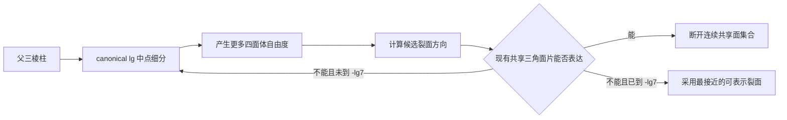

### 53.2 为什么只取中点仍然不够

如果每一级始终使用完全相同的三棱柱到四面体剖分方式，子四面体虽然更小，但共享面的法线方向集合可能基本不变：

```text
尺寸越来越小
≠
可选裂面方向越来越丰富
```

因此裂纹可能出现明显的 mesh bias：真实裂纹想斜着走，计算结果却只能沿固定的几组四面体共享面折线前进。

高保真路线可以在每个三棱柱细分后提供一小组合法 tetrahedralization 模板，以增加候选共享面的方向。第 54 节确定的第一版不要求这组模板；它允许多张已有四面体面组成阶梯状裂面，再用渲染法线隐藏小尺度方向量化。

### 53.3 候选裂面方向

拉伸主导材料使用当前 Cauchy 应力的最大主拉应力方向：

```text
σ·n_star=σ_1·n_star
σ_1=max_eigenvalue(σ)
```

```text
n_star    候选裂面的法线
裂面本身  与 n_star 垂直
```

剪切、塑性或各向异性材料不能固定使用 `n_star`，必须由对应材料 wrapper 给出 `preferred_crack_normal`。

### 53.4 在有限模板中选裂面

对模板 `k` 中每个候选共享三角面 `f`：

```text
θ_f=acos(abs(dot(n_f,n_star)))

d_f
  =abs(dot(n_star,centroid_f-x_crack_target))

η_angle,f=θ_f/allowed_crack_angle
η_position,f=d_f/allowed_crack_position_error
η_quality,f=mesh_quality_error_f/allowed_mesh_quality_error

score_f=max(η_angle,f,η_position,f,η_quality,f)
```

选择：

```text
f_best=argmin_f(score_f)
```

```text
score_best≤1
  → 当前层级能够表达裂面
  → 激活 f_best

score_best>1 且 level>-lg7
  → 当前层级不能表达
  → 继续按 lg 中点细分

score_best>1 且 level=-lg7
  → 本帧实时生产管线不再生成更细层级
  → 使用 f_best 作为有限分辨率下的裂面
  → 记录 crack_quantization_error=score_best
```

最后一条就是普通材料的实时终止语义：`-lg7` 已经是生产管线允许的最深尺度，不能因为裂面方向仍不完美继续爆炸式细分。更深层只属于第 55 节的研究子模型。

### 53.5 裂面激活不是“删掉一个三角形”

内部共享三角面被标记为 broken 后，要在它的三个顶点处重新检查 incident tetra 的连通关系。

对某个原节点 `v`：

```text
NodeStar(v)
  =所有包含 v 的四面体

在 NodeStar 中删除 broken face 邻接
  → 得到 connected sector 0,1,2,...
```

每个 sector 获得一个独立物理节点副本：

```text
v_sector0
v_sector1
v_sector2
...
```

分叉裂纹不是“把节点复制两份”就一定够，而是一个原节点有几个未断裂连通 sector，就生成几个节点副本。

### 53.6 节点分裂必须守恒

设 sector `s` 包含的四面体集合为 `T_s`：

```text
m_s=Σ_(tetra∈T_s) ρ·V_tetra/4
x_s=x_old
v_s=v_old
```

于是：

```text
Σ_s m_s=m_old
Σ_s m_s·v_s=m_old·v_old
```

节点副本初始位置相同，因此分裂瞬间不会凭空改变线动量或角动量。随后两侧是否分开，由 cohesive 牵引力、外力和接触力决定。

### 53.7 当前最难的公式是 cohesive 状态连续转移

激活前，共享面通过连续四面体网格传力；激活后，它改由两侧节点之间的 cohesive 定律传力。切换瞬间至少必须满足：

```text
F_cohesive(0+)=F_shared_face(0-)

M_cohesive(0+)=M_shared_face(0-)

U_bulk(0-)
  =U_bulk(0+)+U_cohesive_initial+E_dissipated_initial
```

如果只复制节点并让新 cohesive 面从 `δ=0、traction=0` 开始，原来正在传递的内力会瞬间消失，物体会产生非物理冲击。

因此激活任务至少要保存：

```text
activation_traction
activation_resultant_force
activation_resultant_moment
activation_bulk_energy
activation_normal
activation_time
```

如何把这些量初始化到双线性 mixed-mode cohesive 历史中，是当前裂纹解算器剩余的第一理论实现问题。

### 53.8 同一时间步多条裂纹必须批量结算

不能按候选面顺序逐个复制节点，否则结果会依赖 CUDA lane 或任务队列顺序。正确流程：

```text
1. 所有候选共享面并行计算 φ 和选面分数
2. 一次性提交本时间步激活面集合
3. 从局部邻接图中同时删除这些面
4. 对受影响 NodeStar 并行计算 connected sectors
5. prefix-scan 计算需要的新节点数量
6. 一次性分配连续节点区间
7. 重写 tetra → node 索引
8. 初始化 cohesive 状态
9. 下一物理子步开始使用新拓扑
```

这样分叉和多裂面同时发生时，拓扑结果只由物理状态决定，不由线程执行先后决定。

### 53.9 裂纹问题的最终拆分

```text
问题 A：裂纹起点和法线
  由材料应力 / 损伤模型给出

问题 B：当前 lg 是否有合适三角面
  由多 tetra 模板和 face score 决定

问题 C：怎样真正切开物体
  由 NodeStar connected sectors 决定

问题 D：切开瞬间怎样不丢力和能量
  由 cohesive 状态连续转移决定

问题 E：裂开后怎样重新接触
  由有限接触 patch 求解器决定

问题 F：裂纹稳定后怎样压缩
  由 -lg7 → -lg6 → ... 自底向上合并决定
```

因此，普通三棱柱细分已经不是主要研究风险。对于高保真 cohesive 路线，当前真正的核心是 `B、C、D`，其中 `D` 最难；第 54 节的第一版离散三角面裂纹主动绕过 `D`。

## 54. 第一版确定采用离散四面体共享面裂纹

### 54.1 结论

第一版不求任意位置、任意方向的连续裂面，也不在运行时切开单个四面体。

```text
三棱柱按 lg 中点细分
  → 每个三棱柱密铺成三个四面体
  → 裂纹只允许通过四面体共享三角面
  → broken shared face 暴露为两个渲染三角形
  → 顶点法线修正大尺度明暗
  → 噪声 normal map 增加微观断面粗糙度
```

这是一种 facet-aligned discrete fracture，不是任意裂面 FEM。它牺牲裂面位置和方向的连续精度，换取固定上限、连续显存、GPU 并行和可预测帧时间。

### 54.2 细分点不需要等于断裂点

撞击点或理论裂纹点 `x_crack` 可以位于四面体内部、三角面内部或棱边上。它只负责产生裂纹搜索种子：

```text
seed_tetra=包含 x_crack 的四面体

seed_face
  =seed_tetra 邻域中
   距离 x_crack 最近并且断裂代价最低的共享三角面
```

最终裂面不是“一个断裂点”，而是一组相邻共享三角面：

```text
CrackFaceSet={f_0,f_1,f_2,...}
```

所以不存在“细分点必须和断裂点重合”的要求。

### 54.3 裂纹先细化到合适等级

材料提供允许的裂面三角形尺寸：

```text
material_crack_face_size_m
```

接触区域给出压力 patch 特征宽度：

```text
contact_patch_width_m
```

希望在接触宽度内至少有 `N_patch` 个裂面单元：

```text
h_required
  =min(
      material_crack_face_size_m,
      contact_patch_width_m/N_patch)

target_depth
  =min(
      7,
      ceil(log2(1m/h_required)))
```

只把裂纹搜索带细化到 `target_depth`。如果当前层级已经能够产生合适的连续裂面，就不继续；`-lg7` 是第一版实时生产管线的硬终点，不因裂面仍有锯齿继续占用帧预算。

### 54.4 四面体对偶图

把局部精算组转换成对偶图：

```text
DualGraph node
  =一个四面体

DualGraph edge
  =两个四面体的共享三角面

切断一条 dual edge
  =断开对应的共享三角面
```

这样裂纹搜索变成图上的连续切面搜索，而不是在空间里动态创建任意三角形。

### 54.5 共享面的断裂驱动力

共享面单位法线为 `n_f`，两侧平均应力为：

```text
σ_avg=1/2·(σ_left+σ_right)
t_f=σ_avg·n_f

t_n=max(dot(t_f,n_f),0)
t_s=t_f-dot(t_f,n_f)·n_f
```

材料强度归一化：

```text
φ_f
  =(t_n/Tn_critical)²
   +(norm(t_s)/Ts_critical)²
```

第一版廉价损伤累计：

```text
D_f^(n+1)
  =D_f^n
   +(Δt/τ_fracture)·max(0,φ_f-1)^m_damage
```

```text
D_f<1   face bond 保持
D_f≥1   face 可以进入裂纹候选集合
```

这不是连续 cohesive 分离求解；它只是共享三角面 bond 的离散失败规则。

### 54.6 不能独立选择三角面

以下做法禁止：

```text
每个 lane 发现自己的 φ_f≥1
  → 立即独立断开该面
```

它会产生孤立三角裂缝、孔洞、非流形分叉和依赖线程顺序的结果。

正确做法是先生成候选 face bitset，再从 `seed_face` 沿共享棱建立连续裂面。候选面的几何代价：

```text
C_f
  =G_c·A_f
   +w_angle·A_f·(1-abs(dot(n_f,n_star)))
   +w_position·A_f·distance(f,target_sheet)²/h²
```

其中：

```text
G_c·A_f       断开该面的材料能量代价
n_star        粗层应力给出的偏好裂面法线
target_sheet  从撞击点和裂纹前沿预测出的粗略目标面
```

裂面选择目标：

```text
在候选共享面中寻找：
  连续
  与已有 crack front 相接
  总 C_f 较小
  不超过本次 fracture_energy_budget
的 CrackFaceSet
```

第一版可以使用并行 bucketed wavefront；需要把物体完全切成两块时，可以在局部四面体对偶图上使用 `s-t min-cut`。对偶图 cut 对应一组真实三角面，因此天然适合输出裂面网格。

### 54.7 裂纹能量预算

本次事件可用于断裂的能量：

```text
E_fracture_budget
  =material_fracture_fraction
   ·E_available_local
```

选中裂面必须满足：

```text
Σ_(f∈CrackFaceSet) G_c·A_f
  ≤E_fracture_budget
```

如果预算不足以形成贯穿切面，当前事件只生成部分裂纹和 crack front；如果足以形成完整 cut，删除这些对偶边后四面体邻接图会分成两个或更多 component。

### 54.8 断面暴露

每个 broken shared face 原来由左右两个四面体共同拥有：

```text
left tetra  → 输出 triangle f_plus
right tetra → 输出 triangle f_minus
```

```text
position(f_plus)=position(f_minus)
winding(f_plus)=-winding(f_minus)
normal(f_plus)=-normal(f_minus)
```

节点按第 53.5 节的 `NodeStar connected sectors` 复制。两张三角面开始时重合，碎片运动后自然分离。

### 54.9 顶点法线和噪声法线贴图各做什么

第一层是几何本身：

```text
暴露的 -lgN 四面体共享三角面
```

第二层是顶点法线：

```text
n_vertex
  =normalize(Σ_same_crack_sheet A_f·n_f)
```

只在同一裂面 sheet 的允许平滑区域中平均。裂纹边界、分叉边和碎片轮廓必须拆顶点，不能跨边平均。

第三层是噪声 normal map：

```text
n_shading
  =apply_normal_noise(
      n_vertex,
      original_material_position,
      fracture_seed,
      material_roughness_scale)
```

推荐使用对象空间或三平面映射的可平铺噪声，不为每条动态裂纹生成独立 UV 和独立贴图。顶点法线负责把厘米级三角面过渡修顺；噪声 normal map 只负责毫米级视觉粗糙。

噪声法线贴图不能改变碎片轮廓或碰撞面，但在 `-lg7=7.8125mm` 的几何裂面上，这个限制通常可以接受。

### 54.10 GPU 主路径

```text
1. Batch32 四面体计算 σ 和 φ_f
2. ballot/scan 压紧 D_f≥1 的候选共享面
3. 只对候选裂纹带推进到目标 lg
4. 建立局部 dual-face 邻接区间
5. 并行 wavefront / local min-cut 选 CrackFaceSet
6. 批量删除对应 dual edges
7. NodeStar connected-sector 分裂节点
8. compact 输出两侧 fracture triangles
9. 计算顶点法线
10. 渲染阶段采样共享噪声 normal map
```

这个流程不动态切四面体，不要求任意裂面几何，也不运行连续 cohesive 迭代。所有新增数量都受目标层级、局部裂纹带和预分配 arena 限制。

### 54.11 与高保真路线的关系

```text
第一版：
  discrete face bond
  connected triangular cut
  vertex normal + noise normal map

未来可选：
  extrinsic cohesive traction-separation
  任意嵌入裂面
  动态局部重网格
```

高保真路线不从文档删除，但不再阻塞第一版 Agent 解算器。

### 54.12 论文路线依据

实时游戏四面体断裂工作明确讨论了关闭单个四面体动态切分，以避免运行时四面体数量不可预测，并使用图形技巧弥补实时限制：

```text
https://doi.org/10.1145/1599470.1599492
```

无重网格图式 FEM 已经证明可以在四面体体网格诱导图上表达和传播裂纹，并只在可视化时显式重建裂面：

```text
https://arxiv.org/abs/2103.14870
```

在自适应四面体网格的对偶图上执行 graph cut 可以直接得到由网格三角面组成的全局切面。该工作原本用于表面重建，但“dual edge cut 对应 primal triangular surface”的数学结构可直接用于本系统的局部离散裂面选择：

```text
https://www.microsoft.com/en-us/research/publication/multi-view-stereo-via-graph-cuts-on-the-dual-of-an-adaptive-tetrahedral-mesh/
```

## 55. 实时 `-lg7` 预算合同与更深物理的前瞻研究

### 55.1 `-lg7` 的准确含义

```text
lgN ... lg0 ... -lg7
  实时生产物理层级

-lg8、-lg9、...
  前瞻性研究层级
  不进入第一版实时完成承诺
```

`-lg7` 不是物理学上的最小裂纹尺度。它只是普通材料在当前引擎中的最深实时预算级。

从正层级到 `-lg7`，以下量仍由物理主导：

```text
质量和动量
变形梯度
应力和应变
局部损伤驱动力
可用于断裂的能量
裂纹是否能够继续增长
```

第一版只把裂面位置和方向量化到四面体共享三角面。顶点法线和噪声 normal map 只修改着色，不参与上述物理判断。

### 55.2 最粗可用层级仍然是第一道预算

预算不能成为“有空就多算一层”的理由：

```text
current_level_usable=true
  → 不创建 next-level task
  → 即使 GPU 空闲也不细分
```

只有当前层级已经被物理误差证明不可用，才生成下一层候选。预算系统只决定这个必要候选何时获得执行资格。

### 55.3 Agent 拥有帧内预算

```text
AgentPhysicsBudget {
    frame_deadline_gpu_ns
    coarse_required_gpu_ns
    refine_gpu_ns
    fracture_topology_gpu_ns
    render_extract_gpu_ns

    max_active_refinement_fronts
    max_lg5_leaf_count
    max_lg6_leaf_count
    max_lg7_leaf_count
    max_deep_refined_bytes
}
```

这些字段属于 Agent 和算法，不由主干读取并推断棱柱数量或物理语义。

### 55.4 任务成本估计

对准备进入下一层的精算组 `g`：

```text
N_tetra(g)       预计活动四面体数
N_face(g)        预计共享面数
N_substep(g)     当前材料和尺寸需要的物理子步数
N_topology(g)    预计受影响 NodeStar 数
```

每种 `material_id、level、refine_mode` 保存最近实测的 GPU 单位成本：

```text
c_tetra
c_face
c_substep
c_topology
```

预计计算时间：

```text
T_est(g)
  =N_substep(g)·[
      c_substep
      +N_tetra(g)·c_tetra
      +N_face(g)·c_face]
   +N_topology(g)·c_topology
```

预计显存：

```text
M_est(g)
  =N_child_prism·bytes_per_prism[level]
   +N_tetra(g)·bytes_per_tetra[level]
   +N_face(g)·bytes_per_face[level]
   +N_topology(g)·bytes_per_topology_record
```

成本来自算法自身的 GPU timestamp 和完成计数，不由主干根据容器长度猜测。

### 55.5 queued 和 admitted 的预算合同

```text
queued
  只有任务描述
  不占用深层 committed arena
  当前层结果继续有效

admitted
  已经预留最低完成路径的计算时间
  已经预留最低完成路径的连续显存
  必须完成承诺检查点
```

接纳条件：

```text
T_reserved+T_est(minimum_checkpoint,g)
  ≤refine_gpu_ns

M_reserved+M_est(minimum_checkpoint,g)
  ≤max_deep_refined_bytes

active_front_count
  <max_active_refinement_fronts
```

任一条件不成立，任务保持 `queued`，不生成一半的精算树。

### 55.6 深层任务的最低完成承诺

当一个任务已经证明必须越过 `-lg4`：

```text
minimum_committed_level=-lg5
```

```text
admitted 后 -lg5 尚未完成
  → 必须继续计算到 -lg5
  → 即使本帧预测发生偏差也不能提交半层状态

-lg5 完成、-lg6 未完成
  → 可以提交 -lg5

-lg6 完成、-lg7 未完成
  → 可以提交 -lg6

-lg7 完成
  → 提交 -lg7
```

因此严格的接纳控制负责避免“32 分都算不完”；如果预测仍然失误，已经接纳的任务按照约定等待到 `-lg5` 完整提交。

### 55.7 进入 `-lg7` 的双重门

从 `-lg6` 进入 `-lg7` 必须同时满足：

```text
Gate A：物理必要
  -lg6 的残差、损伤定位或裂面表达仍不合格

Gate B：预算可完成
  剩余计算预算能够完整完成该局部 -lg7 精算组
  剩余显存能够容纳该组全部 committed 状态
```

```text
Gate A=false
  → -lg6 能用，绝不进入 -lg7

Gate A=true 且 Gate B=false
  → 当前帧提交 -lg6
  → -lg7 请求保留到下一帧 queued

Gate A=true 且 Gate B=true
  → admitted -lg7
```

不能因为 `-lg7` 是最高实时精度，就把所有裂纹前沿自动推进到 `-lg7`。

### 55.8 精算优先级只在必要任务之间比较

对已经证明需要下一层的候选任务：

```text
benefit(g)
  =error_excess(g)
   ·affected_fracture_area(g)
   ·connectivity_importance(g)

priority(g)=benefit(g)/T_est(g)
```

其中：

```text
error_excess
  当前层归一化物理误差超过 1 的部分

connectivity_importance
  该裂纹是否可能改变物体 connected component
```

排序只决定必要任务谁先获得预算，不会把原本可用的粗层任务变成细化候选。

### 55.9 `-lg8` 以下的研究子模型

如果 `-lg7` 完成后仍然出现：

```text
裂纹方向量化误差过大
裂纹尖端能量残差仍不收敛
材料 process-zone 长度明显小于 7.8125mm
实验标定要求更细尺度
```

可以生成：

```text
ResearchCrackPatch {
    parent_lg7_region
    boundary_position
    boundary_velocity
    boundary_traction
    material_history
    requested_research_scale
}
```

研究 patch 只覆盖裂纹尖端及其邻域，从 `-lg7` 接收边界位移、速度和牵引力。它可以继续使用：

```text
-lg8、-lg9... 四面体自适应
phase-field fracture
局部 peridynamics
高保真 cohesive zone
```

研究结果向实时层返回：

```text
更精细的 crack surface
等效断裂能耗
等效界面牵引力 / 柔度
裂纹前沿位置和方向
```

返回量只能在完整同步点限制回 `-lg7`，不能在实时帧中途直接改写 committed 拓扑。

### 55.10 为什么研究层必须与实时层隔离

`-lg8` 每再下降一级，三维 `full8` 的潜在空间工作量乘八，显式稳定时间步还会继续缩短。即使只细化裂纹尖端，它也不适合承诺固定帧时间。

因此：

```text
实时层
  有 deadline
  有 arena 上限
  有 -lg5/-lg6/-lg7 检查点

研究层
  无本帧完成保证
  使用独立队列和独立 arena
  可以用于离线验证、回放重算或未来硬件实验
```

第一版不创建 `ResearchCrackPatch` 执行器，只保留接口和数据边界。

### 55.11 前瞻性论文路线

空间和时间同时自适应的 phase-field 动态断裂已经存在研究路线：

```text
https://doi.org/10.1016/j.mechmat.2026.105604
```

局部 peridynamics 与外部有限元耦合可以把昂贵的非局部断裂求解限制在小区域，并处理两种尺度界面的波反射：

```text
https://doi.org/10.1016/j.cma.2018.09.019
```

移动的局部 peridynamics crack-tip 子域以及多时间步耦合也支持“`-lg7` 提供宏观边界，更深模型只跟随裂纹尖端”的前瞻结构：

```text
https://arxiv.org/abs/2405.00011
https://arxiv.org/abs/2403.03605
```

这些路线只作为未来研究依据，不纳入第一版实现范围。

## 56. 广义三棱柱五面体的实际求解

### 56.1 “五面体”必须进一步限定拓扑

面数为五不能唯一确定单元。第一版 `GeneralizedTriangularPrismElement` 必须满足：

```text
6 个角点

2 个三角端面：
  ABC
  A'B'C'

3 个逻辑四边侧面：
  ABB'A'
  BCC'B'
  CAA'C'
```

上下端面不要求平行，三条对应母线 `AA'、BB'、CC'` 不要求平行，侧面也可以发生扭曲。

方锥同样有五个面，但它不是广义三棱柱，不能进入这一 wrapper。

### 56.2 广义三棱柱不直接承担材料求解

六节点参考映射继续使用：

```text
x(r,s,t)
  =(1-r-s)(1-t)A
   +r(1-t)B
   +s(1-t)C
   +(1-r-s)tA'
   +rtB'
   +stC'

r≥0
s≥0
r+s≤1
0≤t≤1
```

这个映射负责：

```text
点定位
lg 中点生成
父子插值
压力函数参数化
```

第一版不直接把它当成一个六节点 wedge FEM 单元做材料积分。实际应力、内力、质量和断裂仍由三个四面体求解。

### 56.3 默认三个四面体

固定一组合法侧面对角线后，默认分解为：

```text
T0=(A, B, C, A')
T1=(B, C, A', B')
T2=(C, A', B', C')
```

两个内部共享三角面：

```text
F01=(B, C, A')
F12=(C, A', B')
```

三个逻辑四边侧面被定义为六个物理边界三角面：

```text
ABB'A'
  → (A,B,A') + (B,B',A')

BCC'B'
  → (B,C,B') + (C,C',B')

CAA'C'
  → (C,A,A') + (C,A',C')
```

因此一个广义三棱柱在求解器里仍然是：

```text
一个逻辑 PrismElement
三个 TetrahedralSolverPrimitive
```

### 56.4 非平面四边侧面的定义

四个任意空间点通常不共面。此时“一个四边形侧面”没有唯一平面，必须由两张三角形明确规定实际边界。

```text
逻辑面 ABB'A'
  只是拓扑分组

(A,B,A')、(B,B',A')
  才是物理积分、碰撞和渲染使用的真实边界
```

如果这个侧面与相邻棱柱共享，两边必须使用完全相同的对角线和三角形绕序。否则一边使用 `BA'`，另一边使用 `AB'`，中间会出现不一致的四面体界面。

由于输入来源是三角 mesh，优先继承 mesh 已有的边界三角形；内部棱柱之间的侧面对角线由预处理阶段统一求解。

### 56.5 六种三四面体模板

改变 `A、B、C` 的起始顺序，可以得到有限组不同的 staircase tetrahedralization。实现保存六个模板：

```text
template_id=0...5
```

每个模板仍然只有三个四面体，但侧面对角线和内部共享面组合不同。

预处理阶段只考虑同时满足以下条件的模板：

```text
三个四面体 signed volume 全部为正
三个四面体没有重叠
三个四面体体积和等于五面体分片边界定义的体积
所有共享侧面对角线与邻接棱柱一致
```

四面体 `T=(X0,X1,X2,X3)` 的 signed volume：

```text
V(T)
  =det[
      X1-X0,
      X2-X0,
      X3-X0]/6
```

质量指标：

```text
q(T)
  =12·(3V(T))^(2/3)
   /Σ_(six edges e) length(e)²
```

规则四面体满足 `q=1`，越接近零表示越扁。模板选择：

```text
template_best
  =argmax_template min(
      q(T0),
      q(T1),
      q(T2))
```

模板选择只在 mesh 导入和重建子单元时执行，不在每个物理时间步重新选择。

### 56.6 找不到合法三四面体模板时

如果六个模板都不能同时满足正体积、无重叠和共享面对角线约束，这个几何就不是本系统可用三个四面体表达的 `GeneralizedTriangularPrismElement`。

预处理必须明确把它输出为：

```text
BoundaryCompositePrismElement
或
显式 TetrahedralGroup
```

可以在预处理阶段增加内部节点并使用多于三个四面体，但运行时不允许把非法五面体悄悄送进三四面体 wrapper。

### 56.7 三个四面体怎样共同解一个五面体

每个四面体独立计算：

```text
F_k
P_k
σ_k
V_k
f_k,0...f_k,3
```

然后按共享的六个广义棱柱节点组装：

```text
f_A
  =Σ_(T_k contains A) f_k,A

...

f_C'
  =Σ_(T_k contains C') f_k,C'
```

总质量：

```text
m_prism
  =ρ·[V(T0)+V(T1)+V(T2)]
```

内部共享面 `F01、F12` 的作用力通过共享节点自动成对抵消。它们没有外部压强，除非该面后来被离散裂纹算法标记为 broken。

### 56.8 外部压强

外部压力只在六张真实边界三角面和两个三角端面上积分：

```text
f_i^pressure
  =Σ_boundary_triangle
     integral_triangle N_i·traction dA
```

扭曲侧面已经被拆成两张三角形，因此每张三角形拥有确定法线，不需要为非平面四边形发明一条平均法线。

### 56.9 `lg` 中点细分

子节点先在参考域中生成：

```text
横向：
  三角参考域三边中点

纵向：
  canonical 父格 t=1/2
```

再通过 `x(r,s,t)` 映射到广义五面体：

```text
x_child=x(r_child,s_child,t_child)
```

所以上下端面不平行、母线不平行都不会改变 lg 切分规则。得到的每个完整子单元仍有六个角点，再根据继承的共享面对角线选择三个四面体模板。

被 mesh 表面切掉的子单元进入 `BoundaryCompositePrismElement`，不伪造缺失角点。

### 56.10 离散裂纹

裂纹候选面包括：

```text
同一广义棱柱内部：
  F01、F12

不同广义棱柱之间：
  已三角化的共享侧面
```

某个内部面 broken 后，逻辑上的一个广义棱柱可以属于多个物理 connected sector。此后物理连通性由四面体图决定，不能因为三个四面体原来属于同一个 `PrismElement` 就继续强迫它们一起运动。

每张 broken face 输出正反两张裂面三角形，后续使用顶点法线和噪声 normal map 修饰。

### 56.11 CUDA 数据

```text
GeneralizedTriangularPrismSoA {
    node_index_A[]
    node_index_B[]
    node_index_C[]
    node_index_A_prime[]
    node_index_B_prime[]
    node_index_C_prime[]
    template_id[]
    material_id[]
    level[]
}

TetraTemplate[6][3][4]
```

一个 lane 读取一个广义三棱柱，固定执行三个四面体材料求解，再在 lane 内组装六节点结果。不同拓扑的 `BoundaryCompositePrismElement` 和 `TetCap` 进入独立队列，不在同一个 warp 中增加拓扑分支。

### 56.12 第一版选择

```text
采用：
  六节点参考映射
  预处理侧面对角线
  三个线性四面体材料求解
  四面体共享面离散裂纹

不采用：
  六节点 wedge 的直接高阶材料积分
  运行时任意重选四边侧面对角线
  非法或凹五面体的隐式修补
```

直接六节点 wedge FEM 可以作为未来对照求解器，但第一版没有必要同时维护两套体单元材料公式。

## 57. 缺失一条或两条母线的极端拓扑

### 57.1 先把“缺棱”定义清楚

本系统里的“缺一条棱”和“缺两条棱”，专指三条纵向对应母线 `AA'、BB'、CC'` 中有一条或两条发生规范塌缩。

```text
缺一条母线：
  A 与 A' 合并为同一个实际节点 P

缺两条母线：
  A 与 A' 合并为 P
  B 与 B' 合并为 Q
```

它不是“删掉线段但保留两端点”。一个有体积的有限元必须有封闭边界；如果只删除 `AA'`，却仍保留彼此分离的 `A、A'` 以及两侧边界面，边界会开口，不能定义内部和外部，也就不能进行压力积分或体积求解。

任意封闭边界三角网格至少满足：

```text
每条无向边恰好属于两张边界三角面
```

如果 mesh 裁剪不是规范塌缩，而是产生新的切点或切面，就进入 `BoundaryCompositePrismElement`，不套用下面的固定快速拓扑。

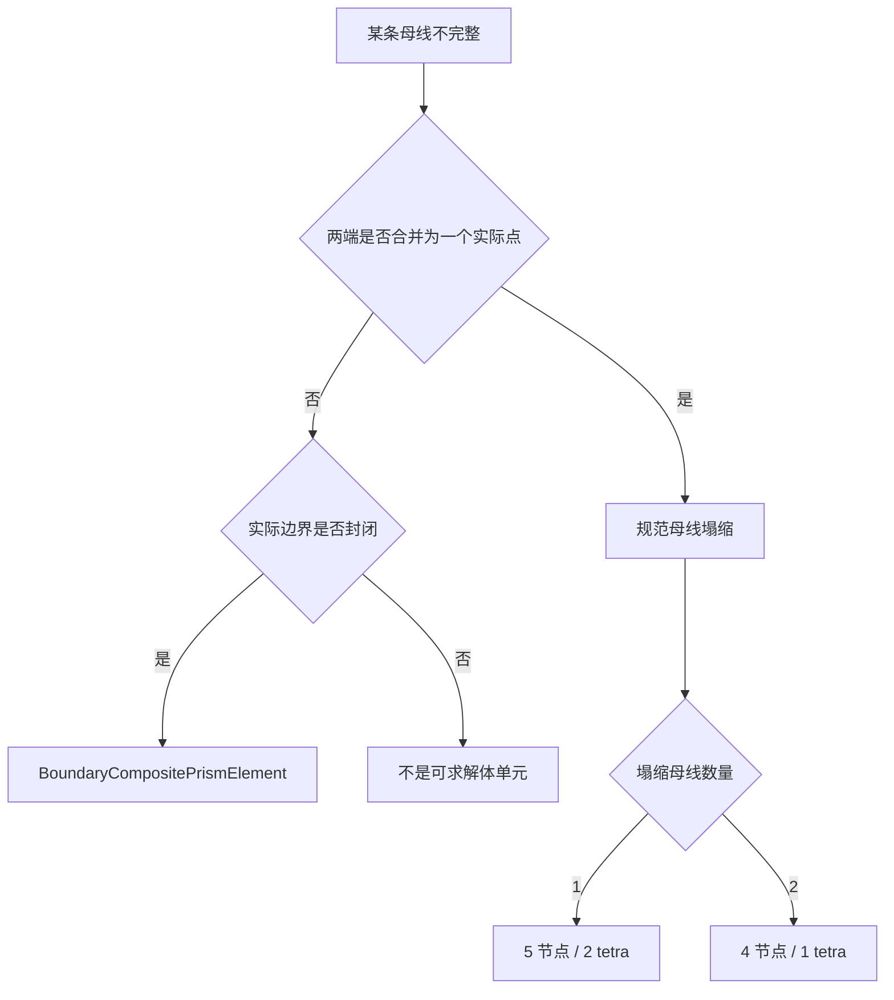

这个分类在 mesh 导入、父单元切割或子单元生成阶段一次完成。运行时 wrapper 直接接收确定的拓扑，不在 CUDA 内猜测或修补。

### 57.2 缺一条母线：五节点双四面体帽

令完整广义三棱柱的 `AA'` 塌缩：

```text
A=A'=P
```

实际拓扑为：

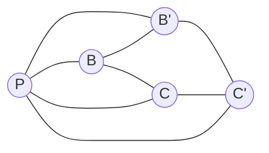

它有五个实际节点：

```text
P、B、C、B'、C'
```

从完整棱柱默认的三个四面体出发：

```text
完整：
  (A,B,C,A')
  (B,C,A',B')
  (C,A',B',C')

令 A=A'=P：
  (P,B,C,P)       → 零体积，不属于实际拓扑
  (B,C,P,B')      → T0
  (C,P,B',C')     → T1
```

所以固定分解就是：

```text
T0=(B,C,P,B')
T1=(C,P,B',C')

内部共享面：
F01=(C,P,B')
```

六张真实边界三角面为：

```text
(P,B,C)
(P,B,B')
(B,C,B')
(C,C',B')
(P,C,C')
(P,B',C')
```

其中逻辑四边侧面 `BCC'B'` 已固定拆成：

```text
(B,C,B') + (C,C',B')
```

两个四面体体积：

```text
V0 = abs(det[C-B, P-B, B'-B]) / 6
V1 = abs(det[P-C, B'-C, C'-C]) / 6

V_element = V0 + V1
m_element = ρ·(V0+V1)
```

节点内力按共享节点直接组装：

```text
f_B  = f_T0,B
f_C  = f_T0,C  + f_T1,C
f_P  = f_T0,P  + f_T1,P
f_B' = f_T0,B' + f_T1,B'
f_C' = f_T1,C'
```

`P` 不是特殊质点，也不需要额外的尖端公式；它只是同时属于两个实际四面体的普通共享节点。

### 57.3 缺两条母线：四节点四面体帽

令 `AA'、BB'` 分别塌缩：

```text
A=A'=P
B=B'=Q
```

只剩四个实际节点：

```text
P、Q、C、C'
```

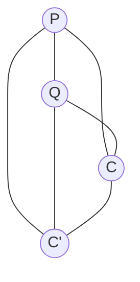

完整三四面体模板退化为：

```text
(P,Q,C,P)     → 零体积
(Q,C,P,Q)     → 零体积
(C,P,Q,C')    → 唯一实际 tetra
```

因此直接保存：

```text
T0=(P,Q,C,C')
```

其四张边界三角面为：

```text
(P,Q,C)
(P,Q,C')
(P,C,C')
(Q,C,C')
```

体积和质量：

```text
V = abs(det[Q-P, C-P, C'-P]) / 6
m = ρ·V
```

这就是普通四节点线性四面体，不需要棱柱参考映射。如果 `P、Q、C、C'` 不能形成非零体积，那么这里根本没有可提交的材料单元；预处理阶段不会为它生成运行时任务。

### 57.4 压强和力怎样传过这些极端单元

两种极端单元都只在真实边界三角面上接受外部压强。对一张三角面 `F=(X0,X1,X2)`：

```text
a = X1-X0
b = X2-X0

A_F = 0.5·length(a×b)
n_F = (a×b) / length(a×b)
```

如果该面上的压强近似常数 `p`：

```text
traction = -p·n_F

f_X0 = A_F·traction/3
f_X1 = A_F·traction/3
f_X2 = A_F·traction/3
```

如果压强不是常数，就继续使用三角面采样积分；公式与完整广义棱柱完全相同，不会因为缺母线而把力分给不存在的节点。

内部材料力仍由每个四面体的应力给出。四面体某个共享面上的牵引为：

```text
traction_internal = σ·n_F
```

在常应力线性四面体内，它对三个面节点的等效力同样为：

```text
f_face_node = A_F·(σ·n_F)/3
```

令 `n` 指向左侧四面体之外，则右侧四面体的外法线是 `-n`。同一共享面给共享节点的两侧牵引贡献为：

```text
left contribution  =  A_F·(σ_left ·n)/3
right contribution =  A_F·(σ_right·(-n))/3

interface residual
  = A_F·[(σ_left-σ_right)·n]/3
```

当两侧满足牵引连续时，这个残差为零；动态受击时它通常暂时不为零，残差进入共享节点的加速度，下一时间步再改变相邻四面体的形变和应力。这就是力从一个 tetra 传入下一个 tetra 的实际途径。

实际有限元组装通过共享节点完成上述过程；上式用于解释界面传力、构造诊断量和裂纹判据，不需要额外创建“棱柱间力粒子”。

### 57.5 两种极端单元的裂纹候选

缺一条母线的双四面体帽内部有一张现成候选裂面：

```text
F01=(C,P,B')
```

它达到损伤阈值后可以断开 `T0` 和 `T1`。其余裂纹可以沿它与相邻单元共享的三角面继续传播。

缺两条母线的四面体帽内部没有更小的共享面，因为它本身只有一个 tetra。因此：

```text
裂纹沿它与邻居共享的面通过
或
先把它细化，再从子 tetra 的共享面中选裂面
```

不能在一个未细化 tetra 内部凭空画一张任意裂面，同时又声称裂面来自既有四面体密铺。到了实时上限 `-lg7` 仍然无法对齐时，第一版选择方向最接近、连通性合法的现有共享三角面。

### 57.6 `lg` 细分不会重新长出缺失母线

拓扑已经塌缩后，细分仍由父级 canonical `lg` 区间驱动，但材料几何通过“子区间与实际占用体积相交”生成：

```text
canonical child prism
  ∩ parent occupied solid
  → child actual polyhedron
  → child topology classification
```

这里的 `∩` 是几何定义，不表示每个物理时间步都运行通用 mesh Boolean。导入阶段保存边界来源和裁剪参数；运行时细分只执行固定模板、边插值和紧凑拓扑输出，并直接写入预分配子单元区间。

规范塌缩具有固定快速结果。

缺一条母线时：

```text
纵向 2 分：
  2 个 one_mother_line_collapsed 子单元

横向 4 分：
  靠近 P 的 1 个 one_mother_line_collapsed 子单元
  其余 3 个通常是完整 generalized_triangular_prism 子单元
```

缺两条母线时：

```text
纵向 2 分：
  (P,Q,C,M) + (P,Q,M,C')
  → 2 个 two_mother_lines_collapsed 子单元

横向 4 分：
  2 个 two_mother_lines_collapsed 子单元
  1 个 one_mother_line_collapsed 子单元
  1 个完整 generalized_triangular_prism 子单元
```

其中 `M` 是幸存母线 `CC'` 在当前 canonical 纵向区间的中点。横纵同时 8 分时先生成八个 canonical 子区间，再按完全相同的规则分类；不在父单元里直接复制八份相同拓扑。

### 57.7 CUDA 固定 wrapper

三个固定 wrapper 分开执行：

```text
GeneralizedTriangularPrismWrapper
  6 nodes / 3 tetra per lane

OneMotherLineCollapsedWrapper
  5 nodes / 2 tetra per lane

TwoMotherLinesCollapsedWrapper
  4 nodes / 1 tetra per lane
```

对应紧凑 SoA：

```text
OneMotherLineCollapsedElementSoA {
    node_index_P[]
    node_index_B[]
    node_index_C[]
    node_index_B_prime[]
    node_index_C_prime[]
    material_id[]
    level[]
}

TwoMotherLinesCollapsedElementSoA {
    node_index_P[]
    node_index_Q[]
    node_index_C[]
    node_index_C_prime[]
    material_id[]
    level[]
}
```

每个固定拓扑 `wrapper` 仍然一次处理 `32` 个同拓扑单元。

任意裁剪形成的可变 tetra 组不让每个 lane 自己循环不同的 tetra 数量。调度器先把它展开成连续的 `TetrahedralPrimitiveQueue`：

```text
tetra_node_indices[]
parent_composite_id[]
material_id[]
level[]
```

一个 lane 解一个 tetra，随后按 `parent_composite_id` 做分段组装。这样任意裁剪仍使用预分配连续内存和 `Batch32`，不让一个 warp 中的 lane 分别猜测自己缺几条母线。

### 57.8 第一版结论

```text
完整广义三棱柱：
  6 节点，3 tetra

缺一条规范母线：
  5 节点，2 tetra，1 张内部裂纹候选面

缺两条规范母线：
  4 节点，1 tetra，无单元内部裂纹候选面

任意曲面裁剪：
  实际封闭边界 + 显式 tetra 集合，数量不固定
```

因此“缺棱”只改变拓扑和 CUDA 分桶，不改变材料本构、四面体应力公式、三角面压强积分或共享面传力规则。

## 58. Assimp 多格式资产到四棱柱主导物理场

### 58.1 输入不是某一种 mesh 文件，而是 Assimp 场景

本系统不为 OBJ、FBX、glTF、STL 等格式分别编写棱柱化算法。格式层统一为：

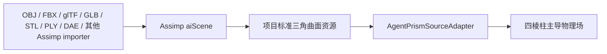

Assimp 只负责：

```text
文件解析
多边形三角化
场景节点和 mesh 引用
材质索引
顶点属性
```

Agent 级组件负责：

```text
物理比例尺
哪些场景节点属于同一实体
封闭体判断
材料映射
lg 网格
四棱柱 / 三棱柱 / tetra 拓扑
邻接、细化、损伤和调度
```

这样主干只提供通用资源导入，不理解棱柱数量、四面体数量或物理实体数量。

### 58.2 当前项目中的 Assimp 状态

当前仓库已经在 `algomanager/catalog` 中使用 Assimp，并固定依赖版本 `6.0.5`。现有导入标志为：

```text
aiProcess_Triangulate
aiProcess_JoinIdenticalVertices
```

现有 `BuildMeshFromAssimpScene` 直接遍历：

```text
scene.mMeshes[0...mNumMeshes)
```

但没有从 `scene.mRootNode` 递归访问 `aiNode`。因此当前能力是“把 aiScene 中每个 aiMesh 的局部顶点各复制一次”，尚未正确表达：

```text
节点父子变换
同一 aiMesh 的多个场景实例
节点级实体归属
负行列式变换后的三角形绕序
源 mesh 的物理材料索引
```

简单 OBJ、STL 通常没有复杂场景层级，所以经常看不出问题；glTF、FBX、DAE、3DS 等场景格式不能假定如此。

这里需要升级的是通用 Assimp 场景展开，不是把 Assimp 或棱柱语义塞进主干其他层级。

### 58.3 Assimp 场景必须先展开成标准物理曲面

从根节点递归遍历。对节点 `k`：

```text
M_scene(k)
  =M_scene(parent(k))·M_local(k)
```

对节点引用的每一个 aiMesh 实例：

```text
x_object
  =M_asset_to_object
   ·M_scene(k)
   ·[x_mesh,1]

n_object
  =normalize(
      inverseTranspose(
        linear(M_asset_to_object·M_scene(k)))
      ·n_mesh)
```

其中 `M_asset_to_object` 明确包含：

```text
源文件单位 → 米
源坐标轴 → 项目左手坐标系
.prism 中声明的 scale
.prism 中声明的 transformer
```

如果最终线性变换的行列式为负，三角形两个索引必须交换，使表面绕序与外法线保持一致：

```text
det(linear(M)) < 0
  → triangle(i0,i1,i2)
  → triangle(i0,i2,i1)
```

同一个 aiMesh 被三个 aiNode 引用时，物理输入中就是三个实例。它们可以在 Agent 配置中声明为三个独立刚体，也可以显式执行实体合并；不能由 `algomanager` 根据数组长度猜测。

### 58.4 标准化曲面只保留格式无关数据

场景展开后的算法输入为：

```text
PhysicalSurfaceInput {
    transformed_positions
    triangles
    source_instance_id
    source_material_id
    render_vertex_reference
}
```

含义：

```text
transformed_positions
  已进入对象物理坐标，单位为米

triangles
  唯一用于体积边界和绕序判断的三角面

source_instance_id
  允许 Agent 决定实体拆分或显式合并

source_material_id
  映射到物理 material_profile

render_vertex_reference
  破碎后把裂块边界映射回原渲染 mesh
```

顶点法线、UV 和切线不能用来判断实体内部；它们只用于最终渲染映射。

### 58.5 “Assimp 能读”不等于“可以做实体力学”

每个要转成体单元的实体必须先满足：

```text
所有面已经三角化
每张三角形面积大于零
每条无向边恰好连接两张表面三角形
相邻三角形绕序一致
整个壳体可以区分 inside / outside
不存在互相穿插的重复壳体
```

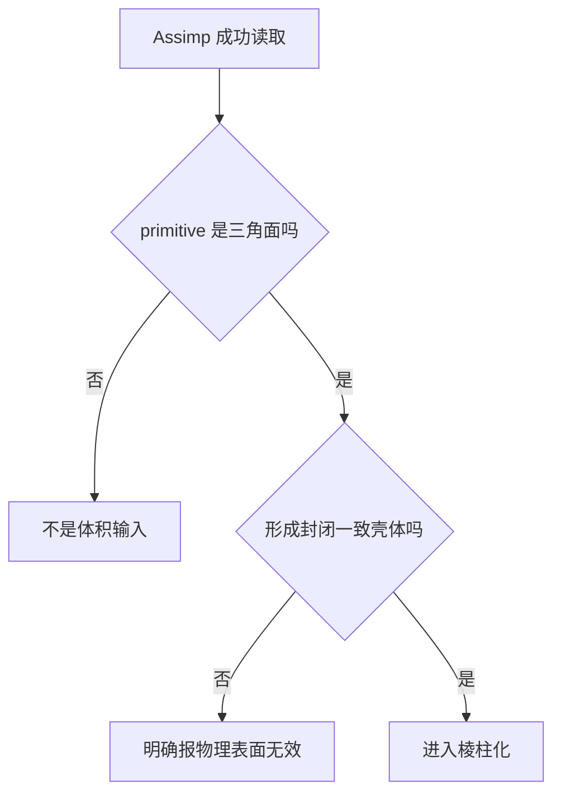

第一版不静默补洞、不自动给单面加厚、不猜测多个相交壳体的布尔关系。意外状态直接在导入预处理阶段报错。

特殊资源必须显式声明：

```text
开口道路 / 布料：
  不是实体；必须提供 thickness 或专用 shell 求解器

骨骼动画 mesh：
  只能按明确选定的 bind pose / 当前 pose 烘焙成一次物理曲面

点云 / 线框：
  没有封闭体积，不能直接棱柱化

多个封闭部件：
  默认按 connected closed shell 分成独立候选实体
```

### 58.6 第一版采用“规则核心 + 裁剪边界”

任意模型全部转换成高质量纯四棱柱网格是一个独立而困难的网格生成问题。第一版采用四棱柱主导的混合网格：

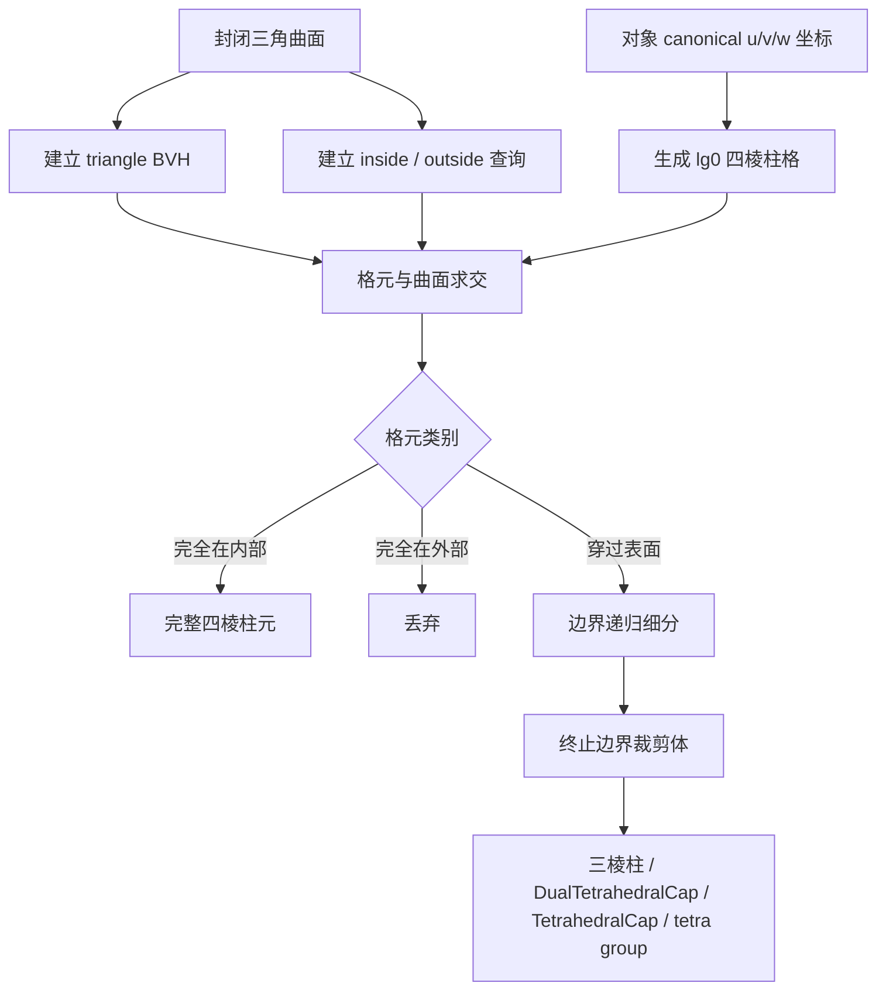

核心区域保持高度规则，只有靠近输入表面的窄带承担复杂拓扑。这样才与当前 CUDA 分桶和 `lg` 递归一致。

### 58.7 canonical 四棱柱格怎样生成

Agent 配置必须给出对象局部基：

```text
origin
u_axis
v_axis
w_axis
scale_m
```

不默认用 PCA 猜方向。球、立方体和高度对称模型的 PCA 轴不稳定，同一个资源重新导入后可能产生完全不同的棱柱拓扑。

在局部坐标中，以 `lg0=1m` 建立四棱柱格：

```text
u_i = origin_u + i·h_u
v_j = origin_v + j·h_v
w_k = origin_w + k·h_w

h_u,h_v,h_w ≤ 1m at lg0
```

一个完整格元有八个角点。固定底面对角线后：

```text
1 个四棱柱
  → 2 个三棱柱
  → 6 个 tetra solver primitive
```

内部完整格元不需要因为离曲面很远而继续细分。相邻完整格元共享节点、三角界面划分和 canonical 编号。

### 58.8 一个格元如何判断内部、外部和边界

只看八个角点的 inside / outside 不够，细长曲面可能穿过格元而所有角点都在外部。必须同时使用 BVH 相交查询：

```text
surface_hit
  =BVH.AnyTriangleIntersects(cell)

if surface_hit:
    class=boundary
else if PointInsideSolid(cell_center):
    class=inside
else:
    class=outside
```

对封闭且绕序一致的曲面，`PointInsideSolid` 可以使用射线奇偶或广义绕数。BVH 负责把查询限制到局部三角面，避免每个格元扫描整个资源。

多壳体场景先按 Agent 明确的实体组合规则得到最终 solid，再执行 inside / outside；不能让重叠 mesh 的三角数量隐式决定实体布尔语义。

### 58.9 边界格元怎样变成规定拓扑

边界格元先按几何误差细分：

```text
surface_error(cell)
  =输入三角曲面
   与当前边界近似之间的最大距离

surface_error > geometry_tolerance
  且 level 未到 geometry_level_limit
  → 继续横向 4 分 / 纵向 2 分 / full8
```

达到终止条件后，求：

```text
occupied_polyhedron
  =canonical_cell ∩ imported_solid
```

这里的 `∩` 是精确几何定义。实现使用格元内的三角面交线、边交点和封闭面片构造裁剪体，不使用“八个角点取正负后随便连线”的近似方式。

裁剪体按优先级分类：

```text
8 实际角点、四棱柱拓扑
  → PrismElement
  → 2 triangular prism
  → 6 tetra

6 实际角点、三棱柱拓扑
  → GeneralizedTriangularPrismElement
  → 3 tetra

5 实际角点、一条母线规范塌缩
  → DualTetrahedralCapElement
  → 2 tetra

4 实际角点、两条母线规范塌缩
  → TetrahedralCapElement
  → 1 tetra

其他封闭裁剪拓扑
  → BoundaryCompositePrismElement
  → 显式 tetra group
```

因此模型主体会产生大量完整四棱柱；球面、倒角、尖端和洞口只占边界窄带，进入前面已经定义的特殊单元。

### 58.10 任意边界裁剪体怎样四面体化

任意裁剪体的内部使用约束四面体化：

```text
输入：
  封闭裁剪体边界三角面
  必须保留的 mesh 表面三角片
  最大尺寸
  最小质量

输出：
  正体积 tetra
  无重叠
  体积和等于裁剪体体积
  外边界与裁剪体一致
```

这一步是离线导入 / 缓存构建工作，不放进每帧 CUDA 求解。可选实现路线：

```text
严格封闭高质量输入：
  constrained Delaunay tetrahedralization

来自实际游戏资产的 triangle soup：
  fTetWild 类鲁棒四面体化

曲面特征和尺寸场要求较强：
  CGAL Mesh_3 类域 + sizing field
```

第一版必须选择并验证一种实现，不能只把“后续 tetrahedralize”留成没有输入输出合同的黑盒。

### 58.11 为什么不先把整个模型四面体化，再硬拼四棱柱

任意 Delaunay tetra mesh 中，随机三个 tetra 很少恰好组成合法三棱柱，六个 tetra 更少恰好组成同一 canonical 四棱柱。先全 tetra 再做组合会导致：

```text
完整棱柱比例不可控
lg 父子关系丢失
CUDA 固定模板命中率低
边界面对角线难以与邻居统一
```

所以正确顺序是：

```text
先建立 canonical 四棱柱层级
再只对边界裁剪体四面体化
```

全局 tetrahedralization 只作为无效输入修复研究、结果对照或复杂边界局部后端，不作为主拓扑来源。

### 58.12 几何细节和 `-lg7` 上限

渲染仍使用原始 Assimp mesh；物理棱柱场不必复制每个微小倒角和贴花。

```text
物理特征尺寸 ≥ 当前 level 尺寸
  → 几何进入物理场

物理特征尺寸 < 1/128m
  且普通材料使用生产预算
  → 不再为该装饰细节继续细分
```

小于物理最小尺度的视觉细节继续由原 mesh、顶点法线和贴图表达。薄片若必须影响物理，必须使用显式 thickness 或更细材料配置，不能依赖渲染三角形自动制造体积。

### 58.13 导入后生成 `.prism` 缓存

Assimp 解析、场景展开、BVH、裁剪和四面体化都不应在每次游戏启动或每个物理时间步重复执行。导入结果写入 `.prism`：

```text
PrismAssetCache {
    source_asset_path
    source_content_hash
    assimp_version
    import_settings_hash
    physical_scale_and_transform
    physical_material_map

    canonical_frame
    source_surface_payload
    source_vertex_embeddings
    prism_nodes
    prism_elements
    tetra_solver_primitives
    interface_faces
    boundary_render_mapping
    lg_parent_child_topology
}
```

运行时 `.prism` 直接提供连续 SoA 初始化数据。源资产或导入设置哈希变化时重新构建；文件扩展名本身不参与棱柱求解语义。

### 58.14 实际实施顺序

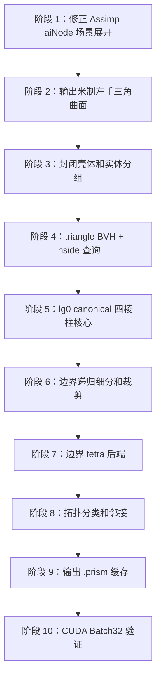

不能跳过阶段 1。否则 OBJ 样例可能正常，而带节点变换或实例的 glTF / FBX 会在错误位置生成物理体。

### 58.15 研究依据

Assimp 官方文档说明了 `aiScene → aiNode → aiMesh` 的引用关系、节点局部坐标、实例复用和父子变换累积：

```text
https://the-asset-importer-lib-documentation.readthedocs.io/en/latest/usage/use_the_lib.html
```

纯六面体 / 四棱柱化对任意复杂边界仍是困难问题，因此第一版采用 dominant mixed mesh，而不是承诺全模型纯四棱柱：

```text
https://doi.org/10.1145/3554920
https://arxiv.org/abs/2103.04183
```

边界任意裁剪体的四面体化可参考：

```text
https://arxiv.org/abs/1908.03581
https://doc.cgal.org/latest/Mesh_3/
```

## 59. 三角面对匹配、四棱柱合并与真实自适应 LOD

### 59.1 三个不同动作不能混为一谈

输入三角曲面可以优先走“成对三角面”路线，但必须区分三种操作：

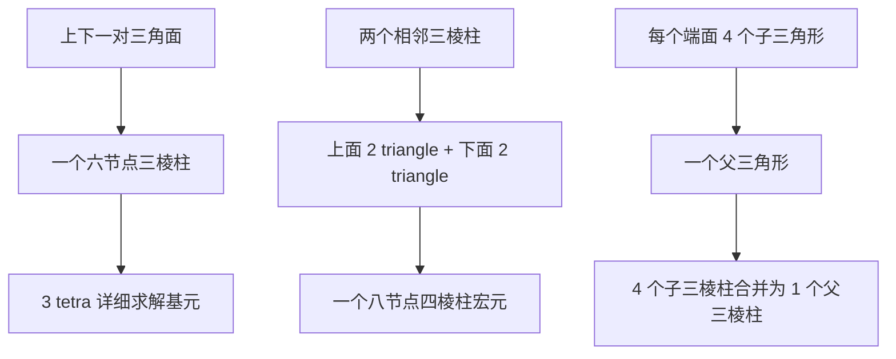

含义：

```text
TrianglePair：
  两张对应三角面
  → 一个三棱柱

AdjacentPrismPack：
  两个相邻三棱柱
  → 一个四棱柱逻辑宏元

FourToOnePrismLod：
  四个更小三棱柱
  → 一个真正更粗的父三棱柱
```

第二种操作只删除逻辑上的内部界面。如果仍然计算原来的六个 tetra，它只减少调度和界面管理开销，不减少材料求解量。

要得到真正 LOD，四棱柱宏元必须允许先执行一次宏观仿射求解，或者执行第三种 `4→1` 节点级合并。

### 59.2 不能在整个外表面上任意抓最近三角形

一个封闭 Assimp mesh 只有外边界三角面，没有天然的内部层。若把球面两侧“距离最近或法线相反”的三角形分别连起来，许多三棱柱会在球心互相穿过。


因此三角面对必须来自两个相邻且拓扑对应的三角前沿：

```text
SurfaceFront(k)
SurfaceFront(k+1)
```

来源可以是：

```text
薄壁模型明确提供的外壳 / 内壳
挤压模型明确提供的起始面 / 结束面
从输入表面向实体内部推进得到的相邻 front
已有 .prism 缓存中的父子 front
```

一般实体采用“推进三棱柱层 + 核心混合填充”：

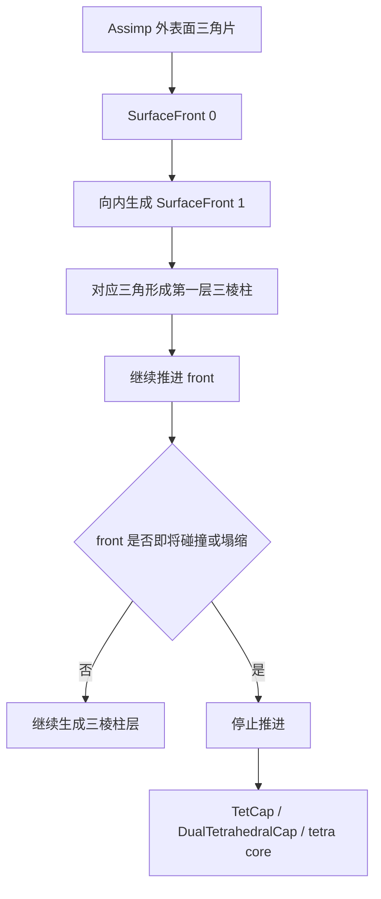

这样每个三棱柱来自相邻两层，不会任意跨过整个实体。

### 59.3 两张三角面怎样生成一个候选三棱柱

设两层上的候选三角面为：

```text
T0=(A,B,C)
T1=(U,V,W)
```

第二张三角面有六种顶点对应排列：

```text
(A',B',C')
  =permutation(U,V,W)

permutation_id=0...5
```

每一种排列都生成一个候选：

```text
cap 0：ABC
cap 1：A'B'C'

mother lines：
AA'、BB'、CC'

logical sides：
ABB'A'
BCC'B'
CAA'C'
```

再使用第 56 节的六种三四面体模板检查。候选必须满足：

```text
三个 tetra signed volume 全部为正
三个 tetra 互不重叠
体积和等于候选棱柱体积
三条母线不互相穿过
三个逻辑侧面不自相交
候选内部采样属于目标实体
候选不穿过其他已接受棱柱
```

所以“两个三角面直接配成三棱柱”在实现上只需要检查：

```text
6 个顶点排列
×
6 个 tetra 模板
=最多 36 个很小的固定候选
```

这是导入预处理工作，不进入每帧求解。

### 59.4 三角面对的质量分数

对某个顶点排列，定义三条母线：

```text
d_A=A'-A
d_B=B'-B
d_C=C'-C

h_mean
  =(length(d_A)+length(d_B)+length(d_C))/3
```

母线长度不一致度：

```text
e_length
  =max(
      abs(length(d_A)-h_mean),
      abs(length(d_B)-h_mean),
      abs(length(d_C)-h_mean))
   /h_mean
```

母线方向扭曲度：

```text
d_mean=normalize(d_A+d_B+d_C)

e_track
  =max(
      angle(normalize(d_A),d_mean),
      angle(normalize(d_B),d_mean),
      angle(normalize(d_C),d_mean))
```

四面体最低质量：

```text
q_min=min(q(Tet0),q(Tet1),q(Tet2))
```

候选排序分数可以写成：

```text
pair_score
  =w_q·q_min
   -w_l·e_length
   -w_t·e_track
   -w_s·side_surface_error
```

广义三棱柱不要求两个端面平行，也不要求三条母线平行，因此 `e_length` 和 `e_track` 首先用于候选排序；真正的硬条件仍然是正体积、无重叠和侧面合法。

### 59.5 邻接一致性比单个配对分数更重要

若前沿上的两个三角形共享边：

```text
T0=(A,B,C)
T1=(A,C,D)

shared edge=(A,C)
```

它们在下一层的配对三角形也必须共享对应边：

```text
T0'=(A',B',C')
T1'=(A',C',D')

shared edge=(A',C')
```

而且两个三棱柱必须对 `A→A'、C→C'` 给出完全相同的对应关系。否则相邻棱柱之间会出现裂缝、交叉母线或不一致的共享侧面。

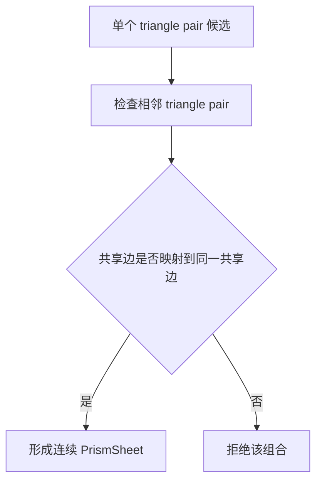

因此实际选择单位不是孤立 `TrianglePair`，而是连续的 `PrismSheet`。同一 sheet 中的三角对应必须构成一致的顶点映射场。

### 59.6 全局接受规则

候选图：

```text
图节点：triangle pair candidate

冲突边：
  复用了同一张 cap triangle
  候选体积互相重叠
  共享边对应不一致
  侧面对角线不一致
```

选择目标：

```text
最大化：
  合法棱柱覆盖体积
  + 棱柱最低质量
  + 邻接连续性

约束：
  每张 cap triangle 最多使用一次
  每个体积位置最多属于一个活动单元
```

第一版不需要求解昂贵的全局最优。可以按连续 front patch 分区，对每区按确定性分数排序，再使用冲突图 maximal independent set 接受候选。未匹配区域进入 tetra core，不伪造棱柱。

### 59.7 两个相邻三棱柱合并成四棱柱

两个三棱柱：

```text
P0：
  top    (A,B,C)
  bottom (A',B',C')

P1：
  top    (A,C,D)
  bottom (A',C',D')
```

上面两张三角形合并为逻辑四边形：

```text
(A,B,C) + (A,C,D)
  → ABCD
```

下面同理：

```text
(A',B',C') + (A',C',D')
  → A'B'C'D'
```

两个三棱柱之间原来的共享侧面：

```text
ACC'A'
```

成为四棱柱宏元的内部划分面。最终宏元为：

```text
QuadrilateralPrismMacroElement {
    nodes=A,B,C,D,A',B',C',D'
    child_triangular_prisms=P0,P1
    detailed_tetra_count=6
}
```

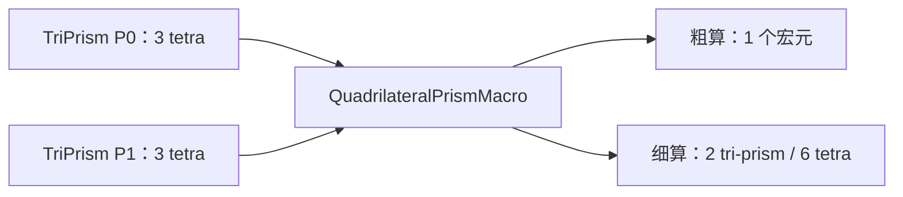

允许形成四棱柱宏元的条件：

```text
两个三棱柱处于同一 lg 层级
材料和材料方向一致
共享完整侧面 ACC'A'
共享面没有 broken / damaging / contact
上下两对三角形分别形成无自交四边 patch
合并后 signed volume 等于两子棱柱体积和
```

上、下逻辑四边形可以不共面。其原有两张三角面仍保留为压力积分和渲染边界，不会因为逻辑合并而丢失弯折几何。

### 59.8 为什么这个四棱柱宏元可以真的少算一次

若四棱柱仍无条件展开六个 tetra，合并只减少容器和内部界面开销。为了形成真实粗级求解，宏元使用八节点最佳仿射拟合。

参考节点和当前节点：

```text
X_i：rest position
x_i：current position
w_i：由六个子 tetra 预计算的节点体积权重
```

加权中心：

```text
X_bar=Σ(w_i·X_i)/Σw_i
x_bar=Σ(w_i·x_i)/Σw_i
```

最佳仿射变形梯度：

```text
B=Σ w_i·(X_i-X_bar)·(X_i-X_bar)^T
A=Σ w_i·(x_i-x_bar)·(X_i-X_bar)^T

F_macro=A·inverse(B)
```

`B` 的可逆性在导入预处理阶段由正体积和质量检查保证。运行时不设置退化回退分支。

预计算宏元形状梯度：

```text
G_i
  =w_i·inverse(B)·(X_i-X_bar)
```

宏元材料力：

```text
P_macro=Material(F_macro,state_macro)

f_i_macro
  =-V_macro·P_macro·G_i
```

它可以精确表达整体平移和最佳仿射拉伸、压缩、剪切，但不能精确表达两个子三棱柱之间的弯折或高梯度。这正好由伪细算检查发现。

### 59.9 四棱柱宏元何时展开成两个三棱柱

先计算一个 `F_macro`，再用两个子三棱柱的六节点位置做低成本伪细算：

```text
F_0=candidate deformation of P0
F_1=candidate deformation of P1
```

非仿射误差：

```text
eta_F
  =max(
      norm(F_0-F_macro),
      norm(F_1-F_macro))
   /F_reference
```

材料响应误差：

```text
P_0=Material(F_0,state_0)
P_1=Material(F_1,state_1)

eta_P
  =max(
      norm(P_0-P_macro),
      norm(P_1-P_macro))
   /P_reference
```

还必须检查：

```text
共享面牵引残差
接触压力变化
损伤最大值
裂纹候选方向
子棱柱几何质量
```

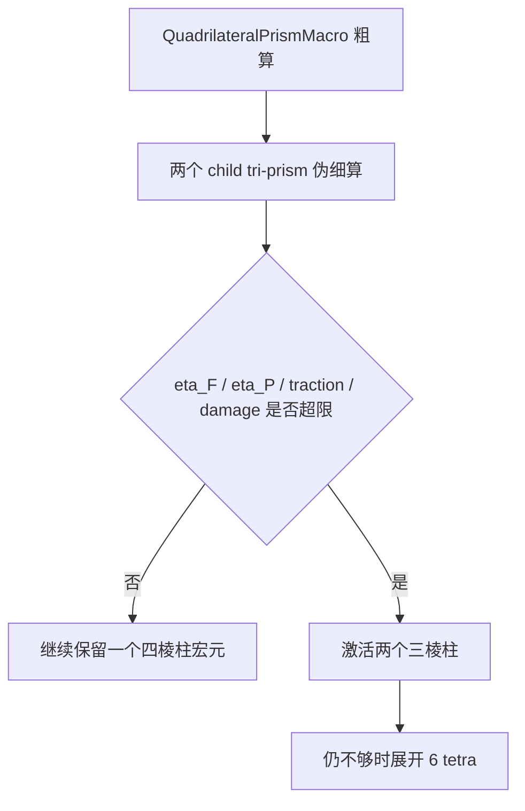

这才是“两个三棱柱合并成四棱柱”对应的自适应计算 LOD。

### 59.10 真正的横向 `4→1` 三角 LOD

一个父三角形 `ABC` 的标准横向四分：

```text
M_AB=(A+B)/2
M_BC=(B+C)/2
M_CA=(C+A)/2

T0=(A,M_AB,M_CA)
T1=(M_AB,B,M_BC)
T2=(M_CA,M_BC,C)
T3=(M_AB,M_BC,M_CA)
```

上下两个 front 使用完全相同的父子拓扑：

```text
top：
  4 child triangles → ABC

bottom：
  4 child triangles → A'B'C'
```

于是：

```text
4 个 child triangular prism
  → 1 个 parent triangular prism

12 个端面节点
  → 6 个父端面节点

12 个详细 tetra
  → 3 个父级 tetra
```

如果纵向也同时二分：

```text
8 个 child triangular prism
  → 1 个 parent triangular prism
```

这与现有“横向四分、纵向二分、full8”完全互逆。

### 59.11 从任意输入三角网格识别 `4→1` patch

`4→1` 首先是一个有明确含义的层级模板，不是“任意抓四个相邻三角形”。如果层级由本系统生成，直接使用 `parent_triangle_id`，不需要运行时重新猜测。

如果要从 Assimp 输入三角网格中识别标准 red-refinement sibling patch，四个三角形必须满足：

```text
总计 6 个唯一顶点
存在 1 个中心三角形
中心三角形分别与另外 3 个角三角形共享一条边
patch 边界形成 6-edge loop
边界顶点可交替解释为 A,M_AB,B,M_BC,C,M_CA
M_AB 到线段 AB 的误差小于几何阈值
M_BC 到线段 BC 的误差小于几何阈值
M_CA 到线段 CA 的误差小于几何阈值
没有材质边、硬法线边或显式 feature edge 穿过 patch
```

上下两个 patch 还必须拓扑同构，并共享同一组三条母线方向。任一条件不满足，就保留原始三角形，不为了追求 LOD 强制改拓扑。

这只是“父面为三角形”的一种情况。四个三角形也可能围绕一个内部点组成四边形，或者形成六边边界链；一般情况必须按第 61 节先提取 patch 边界，不能套用本节的六顶点模板。

### 59.12 动态合并的物理条件

完整 sibling 组只有同时满足以下条件才允许从细层合并到父层：

```text
所有 child 都已完成当前时间步
所有 child 材料类型一致
不存在 broken 内部面
不存在 damaging 裂纹前沿
不存在活动接触
不存在塑性局部化或材料相变边界
几何、位移、速度、应力误差均低于退出阈值
误差连续多个时间步低于退出阈值
相邻层级仍满足 2:1 约束
```

父级状态必须守恒：

```text
m_parent=Σm_child

p_parent
  =Σ(m_child·v_child)

L_parent
  =Σ[(x_child-x_center)×(m_child·v_child)+L_child]

damage_parent
  =max(damage_child)
```

位移和速度使用质量加权投影到父形函数：

```text
q_parent
  =argmin_q Σ_i m_i·norm(
      q_child_i
      -N_parent(xi_i)·q)^2
```

损伤是不可逆历史量，不能简单平均后变小。塑性应变、硬化变量和其他材料内部状态由对应材料算法提供 `coarsen_state`，Agent 只调度，不替不同材料发明统一平均规则。

### 59.13 再细化时怎样恢复子单元

父单元保存固定 child template：

```text
parent_element_id
child_kind
child_node_template
child_interface_template
material_state_projection_id
```

再次细化时：

```text
x_child=N_parent(xi_child)·x_parent
v_child=N_parent(xi_child)·v_parent
```

父级损伤、塑性历史和残余应变按材料的 `refine_state` 展开。若某种材料不能在可接受误差下完成状态限制和延拓，该材料 profile 禁止动态回并，只允许细化后保持当前层级。

### 59.14 粗细三角面怎样继续传力

一个四棱柱宏元面对两个细三棱柱时，界面仍保存子三角面划分：

```text
coarse InterfacePatch
  =fine triangle patch 0
   +fine triangle patch 1
   +...
```

沿用已有跨尺度映射：

```text
delta_u_fine=P·delta_u_coarse
f_coarse=P^T·f_fine
```

并检查：

```text
ΣF_fine=F_coarse
ΣM_fine=M_coarse
```

因此不必为了消除所有悬挂节点，让整件物体跟随最深区域细分。只有必要邻域执行 2:1 平衡，其余通过 `InterfacePatch` 传力。

### 59.15 CUDA 数据和调度

导入 / 缓存构建阶段：

```text
TrianglePairCandidateSoA
PrismSheetCandidateSoA
TrianglePatchFourToOneSoA
```

运行时：

```text
TriangularPrismMacroQueue
QuadrilateralPrismMacroQueue
DetailedTetrahedralQueue
CoarsenCandidateQueue
RefineCandidateQueue
```

一个 `Batch32` 只处理同一种宏元：

```text
TriangularPrismMacroWrapper
  6 nodes / 1 macro material evaluation

QuadrilateralPrismMacroWrapper
  8 nodes / 1 macro material evaluation

DetailedTriangularPrismWrapper
  6 nodes / 3 tetra evaluations

DetailedQuadrilateralPrismWrapper
  8 nodes / 6 tetra evaluations
```

宏元 wrapper 输出：

```text
macro_force
macro_stress_summary
non_affine_probe_request
refine_candidate
```

精算队列仍然由 Agent 自己管理；`algomanager` 和主干不读取 triangle pair 数量或决定 LOD。

### 59.16 与第 58 节 canonical 格方法的关系

两条生成路线并存：

```text
PairedFrontPrismBuilder
  适合薄壁、挤压体、道路、梁、板、规则建筑和存在连续对应面的区域
  优点：贴合输入曲面，三棱柱比例高
  难点：front 碰撞和核心闭合

CanonicalGridPrismBuilder
  适合拓扑复杂、没有明确扫掠方向的任意封闭模型
  优点：父子 lg 稳定，内部四棱柱比例可控
  难点：曲面边界需要裁剪体
```

自动模式：

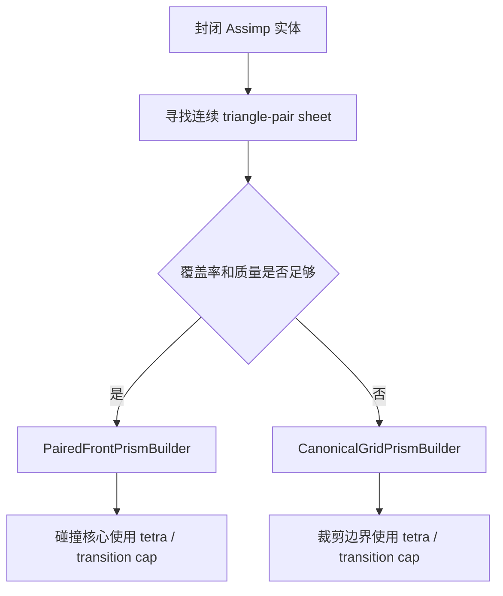

第一版实现可以先支持显式模式选择，再增加自动区域选择。不能在同一实体内未经接口规划就任意混用两套网格，因为两个生成器的边界必须共享同一组三角 `InterfacePatch`。

### 59.17 第一版建议

```text
第一步：
  实现两个相邻 front 上的 triangle-id 一一配对
  不做全表面任意最近三角搜索

第二步：
  每对三角面生成 6 个顶点排列候选
  使用正体积、无重叠和 q_min 选择模板

第三步：
  两个相邻三棱柱打包为 QuadrilateralPrismMacroElement

第四步：
  增加八节点最佳仿射宏元粗算
  误差超限才展开两个三棱柱 / 六个 tetra

第五步：
  增加标准 triangle red hierarchy
  支持真正的 transverse 4→1 和 full8 8→1
```

这条顺序先实现用户提出的最简单“两个三角面形成三棱柱”，再逐步得到真正能减少材料求解次数的自适应 LOD。

### 59.18 研究依据

三棱柱层通常由表面三角网格沿推进方向生成；当推进 front 自相交或互相碰撞时，需要合并 front，并产生 tetra / pyramid 等混合过渡单元：

```text
https://doi.org/10.1016/j.compfluid.2020.104429
```

二维三角网格的 red refinement/coarsening 研究支持把局部四子三角形识别为父三角形，并在不知道完整历史时按局部拓扑执行合并：

```text
https://arxiv.org/abs/2001.06343
```

## 60. 原始顶点保真、近景重建与渲染 LOD

### 60.1 原始信息不能在棱柱合并时删除

Assimp 导入后的原始渲染表面始终保留：

```text
原始对象空间顶点位置
原始三角形索引
原始顶点法线
原始切线
原始 UV
原始材质和 submesh
原始 scene instance 身份
```

棱柱化只生成物理载体和层级映射，不覆盖或销毁原始顶点。

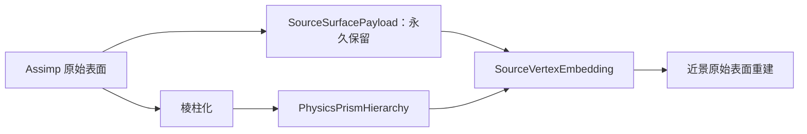

这样远处可以使用粗代理，靠近时仍能恢复输入资产的原始轮廓、顶点法线、UV 和材质细节。

### 60.2 物理 LOD 与渲染 LOD 必须分开

```text
PhysicsLod：
  由接触、应力、应变、损伤和误差决定

RenderLod：
  由相机距离、屏幕误差、可见性和画面预算决定
```

不允许：

```text
相机靠近
  → 强迫物理全部细分到 -lg7
```

也不允许：

```text
物体离相机很远
  → 忽略正在发生的高应力或断裂物理
```

正确关系：

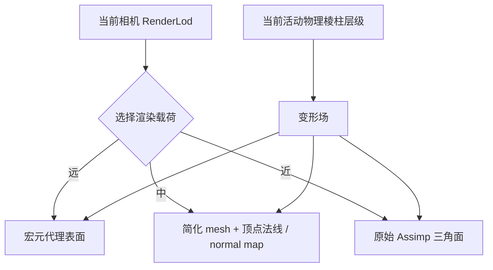

### 60.3 每个原始点必须记录什么

每个原始渲染顶点保存：

```text
SourceVertexEmbedding {
    source_instance_id
    source_mesh_id
    source_vertex_id

    rest_position_object
    rest_normal_object
    rest_tangent_object
    uv
    material_id

    root_prism_element_id
    compact_child_path
    terminal_tetra_index
    embedding_kind
    reference_coordinate
    rest_detail_offset
}
```

其中：

```text
root_prism_element_id
  原始点属于哪个 lg 根单元

compact_child_path
  最多 7 层的 canonical 子格路径
  每层横纵 full8 最多需要 3 bit

terminal_tetra_index
  到达终止边界复合单元后
  指向实际承载该点的 tetra

embedding_kind
  triangular_prism / tetrahedron / quadrilateral_macro / boundary_composite

reference_coordinate
  三棱柱使用 (lambda1,lambda2,lambda3,t)
  tetra 使用 (mu0,mu1,mu2,mu3)
  四棱柱宏元使用 object reference coordinate

rest_detail_offset
  原始点相对粗物理插值面的静止细节残差
```

`source_instance_id + source_mesh_id + source_vertex_id` 共同定义原始点。同一个 aiMesh 被多个 aiNode 实例化时，不能只保存 aiMesh 内的顶点编号。

### 60.4 渲染顶点与物理焊接顶点不是同一套索引

同一几何位置可能因为 UV 缝、硬法线或不同材质拥有多个原始渲染顶点。物理壳体则需要按封闭拓扑建立焊接顶点。

```text
SourceRenderVertex
  保留 UV / normal / tangent / material seam

PhysicalSurfaceVertex
  用于封闭边界、inside/outside 和棱柱化

source_render_to_physical_surface[]
  保存二者映射
```

不能为了物理焊接把原始渲染顶点永久合并，否则近景会丢掉硬边、UV 岛和材质边界。

### 60.5 三棱柱中的原始点怎样记录

对广义三棱柱，原始点 `X_source` 在静止参考几何中反解：

```text
X_base
  =N_A(lambda,t)·A
   +N_B(lambda,t)·B
   +N_C(lambda,t)·C
   +N_A'(lambda,t)·A'
   +N_B'(lambda,t)·B'
   +N_C'(lambda,t)·C'
```

记录：

```text
reference_coordinate
  =(lambda1,lambda2,lambda3,t)

rest_detail_offset
  =X_source-X_base
```

如果点正好位于棱柱表达的表面，`rest_detail_offset=0`。如果粗棱柱只近似曲面，偏移保存原始倒角、弧度和细小轮廓。

### 60.6 tetra 中的原始点怎样记录

若原始点由四面体 `T=(X0,X1,X2,X3)` 承载，保存四个重心坐标：

```text
X_base
  =mu0·X0+mu1·X1+mu2·X2+mu3·X3

mu0+mu1+mu2+mu3=1
```

记录：

```text
reference_coordinate=(mu0,mu1,mu2,mu3)
rest_detail_offset=X_source-X_base
```

缺一母线、缺两母线和任意边界复合单元最终都能使用这套 tetra embedding。

### 60.7 近景时怎样恢复原始位置

先由当前活动物理单元插值得到基础位置：

```text
x_base_current
  =Σ N_i(reference_coordinate)·x_i_current
```

当前载体的局部变形梯度为 `F_active`。原始细节偏移随局部变形移动：

```text
x_render
  =x_base_current
   +F_active·rest_detail_offset
```

若当前活动载体是四棱柱宏元：

```text
x_render
  =x_bar_current
   +F_macro·(X_source-X_bar_rest)
```

这能恢复原始静止几何，并让细节跟随当前粗物理形变。它不能凭空恢复物理层从未计算过的局部弯折；那部分必须由物理误差判据决定是否真正细化。

### 60.8 原始顶点法线怎样恢复

普通变形下，顶点法线不能直接乘 `F`。使用逆转置：

```text
n_render
  =normalize(
      inverseTranspose(F_active)
      ·n_rest)
```

切线使用：

```text
t_render
  =normalize(F_active·t_rest)
```

近景仍使用原始 UV、材质和 normal map。若一个源顶点因为硬边对应多个渲染顶点，它们共享位置 embedding，但保留各自不同的 `n_rest、t_rest、uv`。

### 60.9 合并和细分都不能丢失原始点锚点

物理子单元合并为父单元时：

```text
不删除 SourceSurfacePayload
不重写 rest_position_object
不平均原始顶点法线或 UV
只把 active carrier 从 child 切换为 parent
```

再次细化时，通过 `compact_child_path` 的下一段直接找到对应 canonical child。最多七层标准棱柱路径可以打包在一个 32-bit 字段中：

```text
3 bit per level × 7 levels=21 bit
```

不需要为每个原始顶点保存七个裸指针，也不需要在 GPU 上反复跳转父子对象。

`BoundaryCompositePrismElement` 内部 tetra 数量不受 3-bit 限制；它在 canonical 路径结束后使用独立的 `terminal_tetra_index`。两种索引不能混成一个隐含可变长度指针链。

### 60.10 原始三角形跟随哪个破碎块

每张原始表面三角形保存其三个顶点的物理载体和表面 patch 映射：

```text
SourceTriangleBinding {
    source_triangle_id
    source_vertex_embedding[3]
    physical_boundary_patch_id
    material_id
}
```

裂纹没有到达外表面时，原始三角形继续属于原来的连通块。

裂纹到达外表面后：

```text
三个锚点属于同一 connected component
  → 整张原始三角形跟随该碎块

三个锚点跨越不同 connected component
  → 仅在渲染层沿物理裂纹交线切分该三角形
  → 为两侧生成独立顶点
```

这个切分只更新 `FragmentRenderSurface`，不反过来修改物理裂纹拓扑。

新暴露的内部裂面没有 Assimp 原始表面，因此继续使用四面体共享三角面、生成的顶点法线和噪声 normal map。

### 60.11 远、中、近三级渲染载荷

```text
FarRenderPayload：
  四棱柱宏元外壳或极简 fragment hull
  不读取全部原始顶点

MidRenderPayload：
  简化三角网格
  顶点法线 + normal map

NearRenderPayload：
  SourceSurfacePayload 原始三角形
  SourceVertexEmbedding 逐点重建
  生成裂面与原始外表面共同提交
```

屏幕误差可以估计为：

```text
pixel_error
  =world_geometry_error
   ·camera_focal_length_pixels
   /view_depth
```

当 `pixel_error` 超过当前渲染层阈值时切换到更精细的渲染载荷。进入和退出使用不同阈值，避免相机移动时反复抖动。

### 60.12 GPU 数据流

原始资源常驻只读渲染缓冲：

```text
SourcePositionBuffer
SourceNormalTangentBuffer
SourceUvBuffer
SourceTriangleBuffer
SourceVertexEmbeddingBuffer
```

近景重建队列：

```text
NearSurfaceReconstructionQueue {
    visible_source_vertex_index[]
    active_carrier_index[]
    fragment_render_target[]
}
```

一个 lane 重建一个可见原始顶点。远处对象不进入该队列，因此“保留原始点”只增加静态资源和映射内存，不会让所有原始点每帧都参与物理或渲染计算。

渲染提交数量、可见顶点数量和 LOD 选择仍由 Agent 算法拥有；主干不从缓冲区长度推断绘制语义。

### 60.13 `.prism` 必须增加的持久化数据

```text
SourceSurfacePayload {
    instance_table
    render_positions_rest
    render_normals_rest
    render_tangents_rest
    render_uvs
    render_triangles
    render_material_ids
}

SourceSurfaceEmbeddingPayload {
    source_render_to_physical_surface
    root_prism_element_id
    compact_child_path
    terminal_tetra_index
    embedding_kind
    reference_coordinate
    rest_detail_offset
    source_triangle_to_boundary_patch
}
```

源资源哈希变化时，两组数据和棱柱场一起重新生成。物理运行过程中只切换活动载体和碎块归属，不修改原始静止信息。

### 60.14 第一版结论

```text
物理远近：
  由力学误差决定

视觉远近：
  由屏幕误差决定

原始点：
  永久保留 rest position + vertex normal + UV + material

原始点怎样运动：
  通过 prism / tetra reference coordinate 嵌入当前物理变形场

远处：
  不展开原始顶点

近处：
  重建并提交原始 Assimp 三角表面
```

所以物理棱柱层级可以大胆合并，原始模型信息不会丢失；靠近相机时恢复的是原始输入表面，而不是从粗棱柱临时猜出来的新表面。

## 61. 物理比例尺合同与任意四三角形 patch

### 61.1 没有比例尺就不能建立 `lg0`

mesh 顶点坐标本身只是一组数字。只有完成单位解析后，下面这些量才有物理意义：

```text
lg0=1m
密度与质量
接触面积
刚度
冲量
重力
断裂能
最小物理细节 1/128m
```

比例尺错误十倍，不只是模型视觉大小错误：

```text
长度：×10
面积：×100
体积和质量：×1000
转动惯量：×100000
```

所以物理 `.prism` 缓存不允许在比例尺未知时正式构建。

### 61.2 比例尺的四种来源

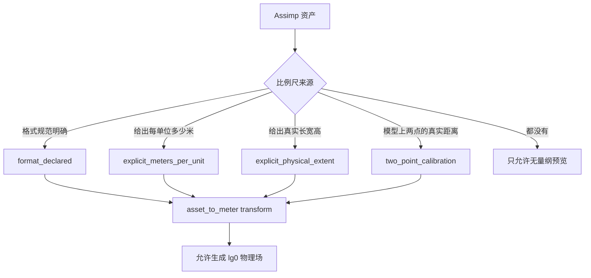

优先级：

```text
1. .prism 显式物理尺度 / 标定
2. 用户明确允许采用的格式单位
3. 否则停止物理构建
```

包围盒大小、文件名、模型类别和平均边长只能帮助 UI 给出提示，不能静默成为物理比例尺。

### 61.3 格式单位不能统一假设

glTF 2.0 规范明确规定线性距离单位为米；OBJ 顶点数值没有标准线性单位。FBX 等格式可能携带单位元数据，但仍必须经过当前 importer 的明确读取和记录。

当前项目的 Assimp 调用只使用：

```text
aiProcess_Triangulate
aiProcess_JoinIdenticalVertices
```

没有启用：

```text
aiProcess_GlobalScale
```

也没有读取并持久化 `aiScene::mMetaData` 中的单位来源。因此不能把当前 `LoadAssimpMeshFile()` 的输出直接解释为米。

### 61.4 推荐的 `.prism` 比例尺字段

```text
PhysicalScaleContract {
    mode

    meters_per_asset_unit

    physical_extent_m
    extent_fit_mode

    calibration_point_a
    calibration_point_b
    calibration_distance_m

    source_unit_metadata
    resolved_asset_to_meter
    scale_provenance
}
```

模式：

```text
format_declared
explicit_meters_per_unit
explicit_physical_extent
two_point_calibration
preview_unitless
```

`preview_unitless` 只能查看、配对三角形和预估拓扑，不能计算质量、应力、断裂或正式 lg 层级。

### 61.5 `scale` 应表示物体的物理尺度

沿用前面的约定：`.prism` 中面向用户的 `scale` 表示对象最终物理尺寸，不是“体素数量”或“粒子数量”。建议明确写成：

```text
physical_extent_m=(length_m,width_m,height_m)
```

导入场景展开、坐标轴转换之后，先计算资产空间包围盒尺寸：

```text
d_asset=(d_x,d_y,d_z)
```

若允许分别适配三个物理尺寸：

```text
s_x=length_m/d_x
s_y=width_m/d_y
s_z=height_m/d_z

S=diag(s_x,s_y,s_z)
```

这会产生非均匀缩放，必须由用户显式选择：

```text
extent_fit_mode=non_uniform
```

若要求保持模型比例，则只给一个已知长度：

```text
s=physical_reference_length_m
  /asset_reference_length

S=s·I
```

不能同时声称“严格保持原模型比例”又强制匹配三个不成比例的目标尺寸。

### 61.6 两点标定是未知格式最实用的办法

用户在原始模型上选择两个点 `P0、P1`，并输入实际距离 `L_meter`：

```text
L_asset=length(P1-P0)

meters_per_asset_unit
  =L_meter/L_asset
```

例如模型上一扇门从底部到顶部的坐标距离是 `2.4`，实际门高是 `2.0m`：

```text
meters_per_asset_unit
  =2.0/2.4
  =0.833333... m/unit
```

标定点使用 `source_instance_id + source_mesh_id + source_vertex/triangle barycentric coordinate` 保存，不能只记录屏幕像素位置。

### 61.7 最终坐标变换顺序

```text
M_physical
  =M_prism_transformer
   ·M_axis_and_handedness
   ·M_scale_to_meter
   ·M_assimp_scene_node
```

```text
X_meter
  =M_physical·[X_asset,1]
```

只有得到 `X_meter` 后才执行：

```text
triangle pair 搜索
front 推进距离
lg0 / -lg1...-lg7 分级
几何误差阈值
质量和惯量计算
```

源渲染顶点仍保存原始 asset-space 数据和最终 `M_physical`，避免重新导入后无法追溯尺度来源。

### 61.8 四个三角形不决定父面顶点数

四个三角形可以组成完全不同的拓扑：

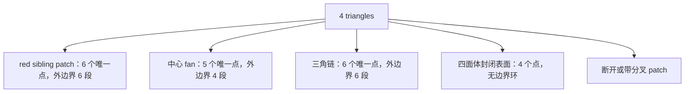

因此不能写：

```text
triangle_count=4
  → parent_vertex_count=4
```

真正需要检查的是 patch 的边界和内部邻接。

### 61.9 先消掉内部边，再得到 patch 边界

对候选四三角形集合 `S={T0,T1,T2,T3}`，统计每条无向边出现次数：

```text
edge_count=2
  → patch internal edge

edge_count=1
  → patch boundary edge

edge_count>2
  → 非流形候选，不能合并
```

边界边必须首尾连接成一个简单闭环：

```text
boundary_loop=(v0,v1,...,vN-1)
```

还要求 patch 是一个拓扑圆盘：

```text
connected_component_count=1
boundary_loop_count=1
Euler characteristic V-E+F=1
```

四面体的四张面满足 `V-E+F=2` 且没有边界环，因此不会被误认为可以合并的表面 patch。

### 61.10 四三角形常见的两个可合并模板

第一种，标准三角形 red sibling：

```text
unique vertices=6
boundary edges=6
internal edges=3

边界：
A-M_AB-B-M_BC-C-M_CA-A
```

若三个中间点可以分别被父边 `AB、BC、CA` 表达，则：

```text
4 child triangles
  → 1 parent triangle ABC
```

第二种，四边形中心 fan：

```text
unique vertices=5
boundary edges=4
internal edges=4

boundary：A-B-C-D-A
interior：O
```

```text
(A,B,O)
(B,C,O)
(C,D,O)
(D,A,O)

  → parent quadrilateral ABCD
```

两种都叫“四合一”，但父面分别是三角形和四边形，内部被删除的节点数量也不同。

### 61.11 六段边界不一定能缩成一个三角形

对于六段边界环，只有当它能在误差内分成三条 coarse edge chain 时，才允许生成父三角形：

```text
chain AB：A ... B
chain BC：B ... C
chain CA：C ... A
```

每条链的中间点到父边线段的最大距离：

```text
e_edge(chain,PQ)
  =max_X_in_chain distance(X,segment(P,Q))
```

父面误差：

```text
e_parent
  =max(
      e_edge(chain_AB,AB),
      e_edge(chain_BC,BC),
      e_edge(chain_CA,CA),
      surface_deviation)
```

只有：

```text
e_parent≤geometry_lod_tolerance
```

才生成 `TriangularPatchParent`。如果六个点形成真正的六边轮廓，就不能因为三角形数量恰好为四而删掉两个轮廓角。

### 61.12 一般边界环怎样判断三角父面或四边父面

对边界环执行受约束的 coarse-corner 选择：

```text
candidate k=3
  在 boundary loop 中选择 3 个保留角
  其余边界点投影到 3 条 coarse edge

candidate k=4
  在 boundary loop 中选择 4 个保留角
  其余边界点投影到 4 条 coarse edge
```

不能删除：

```text
材质边界点
硬法线边点
曲率特征点
裂纹前沿点
接触约束点
```

选择：

```text
parent_kind
  =argmin_(k in {3,4}) geometric_error(k)
```

并要求误差低于对应阈值。结果：

```text
k=3 合法
  → TriangularPatchParent

k=4 合法
  → QuadrilateralPatchParent

两者都不合法
  → IrregularSurfacePatchMacro 或保持四个 child
```

`IrregularSurfacePatchMacro` 只能做调度、包围体和最佳仿射粗摘要；它不是三棱柱或四棱柱，不能进入固定 prism material wrapper。

### 61.13 上下 patch 顶点数不一致怎么办

直接三棱柱要求上下两个三角面具有一一对应的三个角点。直接四棱柱要求上下两个四边 patch 具有一一对应的四个角点。

如果上 patch 和下 patch 的详细三角划分不同：

```text
top patch：4 triangles / 6 vertices
bottom patch：7 triangles / 9 vertices
```

有三种处理方式：

```text
方式 1：
  两侧都能拟合成相同的 3-corner / 4-corner parent
  → 只建立粗宏元
  → 详细层保留各自表面拓扑
  → 两个不同表面 patch 之间预构建显式 tetra group

方式 2：
  在共同二维参数域中叠加两套 triangulation
  → 生成 common refinement
  → 得到一一对应的 micro triangles
  → 再生成详细三棱柱

方式 3：
  无法建立稳定共同参数域
  → 不配成棱柱
  → 使用 BoundaryCompositePrismElement / tetra group
```

第一版优先采用方式 1 和方式 3。方式 2 会引入新的交点和更复杂的稳健几何运算，作为后续提高棱柱覆盖率的功能。

### 61.14 四三角形宏合并与真实物理合并

即使 patch 不能简化为三角形或四边形，也可以生成：

```text
IrregularSurfacePatchMacro {
    child_triangle_offset
    child_triangle_count=4
    boundary_loop_offset
    boundary_vertex_count
    best_affine_summary
}
```

这只表示：

```text
四个 child 一起调度
一起做可见性
一起做宏观误差扫描
```

它不表示：

```text
四个三角形已经变成合法三角面
或
已经变成合法四边面
```

只有三角父面 / 四边父面的几何、拓扑和力学投影全部通过，才允许真正删除 child 自由度。

### 61.15 修正后的合并判定流程

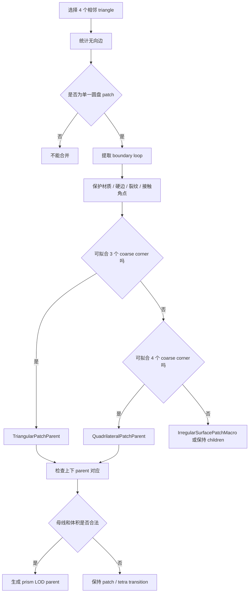

### 61.16 `.prism` 增加的尺度与 patch 数据

```text
PrismAssetCache {
    physical_scale_contract
    resolved_asset_to_meter
    source_bounds_asset
    physical_bounds_meter

    surface_patch_boundary_loops
    surface_patch_feature_vertices
    surface_patch_parent_kind
    source_triangle_to_patch
    patch_parent_child_topology
}
```

缓存哈希必须包含比例尺合同。相同 OBJ 文件分别以 `1 unit=1m` 和 `1 unit=1cm` 导入时，必须生成两个不同的物理缓存。

### 61.17 第一版结论

```text
比例尺未知：
  可以预览
  不可以构建正式物理场

比例尺解决：
  格式明确米制
  或显式 meters_per_asset_unit
  或物理长宽高
  或两点实际距离标定

四个三角形：
  先求 patch 边界
  再判断父面是 triangle、quadrilateral 或 irregular

标准 4→1：
  只对已知 sibling 或通过完整拓扑几何检查的 patch 使用

不规则 patch：
  可以做宏调度
  不能伪装成固定棱柱求解基元
```

### 61.18 格式依据

glTF 2.0 明确规定线性距离单位为米：

```text
https://registry.khronos.org/glTF/specs/2.0/glTF-2.0.html#coordinate-system-and-units
```

OBJ 不编码线性单位，转换器必须通过外部配置确定：

```text
https://docs.omniverse.nvidia.com/usd/latest/technical_reference/conceptual_data_mapping/obj-usd-concept-mapping.html
```

当前 Assimp 版本提供 `aiProcess_GlobalScale` 和 `AI_CONFIG_GLOBAL_SCALE_FACTOR_KEY`，但项目当前调用尚未启用：

```text
build/_deps/assimp_source-src/include/assimp/postprocess.h
build/_deps/assimp_source-src/include/assimp/config.h.in
```

## 62. 多轮变形后的棱柱身份、禁止回并与混合层级

### 62.1 先区分四个概念

```text
PrismLineage
  这个 tetra / child 来自哪个 native root 和哪条细分路径

PrismTopology
  当前 tetra 是否仍通过原共享节点和共享面连接

PrismGeometryValidity
  当前几何是否仍为无翻转、无重叠的有效体

PrismMacroEligibility
  当前状态是否足够平滑，可以用一个粗棱柱宏元代替详细 tetra
```

四者不是一回事。一个严重弯曲的单元可以：

```text
仍然保留 PrismLineage
仍然保留 PrismTopology
详细 tetra 几何仍合法
但 PrismMacroEligibility=false
```

这种情况不需要重建 mesh，只需要继续用详细 tetra 求解。

### 62.2 三个 tetra 多轮变形后还算不算三棱柱

原始三棱柱：

```text
T0=(A,B,C,A')
T1=(B,C,A',B')
T2=(C,A',B',C')
```

只要同时满足：

```text
六个外部节点仍保持原拓扑身份
F01=(B,C,A') 仍 bonded
F12=(C,A',B') 仍 bonded
三个 tetra 的当前 signed volume 保持合法
三个 tetra 的内部不发生非邻接重叠
外边界仍为一个封闭定向表面
```

它们仍然是一个“分片线性广义三棱柱”，即使：

```text
上下端面不平行
三条母线不平行
逻辑侧面强烈扭曲
三个 tetra 的 F 完全不同
```

物理真实几何由三个显式 tetra 的并集定义，不要求它仍能由一个漂亮的直棱柱或单一仿射矩阵精确表达。

### 62.3 六节点 wedge 映射失效，不等于 tetra 组失效

六节点广义三棱柱映射：

```text
x(r,s,t)
```

可能在严重扭曲后出现：

```text
某些位置 det(J_wedge) 太小
宏元最佳仿射残差过大
逻辑侧面发生强烈非平面弯折
```

此时：

```text
禁止使用六节点 wedge / macro 作为最终物理解
继续使用三个显式 tetra
```

只要三个 tetra 本身仍合法，就不需要因为宏映射失效而删除单元或改写连接关系。

```mermaid
flowchart TD
    A[三个 bonded tetra] --> B{tetra 几何是否合法}
    B -->|否| C[进入反转 / 重网格处理策略]
    B -->|是| D{wedge / macro 误差是否可接受}
    D -->|是| E[允许棱柱宏元粗算]
    D -->|否| F[保持 TetrahedralClusterElement]
```

### 62.4 什么情况下拓扑上真的不再是一个棱柱

以下事件会使原父棱柱失去物理合并资格：

```text
内部共享面 F01 或 F12 被标记 broken
裂面两侧节点被复制并属于不同 connected component
局部动态重网格改变了 tetra connectivity
材料相变把子区域切成不同求解域
```

裂纹断开后，即使两个碎块后来在空间中重新贴到一起，也只是接触：

```text
contacted != bonded
```

没有显式焊接 / 愈合材料算法时，不能因为几何位置重新靠近就恢复旧父棱柱。

### 62.5 保留紧凑细分血缘，不永久保留完整父元

裂纹或严重非仿射变形后只保存来源地址：

```text
native_root_index
path_depth
path_code
lineage_generation
```

来源地址只用于：

```text
定位来源
LOD 误差比较
渲染 embedding
恢复 canonical 参考区域
```

当前活动单元之间的粗细界面由 `InterfaceAdjacencyGraph + InterfacePatch` 组织，不从父子关系推导。只有活动单元参与物理组装。

若裂纹穿过父元内部：

```text
释放完整 parent solve state
删除 ReversibleSiblingGroup
保留 RefinementAddress
```

因此“不再能向上合并”不会破坏数据结构；这些 child 直接成为普通活动 cell，并通过共享界面图与周围 cell 连接。

### 62.6 向上合并只能发生在完整 sibling 组

可以合并：

```text
同一个 parent 的完整 4 个横向 child
同一个 parent 的完整 2 个纵向 child
同一个 parent 的完整 8 个 full8 child
```

不能合并：

```text
空间上相邻但 parent 不同的棱柱
不同 lg 层级的任意两个邻居
只剩 3/4 个 sibling 的不完整组
跨越裂纹面的 sibling
材料状态不兼容的 sibling
```

```mermaid
flowchart TD
    A[相邻活动 cell] --> B{RefinementAddress 是否指向同一理论 parent}
    B -->|否| C[只保留 InterfacePatch，不回并]
    B -->|是| D{ReversibleSiblingGroup 是否完整}
    D -->|否| C
    D -->|是| E{拓扑 / 材料 / 误差是否允许}
    E -->|否| F[保持细单元]
    E -->|是| G[重建粗 cell，移除 children]
```

### 62.7 小棱柱挨着大棱柱是合法常态

例如裂纹尖端附近：

```text
左侧：-lg6 小棱柱
右侧：-lg2 大棱柱
```

它们不需要互相合并，也不要求右侧无条件追随到 `-lg6`。共享界面保存为邻接图中的扁平 patch 范围：

```text
InterfacePatchRange {
    coarse_face_id
    fine_face_offset
    fine_face_count
    prolongation_operator
    restriction_operator
    operator_chain_range
}
```

兼容位移：

```text
u_fine=P·u_coarse
```

细面力回到粗面：

```text
f_coarse=P^T·f_fine
```

若跨越多级，则沿预计算的投影算子链逐级执行：

```text
-lg6 → -lg5 → -lg4 → -lg3 → -lg2
```

不建立一个跨五级、地址离散的大矩阵，也不需要为了这个界面物化一棵运行时树。

### 62.8 粗细界面必须守恒

设粗面 `Gamma_c` 被细面 `Gamma_f,j` 覆盖：

```text
Gamma_c
  =union_j Gamma_f,j
```

力守恒：

```text
F_c=Σ_j F_f,j
```

关于粗面参考点 `x_c` 的力矩守恒：

```text
M_c
  =Σ_j [
      (x_f,j-x_c)×F_f,j
      +M_f,j]
```

虚功一致：

```text
delta_u_fine=P·delta_u_coarse
f_coarse=P^T·f_fine
```

所以粗细单元可以长期共存。是否增加 2:1 支撑环是数值质量和预算决策，不是拓扑正确性的必要前提；不能为了消除层级差把整件物体扩散细化到 `-lg7`。

### 62.9 多轮变形后的回并判据

一个完整 sibling 组准备回并时，先用父元插值预测所有 child 节点：

```text
x_hat_i
  =N_parent(xi_i)·x_parent

v_hat_i
  =N_parent(xi_i)·v_parent
```

几何和运动残差：

```text
eta_x
  =max_i length(x_i-x_hat_i)/h_parent

eta_v
  =max_i length(v_i-v_hat_i)
   /v_reference
```

各 child tetra 的材料响应与父宏元比较：

```text
eta_F
  =max_k norm(F_k-F_parent)/F_reference

eta_P
  =max_k norm(P_k-P_parent)/P_reference
```

还要满足：

```text
所有内部共享面 bonded
没有裂纹前沿
没有活动接触
没有 tetra inversion / overlap
所有材料历史可以合法限制到父状态
质量、动量、角动量和不可逆损伤摘要守恒
```

只有全部通过才允许回并。

### 62.10 “看起来仍像棱柱”也可能不能合并

几何恢复平滑并不保证材料历史可合并。例如：

```text
child 0 已发生塑性屈服
child 1 仍为弹性
child 2 存在高损伤但尚未断裂
```

即使当前六个外部点看起来像规则棱柱，一个父级材料状态也可能无法表达三个不同历史。

因此材料算法必须提供：

```text
can_coarsen_state(children)
coarsen_state(children)
refine_state(parent)
```

没有这套映射的材料只能细化，不能动态回并。

### 62.11 合并阻塞原因必须显式保存

```text
CoarsenBlockMask {
    incomplete_sibling_group
    internal_face_broken
    crack_front_present
    active_contact
    geometry_residual_high
    velocity_residual_high
    stress_residual_high
    material_state_incompatible
    tetra_geometry_invalid
    topology_generation_mismatch
}
```

其中两类状态不同：

```text
暂时阻塞：
  active_contact
  geometry_residual_high
  velocity_residual_high
  stress_residual_high

永久阻塞：
  internal_face_broken
  topology_generation_mismatch
  无愈合模型的裂后节点复制
```

暂时阻塞条件消失后可以重新评估；永久阻塞不再浪费 GPU 时间重复尝试同一个父元。

### 62.12 tetra 翻转不是“自动断裂”

四面体当前 signed volume：

```text
V_current
  =det[x1-x0,x2-x0,x3-x0]/6
```

```text
V_current→0
  → 单元接近退化

V_current<0
  → 单元发生 inversion
```

这不等于材料自然形成了裂纹。它通常表示极端压缩、时间推进失败、接触互穿或普通本构超出定义域。

材料 profile 必须明确选择：

```text
支持 invertible FEM
  → 进入该材料明确的 inversion-capable 求解器

不支持 inversion
  → 当前物理任务失败并报告具体 tetra
```

不能把负体积 tetra 悄悄改名为 `TetrahedralCapElement`，也不能把 inversion 当成断裂判据来隐藏数值错误。

### 62.13 严重塑性流动可能需要动态局部重网格

如果材料发生极端塑性流动，即使没有断裂，tetra 也可能长期变得又扁又细。此时单纯细分原 tetra 会继承已经很差的几何，不能恢复质量。

未来的动态局部重网格路线：

```text
识别低质量局部 tetra patch
冻结 patch 外边界和裂面
局部 edge split / collapse / flip / smoothing
生成新的 tetra connectivity
守恒转移质量、动量、塑性状态、损伤和裂纹历史
创建新的 topology_generation
在新 patch 上重建局部棱柱候选层级
```

重网格后的单元不再假装属于旧的可回并 sibling 组。`topology_generation_mismatch` 会永久阻止它回到旧父元。

第一版不建议加入动态重网格：它会显著增加 CUDA 拓扑更新、材料历史转移和裂纹一致性的复杂度。第一版采用预防性细化、详细 tetra 保留和明确 inversion 策略。

### 62.14 裂后碎片可以用刚体代理降算量

一个碎片可能由不规则 tetra 集合组成，永远无法重新拼成三棱柱或四棱柱。若它内部已经没有明显形变，可以切换为：

```text
RigidFragmentProxy {
    connected_component_id
    mass
    center_of_mass
    inertia_tensor
    rigid_transform
    sleeping_tetra_range
}
```

这不是几何回并，而是求解模式降阶：

```text
原 tetra 拓扑和原始点 embedding 保留
活动自由度切换为 6 个刚体自由度
再次受到足够强的冲击时可以唤醒详细 tetra
```

软材料、持续塑性材料或仍在传播裂纹的碎片不能使用刚体代理。

### 62.15 CUDA 状态队列

```text
PrismMacroQueue
BondedTetrahedralClusterQueue
NonconformingInterfacePatchQueue
FractureFaceQueue
CoarsenCandidateQueue
RigidFragmentProxyQueue
```

每轮 child wrapper 输出：

```text
parent_element_id
coarsen_block_mask
mass_summary
momentum_summary
material_state_summary
maximum_residual
```

随后按 `parent_element_id` 排序 / 分段归约。只有完整 sibling 且 `coarsen_block_mask=0` 的父元进入激活队列。

永久阻塞父元保存在单独位图中，不再每帧重复进入 `CoarsenCandidateQueue`。

### 62.16 状态机

```mermaid
stateDiagram-v2
    [*] --> MacroEligible
    MacroEligible --> DetailedBonded: 误差超限 / 接触 / 损伤
    DetailedBonded --> MacroEligible: 完整 sibling 且全部判据通过
    DetailedBonded --> CoarsenTemporarilyBlocked: 非仿射 / 接触 / 状态差异
    CoarsenTemporarilyBlocked --> DetailedBonded: 阻塞条件消失
    DetailedBonded --> FractureSeparated: 内部面 broken
    FractureSeparated --> RigidFragmentProxy: 碎片内部近似刚体
    RigidFragmentProxy --> FractureSeparated: 强冲击唤醒
    DetailedBonded --> RemeshedGeneration: 未来局部重网格
```

没有愈合材料时：

```text
FractureSeparated
  不允许返回 MacroEligible
```

### 62.17 直接回答

```text
会不会变得不像棱柱？
  会，几何上会严重扭曲，宏元可能失效。

三个 tetra 是否立刻不能算？
  不会。只要 tetra 本身合法且内部面未断，就继续作为显式 tetra cluster 求解。

裂开以后还能回到原棱柱吗？
  不能，除非未来明确实现材料愈合 / 焊接。

小棱柱和大棱柱无法向上合并怎么办？
  不需要合并；它们作为混合层级活动 cell 长期共存，通过 InterfaceAdjacencyGraph 中的 InterfacePatch 守恒传力。

细单元永远不能回并会不会爆算力？
  只保留裂纹、接触和高误差区域的细叶；稳定裂后碎片可切换刚体代理，未受影响区域继续保持粗级。
```

### 62.18 研究依据

大变形下的 tetra / hexa inversion 需要明确的 invertible finite element 处理，而不是把负体积解释成裂纹：

```text
https://doi.org/10.1016/j.gmod.2005.03.007
```

极端塑性、断裂和大变形下保持 tetra 质量可以使用局部动态重网格，但需要保存当前 / 静止形状并转移材料状态：

```text
https://doi.org/10.1145/1778765.1778786
```

自适应 brittle fracture 可以使用可逆 tetra refinement，在高拉应力区域细化而不让全模型保持高分辨率：

```text
https://diglib.eg.org/items/03a647ad-9c32-48de-a2ab-f161bba9b32b
```

GPU 动态断裂中的并行细化与合并已有直接研究基础：

```text
https://doi.org/10.1007/s00366-015-0431-0
```

## 63. Mesh 导入时允许直接生成“不能再向上合并”的棱柱元

### 63.1 结论

会，而且这是任意 Mesh 转换中的正常结果，不是导入失败。

必须区分两句话：

```text
这个单元本身是不是合法的棱柱求解元？
这个单元和邻居能不能组成一个更粗的父棱柱？
```

两者没有必然关系：

```text
合法棱柱 + 有合法父元
  -> 普通层级节点

合法棱柱 + 没有合法父元
  -> 原生根棱柱（NativePrismRoot）

连合法棱柱都不是
  -> 边界过渡根元（BoundaryTransitionRoot）
     使用单 tetra、双 tetra 帽元或显式 tetra cluster
```

因此整个物理场不是一棵完整、规则的树，而是由大量不同形状、不同起始 `lg` 的根组成的**棱柱层级森林**。

```mermaid
flowchart TD
    A["导入的表面 Mesh"] --> B["按物理比例尺重采样 / 保特征简化"]
    B --> C["生成合法的基础体单元"]
    C --> D["构造互不重叠的父元候选"]
    D --> E{"候选能否形成合法父棱柱？"}
    E -->|能| F["MacroHierarchyRoot<br/>根下已有多个子元"]
    E -->|不能，但自身是合法棱柱| G["NativePrismRoot<br/>没有更粗父元"]
    E -->|自身也不是完整棱柱| H["BoundaryTransitionRoot<br/>帽元 / tetra cluster"]
    F --> I["PrismReferenceHierarchyAsset"]
    G --> I
    H --> I
```

### 63.2 “不能向上合并”不等于“不能细分”

原生根棱柱只是没有比自己更粗的合法父元；它仍然拥有自己的参考域和固定细分模板，因此可以继续向下细分：

```text
NativePrismRoot at lg0
  -> -lg1 children
      -> -lg2 children
          -> ...
```

冲击结束后，只要子元没有断裂、材料历史可回并且误差合格，它们仍可回并到这个原生根：

```text
-lg2 children
  -> -lg1 parent
      -> NativePrismRoot at lg0
      -X-> 不存在的更粗父元
```

所以这里的准确含义是：

```text
向下可以细化；
向上最多回到自己的原生根；
不能越过原生根临时寻找几个邻居强行拼父元。
```

否则每帧都可能得到不同父元，父子插值、材料历史和裂纹拓扑都会失去确定性。

### 63.3 为什么导入阶段必然产生这种根元

```mermaid
flowchart LR
    A["规则内部区域"] --> A1["容易组成完整 sibling 组"]
    B["曲面 / 尖角 / 薄片"] --> B1["父棱柱会越出物体边界"]
    C["材质或硬边接缝"] --> C1["不允许跨接缝合并"]
    D["上下三角 patch 不匹配"] --> D1["无法建立合法母线对应"]
    E["推进前沿相撞"] --> E1["只能用帽元封口"]
    F["局部尺寸突变"] --> F1["邻居处在不同 native lg"]
```

常见的静态拒绝原因包括：

```text
parent_boundary_not_closed
parent_volume_not_positive
parent_overlaps_neighbor
parent_exits_source_solid
source_feature_seam_crossed
material_homogenization_unavailable
top_bottom_correspondence_invalid
generalized_prism_mapping_invalid
parent_geometry_error_exceeded
parent_quality_below_limit
candidate_conflicts_with_better_parent
```

这些是离线生成诊断，不应在实时阶段反复尝试。导入器输出一次确定的层级森林；运行时只在已经存在的父子关系上细化和回并。

### 63.4 不能把原始 Mesh 的每个三角形直接等同于一个物理棱柱

渲染三角网格和物理离散必须分开：

```text
原始 Render Mesh
  -> 保留原始顶点、法线、UV、材质和 SourceVertexEmbedding

Physics Surface
  -> 按米制尺度、曲率、硬边和允许误差重新采样
  -> 再生成棱柱主导的体网格
```

如果直接把高密度美术 Mesh 的每个三角形都挤成一个物理棱柱，会立刻产生大量只能作为细粒度原生根的单元，`lg0` 粗算层也会失去意义。

正确约束是：

```text
一个源三角形可以覆盖多个物理元；
多个源三角形也可以映射到一个物理元；
原始外观由 SourceVertexEmbedding 恢复；
物理元数量由物理尺寸和误差预算决定。
```

### 63.5 父元生成是受约束的非重叠选择，不是“见到四片三角形就合”

先生成所有局部父元候选：

```text
两个可配对三角截面
  -> 三棱柱候选

两个相邻三棱柱
  -> 四棱柱宏元候选

完整横向四分 sibling
  -> 横向父元候选

完整纵向二分 sibling
  -> 纵向父元候选

完整八分 sibling
  -> 全分父元候选
```

然后为候选计算质量分数：

```text
Q_parent
  = w_shape    * Q_shape
  + w_error    * (1-E_geometry)
  + w_feature  * Q_feature
  + w_material * Q_material
  + w_balance  * Q_level_balance
```

硬约束失败的候选直接淘汰；剩余候选按 `Q_parent` 排序，选择互不重叠的一组。一个基础单元在同一级只能属于一个父元。

```mermaid
flowchart TD
    A["基础体单元集合"] --> B["枚举局部父元候选"]
    B --> C["剔除几何 / 拓扑 / 材料非法候选"]
    C --> D["候选按质量和稳定 ID 排序"]
    D --> E["选择互不重叠候选"]
    E --> F["成功候选生成父层"]
    E --> G["未被选择的合法棱柱保留为本层根"]
    F --> H{"还能继续生成更粗父层？"}
    H -->|能| B
    H -->|不能| I["完成 PrismReferenceHierarchyAsset"]
    G --> I
```

使用稳定 ID 作为同分决胜条件，保证相同输入在不同 CPU 线程数下仍得到相同的离线层级。

### 63.6 资产参考层级不使用“可能为空的父指针”

离线资产显式分池；运行时不整份复制该层级，只提取活动 cell、界面图和紧凑 RefinementAddress：

```text
PrismReferenceHierarchyAsset {
    macro_root_records[]
    native_prism_root_records[]
    boundary_transition_root_records[]

    reference_nodes[]
    child_ranges[]
    sibling_groups[]
    interface_patch_ranges[]
}
```

```text
MacroHierarchyRoot
  已经由多个子元合成；仍有 ReversibleSiblingGroup 时运行时可以在根与子层之间切换

NativePrismRoot
  自身是最粗合法棱柱；只允许细化和回到自身

BoundaryTransitionRoot
  从一开始就是帽元或 tetra cluster；不伪装成棱柱父元
```

运行时队列也按能力分离：

```text
RefinablePrismQueue
CoarsenableSiblingGroupQueue
NativeRootStopQueue
BoundaryTransitionQueue
```

只有由 `ReversibleSiblingGroup` 生成的 `CoarsenableSiblingGroupQueue` 会执行父元归约。原生根根本不进入“继续向上合并”队列，因此 CUDA wrapper 不需要逐 lane 检查一个可空 `parent_id`。

### 63.7 不同粗细的原生根可以直接相邻

例如曲面附近可能出现：

```text
lg0 NativePrismRoot
  <-> -lg1 NativePrismRoot
        <-> -lg2 BoundaryTransitionRoot
```

这不是裂缝，也不要求把 `lg0` 一路强制细分到 `-lg2`。三者之间用第 62 节的 `InterfacePatchRange` 建立覆盖关系，并在界面上保证：

```text
合力守恒
力矩守恒
虚功一致
```

只有当界面误差、接触或裂纹判据要求时，粗侧才进入更细一级。

### 63.8 `.prism` 文件需要保存“参考根类型”

```text
PrismReferenceRootRecord {
    root_kind
    native_lg_u
    native_lg_v
    native_lg_w
    topology_range
    geometry_range
    material_region
    source_embedding_range
    interface_patch_range
}
```

`root_kind` 是确定枚举：

```text
MacroHierarchyRoot
NativeTriangularPrismRoot
NativeQuadrilateralPrismRoot
SurfaceTetrahedralCapRoot
DualTetrahedralCapRoot
TetrahedralClusterRoot
```

不能存成笼统的 `PrismRoot + optional parent + optional missing edge`。缺边帽元和普通棱柱进入不同布局、不同 kernel 和不同细分模板。

### 63.9 对当前问题的直接回答

```text
Mesh 生成时会不会直接出现合并不了的棱柱？
  会，而且任意曲面模型里通常都会出现不少。

这些棱柱是不是废单元？
  不是。只要本身是合法体单元，它就是一个原生根棱柱。

它以后还能不能细化？
  能；细化后的完整子组也能回并到它。

它以后还能不能和临时找到的邻居继续往上合？
  不能。除非未来执行一次显式重网格并建立新的拓扑世代。

如果连完整棱柱都组成不了呢？
  输出边界过渡根元或 tetra cluster，不能冒充“缺棱棱柱”。

这会不会破坏自适应 LOD？
  不会。运行时 LOD 是多根、混合层级的活动 cell 覆盖；资产侧参考层级只负责给出可用的细化路径和代理来源。
```

### 63.10 研究依据

树式 AMR 在复杂几何上本来就由多个 root tree 组成，所有根共同形成非结构粗网格；这里借用的是“多参考根”思想，不要求运行时把所有分支物化成一棵权威物理树：

```text
https://arxiv.org/abs/1611.02929
```

混合单元 AMR 需要让不同根单元类型分别拥有明确的细分、回并、分区和面邻接规则；过渡单元不应伪装成普通棱柱：

```text
https://arxiv.org/abs/2602.20887
```

## 64. 跨原生根强制生成 LOD 代理拓扑

### 64.1 可以强制生成，但它不是物理拓扑

第 63 节中的原生根不能再组成合法物理父棱柱，不代表它们不能共享一个视觉父节点。

必须同时保留两套互不冒充的数据：

```mermaid
flowchart LR
    A["权威物理拓扑<br/>AuthoritativePhysicalTopology"] --> A1["受力"]
    A --> A2["应力 / 应变"]
    A --> A3["损伤 / 裂纹"]
    A --> A4["碰撞与材料历史"]

    B["展示代理拓扑<br/>PresentationProxyTopology"] --> B1["远景渲染"]
    B --> B2["阴影"]
    B --> B3["遮挡剔除"]
    B --> B4["远景裂纹外观"]

    A -."位置、姿态和外观映射".-> B
    B -."绝不反写力学状态".-> A
```

展示代理节点可以：

```text
跨越多个 NativePrismRoot
拥有任意数量的 child
使用任意简化三角网格
近似曲面、薄片和不规则边界
不是闭合体
不是合法广义棱柱
没有材料本构矩阵
不参加有限元积分
```

所以它不能叫 `PrismParent`，应明确命名为：

```text
PresentationProxyNode
```

### 64.2 物理森林上方再覆盖一层视觉聚合树

```text
PresentationProxyRoot
├─ PresentationProxyNode A
│  ├─ lg0 NativePrismRoot 0
│  ├─ lg0 NativePrismRoot 1
│  └─ -lg1 BoundaryTransitionRoot 2
└─ PresentationProxyNode B
   ├─ lg1 MacroHierarchyRoot 3
   └─ -lg2 NativePrismRoot 4
```

这里的父子关系只表示：

```text
“屏幕上足够远时，这几个东西可以由这一份简化外观代替。”
```

它不表示：

```text
“这几个物理单元可以组成一个更粗有限元。”
```

因此视觉 LOD 树可以跨越物理森林的 root 边界，而物理森林仍保持完全不变。

### 64.3 强制代理拓扑的离线生成

```mermaid
flowchart TD
    A["物理森林根 + 原始 Render Mesh"] --> B["建立空间邻接图"]
    B --> C["按空间局部性、材质和目标尺寸聚类"]
    C --> D["抽取该 cluster 的可见外表面"]
    D --> E["边折叠 / QEM / 重采样生成简化外壳"]
    E --> F["保存原表面到代理表面的映射"]
    F --> G["计算几何与外观误差"]
    G --> H["生成 PresentationProxyNode"]
    H --> I{"还能生成更粗代理？"}
    I -->|能| C
    I -->|不能| J["完成 PresentationProxyTopology"]
```

候选 cluster 只需要满足展示约束：

```text
空间上连续或屏幕上不可分辨
简化误差有上界
材质能够合批或拥有代理材质
不会把两个已明显分离的碎片画成一个物体
拥有可逆的 source-to-proxy 映射
```

它不需要满足：

```text
三棱柱拓扑
四棱柱拓扑
完整 sibling 组
正 Jacobian
父级材料状态可回并
物理界面合力守恒
```

### 64.4 代理父元可以是任意多子节点

物理细分继续采用确定的横向四分、纵向二分和全八分。视觉代理不应被这个模板限制：

```text
PresentationProxyNode
  child_count = 3 / 5 / 11 / 27 / ...
```

更适合 GPU 的做法是先形成固定上限的 cluster，例如每个代理叶保存至多若干 meshlet，再自底向上建立宽层级。

```text
物理层级
  -> 固定细分模板，保证守恒和历史映射

展示层级
  -> 任意聚类，保证屏幕误差和批处理效率
```

两种层级没有必要一一对应。

### 64.5 运行时用屏幕误差决定是否“就当它是这样”

设代理节点的离线世界空间最大误差为 `e_world`，相机到节点最近深度为 `z`，画面高度为 `H_px`，垂直视场角为 `fov_y`：

```text
e_pixel
  ≈ e_world * H_px
    / (2 * z * tan(fov_y/2))
```

选择规则：

```text
e_pixel <= render_error_budget_px
  -> 直接画 PresentationProxyNode

e_pixel > render_error_budget_px
  -> 展开它的 children
```

例如：

```text
代理外壳最大偏差 e_world = 0.10 m
相机距离 z = 500 m
画面高度 H_px = 2160
fov_y = 60°

e_pixel
  ≈ 0.10 * 2160 / (2 * 500 * tan(30°))
  ≈ 0.37 px
```

这时即使代理拓扑并不是真实棱柱拓扑，玩家也很难从像素上分辨，直接使用代理是合理的。

进入和退出阈值要分开，避免距离临界点反复跳 LOD：

```text
展开阈值：e_pixel > 1.25 px
回并阈值：e_pixel < 0.80 px
```

阈值、队列预算和本帧最多展开数量全部由这个 Agent 管理，主干只提供算法执行环境。

### 64.6 远处发生断裂时可以近似到什么程度

```mermaid
flowchart TD
    A["远处发生撞击 / 断裂"] --> B{"会不会影响权威逻辑？"}
    B -->|会| C["继续使用真实物理拓扑结算"]
    B -->|不会| D{"投影误差是否低于预算？"}
    D -->|是| E["保留真实事件摘要<br/>展示层使用代理结果"]
    D -->|否| F["展开较细代理节点"]
    E --> G["近似位移 / 近似裂缝 / 代理法线"]
    C --> H["真实裂面和碎片拓扑"]
    F --> H
```

纯展示事件允许保存：

```text
粗碎片 connected_component_id
代理刚体变换
裂纹方向与覆盖范围
可见损伤强度
事件时间
代理法线 / 噪声参数
```

远处可以暂时表现为：

```text
一条粗裂纹带
少量代理碎片
法线扰动
顶点法线变化
材质破损遮罩
```

而不必让渲染管线立即展开全部 `-lg7` 三角裂面。

但必须保留两种语义的区别：

```text
物理已经精确发生，只是远景没有精确画出来
  -> 近景时可以从权威裂面恢复

连远处物理也只做了近似
  -> 近景时只能生成“看起来合理”的结果，不能声称恢复了真实历史
```

第一版应优先采用前一种：物理状态仍权威，只有展示被代理。第二种属于远场物理 LOD，需要单独设计合同。

### 64.7 哪些消费者可以使用强制代理

| 消费者 | 是否允许跨原生根强制合并 | 原因 |
|---|---:|---|
| 主相机远景渲染 | 允许 | 由屏幕误差控制 |
| 阴影渲染 | 允许 | 使用独立阴影误差预算 |
| 反射与远景探针 | 允许 | 通常允许更粗代理 |
| 遮挡剔除 | 允许 | 使用保守包围体即可 |
| 远景损伤贴图 | 允许 | 只是展示信息 |
| 力传递 | 禁止 | 代理没有合法本构与积分域 |
| 应力 / 应变求解 | 禁止 | 代理不是有限元 |
| 裂纹起裂判定 | 禁止 | 会伪造应力集中 |
| 质量、动量和角动量结算 | 禁止 | 展示代理不保证守恒 |
| 游戏逻辑碰撞 | 禁止 | 会改变权威事件结果 |
| 网络同步权威状态 | 禁止 | 不具备确定的物理语义 |

如果未来确实要让远处物体连物理也降阶，必须另建：

```text
FarFieldMechanicalProxy
```

并显式保存质量、质心、惯性张量、线动量、角动量、损伤包络和唤醒规则。它仍然不能复用 `PresentationProxyNode`。

### 64.8 动态变形代理不能只保存一份静态 Mesh

远处物体即使不需要完整裂面，也可能发生弯曲和整体形变。代理顶点可以绑定到少量物理锚点：

```text
x_proxy_vertex
  = sum_i w_i * x_physical_anchor_i

sum_i w_i = 1
```

```text
PresentationProxyVertexBinding {
    proxy_vertex_id
    anchor_range
    normalized_weights
}
```

锚点可以来自：

```text
原生根棱柱端点
宏元角点
碎片刚体代理
局部形变笼顶点
```

如果锚点预测出的代理误差超过节点预算，就展开一个展示 LOD；不能把严重弯曲继续压在一个静态刚体变换里。

### 64.9 裂纹会使某些视觉代理节点失效，但不必摧毁整棵树

代理节点保存它覆盖的物理连通分量摘要：

```text
PresentationProxyNode {
    child_range
    proxy_mesh_range
    source_binding_range
    physical_component_range
    bounds
    world_error
    normal_error
    material_error
}
```

发生断裂后：

```text
裂纹仍小于当前像素预算
  -> 节点继续有效，只更新损伤外观

两个碎片的屏幕分离量超过预算
  -> 只失活覆盖该裂纹的代理分支
  -> 展开到能够分别表示两个碎片的 children

碎片再次远离且各自稳定
  -> 分别生成或选择各自代理
```

不能把已经分离很远的两个碎片继续画成一个代理物体；此时错误已经不是表面细节，而是轮廓和可见性错误。

### 64.10 CUDA / 渲染调度

```text
PresentationProxySelectQueue
PresentationProxyExpandQueue
PresentationProxyDeformQueue
PresentationProxyDrawQueue
```

每个 wrapper 处理一组代理节点：

```text
计算视锥和遮挡可见性
计算 e_pixel
检查物理连通分量是否仍可由当前代理覆盖
输出 draw 或 child range
```

物理 wrapper 与展示 wrapper 之间只通过明确的结果映射连接：

```text
PhysicalResultContainer
  -> PresentationProxyBinding
  -> PresentationResultContainer
```

桥接只传标准容器槽或范围，不复制完整物理容器；节点数量、绘制数量和 LOD 选择都由 Agent 内算法拥有。

### 64.11 `.prism` 文件中的代理拓扑

```text
PresentationProxyTopology {
    proxy_roots[]
    proxy_nodes[]
    child_indices[]
    proxy_meshes[]
    source_bindings[]
    deformation_bindings[]
    component_bindings[]
    geometric_error[]
    appearance_error[]
}
```

物理数据与代理数据分区保存：

```text
.prism
├─ AuthoritativePhysicalTopology
├─ MaterialAndFractureState
├─ SourceRenderEmbedding
└─ PresentationProxyTopology
```

加载代理拓扑失败不能悄悄改变物理拓扑；它是独立资产区。第一版构建器应在离线阶段完整生成并校验它，而不是在实时帧中临时简化整个城市。

### 64.12 直接回答

```text
能不能对合并不了的物理棱柱强行生成拓扑给 LOD 用？
  能。

这个强制父节点必须还是棱柱吗？
  不必。它可以只是任意 N 子节点的简化表面 cluster。

非常远且不影响主逻辑时，能不能“直接当它就是如此”？
  能，只要屏幕误差和事件重要性都在预算内。

这个假拓扑能不能拿去传力或判断断裂？
  不能。它没有合法有限元含义。

靠近以后怎么办？
  按误差展开代理层，最终回到原始渲染信息和权威物理裂面。

物理层合并不了会不会阻断视觉 LOD？
  不会。展示代理拓扑可以跨越任意数量的物理森林根。
```

### 64.13 研究依据

Progressive Meshes 证明了任意三角 Mesh 可以构造独立的连续分辨率表示，并保留材质、法线和纹理坐标等外观属性；这类层级服务几何展示，不需要等同于物理离散：

```text
https://www.microsoft.com/en-us/research/publication/progressive-meshes/
```

View-Dependent Progressive Meshes 使用视点相关误差局部选择层级，并用渐变避免 LOD 跳变，支持这里按屏幕误差展开代理分支的设计：

```text
https://www.microsoft.com/en-us/research/publication/smooth-view-dependent-level-of-detail-control-and-its-application-to-terrain-rendering/
```

粗网格加法线 / 纹理仍可能暴露轮廓误差，因此代理选择除表面误差外还必须关注 silhouette；远景碎片明显分离时必须展开：

```text
https://www.microsoft.com/en-us/research/publication/silhouette-clipping/
```

## 65. 同一物体中的 `lg2`、`lg1`、`lg0` 混合活动层级

### 65.1 会同时存在，而且这是局部自适应的正常状态

同一个物体可以同时包含：

```text
远离事件的 4m 级区域      -> lg2
接近传播路径的 2m 级区域  -> lg1
接触或高梯度的 1m 级区域  -> lg0
更局部的精算区域          -> -lg1 ... -lg7
```

```mermaid
flowchart LR
    A["同一个大型物体"] --> B["平静区域<br/>lg2 活动 cell"]
    A --> C["传播过渡区<br/>lg1 活动 cell"]
    A --> D["受击邻域<br/>lg0 活动 cell"]
    D --> E["接触细节<br/>-lg1 / -lg2 活动 cell"]
```

如果整个物体在任何时刻只能选择一个全局 `lg`，局部撞击会迫使整件物体一起细化，自适应预算立即失去意义。

### 65.2 但同一块材料体积只能有一个权威活动层级

设所有活动求解元集合为 `ActiveCells`，对物体内部任意材料点 `x`：

```text
sum_e indicator(e contains x) = 1
e in ActiveCells
```

也就是：

```text
同一个物体存在 lg2、lg1、lg0
  -> 允许

同一个空间位置同时由 lg2、lg1、lg0 重复结算
  -> 禁止
```

活动覆盖状态为：

```text
CoarseActive
  当前粗 cell 直接拥有这块材料体积

RefinedRegion
  当前更细 cell 拥有这块材料体积；粗 cell 不必作为运行时节点存在
  只保留紧凑 RefinementAddress；可回并时另存 ReversibleSiblingGroup

WindowedActive
  仅用于超级棱柱；父元只拥有未被细化窗口覆盖的 canonical tile
  被窗口覆盖的 tile 由更细活动 cell 拥有
```

```mermaid
flowchart TD
    O["同一个物体"] --> R0["区域 A<br/>lg2 active cell"]
    O --> R1["区域 B<br/>仅保留 lg2 reference address"]
    R1 --> C0["子区域 B0<br/>lg1 active cell"]
    R1 --> C1["子区域 B1<br/>仅保留 lg1 reference address"]
    C1 --> D0["子区域 B10<br/>lg0 active cell"]
    C1 --> D1["子区域 B11<br/>lg0 active cell"]
```

上图的权威活动 cell 是：

```text
区域 A at lg2
子区域 B0 at lg1
子区域 B10 at lg0
子区域 B11 at lg0
```

`区域 B 的 lg2` 和 `子区域 B1 的 lg1` 不要求存在完整父求解节点；只需保存紧凑来源地址。仅当该区域仍可逆回并或下一轮确实需要粗试算时，才额外生成粗摘要。

### 65.3 粗层试算可以重叠，提交的权威结果不能重叠

调度器可以先让 `lg2` wrapper 粗刷整片区域，再让它输出 `lg1` 精算组；这会在计算过程中暂时得到两份不同精度的试算结果。

```text
lg2 trial result
  -> 用来判断是否需要 lg1

lg1 accepted result
  -> 替换对应空间窗口中的 lg2 trial result
```

最终提交必须经过覆盖裁决：

```text
CommittedResult(x)
  = 覆盖 x 且已经完成验收的权威活动 cell 结果
```

父层试算的作用是调度和边界条件预测，不是和子层结果相加。否则质量、外力、弹性能和损伤都会重复计算。

### 65.4 超级棱柱的局部活动窗口

超级棱柱可以继续保留宏观描述，同时把受影响区域交给更细窗口：

```text
lg2 SuperPrismElement
├─ lg2 active domain：未受影响区域
└─ lg1 active window
   ├─ lg1 active domain：过渡区域
   └─ lg0 active window：受击区域
```

这里的超级棱柱处于 `WindowedActive`，不是让完整 `lg2` 体积与 `lg1` 窗口同时结算，而是：

```text
active_domain(lg2)
  = domain(lg2) - covered_domain(lg1 windows)
```

实现时不在 kernel 中对任意多面体做集合减法。离线 canonical 网格与窗口索引直接给出当前活动 tile 范围，细窗口覆盖的 tile 不进入粗层权威求解队列。

### 65.5 混合层级之间通过界面 patch 传力

```mermaid
flowchart LR
    A["lg2 活动区域"] --> P0["InterfacePatchRange"]
    B["lg1 活动区域"] --> P0
    B --> P1["InterfacePatchRange"]
    C["lg0 活动区域"] --> P1
```

细侧的多个界面 patch 覆盖粗侧界面：

```text
F_coarse = sum_j F_fine,j

M_coarse
  = sum_j ((x_fine,j-x_coarse) cross F_fine,j + M_fine,j)
```

因此 `lg2`、`lg1`、`lg0` 可以长期共存。层级差本身不要求全物体补齐中间级；只有界面误差过大时，调度器才增加局部支撑窗口。

### 65.6 同一个棱柱本身也可以具有方向不同的 `lg`

第 3 节的横向与纵向细分已经隔离，因此绝对尺度也应保存为方向元组：

```text
absolute_lg = (lg_u, lg_v, lg_w)
```

例如一个局部物理尺寸约为 `4m x 2m x 1m` 的长棱柱可以记作：

```text
absolute_lg = (lg2, lg1, lg0)
```

这表示：

```text
u 方向按 4m 级描述
v 方向按 2m 级描述
w 方向按 1m 级描述
```

它不是三份重叠单元，而是一个各向异性尺度单元。

第 3 节已有的：

```text
refine_level = (lu, lv, lw)
```

继续表示从当前 native root 向下发生了多少次方向细分；`absolute_lg` 表示当前活动 cell 在三个方向上的实际尺度级。两者不能混成同一个字段。

### 65.7 CUDA 按活动 cell 和方向签名分桶

```text
ActiveLg2Queue
ActiveLg1Queue
ActiveLg0Queue
ActiveNegativeLgQueue
MixedDirectionPrismQueue
CoarseFineInterfaceQueue
```

对于各向异性单元，再按稳定的方向层级签名分桶：

```text
ElementKind
+ absolute_lg_signature
+ material_kernel_id
+ solve_stage
```

同一 wrapper 的 32 个 lane 处理同种拓扑、相同方向层级签名和相同材料 kernel，避免在 warp 内逐 lane 分支。临时粗层试算与活动 cell 求解进入不同队列。

### 65.8 与展示 LOD 的关系

```text
物理活动 cell：
  lg2 + lg1 + lg0 + 局部负层级

当前相机展示：
  可能只选择一个 PresentationProxyNode
```

所以一个物体在物理上可以同时是混合层级，在很远的相机中却只提交一个视觉代理。展示层级不会改变哪些物理活动 cell 拥有质量和材料状态。

### 65.9 直接回答

```text
同一个物体里能不能同时有 lg0、lg1、lg2？
  能，而且应该允许。

它们能不能覆盖同一块体积并一起算？
  不能。任意材料点只能归属一个权威活动 cell。

父元还在不在？
  不保证存在完整父元。通常只保留 RefinementAddress；仍可能回并时才保留 ReversibleSiblingGroup。

相邻区域必须只差一级吗？
  拓扑上不强制；InterfacePatchRange 可以连接更大层级差。
  数值误差过大时再局部增加过渡层，不能因此细化整个物体。

同一个棱柱能不能纵向 lg2、横向 lg0？
  能。使用 absolute_lg 方向元组表达，不把它误认为三个重叠单元。
```

### 65.10 研究依据

自适应网格区分“所有层级上的 cell”和“没有继续细分的 active leaf cell”；活动叶网格天然可以由不同层级的 cell 共同组成：

```text
https://dealii.org/9.0.0/doxygen/deal.II/step_16.html
```

并行 forest-of-octrees 已经能够处理任意细化层级的活动叶及其非共形界面；2:1 邻接平衡是常用限制，但不是描述混合活动层级的唯一前提：

```text
https://arxiv.org/abs/1406.0089
```

## 66. 算法拆分、活动物理拓扑图与最终组装方式

### 66.1 直接结论

完整第一版预计需要：

```text
约 12～14 个有独立职责的算法包 / stage 包
+ 3 个 pipeline 根定义
+ 若干 CUDA kernel（kernel 不单独算算法包）
```

推荐基线是 **13 个算法职责**。

经过第 68 节的修正，运行时中心不再是一棵完整物化的 Tree，而是：

```text
agent_adaptive_prism_active_topology
```

它拥有当前活动物理单元和它们之间的真实连接：

```text
ActivePhysicalCellArray
InterfaceAdjacencyGraph
PhysicalComponentGraph
粗细 InterfacePatch
细化 / 回并 / 断面拓扑命令
连续 GPU 内存池与 topology_generation
```

父子关系降级为紧凑的 `RefinementLineage`：可逆区域额外保存回并组，永久失配区域只保存 root 与细分路径。pipeline 不能代替活动拓扑图；pipeline 只负责某一轮工作的阶段顺序。

### 66.2 三种东西不能混为一个概念

| 层 | 负责什么 | 不负责什么 |
|---|---|---|
| `agent_adaptive_prism_active_topology` | 活动单元、共享面图、节点寿命、内存池和紧凑血缘 | 不算应力，不决定材料断裂 |
| Runtime pipeline | 接触、求解、误差、损伤等阶段顺序和容器映射 | 不拥有活动拓扑语义，不直接修改邻接图 |
| Agent 本地预算调度算法 | 精算任务优先级、wrapper 队列、帧预算、可接受完成级 | 不把棱柱语义塞进主干 scheduler |

```mermaid
flowchart TD
    F["Active Physical Topology<br/>唯一拓扑写者"] --> S["发布只读 ActiveCellSnapshot"]
    S --> P["Physics Pipeline"]
    P --> R["Result + TopologyCommand"]
    R --> D["Agent-local Budget Dispatcher"]
    D -->|"继续精算"| P
    D -->|"提交命令"| F
    F --> V["Presentation Pipeline"]
```

### 66.3 为什么现有 pipeline 不等于活动拓扑图

当前项目的 runtime transfer map 是线性 stage map：一个 stage 最多一个前驱和一个后继。`supportsCircularTick` 可以把 pipeline 尾部结果回送到下一轮 stage 0，但它表达的仍然是时间上的循环：

```text
stage0 -> stage1 -> stage2 -> ... -> stage0
```

它不能天然表达：

```text
一个 lg2 root
  -> 若干 lg1 child
      -> 某些 lg0 child
          -> 不同方向、不同数量的更细 child
```

更不能单靠 pipeline stage index 表达：

```text
同一帧里哪些父元失活
哪些 active cell 接管质量
哪些 sibling 可以回并
哪些断面永久阻止回并
哪一段预分配内存属于新 child group
```

所以 pipeline 是“时间顺序”，活动拓扑图是“当前单元与共享界面关系”，`RefinementLineage` 是“细分来源”。三者必须组合，不能互相冒充。

### 66.4 现有 BVH 也不能直接拿来当活动拓扑图

当前仓库已有演示算法内部构建 BVH：

```text
v6a6_pbd_ball_collision_demo
v4a10_teapot_pbr_demo
```

它们解决的是空间查询：

```text
哪些球可能相撞
射线可能打到哪些三角形
```

活动拓扑图和细分血缘解决的是对象身份、当前连接和状态继承：

```text
这个 child 来自哪个 parent
哪个 parent 当前能否激活
质量和材料历史归谁
裂纹是否永久切断 sibling
当前 active cut 如何覆盖物体且不重叠
```

一个物理元可以同时出现在 BVH、`InterfaceAdjacencyGraph` 和 `RefinementLineage` 中。BVH 可以为了查询重建；共享面状态和材料历史不能因为重建空间索引而丢失。

### 66.5 推荐的 13 个算法职责

以下是职责数量，不要求一次全部实现，也不把每个 CUDA kernel 都包装成独立算法。

#### A. `.prism` 资产编译 pipeline：5 个

| 编号 | 暂定算法名 | 工作 |
|---:|---|---|
| A1 | `agent_adaptive_prism_asset_ingest` | 通过 Assimp 等入口读取 Mesh、节点变换、材质、原始顶点信息和比例尺合同 |
| A2 | `agent_adaptive_prism_volume_meshing` | 生成体网格、三棱柱候选、四棱柱宏元和边界 tetra 帽元 |
| A3 | `agent_adaptive_prism_topology_build` | 建立初始活动单元图、共享界面、紧凑细分血缘、可逆 sibling 组和 InterfacePatch |
| A4 | `agent_adaptive_prism_presentation_proxy_build` | 跨物理 root 构造只用于展示的强制 LOD 代理拓扑 |
| A5 | `agent_adaptive_prism_asset_validate_write` | 校验正体积、覆盖、无重叠、映射完整性并写出 `.prism` |

```mermaid
flowchart LR
    A1["A1 Mesh ingest"] --> A2["A2 Volume meshing"]
    A2 --> A3["A3 Active topology + lineage build"]
    A3 --> A4["A4 Presentation proxy build"]
    A4 --> A5["A5 Validate + .prism"]
```

#### B. 长期驻留核心：2 个

| 编号 | 暂定算法名 | 工作 |
|---:|---|---|
| F1 | `agent_adaptive_prism_active_topology` | 唯一活动物理拓扑拥有者；发布活动单元 / 界面快照并提交细化、回并和断面命令 |
| F2 | `agent_adaptive_prism_budget_dispatch` | 管理 wrapper 任务队列、优先级、预分配页、帧截止时间以及 32/64/128 结果接受策略 |

F1 不是完整父子树算法，而是活动 cell complex / adjacency graph 算法；紧凑 `RefinementLineage` 是它的一份辅助数据。F2 是用户此前要求的 Agent 级特殊调度逻辑，不进入通用 `algomanager` scheduler 语义。

#### C. 实时物理 pipeline：4 个

| 编号 | 暂定算法名 | 工作 |
|---:|---|---|
| P1 | `agent_adaptive_prism_contact_pressure` | 把点、面或碰撞器输入统一投影成表面压强 / 牵引力场 |
| P2 | `agent_adaptive_prism_tetra_mechanics` | 计算 tetra 变形梯度、应力、内部力，并通过 InterfacePatch 传力 |
| P3 | `agent_adaptive_prism_resolution_estimate` | 比较粗算与伪细算，产出横四分、纵二分或 full8 的精算请求 |
| P4 | `agent_adaptive_prism_damage_fracture` | 更新损伤、判定共享三角面断裂、生成裂纹与碎片连通命令 |

第一种材料本构可以先放进 P2 的同一 CUDA 包；以后每增加一种差异很大的本构族，再增加材料算法或材料 kernel 包，不把所有材料硬塞进一条 warp 分支。

#### D. 展示 pipeline：2 个

| 编号 | 暂定算法名 | 工作 |
|---:|---|---|
| V1 | `agent_adaptive_prism_surface_reconstruction` | 从活动 cell、原始点 embedding 和暴露 tetra 面生成可画表面 |
| V2 | `agent_adaptive_prism_presentation_lod` | 选择强制代理拓扑、更新代理变形、提交算法拥有的 draw 数量 |

总计：

```text
资产编译 5
+ 长驻核心 2
+ 实时物理 4
+ 展示 2
= 13 个算法职责
```

### 66.6 三个 pipeline 如何组装

#### Pipeline 1：资产编译

```text
A1 -> A2 -> A3 -> A4 -> A5
```

输入：

```text
Mesh / scene asset
物理比例尺
材质映射
几何误差预算
```

输出：

```text
.prism
```

这是离线、非循环 pipeline。

#### Pipeline 2：实时物理波次

```mermaid
flowchart LR
    F1["F1 Active topology snapshot"] --> P1["P1 Contact pressure"]
    P1 --> P2["P2 Tetra mechanics"]
    P2 --> P3["P3 Resolution estimate"]
    P3 --> P4["P4 Damage / fracture"]
    P4 --> F2["F2 Budget dispatch"]
    F2 -->|"还有预算且需要细化"| P2
    F2 -->|"接受当前结果"| C["Topology command buffer"]
    C --> F1
```

P2 到 F2 之间是精算波次。它不应通过复制完整活动拓扑容器来循环，只传：

```text
work_group_range
result_range
refine_request_range
fracture_command_range
completed_level
deadline_state
```

#### Pipeline 3：展示

```text
F1 accepted active-topology snapshot
  -> V1 surface reconstruction
  -> V2 presentation LOD / draw submission
```

展示可以落后物理一个已定义的 snapshot generation，但不能读一半提交的拓扑。

### 66.7 Active Topology 必须是唯一当前拓扑写者

其他算法不能直接修改活动单元数组、共享面邻接、界面状态或可逆 sibling 组。它们只输出命令：

```text
RefineCommand
CoarsenCommand
BreakInterfaceCommand
ActivateWindowCommand
DeactivateWindowCommand
InvalidatePresentationProxyCommand
```

F1 在确定的 commit 边界按稳定顺序处理：

```text
读取命令
按 physical component / stable element id 排序
检查命令是否属于同一 topology_generation
从连续预分配页取得 child range
更新 active cell / interface / component
更新紧凑 lineage 与可逆 sibling group
切换活动单元所有权
递增 snapshot_generation
发布下一份只读快照
```

如果命令引用错误世代或破坏覆盖不变量，当前物理任务直接失败；不能悄悄忽略命令继续运行。

### 66.8 运行时核心是扁平活动图，血缘不必物化成完整树

CUDA 热数据采用连续 SoA：

```text
ActivePhysicalCellSoA
InterfaceAdjacencySoA
CellInterfaceRangeSoA
PhysicalComponentSoA
InterfacePatchSoA
TopologyGenerationSoA
MaterialStateRangeSoA
```

每个活动单元额外保存紧凑地址：

```text
RefinementAddress {
    native_root_index
    path_code
    path_depth
    topology_generation
}
```

普通材料最多七次负层级细分，每步记录 `subdivision_kind + child_ordinal`，可以压入固定宽度整数。由地址可以求出参考父路径，不必让所有历史 parent 长期占用完整求解节点。

只有仍允许物理回并的区域进入单独池：

```text
ReversibleSiblingGroupSoA {
    coarse_reference_address
    child_index_range
    restriction_mapping
    coarsen_state_range
}
```

永久塑性失配、断裂或重网格区域从可逆池移除，但子元保留 `RefinementAddress` 作为来源和参考坐标映射。活动力学只遍历活动图，不遍历历史父链。

### 66.9 当前 pipeline 还缺少的一项能力

当前 circular pipeline 能让尾阶段输出回到后续循环，但不能自动保证用户要求的：

```text
同一帧内：
wrapper 返回精算组
  -> 空闲 wrapper 立即领取
  -> 再返回下一层精算组
  -> 直到预算耗尽或队列为空
```

这部分不能通过增加固定的 `stage-lg0`、`stage-lg1`、……、`stage--lg7` 来伪造。那会固定深度、浪费空 stage，并且无法处理不同 root 的不同递归路径。

F2 必须实现一种 Agent 本地执行方式：

```text
GPU resident work queue + persistent worker
```

或：

```text
Agent-local dynamic stage0 submission loop
```

第一版更建议 GPU resident queue：F2 预分配任务页，P2/P3 对工作项写回下一波队列，设备侧计数器控制是否继续。每一波仍有显式预算检查和 accepted-level checkpoint。

这属于 Agent 组件自己的调度算法，不要求主干 scheduler 理解 `lg`、棱柱数量或材料数量。

### 66.10 共享容器是系统的连接点

建议定义一个算法拥有的标准布局：

```text
AgentAdaptivePrismWorldState
```

F1、F2 和相关 pipeline stage 通过 `AlgorithmMountMode::StandardContainer` 使用同一标准容器槽。完整活动单元图和界面图不通过 bridge 来回复制。

bridge / mapping 只携带阶段边界需要的范围、计数命令和 generation：

```text
ActiveTopologySnapshotGeneration
ActiveWorkRange
AcceptedResultRange
TopologyCommandRange
DrawIndirectCommand
```

主干不得从数组长度猜 active cell 数量或 draw 数量；这些计数和提交命令由该 Agent 算法组拥有。

### 66.11 Debug Agent 仍然只挂一个算法

不改变用户已经规定的限制：

```text
真实 Agent
  -> 可以挂载 F1、F2、Physics Pipeline、Presentation Pipeline

debugTool 的 Debug Agent
  -> 一次只挂一个待测算法或一个 pipeline 根
```

集成验收时提供一个组合根：

```text
agent_adaptive_prism_system_demo
```

Debug Agent 看见的是一个 pipeline / demo 算法入口；它不获得任意多算法挂载能力。各子算法也必须能使用固定 `.prism` fixture 单独运行 runner。

### 66.12 分阶段工作计划

```mermaid
flowchart TD
    M1["M1 Active-topology sandbox<br/>手写棱柱 fixture + 活动单元图可视化"]
    M2["M2 简单城市<br/>混合 lg + Presentation LOD"]
    M3["M3 Asset compiler<br/>Mesh -> .prism"]
    M4["M4 弹性力学<br/>lg0 -> -lg1"]
    M5["M5 GPU 递归预算<br/>32 / 64 / 128 checkpoint"]
    M6["M6 损伤与离散三角裂面"]
    M7["M7 骑枪断裂集成与性能论文数据"]

    M1 --> M2 --> M3 --> M4 --> M5 --> M6 --> M7
```

#### M1：先证明活动单元图正确

只实现：

```text
F1 Active Topology
固定测试 `.prism` fixture
活动单元 / 邻接界面 / lineage / mixed-lg 调试渲染
```

验收：

```text
同一物体可同时显示 lg2、lg1、lg0 活动 cell
任意材料点只被一个活动 cell 覆盖
细化和回并保持 stable id / generation / interface 合法
```

#### M2：先达到最初城市渲染目标

增加：

```text
A4 Presentation proxy build 的简版
V1 / V2 展示 pipeline
手工生成的十字路口、绿化和两栋楼
```

这一阶段不要求真实力学，先证明活动拓扑图与展示 LOD 能合并工作。

#### M3：再做通用 Mesh 导入

实现 A1、A2、A3、A5，让 Assimp 支持的输入经过比例尺合同生成 `.prism`。

#### M4：再做最小物理闭环

只支持一种材料和一层细化：

```text
P1 接触压强
P2 tetra 弹性求解
P3 lg0 -> -lg1 判据
F1 提交 RefineCommand 并更新活动单元与界面图
```

#### M5：再做真正 Agent 级递归调度

实现 F2 的 GPU 队列、预分配页、时间预算和 32/64/128 checkpoint。此前不承诺 `-lg7` 实时性能。

#### M6：最后加入断裂

实现 P4、断面拓扑、碎片连通分量和 V1 裂面重建。

### 66.13 数量会怎样增长

```text
城市展示 MVP
  约 3～5 个算法职责

Mesh -> .prism + 混合 LOD
  约 7～9 个

lg0 / -lg1 实时物理闭环
  约 10～11 个

第一版完整断裂系统
  约 12～14 个

论文级扩展
  约 15～20 个
```

论文级额外项可能包括：

```text
多材料本构算法
局部动态重网格
FarFieldMechanicalProxy
裂纹误差估计器对照组
CPU / CUDA 基准实现
确定性重放与数据采集算法
```

### 66.14 当前应当作出的架构决定

```text
是否需要完整物化、长期驻留的 Tree 算法？
  不需要。运行时权威核心应是 agent_adaptive_prism_active_topology。

父子关系是否完全删除？
  不完全删除。压缩为 RefinementAddress；只有可逆区域保存 ReversibleSiblingGroup。

活动拓扑算法是否属于某个固定 pipeline stage？
  不完全属于。它是 Agent 生命周期内的长期状态拥有者；pipeline 读取快照并返回命令。

是否还需要 BVH？
  需要，用于变形后的空间候选查询；精确内部邻居由 InterfaceAdjacencyGraph 给出。

是否一次实现 13 个？
  不需要。先完成 F1 + fixture + 活动单元 / 界面图渲染，再逐层接入 pipeline。
```

## 67. Agent 作为 SceneNode / Actor 混合体时的活动拓扑与活跃节点数组

### 67.1 结论

用户对 Agent 的定位可以正式写成：

```text
Agent
  = SceneNode 身份与场景挂接能力
  + Actor 行为、事件与算法挂载能力
```

但：

```text
Agent != ActivePhysicalTopology
Agent scene hierarchy != InterfaceAdjacencyGraph
Active node array != 完整活动拓扑
```

正确组合是：

```mermaid
flowchart TD
    A["Agent<br/>SceneNode + Actor"] --> S["Scene attachment state"]
    A --> B["Behavior / event state"]
    A --> M["Mounted algorithm group"]
    M --> F["ActivePhysicalTopologySet"]
    F --> L["ActivePhysicalCellArray"]
    F --> P["PresentationProxyTopology"]
```

活动物理拓扑是 Agent 挂载的物理组件；活跃节点数组是它发布给 CUDA 的稠密热数据视图。`RefinementLineage` 只作为细分来源和可选回并依据。

### 67.2 三种拓扑必须分开

```mermaid
flowchart LR
    S["SceneAttachmentGraph"] --> S1["父子 transform"]
    S --> S2["可见性 / 场景归属"]

    F["ActivePhysicalTopology"] --> F1["cell / shared interface / component"]
    F --> F2["active cell / fracture / material history"]

    P["PresentationProxyTopology"] --> P1["屏幕误差"]
    P --> P2["强制视觉合并"]
```

| 层级 | 节点身份 | 更新频率 | 是否权威物理 |
|---|---|---:|---:|
| Scene attachment | Agent、场景挂点、整体 transform | 低到中 | 只提供世界变换与身份 |
| Active physical topology | 棱柱元、tetra cluster、共享界面、碎片连通分量 | 高 | 是 |
| Presentation proxy | 简化 Mesh cluster | 每相机 / 每帧选择 | 否 |

这三套拓扑可以互相保存映射，但不能共享同一套边语义。例如一个楼房 Agent 可以只有一个场景父节点，却包含几千个活动物理单元、共享界面和多层视觉代理节点。

### 67.3 SceneNode 一半与 Actor 一半分别负责什么

```text
SceneNode 一半：
  agent_scene_id
  scene_parent_binding
  local_to_parent_transform
  world_transform_snapshot
  visibility / layer
  asset_instance_binding

Actor 一半：
  actor_state
  event mailbox
  lifetime
  mounted_algorithm_group
  material behavior bindings
  physical topology instance range
  output signal range
```

当前项目的 `Agent` 代码还只直接保存：

```text
agent_name
algorithm_objects
algorithm_runtime_states
algorithm_assembly_states
shared standard containers
```

因此 `SceneNode + Actor` 目前是下一层 Agent 合同设计，不应假定主干已经存在完整 scene graph。

### 67.4 一个 Agent 拥有一个 ActiveTopologySet

```text
AgentAdaptivePrismActiveTopologySet
├─ TopologyInstance 0：楼房主体
│  ├─ Active cell at lg2
│  ├─ Active cells at lg1
│  └─ Active cells at lg0
├─ TopologyInstance 1：招牌或附属结构
└─ PhysicalComponent 2：已经断开的碎片组
```

```text
AgentAdaptivePrismActiveTopologySet {
    topology_instances[]
    active_physical_cells[]
    interface_adjacency[]
    cell_interface_ranges[]
    refinement_addresses[]
    reversible_sibling_groups[]
    interface_patches[]
    physical_components[]
}
```

静态细分来源只需要表示为：

```text
一组 native root
+ 活动 cell 上的 RefinementAddress
+ 少量 ReversibleSiblingGroup
= 紧凑参考血缘，不是运行时物理树
```

一个 Agent 可以拥有零个、一个或多个 TopologyInstance。不同材料不必强制拆成不同 Agent；它们通过 `material_region_id` 和共享物理界面区分。

### 67.5 活跃节点数组是第一等运行时数据

建议正式命名为：

```text
ActivePhysicalCellArray
```

不要只叫 `ActiveNodeArray`，因为还会同时存在展示活跃节点和任务活跃项。

```text
ActivePhysicalCellSoA {
    cell_index[]
    topology_instance_index[]
    physical_component_index[]
    absolute_lg_signature[]
    work_signature[]
    topology_generation[]
    active_cell_count
}
```

其中 `active_cell_count` 由活动拓扑算法显式拥有；主干不能从数组容量推断活动棱柱数量。

热路径：

```text
CUDA physics wrapper
  -> 只遍历 ActivePhysicalCellArray
  -> 不从 root 开始递归历史父链
```

冷路径：

```text
细化 / 回并 / 断裂 / 唤醒
  -> 访问 interface、RefinementAddress 与可逆 sibling 元数据
  -> 重建下一份 ActivePhysicalCellArray 和受影响界面
```

### 67.6 不应只有一份含义模糊的“活跃数组”

至少分成三类：

```text
ActivePhysicalCellArray
  当前权威物理覆盖；任意材料点只归属一个 active cell

PhysicsWorkItemArray
  从 active cell 按 element kind、lg、material kernel 分桶后的本轮任务

ActivePresentationNodeArray
  当前相机最终选择的视觉代理或真实表面节点
```

三者的关系：

```mermaid
flowchart LR
    A["ActivePhysicalCellArray"] --> B["sort / bin by work signature"]
    B --> C["PhysicsWorkItemArray"]
    A --> D["surface binding"]
    D --> E["ActivePresentationNodeArray"]
```

不能因为一个视觉代理当前活跃，就把它写进物理活跃叶数组；也不能因为某个物理叶暂时没有本轮任务，就从权威 active cut 中删除它。

### 67.7 活跃叶数组使用双缓冲重建

```text
active_cell_current
active_cell_next
```

一次拓扑 commit：

```mermaid
flowchart TD
    A["读取 active_cell_current"] --> B["应用 Refine / Coarsen / Break 命令"]
    B --> C["为保留单元和新子单元计算输出数量"]
    C --> D["parallel prefix scan"]
    D --> E["scatter 到 active_cell_next"]
    E --> F["按 work signature 分桶 / 排序"]
    F --> G["交换 current 与 next"]
    G --> H["发布新 snapshot_generation"]
```

细化时：

```text
parent 不写入 next
children 写入 next
```

回并时：

```text
完整 siblings 不写入 next
parent 写入 next
```

预算不足、child 结果尚未验收时：

```text
parent 继续留在 current / next
未验收 child 只存在于 trial work pool
```

这样不会在尚未完成 32 分结果时提前切换权威物理所有权。

### 67.8 Active array 不能替代界面图和紧凑血缘

只有活跃数组时，可以知道：

```text
“现在算谁”
```

但无法知道：

```text
它从哪个参考单元细分而来
是否仍属于完整可逆 sibling group
能否回并
回并后材料状态写到哪里
断裂前沿阻断了哪个 parent
近景时如何恢复更细原始信息
```

所以两者关系是：

```text
InterfaceAdjacencyGraph + RefinementLineage
  = 当前连接、身份、历史和可选可逆层级

ActivePhysicalCellArray
  = 当前帧 CUDA 真正需要遍历的稠密索引
```

界面图只按当前 cell 的 interface range 局部访问，历史父链不完整物化；活跃数组承担批量实时遍历。这正是把三者拆开的原因。

### 67.9 TopologyInstance 如何挂到 Agent 场景变换

```text
PhysicalTopologyInstance {
    owning_agent_index
    scene_attachment_index
    active_cell_range
    physical_component_range
    local_material_frame
}
```

棱柱节点主要保存材料 / 参考空间数据，不给每个 child 重复保存完整 SceneNode transform。

世界位置：

```text
x_world
  = AgentWorldTransform
  * AttachmentTransform
  * x_deformed_material
```

整体 Agent 移动时只更新 Agent / attachment transform palette，不重建活动物理拓扑。外部世界空间接触先通过逆变换映射到相应 TopologyInstance 的材料空间，再形成压强函数。

坐标仍遵循项目约定的左手系：原点为左下近角，`+X` 向右、`+Y` 向上、`+Z` 向屏幕内。

### 67.10 断裂碎片不应立刻变成大量 Agent

断裂首先改变共享界面图，并由此改变物理连通分量：

```text
一个 Agent
  -> PhysicalComponent 0
  -> PhysicalComponent 1
  -> PhysicalComponent 2
```

碎片仍可拥有各自的：

```text
mass
center_of_mass
inertia
linear_velocity
angular_velocity
rigid fragment proxy
```

只有当碎片真正需要独立的 Actor 语义时，例如：

```text
独立 AI / 行为
独立网络所有权
独立生命周期
独立脚本和交互
```

才在安全提交边界执行：

```text
PromotePhysicalComponentToAgentCommand
```

否则一栋楼破碎出一万个小块就会生成一万个 Agent，Agent 调度成本会比物理解算更早爆掉。

### 67.11 与现有项目调用链的关系

```text
sdk
  -> agentmanager
      -> Agent（SceneNode / Actor 合同）
          -> mounted agent_adaptive_prism_active_topology
          -> mounted physics / presentation algorithms
              -> algomanager
                  -> runtimesys
```

场景身份和整体 transform 属于 Agent 输入；棱柱数量、活动 cell 数量、材料数量和 draw 数量全部属于挂载算法组。`algomanager` 与 `runtimesys` 不读取活动拓扑或血缘语义。

### 67.12 最小活动拓扑原型不需要先实现完整 SceneGraph

第一阶段只需要：

```text
一个测试 Agent
一个 identity AgentWorldTransform
一个 PhysicalTopologyInstance
多个初始活动 cell
一份 InterfaceAdjacencyGraph
一份紧凑 RefinementLineage
一份 ActivePhysicalCellArray
current / next 双缓冲
RefineCommand / CoarsenCommand
活动 cell 调试渲染
```

随后再增加：

```text
多个 attachment
Agent 父子 transform
多个 PhysicalComponent
碎片 promotion
```

所以 Agent 的 SceneNode / Actor 混合定位不会阻塞活动拓扑原型；只需现在把 attachment 索引和坐标空间合同预留清楚。

### 67.13 对当前想法的直接回答

```text
是否需要活跃节点数组？
  需要，而且应当是 CUDA 热路径的核心数据。

有了活跃数组还需要完整细分树吗？
  不需要完整物化的细分树。
  需要 InterfaceAdjacencyGraph 保存当前邻居，并保留紧凑 RefinementLineage 支持来源映射和可选回并。

Agent 是 SceneNode 和 Actor 的混合是否合理？
  合理。SceneNode 一半提供身份与 transform，Actor 一半提供行为、事件和算法挂载。

活动物理拓扑是不是 Agent 的场景子节点树？
  不是。它是 Agent 内部的 cell / interface 图组件。

一个 Agent 只能有一套活动物理拓扑吗？
  一个 Agent 持有一个 ActiveTopologySet；其中可以有多个 TopologyInstance 和多个物理连通分量。

断裂碎片是否都变成 Agent？
  不。默认仍是同一 Agent 内的 PhysicalComponent；需要独立 Actor 语义时才显式提升。
```

## 68. 变形后父子关系降级：活动单元图为主，细分血缘为辅

### 68.1 对前两节的关键修正

用户指出的问题成立：

```text
如果 lg0 已经因为永久变形、材料历史或断裂而绝不可能由 -lg1 回并，
长期保存一个完整 lg0 求解父节点没有意义。
```

因此第 66、67 节中“完整 Forest 是运行时权威物理拓扑”的早期表述已经修正。新的权威结构是：

```text
ActivePhysicalCellArray
+ InterfaceAdjacencyGraph
+ PhysicalComponentGraph
+ SpatialAccelerationIndex
+ compact RefinementLineage
+ optional ReversibleSiblingGroup
```

```mermaid
flowchart TD
    A["ActivePhysicalCellArray<br/>现在有哪些求解元"]
    I["InterfaceAdjacencyGraph<br/>现在谁和谁传力"]
    C["PhysicalComponentGraph<br/>现在分成几个物体"]
    B["BVH / LBVH<br/>空间上谁可能接触"]
    L["RefinementLineage<br/>它从哪里细分而来"]
    R["ReversibleSiblingGroup<br/>哪些组仍可能回并"]

    A --> I
    I --> C
    A --> B
    A --> L
    L --> R
```

### 68.2 父子关系不是邻居关系

这两个问题必须拆开：

```text
parent / child
  -> 垂直关系：谁由谁细分而来

neighbor / interface
  -> 水平关系：当前哪两个单元共享物理界面
```

```mermaid
flowchart LR
    P["lg0 reference parent"] --> C0["-lg1 child A"]
    P --> C1["-lg1 child B"]
    C0 <-->|"共享面：真实传力关系"| C1
```

父节点只能告诉我们 `A` 和 `B` 可能是 siblings，不能替代 `A.face_k <-> B.face_m` 的精确共享面记录。尤其在：

```text
粗细层级相邻
广义棱柱
边界 tetra 帽元
断裂后节点复制
动态接触
局部重网格
```

这些情况下，邻居关系天然是图，不是树。

所以用户“树最多帮助找邻居”的方向接近正确，但还要再精确一步：

```text
树 / lineage 最多帮助缩小候选范围；
真正决定邻居和传力的是 InterfaceAdjacencyGraph。
```

### 68.3 变形之后父级有四种命运

| 当前状态 | 是否保留完整父求解状态 | 是否保留血缘 | 是否允许回并 |
|---|---:|---:|---:|
| 平滑弹性变形，父基仍能表达 | 暂时保留或可重建 | 是 | 可以 |
| 永久塑性历史无法归约 | 释放 | 是 | 永久禁止 |
| sibling 内部共享面已经断裂 | 释放 | 是 | 永久禁止 |
| 局部重网格产生新拓扑世代 | 释放旧父组 | 只保留来源记录 | 旧世代禁止 |

弹性变形本身不自动禁止回并。判断条件仍然是：当前子元的几何、速度、应力和材料状态能否被父自由度表达。

但一旦确定：

```text
CoarsenBlockPermanent = true
```

就不再保存父元的完整：

```text
节点自由度
材料积分点
求解矩阵
活动状态
```

只保留紧凑来源地址和必要的原始 Mesh embedding。

### 68.4 精确邻接应当由共享面图表达

每个物理连接的核心是面，不只是 cell id：

```text
BondedInterfaceRecord {
    cell_a
    local_face_a
    cell_b
    local_face_b
    interface_patch_range
    traction_law_id
    topology_generation
}
```

不同语义分开存池：

```text
BondedInterfaceSoA
NonconformingBondedInterfaceSoA
ContactInterfaceSoA
FractureSurfacePairSoA
```

断裂时不是把同一条边留在图里然后到处判断 `broken`：

```text
BondedInterface
  -> 从受力邻接图移除
  -> 生成 FractureSurfacePair
  -> 更新 PhysicalComponentGraph
```

这样内部力 kernel 只遍历仍然传力的 bonded interface；裂面渲染 kernel 只遍历 fracture surface。

### 68.5 力传递只看当前界面图

对活动单元 `i`：

```text
f_internal_i
  = sum_(interface q incident to i)
      integral_(Gamma_q) N_i^T * traction_q dA
```

实现时：

```text
Active cell i
  -> CellInterfaceRange[i]
  -> 连续读取与 i 相连的 bonded / contact interface
  -> 累加界面力与力矩
```

这里完全不需要先访问 `parent(i)`。`lg0` 与 `-lg1`、`lg2` 与 `lg0` 的传力差别只体现在 `InterfacePatch` 如何覆盖粗细两侧。

### 68.6 细化操作本质是局部改图

一个活动父元被细化时：

```mermaid
flowchart TD
    A["移除 active parent"] --> B["生成 children"]
    B --> C["生成 child 内部共享面"]
    C --> D["把 parent 外部界面切成 child InterfacePatch"]
    D --> E["重接相邻活动 cell"]
    E --> F["写入 active_cell_next"]
    F --> G{"是否仍可逆？"}
    G -->|是| H["写 ReversibleSiblingGroup"]
    G -->|否| I["只写 RefinementAddress"]
```

因此细化提交需要更新：

```text
ActivePhysicalCellArray
InterfaceAdjacencyGraph
CellInterfaceRange
PhysicalComponentGraph（若连接改变）
RefinementLineage
```

而不是维护一棵包含所有历史求解节点的运行时大树。

### 68.7 紧凑 RefinementAddress 足够保存来源

```text
RefinementAddress {
    native_root_index
    path_depth
    path_code
    topology_generation
}
```

每一步 path 记录：

```text
subdivision_kind：horizontal4 / longitudinal2 / full8
child_ordinal
```

这不是一个 `parent*` 指针，也不要求父对象存在。它只是活动 cell 上的固定宽度参考坐标编码，因此 CUDA 不需要沿父链跳指针。

普通材料从 `lg0` 到 `-lg7` 最多七步，细分路径可以固定宽度编码。由路径能够恢复：

```text
canonical 材料坐标区间
原始 root
理论 sibling 地址
SourceVertexEmbedding 的参考区域
用于误差比较的粗参考基
```

它不能证明 sibling 当前仍然可以回并；能否回并只由 `ReversibleSiblingGroup` 和当前误差 / 材料判据决定。

### 68.8 ReversibleSiblingGroup 是可丢弃的优化结构

```text
ReversibleSiblingGroup {
    coarse_reference_address
    child_indices
    restriction_mapping
    reduced_state_storage
    last_eligible_generation
}
```

保留条件：

```text
内部界面全部 bonded
没有永久塑性不相容
没有裂纹前沿
没有拓扑世代变化
材料提供合法 restriction / coarsen_state
```

永久失效时：

```text
释放 reduced parent state
释放 coarsen candidate record
children 继续作为普通活动 cell
保留 RefinementAddress
```

因此“维持 lg0 与 -lg1 父子关系”不再意味着永久保留一个沉重 lg0 节点，只是保留很小的来源编码。

### 68.9 三种邻居查询路径

```text
物体内部、仍然粘结的邻居
  -> InterfaceAdjacencyGraph，直接查

粗细非共形邻居
  -> InterfaceAdjacencyGraph + InterfacePatch，直接查

变形后空间上新靠近的外部表面
  -> BVH / LBVH broad phase
  -> narrow phase 生成 ContactInterface
```

不能只靠参考层级树找动态接触：两个原来相距很远的分支可能因为弯曲而碰到；两个原来相邻的单元也可能因为断裂而不再传力。

### 68.10 对活跃节点数组的影响

早期草案把它称为活跃叶数组；现在统一命名为：

```text
ActivePhysicalCellArray
```

“leaf”暗示它必须是某棵完整树的叶子；新架构只要求它是当前权威求解 cell。

```text
ActivePhysicalCellSoA {
    cell_index[]
    topology_instance_index[]
    physical_component_index[]
    absolute_lg_signature[]
    work_signature[]
    refinement_address[]
    cell_interface_range[]
    topology_generation[]
    active_cell_count
}
```

CUDA 的主工作数组仍然成立，而且比完整细分树更重要。

### 68.11 算法职责随之修正

不再单独实现：

```text
agent_adaptive_prism_element_forest
```

改成：

```text
agent_adaptive_prism_active_topology
```

它拥有：

```text
活动 cell 数组
界面邻接图
物理连通分量
紧凑 lineage
可逆 sibling group
拓扑命令提交
```

资产侧的 A3 改为 `agent_adaptive_prism_topology_build`，生成初始 cell / interface 图和参考 lineage。这里“不需要 Tree”只指不需要一棵长期物化的空间父子树；用户所说的执行后条件分支 Tree 是另一种调度结构，见第 69 节。

### 68.12 对当前问题的直接回答

```text
变形后绝不可能回并，维持完整 lg0 / -lg1 父子节点有意义吗？
  没有。应释放完整父求解状态。

父子信息是否全部删除？
  不全部删除。保留紧凑 RefinementAddress，支持参考坐标、来源和误差映射。

树是不是主要用来找邻居？
  也不准确。树只能帮助缩小候选范围；真实邻居由共享面图表达。

真正的运行时核心是什么？
  ActivePhysicalCellArray + InterfaceAdjacencyGraph。

还需不需要一个空间父子 Tree 算法？
  不需要。需要的是 active topology 算法；lineage 是它的辅助数据。

执行算法以后选择下一分支的 Tree 呢？
  这是独立的可行性问题，不能和空间层级树混为一谈；结论见第 69 节。

什么时候保留可回并父组？
  仅在弹性、未断裂、材料状态可归约且误差可能重新下降的区域。
```

### 68.13 研究依据

并行 AMR 研究明确指出：线性 octree 往往只存活动叶，树分支不一定显式保存；网格邻接又会产生不服从树层级的独立拓扑依赖。这直接支持“活动数组 + 邻接拓扑 + 紧凑血缘”的拆分：

```text
https://arxiv.org/abs/1406.0089
```

自适应 brittle fracture 只有在采用可逆 refinement 且材料状态允许时才反向粗化；这说明回并关系是有条件的能力，而不是所有变形单元都必须永久维持的身份：

```text
https://doi.org/10.2312/sca.20141123
```

基于体网格诱导图的 fracture FEM 已直接使用图边损伤表达裂纹传播，说明断裂后的关键结构可以是当前单元 / 边连接图，而不是完整父子树：

```text
https://diglib.eg.org/handle/10.1111/cgf14725
```

## 69. 现有算法容器与“执行分支 Tree”的可行性研究

### 69.1 先修正 Tree 的含义

用户所说的 Tree 是算法执行控制树，不是第 62 至 68 节讨论的空间细分树：

```mermaid
flowchart LR
    A["执行算法 A"] --> D{"A 根据结果作判断"}
    D -->|route 0| B["执行算法 B"]
    D -->|route 1| C["执行算法 C"]
    D -->|route 2| E["执行算法 E"]
```

正确职责边界：

```text
算法 A
  -> 计算物理 / 误差 / 预算条件
  -> 决定 route id

通用 scheduler
  -> 不理解 route 的物理含义
  -> 只验证 route id 属于 A 声明的出边
  -> 激活目标算法节点
```

所以第 68 节“不需要 Tree”的结论只针对空间父子树，不针对这种执行分支 Tree。

### 69.2 棱柱解算器真正需要的数据结构复杂度

运行时不需要指针密集的递归对象树。最复杂的结构仍然可以压成数组、索引和范围：

```mermaid
flowchart TD
    A["DeviceArena<br/>预分配连续页"]
    A --> C["CellSoA<br/>活动棱柱 / tetra 状态"]
    A --> N["NodeSoA<br/>位置、速度、质量"]
    A --> I["Interface CSR<br/>当前共享面图"]
    A --> M["MaterialStatePools<br/>按材料 kernel 分池"]
    A --> Q["TaskQueueSet<br/>按分支和 lg 分桶"]
    A --> B["LBVH<br/>动态接触候选"]
    A --> F["FractureSurfacePool<br/>暴露 tetra 三角面"]
    A --> R["RenderSurfacePool<br/>近景表面与代理"]
```

| 数据结构 | 推荐表示 | 空间复杂度 | 是否需要指针树 |
|---|---|---:|---:|
| 活动物理单元 | `CellSoA + active_cell_current/next` | `O(N)` | 否 |
| 四面体节点与连接 | `NodeSoA + tet_node[4]` | `O(V+T)` | 否 |
| 当前受力邻居 | CSR：`cell_interface_offset + interface_records` | `O(N+M)` | 否 |
| 粗细非共形界面 | `InterfacePatchRange` | `O(P)` | 否 |
| 材料历史 | 按材料类型分开的状态池与 range | `O(H)` | 否 |
| 细化来源 | 固定宽度 `RefinementAddress` | `O(N)` | 否 |
| 分支任务 | 固定容量 queue + prefix scan / compaction | `O(Q)` | 否 |
| 动态接触 | 线性 BVH / LBVH 数组 | `O(N)` | 否 |
| 裂纹与碎片 | 暴露面池 + component label | `O(F+N)` | 否 |
| 可选回并 | 稀疏 `ReversibleSiblingGroup` | `O(R)` | 否 |

`-lg7` 不意味着预先物化 `8^7` 个节点。内存只与当前活动 cell、当前界面和预留任务上限有关。

### 69.3 建议的 CUDA 热数据

```text
PrismSolverDeviceArena
├─ NodeSoA
│  ├─ x0_x/y/z[]
│  ├─ x_x/y/z[]
│  ├─ v_x/y/z[]
│  ├─ mass[]
│  └─ flags[]
├─ CellSoA
│  ├─ kind[]
│  ├─ material_kernel_id[]
│  ├─ node0/1/2/3[]
│  ├─ absolute_lg_signature[]
│  ├─ refinement_address[]
│  ├─ material_state_index[]
│  └─ cell_interface_range[]
├─ InterfaceSoA
│  ├─ cell_a/b[]
│  ├─ local_face_a/b[]
│  ├─ patch_range[]
│  ├─ traction_law_id[]
│  └─ generation[]
├─ active_cell_current[]
├─ active_cell_next[]
├─ branch_queue[branch_kind][lg]
├─ branch_queue_count[branch_kind][lg]
├─ arena_page_state[]
├─ lbvh_nodes[]
├─ fracture_faces[]
└─ accepted_result_slots[32 / 64 / 128]
```

重点不是数据结构理论复杂，而是这些池必须：

```text
连续
预分配
索引寻址
双缓冲提交
按 work signature 分桶
禁止在 kernel 热路径中逐节点 new / delete
```

### 69.4 现有 `AlgorithmContainerSet` 能装下什么

当前标准容器的本体是：

```text
AlgorithmContainer {
    name
    storage_kind
    element_count
    element_stride
    pmr::vector<byte> bytes
}
```

因此从“逻辑数据布局”看，它能够声明固定容量的 SoA、CSR、双缓冲、队列和间接绘制命令。

| 需求 | 现有容器 | 结论 |
|---|---|---|
| 固定容量标量 / tuple 数组 | `count + stride + bytes` | 直接满足 |
| SoA | 每个字段一个 `variableArray` | 直接满足 |
| CSR 邻接图 | offset 数组 + record 数组 | 直接满足 |
| active current / next | 两组数组 | 直接满足 |
| 固定容量任务队列 | payload 数组 + 算法自有计数 | 直接满足 |
| 8/16/32/64 位字段宽度 | 每容器 `precision` | 宽度满足 |
| 明确的 float / uint 类型元数据 | 运行时主要只保留 stride | 部分满足，类型由插件合同解释 |
| 动态扩容 | CPU `pmr::vector` 可以改大小 | 技术上可以，但不适合实时 GPU 热路径 |
| CUDA device pointer / allocation | 无标准字段 | 不满足 |
| CUDA event / stream / fence | 无标准字段 | 不满足 |
| 多算法共享同一 CUDA arena | 无运行时资源合同 | 不满足 |
| CUDA 与 Vulkan 零复制互操作 | 无标准容器合同 | 不满足 |

直接结论：

```text
数据形状：现有容器够用。
正式 CUDA 驻留与跨算法共享：现有容器不够用。
```

### 69.5 现有实现的准确边界

#### 容器是主机内存

`AlgorithmContainer::bytes` 使用 `std::pmr::vector<std::byte>`；当前默认 PMR 后端最终由 mimalloc 分配普通主机内存。它不是 CUDA device allocation，也不是 pinned / managed memory 的显式合同。

相关实现：

```text
src/algomanager/bridge/algorithm_types.h
src/runtimesys/memory_manager.cpp
```

#### CUDA executor 可以拥有私有复杂状态

现有 `IAlgorithmCudaExecutor` 是有生命周期的对象，可以像 `physx_lance_cuda_demo` 一样在 executor 内长期保存 CUDA / PhysX 状态。

所以单个 CUDA 算法完全可以自己拥有：

```text
device arena
stream
event
queue
CUDA Graph
persistent kernel state
```

但另一个独立挂载算法拿不到这份私有状态。通过全局静态表强行共享会破坏生命周期和 Agent 隔离，不作为正式设计。

#### CUDA 调用目前是阻塞的

`ExecuteCudaAlgorithmObject` 通过 `SubmitBlockingJob` 调用 `ExecuteCudaAlgorithm`。当前 ABI 没有“提交后返回 CUDA event，稍后完成”的 executor 合同。

#### pipeline 容器在同一 pipeline 内共享

挂载 pipeline 时，各 stage 最终绑定到同一个标准 `AlgorithmContainerSet`。这避免了整份标准数组在 stage 间重复复制，但共享的仍然是主机侧容器合同，不等于共享 CUDA device arena。

### 69.6 当前 pipeline 不能表达用户所说的 Tree

当前 `AlgorithmRuntimeTransferMap` 在代码中明确规定：

```text
每个 stage 最多一个 successor
每个 stage 最多一个 predecessor
```

loader 会拒绝同一个 source 指向两个 target。scheduler 在 stage 完成后只会：

```text
普通 stage -> 无条件激活 index + 1
圆形末 stage -> 无条件激活 stage 0
```

因此当前支持的是：

```mermaid
flowchart LR
    A --> B --> C --> D
    D -.circular.-> A
```

当前不支持：

```mermaid
flowchart LR
    A --> X{"判断"}
    X --> B
    X --> C
    X --> D
```

`AlgorithmObject` 已经有 `child_algorithm_objects`，`AgentAlgorithmRuntimeState` 也有 `child_runtime_states`，所以“复合算法拥有子算法”的对象基础已经存在；但 scheduler 目前只把这些 child 解释成有序的线性 pipeline stage。

### 69.7 棱柱解算需要的不是严格单选 Tree，而是任务 Work Graph

对单个 cell，逻辑上确实是一棵决策树：

```mermaid
flowchart TD
    S["solve(cell)"] --> D{"判定"}
    D -->|可用| A["accept"]
    D -->|横向不足| H["horizontal4"]
    D -->|纵向不足| L["longitudinal2"]
    D -->|两者都不足| F["full8"]
    D -->|损伤越阈值| B["fracture"]
```

但一个 CUDA wrapper 同时处理 32 个 cell；32 个 lane 可能得到不同结论：

```text
lane 0..11   -> accept
lane 12..18  -> horizontal4
lane 19..23  -> longitudinal2
lane 24..28  -> full8
lane 29..31  -> fracture
```

所以整个 wrapper 不能只返回一个 `next_branch`。判断 kernel 必须执行：

```text
classify
-> prefix scan / stream compaction
-> 同时生成多个非空 branch queue
```

之后多个分支还会回到同一个 dispatcher，并可能再次精算：

```mermaid
flowchart TD
    Q["ReadyQueue"] --> W["空闲 CUDA wrapper 取 32 个任务"]
    W --> S["Solve + classify"]
    S --> A["AcceptedQueue"]
    S --> H["Horizontal4Queue"]
    S --> L["Longitudinal2Queue"]
    S --> F["Full8Queue"]
    S --> B["FractureQueue"]
    H --> Q
    L --> Q
    F --> Q
    B --> C["Fracture commit"]
```

这在语义上可以叫“Tree 算法”，但运行时数据结构应叫：

```text
Algorithm Continuation Graph
或
GPU Work Graph
```

Tree 是它的单任务视图；队列图才是 Batch32 并行执行视图。

### 69.8 三条可行路径

| 路径 | 修改主干 | 性能潜力 | 多算法复用 | 可行性结论 |
|---|---:|---:|---:|---|
| A. 单个 CUDA executor 内部实现 Work Graph | 无 | 高 | 低 | 最适合先验证解算器 |
| B. 用现有线性 circular pipeline 依次跑所有分支，空队列 stage 自行跳过 | 无 | 中低 | 中 | 能模拟，但不是真分支 |
| C. 新增原生 Algorithm Execution Graph / Tree | 有 | 高 | 高 | 完整 Agent 级方案需要 |

#### 路径 A：先证明物理和 GPU 队列

```text
Agent
  -> agent_adaptive_prism_solver（一个 CUDA AlgorithmObject）
       -> 私有 PrismSolverDeviceArena
       -> 多个 CUDA kernel
       -> device-side branch queues
       -> persistent / repeated dispatcher
```

标准容器只承担：

```text
资产输入 staging
材料与预算配置
少量统计
已接受结果摘要
渲染提交出口
```

优点是完全不需要先改 scheduler，而且最符合“不要把每个 cell 的分支拉回 CPU”。

#### 路径 B：线性 pipeline 模拟

```text
classify
-> accept stage
-> horizontal4 stage
-> longitudinal2 stage
-> full8 stage
-> fracture stage
-> loop
```

每个 stage 只处理自己的非空 queue。它能验证算法拆分，但所有 stage 都会被调度，而且独立 CUDA executor 之间没有正式的共享 device arena，因此不适合作为最终实时架构。

#### 路径 C：原生执行分支 Tree / Graph

如果要求：

```text
每个分支是独立算法包
Agent 可以替换某个分支算法
只调度真实非空分支
分支能够回流或继续递归
多个算法共享同一份 CUDA 物理状态
```

则需要新增通用执行图能力。

### 69.9 原生执行图最小合同

不能把材料阈值、cell 数量或 `lg` 语义塞进 scheduler。最小通用合同应为：

```text
AlgorithmExecutionGraph {
    nodes[]
    edges[]
    entry_node_id
}

AlgorithmExecutionEdge {
    edge_id
    source_node_id
    target_node_id
    payload_slot_id
}

AlgorithmContinuation {
    edge_id
    lane_id
    opaque_work_handle
}
```

算法节点返回零个、一个或多个 continuation：

```text
0 个  -> 本任务终止
1 个  -> 普通 Tree 单选分支
多个  -> Batch32 分流后的多个非空任务组
```

scheduler 只负责：

```text
验证 edge_id
把 continuation 放入目标节点 ready queue
维护 lane / lifetime / timing
提交目标 executor
```

scheduler 不负责：

```text
读取 active cell count
解释 refine / fracture
判断材料
根据数组长度猜任务量
```

### 69.10 执行图之外还缺一个共享 CUDA 状态合同

只有 Tree 仍然不够。若分支是独立 CUDA 算法，至少还需要以下二选一：

```text
方案 1：复合 ExecutionGraph 节点统一拥有 SharedCudaArena
方案 2：runtimesys 提供算法不透明的 DeviceResourceHandle
```

推荐第一版采用方案 1：

```mermaid
flowchart TD
    G["Agent ExecutionGraph"] --> A["SharedCudaArena owner"]
    A --> N0["coarse solve node"]
    A --> N1["refine node"]
    A --> N2["fracture node"]
    A --> N3["commit node"]
```

这样主干只知道它是一个不透明共享运行时资源，不知道里面有多少棱柱、节点或裂面。

### 69.11 对“空闲 wrapper 立即取精算组”的影响

这个行为不应由 CPU Tree 逐个调度 cell：

```text
CPU algorithm branch
  -> 适合选择下一个算法节点

CUDA device queue
  -> 适合让空闲 wrapper / block 立即领取 32 个 cell 工作组
```

推荐两级调度：

```mermaid
flowchart TD
    A["Agent Execution Graph<br/>算法级分支"] --> C["CUDA solver node"]
    C --> Q["Device Work Queues<br/>cell 级分流"]
    Q --> W0["wrapper 0"]
    Q --> W1["wrapper 1"]
    Q --> WN["wrapper N"]
```

这样 Tree 不会把上百万个 cell continuation 拉回 CPU。

### 69.12 最终可行性结论

```text
棱柱物理数据是否复杂到现有容器完全装不下？
  否。采用 SoA、CSR、flat pool 和固定容量队列后，逻辑布局可以装下。

现有容器是否足以支持正式 CUDA 实时版本？
  不完全足够。缺少 device-resident / shared CUDA arena 合同。

当前 pipeline 是否已经是用户所说的 Tree？
  不是。它是线性链，最多支持尾到头的固定循环。

能否不实现 Tree 就先做解算器？
  能。单个 CUDA executor 内部实现 device Work Graph 是最短验证路径。

完整 Agent 级多算法版本是否需要 Tree？
  需要条件分支能力，但应实现 Algorithm Execution Graph，而不是只支持单选二叉树。

只实现执行 Tree 是否足够？
  不足。还必须解决独立算法之间共享 CUDA arena 和异步完成状态的问题。
```

### 69.13 建议的研发闸门

```mermaid
flowchart TD
    P0["P0：CPU / Jobs 验证 CellSoA + InterfaceCSR"] --> P1["P1：单 CUDA executor<br/>内部 Work Graph"]
    P1 --> G{"是否确实需要独立算法包分支？"}
    G -->|否| K["保持算法私有调度<br/>不增加主干复杂度"]
    G -->|是| T["实现通用 Algorithm Execution Graph"]
    T --> R["增加 SharedCudaArena 合同"]
    R --> M["拆成可替换的 Agent 多算法节点"]
```

当前研究建议：先走 `P0 -> P1`。当单 executor 已证明物理判据、内存预算和 Batch32 队列有效，再决定是否投入主干 Execution Graph；不要让 Tree 的基础设施风险挡在物理解算验证之前。

### 69.14 本次检查的代码依据

```text
src/algomanager/bridge/algorithm_types.h
  AlgorithmContainer / AlgorithmContainerSet
  AlgorithmRuntimeTransferMap 的 linear pipeline 注释

src/algomanager/catalog/algorithm_package_loader.cpp
  _ValidateRuntimeTransferEdgeLinearity

src/algomanager/scheduler/algorithm_scheduler.cpp
  ExecuteCudaAlgorithmObject 使用 SubmitBlockingJob
  TickMountedPipeline 只推进下一 stage 或固定 circular loopback

src/algomanager/bridge/algorithm_abi.h
  AlgorithmObject::child_algorithm_objects
  IAlgorithmCudaExecutor

src/agentmanager/agent/agent.cpp
  Agent 顺序 tick 已挂载 AlgorithmObject
  pipeline child 当前按线性 stage 组织

src/runtimesys/memory_manager.cpp
  PMR 默认后端为 mimalloc 主机内存

algorithmLib/algorithmSrc/norm/physx_lance_cuda_demo/physx_lance_cuda_demo_plugin.cpp
  CUDA executor 私有长期状态的现有先例
```
