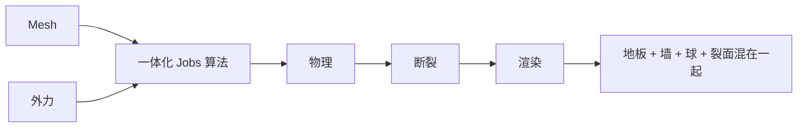
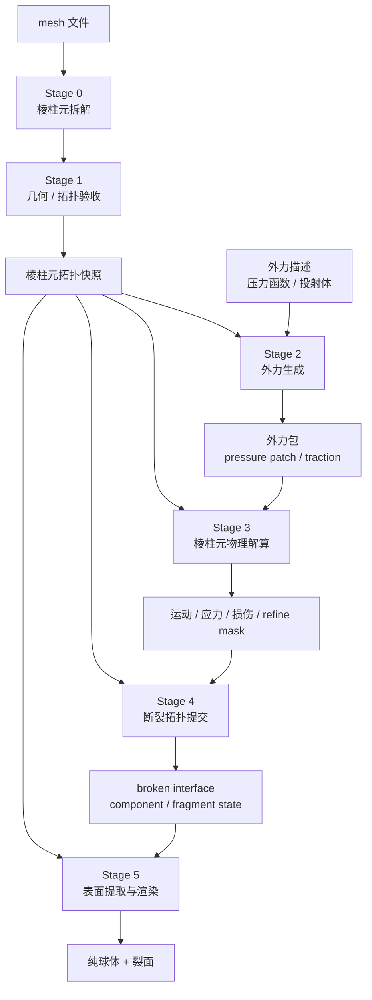
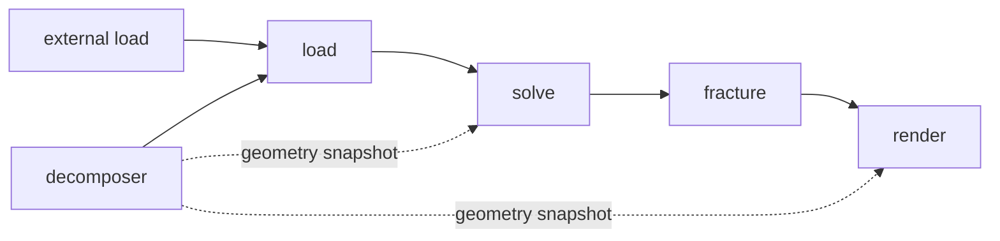
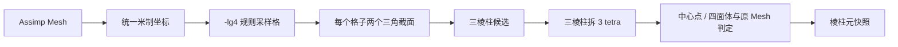
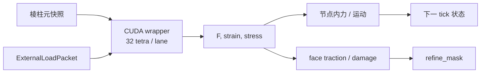
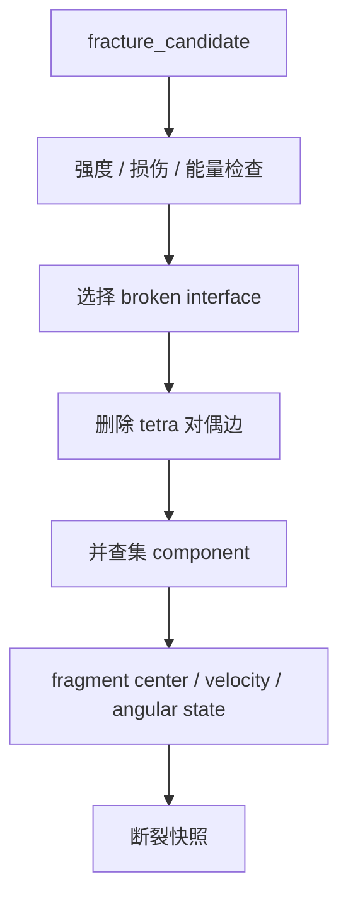
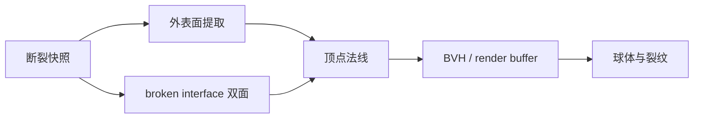
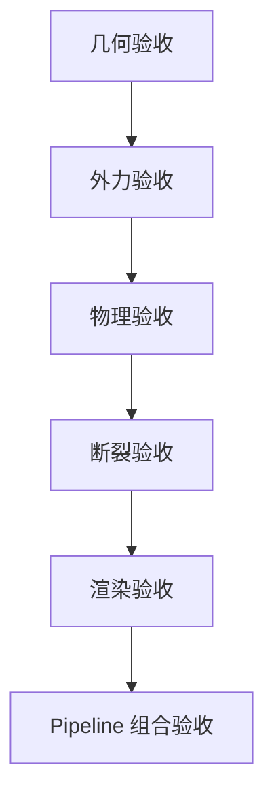
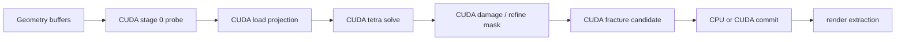

# 棱柱元球体 Demo：分阶段 Pipeline 架构

> 目标：先让每个 stage 可以单独验收，再组合成撞击、损伤和断裂 Demo。
> 本文不要求本轮完成实现。

## 0. 当前 Demo 为什么失败



当前问题：

| 问题 | 结果 |
|---|---|
| 拆解、外力、物理、断裂、渲染共用一个 `Simulation` | 无法单独知道是哪一层错了 |
| 验收只跑 1 tick | 投射体还没有撞到球，当然看不到断裂 |
| 多 tick Jobs 版超过验证时间 | 不能证明实时，也不能用 CPU 版代替 CUDA |
| `BuildRender()` 主动加入 floor/wall | 预览出现了没有来源的地板和墙 |
| 断裂状态没有单独的可视化验收输入 | 即使 `broken_faces` 错了，也只能看到一张图 |
| 物理解算直接持有 Mesh、接触、渲染数据 | 后续 CUDA wrapper 无法按 stage 切分预算 |

本轮不再继续扩大一体化算法。

## 1. 目标数据流



### 现有 runtime 下的组合方式

当前项目的 pipeline 映射是连续 stage chain，不先假设它支持任意 DAG：



“并联”先按两个层次处理：

1. 每个 stage 都是可独立挂载、可独立 runner 验收的算法包。
2. Pipeline 内先使用线性映射保证数据契约；外力生成和渲染观察分支以后再根据 scheduler 能力并行化，不修改主干调度器来承载物理语义。

## 2. Stage 列表

| Stage | 建议算法包 | 只负责 | 不负责 |
|---|---|---|---|
| 0 | `agent_adaptive_prism_mesh_decomposer` | Mesh → 棱柱元、四面体、邻接、原始顶点映射 | 外力、应力、断裂、地板 |
| 1 | `agent_adaptive_prism_geometry_probe` | 检查覆盖、方向、体积、邻接；输出诊断图 | 修改物理状态 |
| 2 | `agent_adaptive_prism_external_load` | 产生压力函数、接触斑、合力、力矩、反力 | 直接改节点位置 |
| 3 | `agent_adaptive_prism_physics_solver` | 应变、应力、内部力、节点运动、损伤、精算 mask | 删除拓扑、画场景 |
| 4 | `agent_adaptive_prism_fracture_commit` | 根据精算结果切共享面、建 component、保存碎片运动状态 | 重新猜测接触压力 |
| 5 | `agent_adaptive_prism_surface_renderer` | 外表面、裂面、顶点法线、BVH、纯几何预览 | 添加地板、墙、辅助物体 |

球体 Demo 的 pipeline root 建议命名为：

```text
agent_adaptive_prism_sphere_fracture_pipeline
```

## 3. Stage 0：Mesh 拆成棱柱元



最小输出：

```text
rest_position[node]
tetra_node[tid][4]
tetra_volume[tid]
face_owner[face][left_tetra, right_tetra]
face_normal[face]
source_triangle_id[face]
source_barycentric[face]
```

Stage 0 的 render 只画“拆解后的球”，不画物理、不画投射体、不画地板。

## 4. Stage 2：外力必须是独立输入

```mermaid
flowchart TB
    A[外力描述] --> B{类型}
    B --> C[均匀压力 patch]
    B --> D[压力函数 p(x,y)]
    B --> E[投射体接触]
    C --> F[三角面采样 / 积分]
    D --> F
    E --> F
    F --> G[每个边界面 traction]
    G --> H[面合力 / 力矩 / 作用点]
    H --> I[ExternalLoadPacket]
```

```text
ExternalLoadPacket {
    face_id[]
    pressure[]
    traction[]
    resultant_force
    resultant_torque
    center_of_pressure
    projectile_reaction
}
```

这个 stage 的验收不需要球运动：给两个对称侧面相同负压，必须得到等大反向的两个面力，合力和力矩符合对称性。

## 5. Stage 3：物理解算输入 / 输出



最小输出：

```text
position[node]
velocity[node]
stress[tid][6]
face_damage[face]
refine_mask[prism]
fracture_candidate[face]
```

第一阶段只验证：

- 无外力时球不自己爆炸；
- 对称压力产生对称位移；
- 外力方向、反力方向正确；
- 精算 mask 只标记局部区域。

## 6. Stage 4：断裂提交



这里才允许产生：

```text
broken_face_id[]
component_id[tetra]
fragment_transform[component]
fragment_velocity[component]
fragment_surface_range[component]
```

断裂 stage 的单独验收不需要真实撞击：输入一个人工构造的中间切面候选，必须得到两个 component，并输出两份反向绕序的裂面三角形。

## 7. Stage 5：纯几何渲染



此 stage 的场景中只允许出现：

```text
目标球外表面
断裂面
必要时的撞击球
```

删除当前 demo 中的：

```text
floor0..floor3
wall0..wall3
shader 内的 floor fallback
```

## 8. 分阶段验收顺序



| 验收 | 输入 | 必须看到的结果 |
|---|---|---|
| Geometry | 球 Mesh | 只有球；棱柱 / tetra 数量非零；无地板 |
| Load | 对称压力 patch | 两侧面力对称；合力、力矩可解释 |
| Physics | 固定外力包 | 球位移、速度、应力场出现；不自动断裂 |
| Fracture | 人工候选切面 | `component >= 2`；裂面双面存在 |
| Render | 断裂快照 | 球、碎片、裂面可见；没有莫名其妙的几何 |
| Pipeline | 真实外力 + solver | 按 tick 看到接触、损伤、断裂、分离 |

## 9. CUDA 化顺序

不要一开始把整个 Demo 搬进一个 CUDA kernel：



优先 CUDA 化：

1. tetra 应力与节点力；
2. face traction / damage；
3. refine mask 压缩与任务队列；
4. 断裂候选筛选。

Mesh 拆解和最终拓扑提交先保留 Jobs 参考版本，便于单独对照 CUDA 结果。

## 10. 本轮结论

本轮只确认架构，不继续改一体化 demo。下一步应从 **Stage 0：球 Mesh → 棱柱元** 开始，验收图只允许出现球，不允许有物理、投射体、地板或墙。Stage 0 通过后再做外力 stage。

