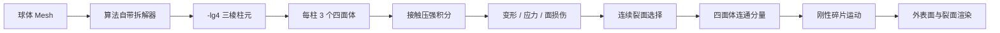
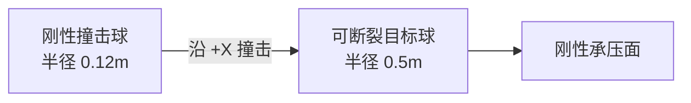
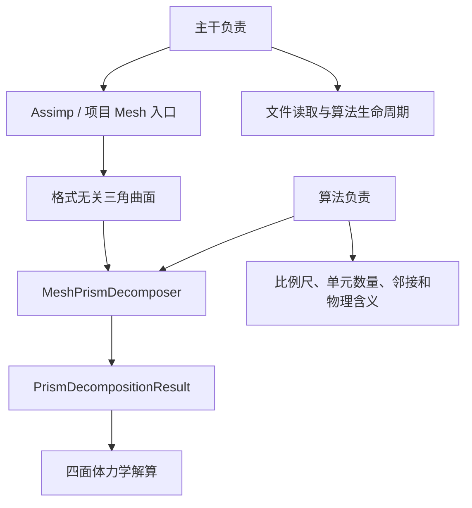
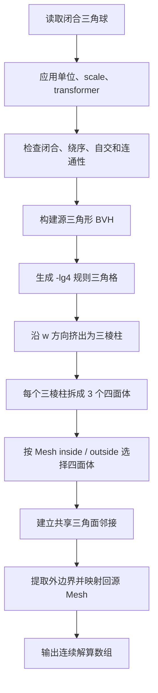
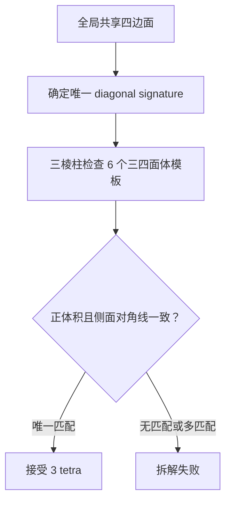
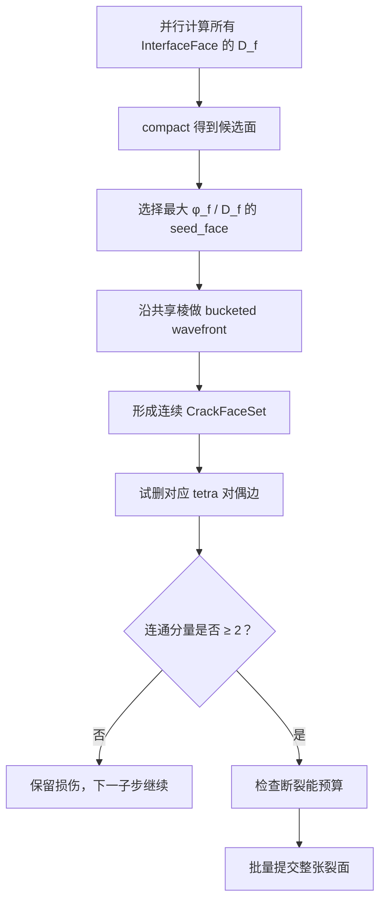
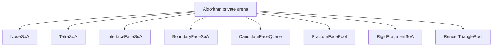
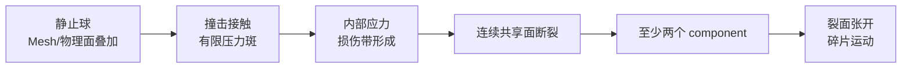
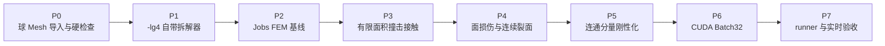
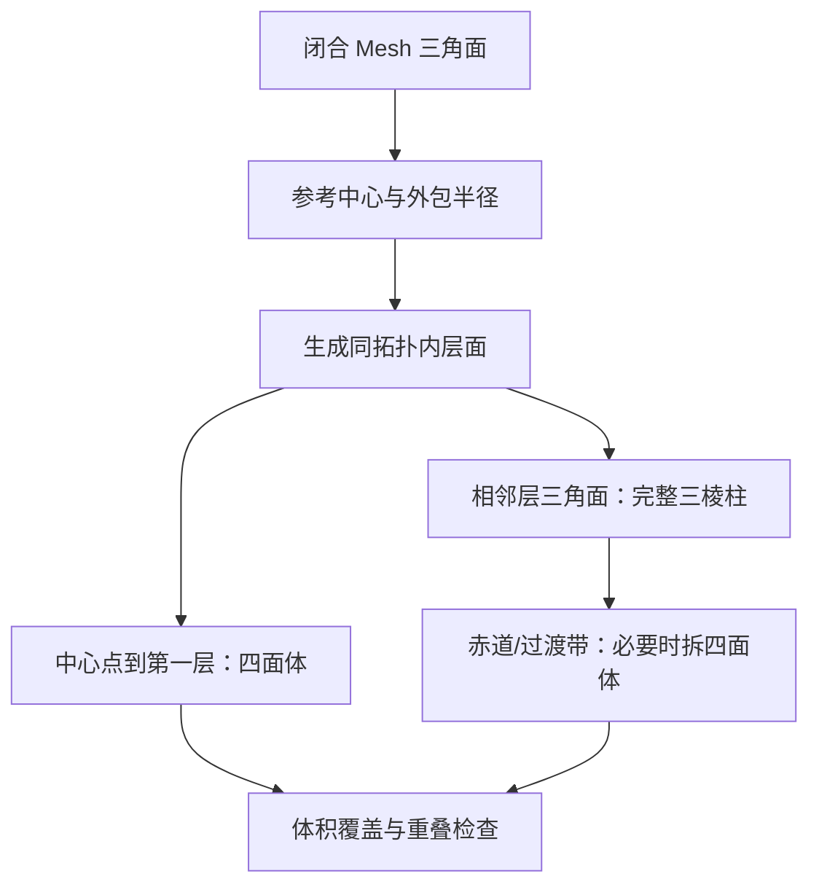

# `-lg4` 球体撞击断裂最小验证 Demo

## 1. 文档结论

这个 Demo 可以做，并且应该先作为一个普通算法包实现：

```text
agent_adaptive_prism_sphere_fracture_probe
```

它挂载在 Agent 中，但所有棱柱元语义、拆解、四面体求解、损伤、断裂和碎片数量都由算法自己拥有。主干只提供算法执行环境，不读取这些数量，也不解释其物理含义。

第一版固定从 `-lg4` 开始：

```text
lg0  = 1m
-lg4 = 1/16m = 0.0625m = 6.25cm
```

本 Demo 不验证从 `lg0` 自动进入 `-lg1...-lg4` 的判断，也不需要 Tree 或 Algorithm Execution Graph。它只验证下面这一条纵向链路：



最终验收不是“出现一条贴图裂纹”，而是：

```text
一个真实加载的三角 Mesh 球
  → 被拆成 -lg4 物理单元
  → 受到有限面积接触压强
  → 内部应力使共享三角面失效
  → 四面体邻接图分成至少两个连通分量
  → 两个碎片继承断裂前的线动量和角动量
  → 裂面真正张开并可见
```

---

## 2. 第一版明确不做什么

| 不做的内容 | 原因 |
|---|---|
| `lg0 → -lg4` 自适应细化 | 本 Demo 先隔离解算与断裂问题 |
| `-lg4` 以下继续细化 | 避免把验证范围扩展成完整生产求解器 |
| 任意方向切开单个四面体 | 第一版裂面只采用已有共享三角面 |
| 通用 Mesh 的精确边界裁剪 | 需要约束四面体化后端，单独立项 |
| 裂后继续做可变形 FEM | 贯穿断裂后转换成刚性碎片 |
| 碎片之间的完整自碰撞 | 第一版只保证裂面张开和基本外部碰撞 |
| 真实玻璃或陶瓷参数标定 | 第一版使用时间缩放的脆性演示材料 |
| 主干 Tree / 调度器修改 | 固定 `-lg4` 不产生精算分支 |

这些限制不能被静默回退逻辑掩盖。输入或拓扑不符合第一版合同就直接结束拆解并报告错误。

---

## 3. 固定演示场景



建议默认参数：

| 参数 | 建议初值 | 含义 |
|---|---:|---|
| 目标球半径 | `0.5m` | 直径刚好为 `lg0` |
| 撞击球半径 | `0.12m` | 产生局部而非单点接触 |
| 撞击方向 | `+X` | 项目左手坐标约定不变 |
| 撞击球初速度 | `6m/s` | 后续按材料调参 |
| 物理帧 | `1/60s` | 对外帧时间 |
| 最大物理子步 | `32` | 超过时判定该材料不适合本 Demo 实时预算 |
| 目标物理尺度 | `-lg4` | 6.25cm |

刚性承压面不是预制裂纹。它只让目标球形成稳定的直径向受压状态，避免整个自由球只被撞飞而没有可靠的内部拉应力。裂面仍然必须由计算得到的应力和损伤决定。

第一轮调参可以从下面这组“时间缩放脆性材料”开始。它只用于让 60Hz Demo 在有限子步内验证流程，不代表任何真实材料：

| 参数 | 建议起点 | 单位 |
|---|---:|---|
| `ρ` | `1000` | `kg/m³` |
| `E` | `2.0e5` | `Pa` |
| `ν` | `0.22` | 无量纲 |
| `Tn_critical` | `1.5e4` | `Pa` |
| `Ts_critical` | `2.5e4` | `Pa` |
| `G_c` | `20` | `J/m²` |
| `τ_fracture` | `0.002` | `s` |
| `m_damage` | `1` | 无量纲 |
| `k_n` | `2.0e7` | `Pa/m` |
| `c_n` | `1.0e3` | `Pa·s/m` |

---

## 4. 为什么算法应当自带拆解器

建议第一版在算法包内部提供：

```text
MeshPrismDecomposer
```

职责边界：



原因：

1. 三棱柱元、四面体、层级和裂纹都是算法语义，不应进入主干。
2. 拆解只在加载或缓存构建时执行，不属于每帧热路径。
3. 球体 Demo 验证稳定后，拆解器可以留在算法内部，也可以再抽成同一 Agent 挂载的资产预处理算法。
4. 不需要修改 Assimp，更不允许修改任何第三方库。

第一版可以通过 Assimp 加载 OBJ。以后 OBJ、FBX、glTF、STL 等都先变成同一份格式无关输入：

```text
PhysicalSurfaceInput {
    positions_m[]
    triangles[]
    source_material_id[]
    source_vertex_reference[]
}
```

---

## 5. 球体 Mesh 输入合同

### 5.1 文件和比例尺

第一版必须真正读取一个三角 Mesh 文件，不能直接用解析球公式代替输入。解析球公式只允许作为拆解结果的验收基准。

Mesh 文件本身不负责猜测单位。算法配置必须明确声明：

```text
asset_unit_to_meter
object_scale_m
object_transformer
```

变换后的目标必须满足：

```text
球心位于对象局部原点
半径 = 0.5m
所有物理位置统一使用米
```

### 5.2 输入拓扑硬条件

拆解前执行一次离线检查：

```text
所有面已经三角化
每个三角形面积 > 0
每条无向边恰好属于两张三角形
相邻三角形绕序一致
球壳绕序朝外，带符号总体积 > 0
整个球壳只有一个连通分量
球壳没有自相交
球壳能够区分 inside / outside
变换后的包围盒直径约为 1m
```

任何条件失败都直接判定输入无效。第一版不自动补洞、不自动加厚、不猜单位、不修正自相交。

### 5.3 原始 Mesh 保留什么

拆解后仍保留：

```text
原始顶点位置
原始三角形索引
原始法线 / UV / 材质引用
源三角形到物理边界面的投影关系
```

原始 Mesh 用于近景外观和拆解误差检查；物理质量、应力和裂纹只由四面体场决定。

---

## 6. 球体 Mesh 的最小拆解算法

### 6.1 总流程



### 6.2 生成 `-lg4` 规则三角格

固定：

```text
h = 0.0625m
```

先在对象局部 `u-v` 平面生成边长为 `h` 的规则方格。每个方格按棋盘奇偶选择一条固定对角线，拆成两张三角形：

```text
(i+j) 为偶数：使用左下 → 右上
(i+j) 为奇数：使用右下 → 左上
```

再把每张三角形从 `w_k` 挤出到 `w_(k+1)`：

```text
w_k = w_min + k·h
```

一张下层三角形和对应上层三角形形成一个三棱柱：

```text
P = (A,B,C,A',B',C')
```

因此一个 `h × h × h` 构造格大约产生两个三棱柱。构造格不是物理解算单元；三棱柱和它的四面体才是物理单元。

### 6.3 每个三棱柱拆成三个四面体

一个合法模板为：

```text
T0 = (A, B, C, A')
T1 = (B, C, B', A')
T2 = (C, B', C', A')
```

广义三棱柱存在六种对应模板。拆解器不能让每个三棱柱独立猜侧面对角线，必须先确定全局共享四边面的对角线，再从六种模板中选择唯一匹配者：



所有四面体最终必须重新定向，使：

```text
det(D_m) > 0
V_0 = det(D_m)/6 > 0
```

### 6.4 Mesh 如何决定保留哪些四面体

第一版不精确裁剪球面。它使用源 Mesh 的 inside / outside 查询，把规则四面体集合变成一个封闭的近似球：

```text
x_c = 四面体参考位置的体积重心
winding = WindingNumber(source_mesh, x_c)

winding > 0.5  → 保留
winding ≤ 0.5  → 丢弃
```

源三角形 BVH 用于加速查询和确认边界附近的源三角形。解析球公式不参与保留判断，只在验收时计算理论体积和理论半径误差。

这种做法的结果是：

```text
远离球面的三棱柱：3 个 tetra 全部保留
球面附近：可能只保留 1 个或 2 个 tetra
球体外部：0 个 tetra
```

父三棱柱的分类：

| 保留情况 | 物理表示 |
|---|---|
| 3 个 tetra | 完整三棱柱元 |
| 2 个且共享完整三角面 | 双四面体帽 |
| 1 个 tetra | 单四面体帽 |
| 2 个但不共享三角面 | 两个独立单四面体帽 |
| 0 个 | 丢弃 |

这条近似会使物理球表面呈 `-lg4` 分面形状，但不会引入任意裁剪拓扑，也不需要额外四面体化库。

### 6.5 建立共享面邻接

每个四面体有四张三角面。对每张面生成与绕序无关的键：

```text
face_key = sort(node_id_0, node_id_1, node_id_2)
```

按 `face_key` 排序后：

```text
出现 1 次 → 外边界面
出现 2 次 → 两个四面体的共享界面
出现 >2 次 → 非流形，拆解失败
```

共享面记录：

```text
InterfaceFace {
    tetra_left
    tetra_right
    local_face_left
    local_face_right
    rest_area
    rest_normal
    damage
    broken
}
```

这张四面体对偶图同时用于传力、裂纹搜索和裂后连通分量计算。

### 6.6 保留源 Mesh 映射

对每张物理外边界面：

1. 用 BVH 找最近的源 Mesh 三角形。
2. 把物理面中心投影到源三角形。
3. 保存源三角形编号、重心坐标和投影距离。

```text
BoundarySourceMap {
    boundary_face_id
    source_triangle_id
    source_barycentric
    projection_distance_m
}
```

第一版渲染提供两个视图：

```text
Source Mesh：拆解前的光滑参考球
Physical Surface：四面体实际外边界和实际裂面
```

断裂后的拓扑以 `Physical Surface` 为准。第一版不强行让未切开的原始光滑球壳跨越两个碎片。

### 6.7 拆解器输出

```text
PrismDecompositionResult
├── reference_node_position[]
├── current_node_position[]
├── node_velocity[]
├── tetra_node[4][]
├── tetra_parent_prism_id[]
├── prism_kind[]
├── inverse_Dm[]
├── rest_volume[]
├── interface_faces[]
├── boundary_faces[]
├── boundary_source_map[]
└── active_tetra_ids[]
```

运行时全部使用连续数组和索引，不使用逐单元指针树。

---

## 7. 拆解完成后怎样检查

### 7.1 几何与拓扑检查

```text
每个 tetra：det(D_m) > 0
每个 tetra：V_0 > 0
任意两个保留 tetra 不发生体积重叠
每个共享面恰好有两个 owner
每个外边界面恰好有一个 owner
不存在三 owner 面
断裂前 tetra 对偶图只有一个连通分量
外边界三角网格是闭合二流形
```

### 7.2 体积和表面误差

理论球体积：

```text
V_sphere = 4/3·π·R³
```

离散体积：

```text
V_discrete = Σ V_0(tetra)
```

第一版验收范围：

```text
abs(V_discrete - V_sphere) / V_sphere ≤ 10%
最大边界投影距离 ≤ 2h = 0.125m
```

`10%` 是最小验证容差，不是生产精度目标。后续精确边界裁剪器应显著收紧这两个数值。

### 7.3 规模检查

对直径 `1m` 的球，预期数量级：

```text
包围盒构造三棱柱候选约 8,192
保留至少一个 tetra 的活动三棱柱组约 3,500～5,500
保留四面体约 10,000～20,000
共享面约 20,000～40,000
极端全部暴露的 tetra 三角面不超过约 80,000
```

数量越界不是由主干判断，而是算法自己的拆解报告和预算合同判断。

---

## 8. 撞击不能直接变成点力

### 8.1 撞击球接触

撞击球是动态刚体。对目标球每张外边界三角面使用三点面积积分。积分点 `x_q` 到撞击球球心 `c_p` 的有符号间隙：

```text
g_q = norm(x_q - c_p) - R_p
```

只有 `g_q < 0` 时存在接触。定义：

```text
δ_q = -g_q
n_q = normalize(x_q - c_p)
v_n = dot(v_target(x_q) - v_projectile(x_q), n_q)
```

接触压强：

```text
p_q = k_n·δ_q + c_n·max(-v_n, 0)
```

目标球牵引力：

```text
t_q = p_q·n_q
```

三角面节点外力：

```text
f_i^contact
  += Σ_q w_q·A_face·N_i(x_q)·t_q
```

撞击球接收完全相反的合力和力矩：

```text
F_projectile = -Σ f_target_contact
τ_projectile = -Σ (x_q-c_p)×f_target_contact
```

刚性承压面使用同样的有限面积压强积分，不允许直接锁死目标球内部节点。

### 8.2 接触检查

每个物理子步检查：

```text
接触面积 > 0 时，目标和撞击球接触力大小相等、方向相反
目标节点接触合力等于压力面积积分
目标节点接触力矩等于压力力矩积分
没有接触时，接触力严格为 0
```

---

## 9. 四面体怎样受力和运动

### 9.1 预计算

对每个四面体：

```text
D_m = [X_1-X_0, X_2-X_0, X_3-X_0]
V_0 = det(D_m)/6
inverse_Dm = inverse(D_m)
m_e = ρ·V_0
```

每个节点获得：

```text
m_i += m_e/4
```

### 9.2 每个子步的变形和内力

```text
D_s = [x_1-x_0, x_2-x_0, x_3-x_0]
F = D_s·inverse_Dm
J = det(F)
```

第一版使用 fixed-corotated 弹性：

```text
F = R·S
μ = E/[2·(1+ν)]
λ = E·ν/[(1+ν)·(1-2ν)]

P = 2μ·(F-R) + λ·(J-1)·cofactor(F)
```

四面体内力：

```text
H = -V_0·P·transpose(inverse_Dm)

f_1^internal = column_0(H)
f_2^internal = column_1(H)
f_3^internal = column_2(H)
f_0^internal = -(f_1^internal+f_2^internal+f_3^internal)
```

节点运动方程：

```text
a_i = (f_i^external + f_i^internal + m_i·gravity) / m_i
v_i^(n+1) = v_i^n + Δt·a_i
x_i^(n+1) = x_i^n + Δt·v_i^(n+1)
```

这里使用半隐式 Euler。材料黏性应进入应力，不使用会错误减慢整体刚体运动的全局速度乘数。

### 9.3 时间步限制

纵波速度近似：

```text
c_p = sqrt((λ+2μ)/ρ)
```

显式积分时间步：

```text
Δt ≤ CFL·h/c_p
```

Demo 建议 `CFL=0.25`。如果一个 `1/60s` 物理帧需要超过 32 个子步，默认材料配置必须重新缩放；不能让 Demo 静默进入无限子步。

第一版材料是“时间缩放脆性材料”，用于验证算法，不得在报告中称为真实玻璃。

### 9.4 无撞击基线检查

在允许断裂前必须通过：

```text
静止 120 帧：球不自行移动
统一平移：F=I，内部应力接近 0
纯刚体旋转：fixed-corotated 内力接近 0
四面体始终满足 det(F)>0
无外力时总线动量守恒
```

---

## 10. 怎样判断共享面开始损伤

### 10.1 从四面体应力得到面牵引力

把第一 Piola 应力转换成 Cauchy 应力：

```text
σ = (1/J)·P·transpose(F)
```

共享面两侧平均应力：

```text
σ_avg = 1/2·(σ_left+σ_right)
t_f = σ_avg·n_f
```

分成拉伸和剪切：

```text
t_n = max(dot(t_f,n_f), 0)
t_s = t_f - dot(t_f,n_f)·n_f
```

压缩法向应力不直接打开裂面；剪切仍可以产生损伤。

### 10.2 混合断裂指标

```text
φ_f
  = (t_n/Tn_critical)²
  + (norm(t_s)/Ts_critical)²
```

```text
φ_f ≤ 1  → 本子步不增长损伤
φ_f > 1  → 累计面损伤
```

损伤累计：

```text
D_f^(n+1)
  = D_f^n
  + (Δt/τ_fracture)·max(0,φ_f-1)^m_damage
```

```text
D_f < 1  → intact
D_f ≥ 1  → fracture candidate
```

大力本身不是断裂条件。只有共享面上的拉伸 / 剪切牵引超过材料强度并持续足够时间，才进入候选集合。

---

## 11. 怎样从候选面形成一张裂面

### 11.1 禁止逐 lane 立即断面

下面的做法不能采用：

```text
某个 CUDA lane 发现 D_f ≥ 1
  → 当场删除这一张共享面
```

它会产生孤立孔洞，并使结果依赖线程执行顺序。

### 11.2 第一版裂面搜索



候选面的排序代价：

```text
C_f
  = G_c·A_f
  + w_angle·A_f·(1-abs(dot(n_f,n_star)))
  + w_damage·A_f·(1-clamp(D_f,0,1))
```

含义：

```text
G_c·A_f       切开这张面的材料能量
n_star        当前最大拉应力给出的偏好裂面法线
D_f           已经积累的物理损伤
```

只有 `D_f` 达到候选阈值的面可以进入 wavefront。算法不能为了让球一定裂开而穿过完全无损伤区域补一张预设平面。

### 11.3 断裂能检查

```text
E_crack = Σ_(f∈CrackFaceSet) G_c·A_f
```

裂纹邻域可释放弹性能记为：

```text
Ψ_e = 每个 tetra 的 fixed-corotated 应变能密度
U_e = V_0·Ψ_e

CrackBandTetra
  = CrackFaceSet 两侧 tetra
    加一圈共享面邻居

E_available_local
  = Σ_(e∈CrackBandTetra) U_e
```

第一版只把裂纹邻域当前保存的弹性能视为可用能量，不把整个球的动能全部拿来切裂面。

只有：

```text
E_crack ≤ fracture_fraction·E_available_local
```

才允许提交。若不足，保留损伤但不切断拓扑。

### 11.4 提交断裂

提交是一次批处理：

```text
1. 把 CrackFaceSet 标记为 broken
2. 从四面体对偶图删除对应边
3. 重新计算 tetra connected components
4. 每张 broken face 输出正反两张裂面三角形
5. 检查每个碎片外表面闭合
```

每张断裂面：

```text
position(f_plus) = position(f_minus)
winding(f_plus)  = -winding(f_minus)
normal(f_plus)   = -normal(f_minus)
```

它们刚提交时重合，碎片运动后自然张开。

---

## 12. 断裂以后运动怎样变化

### 12.1 为什么不能给碎片添加“爆炸速度”

断裂只删除内部约束并消耗能量，不会凭空产生动量。碎片速度必须来自断裂前的节点速度场。

第一版一旦形成贯穿裂面，就把每个 tetra 连通分量冻结成一个刚性碎片。

### 12.2 从节点状态生成刚性碎片

对一个碎片中的每个四面体，把 `m_e/4` 分给四个节点采样。碎片质量和质心：

```text
M = Σ m_i
x_cm = Σ(m_i·x_i)/M
```

线动量和质心速度：

```text
P_linear = Σ(m_i·v_i)
v_cm = P_linear/M
```

角动量：

```text
r_i = x_i-x_cm
L = Σ r_i×(m_i·v_i)
```

惯量张量和角速度：

```text
I = Σ m_i·(dot(r_i,r_i)·Identity-r_i·transpose(r_i))
ω = inverse(I)·L
```

碎片节点速度投影为：

```text
v_i^rigid = v_cm + ω×r_i
```

这个投影保持碎片的总线动量和角动量，同时丢弃无法由刚体表示的高频形变速度。它不会增加能量，也不会制造爆炸冲量。

### 12.3 断裂后的刚体积分

```text
v_cm^(n+1) = v_cm^n + Δt·F_external/M
x_cm^(n+1) = x_cm^n + Δt·v_cm^(n+1)

ω^(n+1) = ω^n + Δt·inverse(I_world)·τ_external
R^(n+1) = Exp(Δt·ω^(n+1))·R^n
```

碎片顶点由提交断裂时保存的局部位置和当前刚体变换生成。

第一版继续处理：

```text
碎片与撞击球接触
碎片与刚性承压面接触
重力
```

第一版暂不处理碎片之间的二次自碰撞。验收录像只覆盖裂面开始张开后的短时间窗口。

### 12.4 断裂提交守恒检查

断裂提交前后必须检查：

```text
总质量不变
总线动量不变
总角动量不变
刚体投影后的动能不高于投影前动能
断裂过程没有添加额外外力或速度
```

---

## 13. 推荐运行数据布局



热路径分工：

| 批次 | 并行单位 |
|---|---|
| 接触积分 | 一个 lane 对应一个边界三角面积分点或三角面 |
| 四面体本构 | 一个 lane 对应一个 tetra |
| 节点组装 | sort/reduce 或 node CSR |
| 共享面损伤 | 一个 lane 对应一个 InterfaceFace |
| 候选压紧 | ballot / prefix scan |
| 连通分量 | tetra 对偶图 label propagation |
| 渲染面输出 | 一个 lane 对应一个外边界或断裂面 |

直径 `1m`、固定 `-lg4` 时，约 `10,000～20,000` 个 tetra，只需要几百个 CUDA wrapper。初始化后每帧热路径不允许重新分配单元数组。

第一版工程路线：

```text
Jobs 参考实现：验证拆解、公式、裂面和守恒
CUDA 实现：验证 Batch32 并行与实时预算
```

只完成 Jobs 可以证明算法正确性，但不能完成“实时 CUDA Demo”的最终验收。拆解器本身允许在 CPU 上一次性执行，因为它不属于每帧求解。

---

## 14. Debug 可视化必须提供什么

Demo 至少提供以下切换视图：

```text
1. 原始 Mesh 线框
2. -lg4 三棱柱 parent 分组颜色
3. 四面体边界三角面
4. 接触压强热力图
5. 最大主拉应力热力图
6. InterfaceFace 损伤 D_f
7. CrackFaceSet
8. tetra connected component 颜色
9. 碎片质心速度和角速度矢量
```

关键画面：



---

## 15. 分层验收

### A. Mesh 真实导入

- [ ] 通过 Assimp 读取一个球体 Mesh 文件。
- [ ] 日志记录源顶点数、三角形数、源包围盒和声明比例尺。
- [ ] 变换后半径为 `0.5m`。
- [ ] Mesh 闭合、绕序一致、无退化面、单连通壳体。
- [ ] 输入非法时直接报错，不自动修复。

### B. 拆解器

- [ ] 固定使用 `h=0.0625m`。
- [ ] 生成规则三角格并挤出三棱柱。
- [ ] 每个完整三棱柱恰好生成 3 个正体积 tetra。
- [ ] 表面出现完整三棱柱、双四面体帽和单四面体帽。
- [ ] 所有共享面 owner 数为 2，所有外边界面 owner 数为 1。
- [ ] 断裂前 tetra 对偶图恰好一个连通分量。
- [ ] 离散体积相对球体理论体积误差不超过 `10%`。
- [ ] 最大物理边界到源 Mesh 投影距离不超过 `0.125m`。
- [ ] 同一输入连续拆解三次得到相同节点、tetra 和 face ID。

### C. 无载荷与接触

- [ ] 静止 120 帧不产生自发移动或损伤。
- [ ] 统一平移和纯刚体旋转不产生显著内部应力。
- [ ] 接触区域是一组有面积的三角面，不是一个点。
- [ ] 目标接触合力与撞击球反力大小一致、方向相反。
- [ ] 撞击球速度因反作用力下降。
- [ ] 整个验收过程没有 `det(F)≤0` 的 tetra。

### D. 损伤与断裂

- [ ] 所有 broken face 在断裂前都满足候选损伤条件。
- [ ] 裂面由相邻共享三角面组成，不含孤立三角孔洞。
- [ ] 裂面总能量不超过局部可释放能量预算。
- [ ] 删除裂面对偶边后，component 数量至少为 2。
- [ ] 每张 broken face 输出两张位置相同、绕序相反的裂面三角形。
- [ ] 每个碎片的外表面加裂面构成闭合三角网格。
- [ ] 不存在连接两个不同 component 的 intact interface。

### E. 断裂后运动

- [ ] 碎片总质量等于断裂前目标球质量。
- [ ] 刚性化前后总线动量相对误差不超过 `1e-4`。
- [ ] 刚性化前后总角动量相对误差不超过 `1e-3`。
- [ ] 刚性投影不会增加总动能。
- [ ] 没有人工添加碎片爆炸速度。
- [ ] 断裂后 30 个画面帧内，至少一对裂面平均间距超过 `0.01m`。

### F. 渲染和 runner

- [ ] 原始 Mesh、物理外表面和裂面可以分别显示。
- [ ] 连通分量使用不同颜色显示。
- [ ] runner 返回 `OK algorithm_runner`。
- [ ] 日志不存在 `pipeline=not_ready` 或 `target=not_ready`。
- [ ] `preview_pixels > 0`。
- [ ] 预览图片输出到 `testData\`。
- [ ] 最新普通算法日志位于 `testData\norm\debugInfo\last_run.log`。

### G. 实时预算

- [ ] 拆解时间单独统计，不计入每帧物理时间。
- [ ] 初始化完成后，物理热路径动态分配次数为 0。
- [ ] `-lg4` 默认材料每画面帧不超过 32 个物理子步。
- [ ] 报告 CUDA 每帧平均值和 P95，不用单个最快帧代表实时性能。
- [ ] 60Hz 目标为 P95 不超过 `16.67ms`；若未达到，必须标记为物理功能通过、实时验收失败。

---

## 16. 验收时间线

默认配置应该满足下面的可重复时间线。具体 tick 可以在首次调参后固定进测试数据：

| 阶段 | 预期状态 |
|---|---|
| tick 1 | 球已拆解，未接触，component=`1` |
| 接触检查点 | 压力斑非空，撞击球开始减速 |
| 损伤检查点 | `max(D_f)>0`，broken face 仍可为 `0` |
| 断裂检查点 | broken face 非空，component 至少为 `2` |
| 分离检查点 | 裂面间距超过 `0.01m` |

同一后端重复三次必须得到相同的：

```text
tetra_count
interface_face_count
broken_face_count
broken_face_id_hash
component_count
```

Jobs 和 CUDA 不要求逐浮点位一致，但必须通过相同的拓扑、守恒和视觉验收。

---

## 17. 最终构建与 runner 验收命令

实现完成后，从仓库根目录构建：

```powershell
python boot\booterNinjaClang.py agent_adaptive_prism_sphere_fracture_probe --cuda on
```

然后启动一次 runner server：

```powershell
cmd /c start "" /b build\Microsoft\RelWithDebInfo\debugTool.exe --runner-server --runner-server-once --runner-endpoint 127.0.0.1:0
Start-Sleep -Seconds 2
```

运行 CUDA 验收并导出最终分离画面：

```powershell
cmd /c build\Microsoft\RelWithDebInfo\debugTool.exe --algorithm-runner --algorithm agent_adaptive_prism_sphere_fracture_probe --ticks 180 --execution cuda --preview-output testData\agent_adaptive_prism_sphere_fracture_probe_cuda.png
```

还必须运行 Jobs 参考结果：

```powershell
cmd /c start "" /b build\Microsoft\RelWithDebInfo\debugTool.exe --runner-server --runner-server-once --runner-endpoint 127.0.0.1:0
Start-Sleep -Seconds 2
cmd /c build\Microsoft\RelWithDebInfo\debugTool.exe --algorithm-runner --algorithm agent_adaptive_prism_sphere_fracture_probe --ticks 180 --execution jobs --preview-output testData\agent_adaptive_prism_sphere_fracture_probe_jobs.png
```

不能把只输出：

```text
runner_client.begin
```

当作成功。必须得到：

```text
OK algorithm_runner
```

并检查：

```text
testData\norm\debugInfo\last_run.log
preview_pixels > 0
预览目标 ready
```

---

## 18. 实施顺序



建议每一步都必须先通过自己的检查再进入下一步。尤其不能在静止、刚体旋转和接触反力还没有通过时开始调断裂阈值，否则错误的内力或接触力会被误认为裂纹效果。

---

## 18A. 地基级拆解方案：径向体积分层

球体验证已经证明：只把外表面三角形两两配对，不能得到体积密铺。最快、最稳定的基础方案是先生成内部层，再生成单元。



### 18A.1 单元构造

设原始三角面为 `T_i=(a_i,b_i,c_i)`，参考中心为 `C`，层缩放系数为 `s_k`：

```text
P_k(v) = C + s_k (v-C)
s_0 < s_1 < ... < s_n = 1
```

中心单元：

```text
tetra(C, P_0(a_i), P_0(b_i), P_0(c_i))
```

相邻层单元：

```text
prism(
    P_k(a_i), P_k(b_i), P_k(c_i),
    P_(k+1)(a_i), P_(k+1)(b_i), P_(k+1)(c_i))
```

每个三棱柱继续固定拆成三个四面体，物理求解统一使用四面体数据。

### 18A.2 当前地基方案不强行生成五面体

五面体来自相邻三角面只共享一个顶点的曲面过渡。但为了最快完成可靠体积分解，地基方案不做全局曲面配对，而使用同一三角面在相邻几何层的对应副本。因此当前方案只产生：

```text
中心四面体 + 完整三棱柱 + 必要的四面体退化单元
```

五面体保留为一般非规则 Mesh 的后续优化，不是体积密铺的必要条件。

### 18A.3 必须通过的检查

```text
每个四面体：det(D_m) > 0
总单元体积：abs(sum(V_cell) - V_mesh) / V_mesh <= 1e-4
任意两个单元：不能有正体积交叠
内部共享面：必须恰好有两个 owner
外部边界面：必须恰好有一个 owner
```

球体验证实际结果：

```text
source triangles = 80
volume cells     = 400
orange cells     = 364
red transition   = 36
volume overlap   = 0
```

### 18A.4 香蕉不使用体素化，使用原始三角面配对

香蕉路径不能从空白空间采样格子。棱柱元的两个三角端面必须来自原始 Mesh；算法只负责生成端面之间的母线和侧面：

```text
原始三角面 A + 原始三角面 B
        ↓
匹配顶点顺序与方向
        ↓
生成对应母线和三个侧面
        ↓
完整三棱柱元
```

特殊配对保持同一规则：

```text
共享两条顶点的两个原始三角面 → 四面体
共享一个顶点的两个原始三角面 → 五面体
不共享顶点但相对、面积和边形状匹配 → 完整三棱柱
```

香蕉的 `44` 个原始三角面必须被全局匹配成 `22` 个单元。每个单元记录两个原始三角面 ID，不能产生没有原始三角端面的“空间格元”。

新增的硬约束是：每个生成单元必须嵌在原始闭合 Mesh 内部。候选匹配阶段对每个四面体检查重心、靠近四个顶点的内部采样点和六条边的内部采样点；任意采样点越出原始 Mesh，该候选直接淘汰。最终结果再次检查所有单元，避免错误候选漏过。

因此，“拆解完成模型与原始模型重合”不是靠把棱柱向外撑到表面，而是同时满足：

```text
每个单元 ⊆ 原始实体
单元之间无体积相交
所有原始三角面恰好被配对一次
Σ 单元体积 = 原始 Mesh 体积
⇒ 单元并集 = 原始实体（允许边界测度为零的差异）
```

验收仍然使用闭合 Mesh 有向体积：

```text
V_mesh = abs(Σ dot(p0-C, cross(p1-C, p2-C)) / 6)
abs(V_decomposition - V_mesh) / V_mesh <= 1e-5
```

同时要求所有生成侧面只连接配对端面的顶点，不能产生单元相交或脱离原始表面的棱角块。

---

## 19. Demo 成功以后才进入的工作

```text
从 lg0 自动判断是否进入负层级
局部 -lg4，而不是整球固定 -lg4
边界精确裁剪和约束四面体化
裂纹带继续进入 -lg5...-lg7
裂后可变形求解与碎片自碰撞
原始光滑 Mesh 按碎片重新切片
棱柱元资产缓存格式
单 CUDA executor 内部 Work Graph
必要时再研究 Agent Algorithm Execution Graph
```

这个 Demo 的价值是先回答最关键的问题：在不预制裂面的情况下，现有项目能否从一个真实三角 Mesh 球生成可并行的四面体物理场，并让计算得到的共享面裂纹真正把球分成会运动的碎片。
