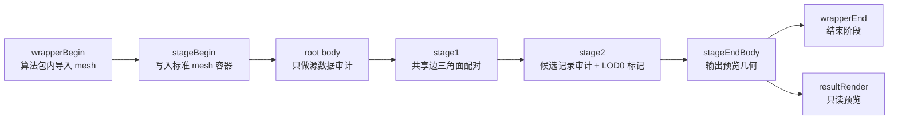
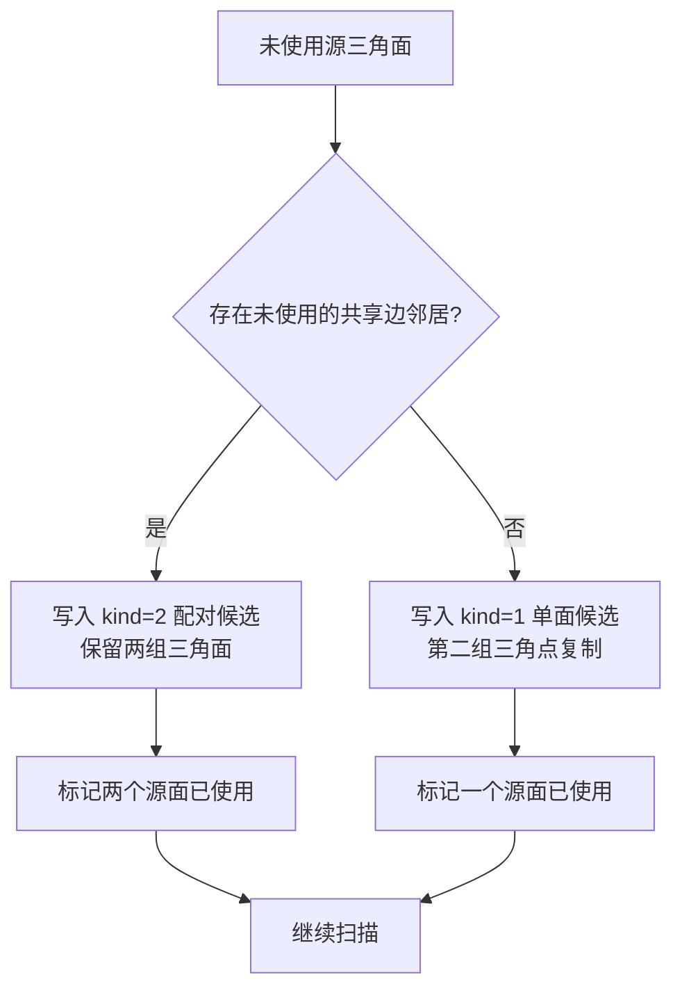
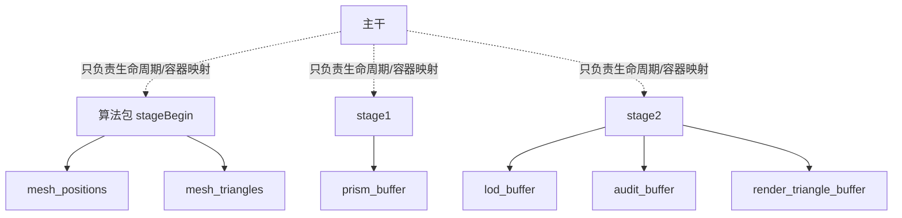
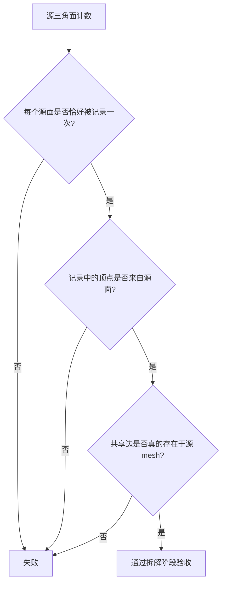

# Agent Adaptive Prism Pipeline Probe：拆解阶段设计

本阶段只负责把 mesh 拆成“原生三角面 + 候选棱柱记录”，暂不做四面体/三棱柱合并。



## 阶段职责

| 阶段 | 输入 | 输出 | 明确禁止 |
|---|---|---|---|
| `stageBegin` | 算法包自己的 mesh 输入 | `mesh_positions`、`mesh_triangles`、源计数 | 不配对、不合并、不渲染 |
| root body | 标准 mesh 容器 | 源数据审计记录 | 不改变几何语义 |
| `stage1` | 源顶点、源三角面 | `prism_buffer`、配对计数 | 不生成新表面、不宣称体积闭合 |
| `stage2` | 候选棱柱记录、源计数 | `lod_buffer`、审计状态、预览三角面 | 不做四面体/三棱柱合并 |
| `stageEndBody` | 审计后的预览缓冲 | 预览场景 | 不修改拆解结果 |
| wrapper `stageEnd` | 管线完成状态 | 结束生命周期 | 不拥有算法数据 |

## 当前拆解规则

1. 对每个源三角面建立三条无向共享边。
2. 从未使用的三角面开始，寻找第一个仍未使用、且共享一条边的邻接三角面。
3. 找到邻接面：生成一个“配对候选记录”，保留两组三角面的六个原始顶点。
4. 找不到邻接面：生成一个“单面候选记录”，第二组三角点复制第一组三角点；它不是实体棱柱，只是未配对记录。
5. 每个源三角面只能出现一次，因此候选记录数量不超过源三角面数量。



## `prism_buffer` 记录

每条记录是 28 个 `float`：

```text
0..23   六个点，每个点为 xyz + 1
24      geometry_kind：1=单面候选，2=共享边配对候选
25      first_source_triangle
26      second_source_triangle，-1=未配对
27      lod_level：当前固定为 0，表示拆解结果的 LOD0 记录
```

`kind=2` 只表示“两个原生三角面已被配对”，并不表示已经完成严格的三棱柱实体化。后续实体化必须单独验证：三角面方向、共享边、母线、闭合边界和非相交性。

## 数据所有权



主干不解释 `kind`、LOD 数量、候选记录数量或渲染数量；这些语义由算法包自己产生和消费。wrapperBegin 当前也不接收 host resource binding，因此验证导入器直接位于 `stageBegin` 算法包内；将来可在同一阶段替换为 Assimp importer，后续阶段接口不变。

## 拆解阶段验收



第一阶段的硬指标是“面覆盖和可追溯”，不是记录数量减少，也不是体积合并。只有以下条件满足后，才允许进入合并研究：

- 源三角面索引无遗漏、无重复；
- `kind=2` 的两个三角面确实共享源 mesh 的一条边；
- 所有候选记录都能追溯回源三角面；
- 单面候选不会被误标为实体棱柱；
- 预览只显示原生三角面，不用假几何掩盖拆解错误；
- runner 返回 `OK pipeline_runner`，预览像素非零，pipeline 和 target 均为 ready。

## 当前状态与下一阶段

当前已完成：导入、源审计、共享边配对、候选记录、LOD0 标记、预览和管线验收。

当前明确未开始：四面体合并、三棱柱合并、五面体合并、体积误差优化、裂面生成。

下一阶段应先增加共享边方向、二面角、边界类型和面覆盖审计；审计通过后，再定义严格的四面体/三棱柱实体记录，最后才研究保守合并。
