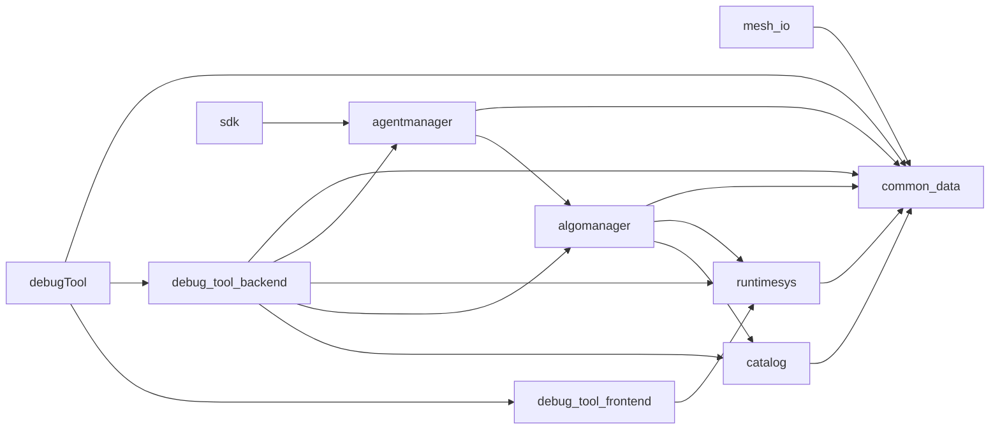
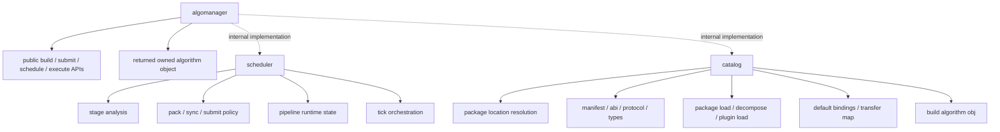

# Layer Readme

## Purpose

This file describes the repository structure that is actually present in the
workspace today.

Use it before:

- adding a new module
- moving code between folders
- wiring new runtime behavior into the app
- restoring older architecture ideas

When code and docs disagree, follow the code and update the docs.

## Core Rules

- Lower layers do not depend upward.
- `common_data` is shared in-memory data only.
- `common_data` is the one exception to the single-facade header rule.
- `runtimesys` owns the SDL, ImGui, and Vulkan runtime shell and exposes one facade header.
- `catalog` is the catalog subtree for package support, manifest assembly, and reflection helpers.
- `catalog` only consumes resolved algorithm package locations and performs assembly/loading; it does not search for packages.
- `agentmanager` and `debug_tool_backend` should reach algorithm loading through `algomanager`, not by treating `catalog` as a public root.
- `algomanager` is the strict main-trunk root interface for the algorithm layer.
- `algomanager` exposes only the root orchestration surface to upper layers.
- Upper layers must not use `using namespace algomanager` and must not
  import child namespaces directly; they may only consume symbols that the
  root `algomanager` node re-exports.
- The public `algomanager` facade must not use `using` declarations to
  re-export symbols; it should use explicit declarations, typedefs, or inline
  forwarding wrappers instead.
- `scheduler` and `catalog` are internal implementation subtrees behind that root interface.
- `algomanager` owns the top-level orchestration entrypoints only.
- `debug_tool_backend` owns the non-UI debug host backend and agent/runtime wiring.
- `debug_tool_frontend` is the editor-facing debug surface.
- `sdk` is the external agent/algorithm submission surface and depends on `agentmanager`.
- `debugTool` owns startup wiring for the debug executable only.
- Modules under `src/capabilities` are capability modules, not strict main-trunk hops.
- Capability modules may aggregate lower-level contracts, but they must not introduce upward dependencies into strict trunk layers.
- Optional capabilities must be linked explicitly by any consumer.
- Algorithm package source lives in `algorithmLib/algorithmSrc`, and built DLL/SPV runtime artifacts live in `algorithmLib/algorithmruntimeLib`.

## Current Module Graph

Compile dependency graph:



Runtime shell support path:

`debug_tool_backend -> runtimesys -> common_data`

UI path:

`debug_tool_frontend -> runtimesys -> common_data`

Capability modules grouped under `src/capabilities`:

- `agent`
- `sidecar`

Current project-library dependency graph from `CMakeLists.txt`:

- `mesh_io -> common_data`
- `catalog -> common_data`
- `algomanager -> common_data + runtimesys + catalog`
- `runtimesys -> common_data`
- `agentmanager -> common_data + algomanager`
- `debug_tool_backend -> common_data + agentmanager + runtimesys + algomanager + catalog`
- `debug_tool_frontend -> runtimesys`
- `sdk -> agentmanager`
- `debugTool -> debug_tool_backend + debug_tool_frontend + common_data`

Important note:

`catalog` still exists as a helper bundle, but it is meant to remain a
peer subtree of `algomanager`, not a child of `scheduler`.

`capabilities/agent` is intentionally different: it is consumed by trunk code,
but it is a capability carrier rather than one strict hop in the layering path.

## Ideal `algomanager` Tree

The intended public shape of `algomanager` is:



Rules for this tree:

- Upper layers only depend on the root `algomanager`.
- `scheduler` and `catalog` are internal implementation subtrees.
- `scheduler` and `catalog` must not depend on each other directly.
- After execution, `algomanager` returns the algorithm object structure it owns.

## Current Tree

```text
src/
├─ algomanager/
│  ├─ algorithm_manager.h
│  ├─ algorithm_container_manifest.h/.cpp
│  ├─ algorithm_package_location.h
│  ├─ algorithm_types.h
│  └─ README.md
├─ capabilities/
│  ├─ README.md
│  ├─ agent/
│  │  ├─ agent.h/.cpp
│  │  └─ README.md
│  └─ sidecar/
│     ├─ mesh_io.h/.cpp
│     └─ README.md
├─ common_data/
├─ algomanager/catalog/
│  ├─ algorithm_interaction_protocol.h
│  └─ algorithm_protocol.h
├─ runtimesys/
├─ sdk/
└─ debug_tool/
```

## Public Interfaces

- `common_data`: specific headers or `common_data/common_data.h`
- `catalog`: internal helper bundle under the `algomanager` root interface
- `algomanager`: `algomanager/algorithm_manager.h`
- `algomanager` package-location helper: `algomanager/catalog/algorithm_package_location.h`
- `runtimesys`: `runtimesys/runtime_systems.h`
- `debug_tool_backend`: no public interface; it is an internal debug backend target
- `debug_tool`: `debug_tool/debug_tool_host.h`, `debug_tool/debug_tool_backend_runtime.h`, and `debug_tool/debug_tool_frontend_panel.h`
- `agentmanager`: `agentmanager/agent_management.h`
- `sdk`: `sdk/sdk.h`

## Module Roles

### `algomanager`

Strict trunk layer for algorithm orchestration.

It should:

- expose the algorithm orchestration API from the root `algomanager`
- keep top-level orchestration entrypoints thin
- keep downstream execution and package assembly in the right subtree
- provide the build interfaces at the root level, not as child modules
- leave `AlgorithmObject` ownership and routing below the root API

It should not:

- make `scheduler` and `catalog` depend on each other directly
- own runtime execution state
- become a sidecar format layer
- turn back into a full algorithm runtime
- become a storage owner for algorithm objects at the root layer

Code outside `src/algomanager` should include only
`algomanager/algorithm_manager.h`.

### `capabilities/agent`

Cross-layer capability module for the lightweight `Agent` object and its package
hook contracts.

It may aggregate:

- algorithm-management container and manifest types
- algorithm support hook contracts
- package-provided submission requirements contracts
- shared interaction and common-data types

It should not:

- own outer runtime scheduling
- own the runtime shell
- become a hidden execution graph manager

### `capabilities/sidecar`

Optional external-format and adapter capabilities.

Current sidecar:

- `mesh_io`: OBJ mesh import/export on top of `common_data::Mesh`

### `debug_tool_backend`

Debug backend layer for the executable. It owns:

- runtime lifetime
- the managed agent registry
- frame timing
- non-UI create/attach orchestration

It should not:

- render editor widgets directly
- become the SDK surface

### `debug_tool_frontend`

This layer is split into:

- debug host runtime backend: `DebugToolBackendRuntime` compiled into `debug_tool_backend`
- editor-facing frontend surface: `DebugToolFrontendPanel`

`DebugToolFrontendPanel` owns:

- editor-facing panels
- custom intervention UI integration

`debugTool` composes the backend and the UI surface.

### `sdk`

The SDK surface is for agent and algorithm submission.

It should:

- expose agent creation, destruction, algorithm mounting, resource mounting, algorithm submission, and unmounting
- avoid UI dependencies
- avoid reflector/intervention UI surfaces

## Current Runtime Flow

1. `main.cpp` builds a default triangle mesh.
2. `DebugToolBackendRuntime::Init` initializes `RuntimeEnvironment`.
3. `debugTool` binds `DebugToolFrontendPanel` to the runtime host and sets the draw callback.
4. `RuntimeEnvironment` drives the SDL and ImGui frame loop.
5. `DebugToolFrontendPanel::Draw` calls into the managed agent registry through `IDebugToolHost`.
6. `AgentTicker` builds macro tick context and lets `Agent` tick its attached algorithm support groups.

## Quick Guidance For AI Agents

When changing code:

1. Start from this file and `src/README.md`.
2. Decide whether the new behavior belongs in the strict trunk or under `src/capabilities`.
3. Keep `runtimesys` behind `RuntimeEnvironment`.
4. Keep packet transport as shared packet structs in `common_data`.
5. Keep manifest loading and runtime container creation helpers in `algomanager`.
6. Keep cross-layer package hooks in `capabilities/agent`.
7. Keep optional adapters in `capabilities/sidecar`.
8. Keep runtime binding in `debug_tool_backend`.
9. Keep debug-host behavior in `debug_tool_backend` and editor behavior in `debug_tool_frontend`.
10. Do not claim a full execution pipeline exists unless you also implement it.
