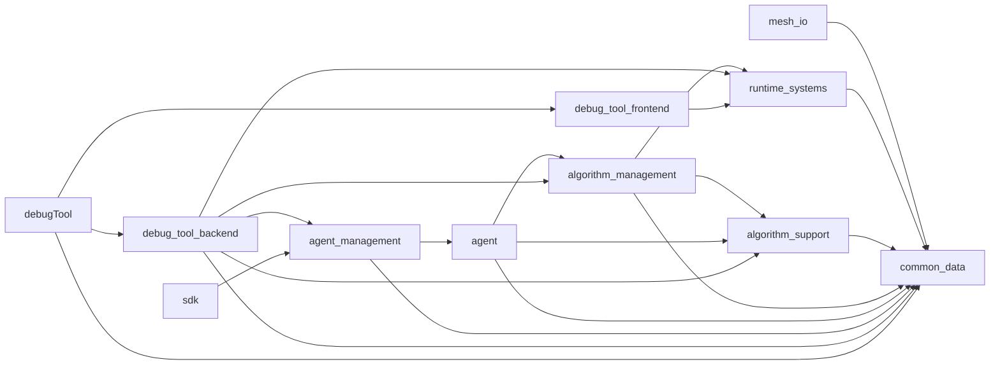

# Layer Readme

## Purpose

This file describes the repository structure that is actually present in the
workspace today.

Use it before:

- adding a new module
- moving code between folders
- wiring new runtime behavior into the app
- restoring older architecture ideas

When code and docs disagree, follow the code and update the docs.

## Core Rules

- Lower layers do not depend upward.
- `common_data` is shared in-memory data only.
- `common_data` is the one exception to the single-facade header rule.
- `runtime_systems` owns the SDL, ImGui, and Vulkan runtime shell and exposes one facade header.
- `algorithm_support` contains package support and reflection helpers, but its public entrypoints are surfaced through `algorithm_management`.
- `algorithm_support` only consumes resolved algorithm package locations and performs assembly/loading; it does not search for packages.
- `agent` and `debug_tool_backend` should reach algorithm loading through `algorithm_management`, not by including `algorithm_support` directly.
- `algorithm_management` is a strict main-trunk layer.
- `algorithm_management` owns container-manifest loading, manifest-name resolution, and runtime container creation helpers only.
- `algorithm_management` also resolves algorithm package locations before higher layers assemble plugin-backed tools.
- `debug_tool_backend` owns the non-UI debug host backend and agent/runtime wiring.
- `debug_tool_frontend` is the editor-facing debug surface.
- `sdk` is the external agent/algorithm submission surface and depends on `agent_management`.
- `debugTool` owns startup wiring for the debug executable only.
- Modules under `src/capabilities` are capability modules, not strict main-trunk hops.
- Capability modules may aggregate lower-level contracts, but they must not introduce upward dependencies into strict trunk layers.
- Optional capabilities must be linked explicitly by any consumer.
- `capabilities/algorithm_library` is legacy/deprecated. Do not add new work there; the packaged mirror lives in `algorithmLib/algorithmSrc`, and built DLL/SPV artifacts live in `algorithmLib/algorithmruntimeLib`.

## Current Module Graph

Compile dependency graph:



Runtime shell support path:

`debug_tool_backend -> runtime_systems -> common_data`

UI path:

`debug_tool_frontend -> runtime_systems -> common_data`

Capability modules grouped under `src/capabilities`:

- `agent`
- `algorithm_library` (legacy/deprecated)
- `sidecar`

Current project-library dependency graph from `CMakeLists.txt`:

- `mesh_io -> common_data`
- `algorithm_support -> common_data`
- `algorithm_management -> common_data + runtime_systems + algorithm_support`
- `runtime_systems -> common_data`
- `agent -> common_data + algorithm_management + algorithm_support`
- `agent_management -> common_data + agent`
- `debug_tool_backend -> common_data + agent_management + runtime_systems + algorithm_management + algorithm_support`
- `debug_tool_frontend -> runtime_systems`
- `sdk -> agent_management`
- `debugTool -> debug_tool_backend + debug_tool_frontend + common_data`

Important note:

`algorithm_support` still exists as a helper bundle, but the public loading path is
carried through `algorithm_management`, which owns the unified package loader facade.

`capabilities/agent` is intentionally different: it is consumed by trunk code,
but it is a capability carrier rather than one strict hop in the layering path.

## Current Tree

```text
src/
├─ algorithm_management/
│  ├─ algorithm_manager.h
│  ├─ algorithm_container_manifest.h/.cpp
│  ├─ algorithm_package_location.h
│  ├─ algorithm_types.h
│  └─ README.md
├─ capabilities/
│  ├─ README.md
│  ├─ agent/
│  │  ├─ agent.h/.cpp
│  │  └─ README.md
│  ├─ algorithm_library/ (legacy/deprecated)
│  │  └─ README.md
│  └─ sidecar/
│     ├─ mesh_io.h/.cpp
│     └─ README.md
├─ common_data/
├─ algorithm_support/
│  ├─ algorithm_intervention.h
│  └─ algorithm_protocol.h
├─ runtime_systems/
├─ sdk/
└─ debug_tool/
```

## Public Interfaces

- `common_data`: specific headers or `common_data/common_data.h`
- `algorithm_support`: internal helper bundle; public entrypoints are surfaced through `algorithm_management`
- `algorithm_management`: `algorithm_management/algorithm_manager.h`
- `algorithm_management` package-location helper: `algorithm_management/algorithm_package_location.h`
- `runtime_systems`: `runtime_systems/runtime_systems.h`
- `debug_tool_backend`: no public interface; it is an internal debug backend target
- `debug_tool`: `debug_tool/debug_tool_host.h`, `debug_tool/debug_tool_backend_runtime.h`, and `debug_tool/debug_tool_frontend_panel.h`
- `agent_management`: `agent_management/agent_management.h`
- `sdk`: `sdk/sdk.h`

## Module Roles

### `algorithm_management`

Strict trunk layer for manifest-driven runtime container creation.

It should:

- load official JSON manifests
- resolve manifest names from `algorithmLib/algorithmSrc`
- resolve algorithm package locations before algorithm support assembly
- create real runtime containers from a manifest
- cache per-manifest container templates for fast clone-and-clear reuse

It should not:

- own runtime execution state
- become a sidecar format layer
- turn back into a full algorithm runtime

Code outside `src/algorithm_management` should include only
`algorithm_management/algorithm_manager.h`.

### `capabilities/agent`

Cross-layer capability module for the lightweight `Agent` object and its package
hook contracts.

It may aggregate:

- algorithm-management container and manifest types
- algorithm support hook contracts
- package-provided submission requirements contracts
- shared interaction and common-data types

It should not:

- own outer runtime scheduling
- own the runtime shell
- become a hidden execution graph manager

### `capabilities/algorithm_library` (legacy/deprecated)

Reserved home for concrete algorithm package capability bundles.

Keep:

- package-local contracts
- package-local container manifests
- package-local hook bundles

Do not move manager responsibilities out of `algorithm_management` into this
directory. The generated package mirror should go to `algorithmLib/algorithmSrc`, not into `src/` or `app/`.

### `capabilities/sidecar`

Optional external-format and adapter capabilities.

Current sidecar:

- `mesh_io`: OBJ mesh import/export on top of `common_data::Mesh`

### `debug_tool_backend`

Debug backend layer for the executable. It owns:

- runtime lifetime
- the managed agent registry
- frame timing
- non-UI create/attach orchestration

It should not:

- render editor widgets directly
- become the SDK surface

### `debug_tool_frontend`

This layer is split into:

- debug host runtime backend: `DebugToolBackendRuntime` compiled into `debug_tool_backend`
- editor-facing frontend surface: `DebugToolFrontendPanel`

`DebugToolFrontendPanel` owns:

- editor-facing panels
- custom intervention UI integration

`debugTool` composes the backend and the UI surface.

### `sdk`

The SDK surface is for agent and algorithm submission.

It should:

- expose agent creation, destruction, algorithm mounting, resource mounting, algorithm submission, and unmounting
- avoid UI dependencies
- avoid reflector/intervention UI surfaces

## Current Runtime Flow

1. `main.cpp` builds a default triangle mesh.
2. `DebugToolBackendRuntime::Init` initializes `RuntimeEnvironment`.
3. `debugTool` binds `DebugToolFrontendPanel` to the runtime host and sets the draw callback.
4. `RuntimeEnvironment` drives the SDL and ImGui frame loop.
5. `DebugToolFrontendPanel::Draw` calls into the managed agent registry through `IDebugToolHost`.
6. `AgentTicker` builds macro tick context and lets `Agent` tick its attached algorithm support groups.

## Quick Guidance For AI Agents

When changing code:

1. Start from this file and `src/README.md`.
2. Decide whether the new behavior belongs in the strict trunk or under `src/capabilities`.
3. Keep `runtime_systems` behind `RuntimeEnvironment`.
4. Keep packet transport as shared packet structs in `common_data`.
5. Keep manifest loading and runtime container creation helpers in `algorithm_management`.
6. Keep cross-layer package hooks in `capabilities/agent`.
7. Keep optional adapters in `capabilities/sidecar`.
8. Keep runtime binding in `debug_tool_backend`.
9. Keep debug-host behavior in `debug_tool_backend` and editor behavior in `debug_tool_frontend`.
10. Do not claim a full execution pipeline exists unless you also implement it.
